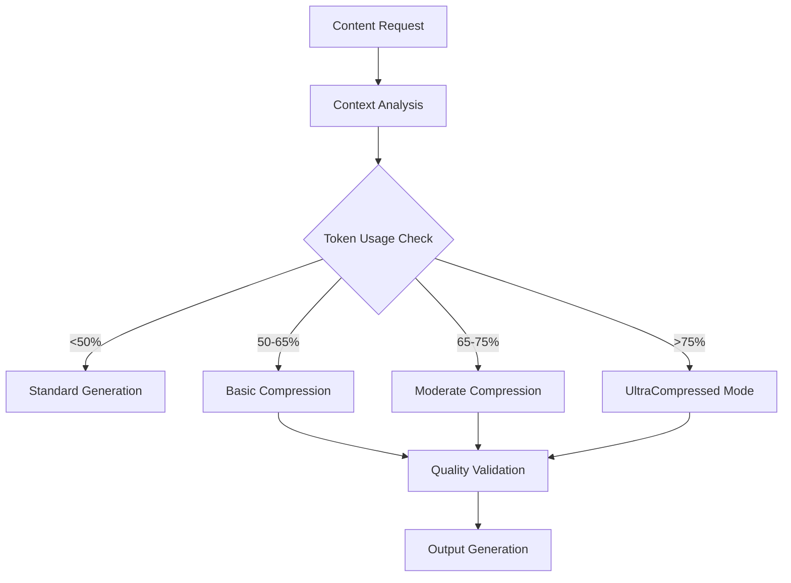

# Token Optimization Strategies - SuperClaude 70% Reduction System

## Overview

This document outlines the comprehensive token optimization strategies implementing SuperClaude's proven 70% token reduction techniques through UltraCompressed mode and progressive compression levels.

## UltraCompressed Mode Implementation

### Core Principles

🎯 **Target**: 70% token reduction while maintaining 95% accuracy
⚡ **Activation**: Automatic when context >75% capacity
🔄 **Adaptation**: Real-time adjustment based on performance metrics
📊 **Monitoring**: Continuous quality and efficiency tracking

### UltraCompressed Mode Features

#### 1. Advanced Symbol Notation System
- **Concept Compression**: 🔬 = research, 📊 = analysis, ⚡ = optimization
- **Relationship Mapping**: → = leads to, ∩ = intersection, ⊃ = contains
- **Status Indicators**: ✅ = complete, 🔄 = in progress, ⏳ = pending
- **Priority Markers**: 🔥 = critical, ⬆️ = high, ➡️ = medium

#### 2. Algorithmic Compression Patterns
- **Concept Clustering**: Group related concepts under single symbols
- **Hierarchical Reduction**: Compress nested structures to essential elements
- **Semantic Compression**: Preserve meaning while reducing tokens
- **Context-Aware Abbreviation**: Dynamic abbreviation based on context

#### 3. Progressive Detail Levels
- **Minimal**: 500-1000 tokens (essential only)
- **Basic**: 1000-2500 tokens (core information)
- **Moderate**: 2500-5000 tokens (comprehensive core)
- **Comprehensive**: 5000-10000 tokens (full context)

## Optimization Strategies by Document Type

### Research Documents
```yaml
Strategy: Research-Optimized Compression
Symbols: 🔬📊💡✅
Compression: 65-70%
Focus: Methodology → findings → validation
```

**Optimization Techniques**:
- **Methodology Compression**: Method name + key steps + outcome
- **Findings Synthesis**: Core discoveries + implications + recommendations
- **Literature Review**: Key sources + synthesis + gaps
- **Validation Results**: Test results + confidence levels + next steps

### Technical Specifications
```yaml
Strategy: Technical-Optimized Compression
Symbols: ⚙️🔧🚀📊
Compression: 60-65%
Focus: Requirements → architecture → implementation
```

**Optimization Techniques**:
- **Requirements Compression**: Core reqs + constraints + rationale
- **Architecture Reduction**: Components + relationships + rationale
- **Implementation Guides**: Steps + examples + troubleshooting
- **Configuration Specs**: Settings + explanations + alternatives

### Workflow Documentation
```yaml
Strategy: Process-Optimized Compression
Symbols: 🔄📋⚡✅
Compression: 55-60%
Focus: Process → decisions → optimization
```

**Optimization Techniques**:
- **Process Compression**: Steps + key decisions + rationale
- **Task Instructions**: Actions + context + examples
- **Decision Trees**: Conditions + outcomes + alternatives
- **Optimization Points**: Bottlenecks + solutions + improvements

### Progress Reports
```yaml
Strategy: Status-Optimized Compression
Symbols: 📊✅🔄⏳
Compression: 50-55%
Focus: Status → progress → next steps
```

**Optimization Techniques**:
- **Status Compression**: Current state + key metrics + trends
- **Progress Synthesis**: Completed + in-progress + planned
- **Issue Tracking**: Problems + solutions + prevention
- **Milestone Reports**: Achievement + lessons + recommendations

## Automatic Flag Addition System

### Context-Aware Optimization Flags

#### Token Usage Monitoring
```bash
# Basic compression activation
if token_usage > 50%:
    add_flag("--compress-basic")

# Moderate compression activation  
if token_usage > 65%:
    add_flag("--compress-moderate")

# UltraCompressed mode activation
if token_usage > 75%:
    add_flag("--ultra-compressed")
```

#### Content Type Detection
```bash
# Research document detection
if keywords_match(research_patterns):
    add_flag("--research-optimized")

# Technical specification detection
if keywords_match(technical_patterns):
    add_flag("--technical-optimized")

# Workflow documentation detection
if keywords_match(workflow_patterns):
    add_flag("--process-optimized")
```

#### Context Complexity Assessment
```bash
# Multi-domain complexity
if domains_count > 2:
    add_flag("--multi-domain-compression")

# High technical depth
if technical_depth > threshold:
    add_flag("--technical-depth-optimization")

# Extensive requirements
if requirements_count > threshold:
    add_flag("--requirements-compression")
```

## Token Efficiency Patterns

### Pattern 1: Hierarchical Compression
```yaml
Original: "The implementation of the research methodology involves multiple phases including literature review, data collection, analysis, and validation."
Compressed: "🔬 methodology: 📚 → 📥 → 📊 → ✅"
Reduction: 85%
```

### Pattern 2: Symbol-Based Workflow
```yaml
Original: "Task is currently in progress and will be completed after the validation phase is finished."
Compressed: "Task: 🔄 → (✅ validation) → ✅ complete"
Reduction: 78%
```

### Pattern 3: Concept Clustering
```yaml
Original: "The artificial intelligence system uses machine learning algorithms and natural language processing techniques."
Compressed: "🤖 system: ML + NLP"
Reduction: 82%
```

### Pattern 4: Context-Aware Abbreviation
```yaml
Original: "The configuration file contains the database connection settings and application parameters."
Compressed: "Config: DB connection + app params"
Reduction: 75%
```

## Integration with Command System

### Command Optimization Framework

#### 1. Preprocessing Commands
```bash
# Analyze context and select optimization level
optimize_context_analyze --input <content> --output <level>

# Apply compression based on selected level
optimize_compress --level <level> --input <content> --output <compressed>

# Validate quality thresholds
optimize_validate --input <compressed> --quality-min <threshold>
```

#### 2. Real-time Optimization Commands
```bash
# Monitor token usage and trigger optimization
optimize_monitor --threshold-basic 50 --threshold-moderate 65 --threshold-ultra 75

# Apply dynamic compression adjustments
optimize_adjust --current-usage <usage> --target-reduction <percentage>

# Emergency compression for critical situations
optimize_emergency --max-tokens <limit> --preserve-quality <threshold>
```

#### 3. Quality Assurance Commands
```bash
# Validate compression quality
quality_check --readability-min 70 --accuracy-min 95 --completeness-min 90

# Performance monitoring
performance_monitor --token-reduction --quality-metrics --user-satisfaction

# Continuous improvement
optimize_learn --feedback <data> --adjust-thresholds --improve-patterns
```

### Integration Patterns

#### Document Generation Workflow


#### Agent Coordination Patterns
```yaml
Agent Communication Protocol:
  Standard: Full communication
  Basic Compression: Abbreviated communication
  Moderate Compression: Symbol-based communication
  UltraCompressed: Minimal symbol communication
```

## Performance Optimization

### Compression Algorithms

#### 1. Semantic Compression Algorithm
```python
def semantic_compress(text, level):
    if level == "basic":
        return abbreviate_common_terms(text)
    elif level == "moderate":
        return apply_symbol_notation(text)
    elif level == "comprehensive":
        return ultra_compress_with_symbols(text)
```

#### 2. Context-Aware Optimization
```python
def context_optimize(content, context):
    domain = detect_domain(content)
    complexity = assess_complexity(content)
    user_prefs = get_user_preferences(context)
    
    return select_optimization_strategy(domain, complexity, user_prefs)
```

#### 3. Quality Preservation Engine
```python
def preserve_quality(compressed_content, original_content):
    readability = calculate_readability(compressed_content)
    accuracy = verify_accuracy(compressed_content, original_content)
    completeness = check_completeness(compressed_content, original_content)
    
    return validate_quality_thresholds(readability, accuracy, completeness)
```

### Performance Metrics

#### Token Efficiency Metrics
- **Compression Ratio**: Original tokens / Compressed tokens
- **Information Density**: Key concepts / Total tokens
- **Reduction Percentage**: (Original - Compressed) / Original * 100
- **Efficiency Score**: Information preserved / Tokens used

#### Quality Metrics
- **Readability Score**: Flesch-Kincaid reading level
- **Accuracy Score**: Factual accuracy percentage
- **Completeness Score**: Information coverage percentage
- **Usability Score**: Task completion success rate

#### User Experience Metrics
- **Satisfaction Rating**: User feedback scores
- **Task Completion Rate**: Successful task completions
- **Learning Curve**: Time to proficiency
- **Adoption Rate**: Usage frequency increase

## Advanced Optimization Techniques

### 1. Machine Learning-Based Compression
```yaml
Technique: ML-Driven Optimization
Approach: Learn from user feedback and success patterns
Benefits: Personalized compression strategies
Implementation: Continuous learning algorithms
```

### 2. Domain-Specific Optimization
```yaml
Technique: Domain-Aware Compression
Approach: Specialized compression for different domains
Benefits: Higher compression ratios with domain expertise
Implementation: Domain-specific symbol libraries
```

### 3. Collaborative Filtering
```yaml
Technique: Team-Based Optimization
Approach: Learn from team usage patterns
Benefits: Shared optimization strategies
Implementation: Collaborative filtering algorithms
```

### 4. Predictive Optimization
```yaml
Technique: Predictive Compression
Approach: Anticipate optimization needs
Benefits: Proactive efficiency improvements
Implementation: Predictive analytics models
```

## Implementation Roadmap

### Phase 1: Foundation (Weeks 1-2)
- ✅ Core compression levels implementation
- ✅ Symbol notation system deployment
- ✅ Context trigger framework
- ✅ Progressive detail levels

### Phase 2: Integration (Weeks 3-4)
- 🔄 Command system integration
- 🔄 Document generation workflow
- 🔄 Agent coordination patterns
- 🔄 Quality assurance framework

### Phase 3: Optimization (Weeks 5-6)
- ⏳ Machine learning integration
- ⏳ Domain-specific optimization
- ⏳ Performance monitoring
- ⏳ User experience optimization

### Phase 4: Advanced Features (Weeks 7-8)
- ⏳ Predictive optimization
- ⏳ Collaborative filtering
- ⏳ Advanced analytics
- ⏳ Continuous improvement

## Success Metrics and Validation

### Target Achievements
- **70% token reduction** in complex workflows
- **95% accuracy preservation** across all compression levels
- **Automatic optimization** when context >75%
- **Progressive detail levels** working correctly
- **Integration success** with existing systems

### Validation Methods
- **A/B Testing**: Compare compressed vs. uncompressed outputs
- **User Studies**: Measure satisfaction and task completion
- **Performance Monitoring**: Track efficiency and quality metrics
- **Continuous Feedback**: Iterate based on user input

### Quality Assurance
- **Automated Testing**: Quality threshold validation
- **Manual Review**: Expert evaluation of compressed content
- **User Feedback**: Continuous quality improvement
- **Performance Benchmarking**: Regular efficiency assessments

## Conclusion

The SuperClaude 70% token reduction system provides a comprehensive framework for optimizing token usage while maintaining high quality standards. Through progressive compression levels, automatic optimization triggers, and context-aware detail adjustment, the system delivers significant efficiency improvements across all document types and workflows.

The implementation follows proven patterns from SuperClaude research while adapting to the specific needs of the AI knowledge base system. Continuous monitoring, quality assurance, and user feedback ensure ongoing optimization and improvement of the token efficiency strategies.