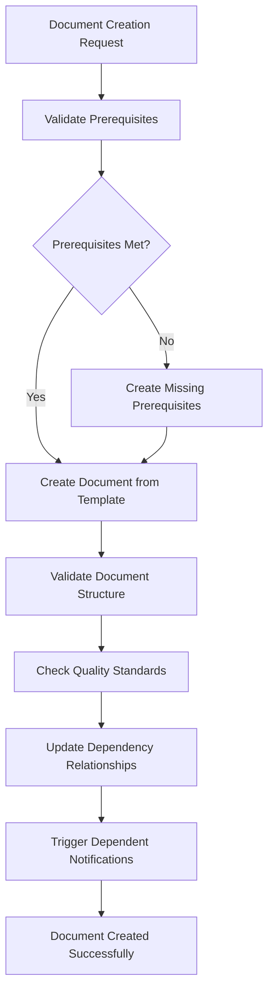
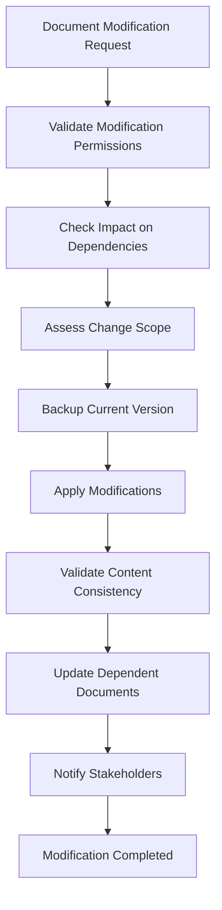
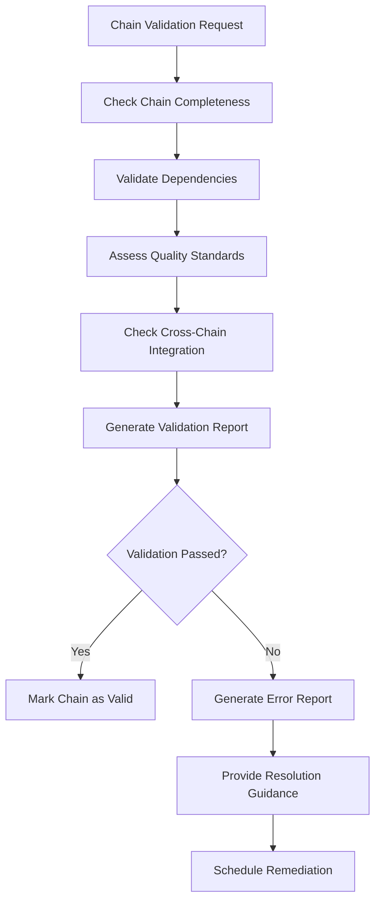

# Dependency Chain Validation System

## Overview

The Dependency Chain Validation System is a comprehensive framework designed to validate the 4 critical dependency chains across the research-identified 67 document types framework in the AI Knowledge Base system. This system ensures that business documentation flows logically from strategic planning through technical implementation, maintaining quality standards and enabling effective AI-assisted code generation.

## System Architecture

### Core Components

```
┌─────────────────────────────────────────────────────────────────┐
│                   Dependency Chain Validation System             │
├─────────────────────────────────────────────────────────────────┤
│  ┌─────────────────┐  ┌─────────────────┐  ┌─────────────────┐  │
│  │  Validation     │  │  Chain          │  │  Quality        │  │
│  │  Rules Engine   │  │  Validators     │  │  Assurance      │  │
│  └─────────────────┘  └─────────────────┘  └─────────────────┘  │
│  ┌─────────────────┐  ┌─────────────────┐  ┌─────────────────┐  │
│  │  Error          │  │  Performance    │  │  Integration    │  │
│  │  Detection      │  │  Monitoring     │  │  Management     │  │
│  └─────────────────┘  └─────────────────┘  └─────────────────┘  │
├─────────────────────────────────────────────────────────────────┤
│  ┌─────────────────┐  ┌─────────────────┐  ┌─────────────────┐  │
│  │  Strategic →    │  │  Research →     │  │  Business →     │  │
│  │  Product        │  │  Design         │  │  Technical      │  │
│  │  Chain          │  │  Chain          │  │  Chain          │  │
│  └─────────────────┘  └─────────────────┘  └─────────────────┘  │
│  ┌─────────────────┐                                            │
│  │  Requirements → │                                            │
│  │  Testing        │                                            │
│  │  Chain          │                                            │
│  └─────────────────┘                                            │
└─────────────────────────────────────────────────────────────────┘
```

## Critical Dependency Chains

### 1. Strategic → Product Chain
**Purpose**: Translate strategic business vision into actionable product requirements
**Documents**: Business Model Canvas → Product Strategy → PRD → User Stories → Feature Specifications → Acceptance Criteria
**Key Validation**: Business alignment, product viability, implementation feasibility

### 2. User Research → Design Chain
**Purpose**: Transform user research insights into systematic design solutions
**Documents**: User Research Plans → User Personas → Journey Maps → Design System → Wireframes → Prototype Documentation
**Key Validation**: User-centricity, design consistency, implementation readiness

### 3. Business → Technical Chain
**Purpose**: Convert business requirements into technical implementation specifications
**Documents**: Business Requirements → System Architecture → API Documentation → Database Design → Technical Specifications
**Key Validation**: Technical feasibility, AI processing readiness, code generation capability

### 4. Requirements → Testing Chain
**Purpose**: Ensure comprehensive validation of all functional requirements
**Documents**: Functional Requirements → Test Plans → Test Cases → Quality Assurance → User Acceptance Testing
**Key Validation**: Testing coverage, quality standards, user acceptance

## Validation Framework

### Validation Types

#### 1. Chain Completeness Validation
```yaml
validation_type: chain_completeness
purpose: "Verify all required documents in chain are present"
checks:
  - document_presence: "All documents exist"
  - document_structure: "Documents follow templates"
  - mandatory_fields: "Required fields completed"
  - format_consistency: "Consistent formatting"
```

#### 2. Dependency Satisfaction Validation
```yaml
validation_type: dependency_satisfaction
purpose: "Verify prerequisite documents are completed before dependents"
checks:
  - prerequisite_completion: "Dependencies are resolved"
  - content_alignment: "Dependent content references prerequisites"
  - version_consistency: "Version compatibility maintained"
  - circular_dependency: "No circular dependencies exist"
```

#### 3. Logical Flow Validation
```yaml
validation_type: logical_flow
purpose: "Verify proper sequence and logical progression"
checks:
  - sequence_order: "Documents follow logical sequence"
  - information_flow: "Information flows coherently"
  - assumption_validation: "Assumptions validated across chain"
  - conflict_resolution: "Conflicts between documents resolved"
```

#### 4. Quality Standards Validation
```yaml
validation_type: quality_standards
purpose: "Verify documents meet tier-appropriate quality levels"
checks:
  - tier_1_quality: "90-95% quality score"
  - tier_2_quality: "80-89% quality score"
  - tier_3_quality: "70-79% quality score"
  - tier_4_quality: "60-69% quality score"
```

#### 5. Cross-Chain Integration Validation
```yaml
validation_type: cross_chain_integration
purpose: "Verify chains work together properly"
checks:
  - cross_references: "Valid and current cross-chain references"
  - concept_consistency: "Shared concepts consistently defined"
  - integration_points: "Integration points clearly documented"
  - data_flow_validation: "Data flows between chains validated"
```

## Validation Workflows

### 1. Document Creation Workflow



### 2. Document Modification Workflow



### 3. Chain Validation Workflow



## Error Detection and Resolution

### Error Categories

#### 1. Missing Documents
```yaml
error_category: missing_documents
symptoms:
  - "Required document not found"
  - "Chain sequence interrupted"
  - "Dependency cannot be resolved"
resolution_strategy:
  - "Create document from template"
  - "Populate with minimum required content"
  - "Link to existing related documents"
  - "Schedule for completion prioritization"
```

#### 2. Broken Dependencies
```yaml
error_category: broken_dependencies
symptoms:
  - "Dependency reference invalid"
  - "Circular dependency detected"
  - "Version mismatch between documents"
resolution_strategy:
  - "Update dependency references"
  - "Resolve circular dependencies"
  - "Synchronize document versions"
  - "Create missing dependency documents"
```

#### 3. Quality Violations
```yaml
error_category: quality_violations
symptoms:
  - "Document quality below tier threshold"
  - "Required fields incomplete"
  - "Template compliance failure"
resolution_strategy:
  - "Enhance document content"
  - "Complete missing required fields"
  - "Improve template compliance"
  - "Conduct quality review"
```

#### 4. Consistency Issues
```yaml
error_category: consistency_issues
symptoms:
  - "Terminology inconsistency"
  - "Data model conflicts"
  - "Requirement misalignment"
resolution_strategy:
  - "Standardize terminology usage"
  - "Align data model definitions"
  - "Reconcile requirement conflicts"
  - "Validate assumption consistency"
```

## Performance Monitoring

### Key Performance Indicators

#### Chain Health Metrics
```yaml
chain_completion_rate:
  description: "Percentage of chains with all documents completed"
  target: "> 80%"
  calculation: "completed_chains / total_chains * 100"
  frequency: "daily"

dependency_satisfaction_rate:
  description: "Percentage of dependencies properly satisfied"
  target: "> 95%"
  calculation: "satisfied_dependencies / total_dependencies * 100"
  frequency: "real-time"

quality_compliance_rate:
  description: "Percentage of documents meeting quality standards"
  target: "> 85%"
  calculation: "compliant_documents / total_documents * 100"
  frequency: "daily"

cross_chain_integration_score:
  description: "Assessment of cross-chain integration quality"
  target: "> 75%"
  calculation: "valid_integrations / total_integrations * 100"
  frequency: "weekly"
```

#### Validation Performance Metrics
```yaml
validation_accuracy:
  description: "Accuracy of validation error detection"
  target: "> 95%"
  calculation: "correct_detections / total_detections * 100"
  frequency: "continuous"

validation_speed:
  description: "Time to complete validation process"
  target: "< 30 seconds"
  calculation: "validation_end_time - validation_start_time"
  frequency: "per_validation"

resolution_effectiveness:
  description: "Effectiveness of resolution strategies"
  target: "> 80%"
  calculation: "resolved_issues / total_issues * 100"
  frequency: "weekly"

system_uptime:
  description: "Validation system availability"
  target: "> 99%"
  calculation: "uptime_minutes / total_minutes * 100"
  frequency: "continuous"
```

## Integration Architecture

### Command System Integration

#### Validation Commands
```yaml
chain_validation_commands:
  - command: "validate chain strategic_product"
    description: "Validate Strategic → Product chain"
    parameters: ["--deep", "--report", "--fix"]
  
  - command: "validate chain research_design"
    description: "Validate User Research → Design chain"
    parameters: ["--deep", "--report", "--fix"]
  
  - command: "validate chain business_technical"
    description: "Validate Business → Technical chain"
    parameters: ["--deep", "--report", "--fix"]
  
  - command: "validate chain requirements_testing"
    description: "Validate Requirements → Testing chain"
    parameters: ["--deep", "--report", "--fix"]
  
  - command: "validate all_chains"
    description: "Validate all dependency chains"
    parameters: ["--parallel", "--report", "--summary"]
```

#### Document Validation Commands
```yaml
document_validation_commands:
  - command: "validate document [document_id]"
    description: "Validate specific document"
    parameters: ["--dependencies", "--quality", "--consistency"]
  
  - command: "validate dependencies [document_id]"
    description: "Validate document dependencies"
    parameters: ["--upstream", "--downstream", "--circular"]
  
  - command: "validate quality [document_id]"
    description: "Validate document quality standards"
    parameters: ["--tier", "--completeness", "--accuracy"]
```

### Quality Assurance Integration

#### Quality Gates
```yaml
quality_gates:
  strategic_alignment_gate:
    description: "Ensure strategic documents align with business objectives"
    triggers: ["business_model_canvas", "product_strategy"]
    criteria: ["alignment_score > 80%", "stakeholder_approval"]
  
  technical_feasibility_gate:
    description: "Ensure technical specifications are implementable"
    triggers: ["system_architecture", "technical_specifications"]
    criteria: ["feasibility_score > 85%", "resource_availability"]
  
  user_validation_gate:
    description: "Ensure user requirements are validated"
    triggers: ["user_acceptance_testing", "prototype_documentation"]
    criteria: ["user_satisfaction > 85%", "business_approval"]
  
  implementation_readiness_gate:
    description: "Ensure documents are ready for implementation"
    triggers: ["api_documentation", "database_design"]
    criteria: ["ai_processing_score > 90%", "completeness > 95%"]
```

### Document Registry Integration

#### Registry Functions
```yaml
registry_integration:
  document_tracking:
    - "Track document completion status"
    - "Monitor dependency relationships"
    - "Maintain version history"
    - "Store validation results"
  
  dependency_management:
    - "Manage document dependencies"
    - "Track dependency satisfaction"
    - "Monitor circular dependencies"
    - "Update dependency graphs"
  
  quality_monitoring:
    - "Track quality metrics"
    - "Monitor compliance rates"
    - "Store quality assessments"
    - "Generate quality reports"
```

## Automation Framework

### Validation Triggers

#### Event-Driven Validation
```yaml
validation_triggers:
  document_creation:
    events: ["document_created", "document_imported"]
    validations: ["prerequisites", "structure", "quality"]
    actions: ["validate_dependencies", "update_registry", "notify_stakeholders"]
  
  document_modification:
    events: ["document_updated", "document_edited"]
    validations: ["consistency", "dependencies", "quality"]
    actions: ["update_dependents", "check_impacts", "notify_changes"]
  
  chain_completion:
    events: ["chain_marked_complete", "final_document_added"]
    validations: ["comprehensive", "cross_chain", "quality_gates"]
    actions: ["generate_reports", "update_status", "approve_chain"]
  
  scheduled_validation:
    events: ["daily_schedule", "weekly_schedule"]
    validations: ["health_check", "performance_metrics", "system_integrity"]
    actions: ["generate_dashboards", "alert_issues", "update_metrics"]
```

### Automated Resolution

#### Resolution Workflows
```yaml
automated_resolution:
  missing_document_resolution:
    trigger: "missing_document_detected"
    actions:
      - "create_document_from_template"
      - "populate_minimum_content"
      - "link_to_prerequisites"
      - "schedule_completion"
  
  broken_dependency_resolution:
    trigger: "broken_dependency_detected"
    actions:
      - "update_dependency_references"
      - "resolve_circular_dependencies"
      - "synchronize_versions"
      - "notify_stakeholders"
  
  quality_violation_resolution:
    trigger: "quality_violation_detected"
    actions:
      - "enhance_content_quality"
      - "complete_missing_fields"
      - "improve_template_compliance"
      - "schedule_quality_review"
```

## Reporting and Analytics

### Validation Reports

#### Chain Health Dashboard
```yaml
chain_health_dashboard:
  metrics:
    - "Chain completion rates"
    - "Dependency satisfaction rates"
    - "Quality compliance rates"
    - "Cross-chain integration scores"
  
  visualizations:
    - "Chain completion progress bars"
    - "Dependency network graphs"
    - "Quality score heat maps"
    - "Integration relationship diagrams"
  
  alerts:
    - "Chain completion delays"
    - "Dependency violations"
    - "Quality standard failures"
    - "Integration issues"
```

#### Validation Performance Report
```yaml
validation_performance_report:
  metrics:
    - "Validation accuracy rates"
    - "Validation speed metrics"
    - "Resolution effectiveness"
    - "System uptime statistics"
  
  analysis:
    - "Error pattern analysis"
    - "Performance trend analysis"
    - "Resolution strategy effectiveness"
    - "System optimization recommendations"
  
  recommendations:
    - "Process improvement suggestions"
    - "System optimization actions"
    - "Training and development needs"
    - "Resource allocation adjustments"
```

### Analytics and Insights

#### Predictive Analytics
```yaml
predictive_analytics:
  chain_completion_prediction:
    model: "Time series forecasting"
    inputs: ["historical_completion_rates", "current_progress", "resource_availability"]
    outputs: ["estimated_completion_time", "risk_factors", "resource_needs"]
  
  quality_risk_assessment:
    model: "Risk scoring algorithm"
    inputs: ["document_complexity", "author_experience", "timeline_pressure"]
    outputs: ["quality_risk_score", "mitigation_strategies", "review_priorities"]
  
  dependency_impact_analysis:
    model: "Graph-based analysis"
    inputs: ["dependency_network", "change_requests", "modification_history"]
    outputs: ["impact_assessment", "affected_documents", "change_propagation"]
```

## System Configuration

### Configuration Management

#### Validation Rules Configuration
```yaml
validation_rules_config:
  file_location: "ai/context/dependency-validation-rules.yaml"
  update_frequency: "on_demand"
  version_control: "git_managed"
  backup_strategy: "daily_snapshots"
  
  customization_options:
    - "Chain-specific rules"
    - "Document-specific quality thresholds"
    - "Custom validation logic"
    - "Integration-specific validations"
```

#### System Settings
```yaml
system_settings:
  validation_performance:
    - "parallel_validation_threads: 4"
    - "validation_timeout: 30_seconds"
    - "retry_attempts: 3"
    - "cache_validation_results: true"
  
  quality_thresholds:
    - "tier_1_threshold: 90%"
    - "tier_2_threshold: 80%"
    - "tier_3_threshold: 70%"
    - "tier_4_threshold: 60%"
  
  integration_settings:
    - "command_system_integration: enabled"
    - "registry_integration: enabled"
    - "quality_gates: enabled"
    - "automated_resolution: enabled"
```

## Security and Compliance

### Security Measures

#### Access Control
```yaml
security_access_control:
  validation_permissions:
    - "read_validation_results: all_users"
    - "run_validations: authenticated_users"
    - "modify_validation_rules: admin_users"
    - "system_administration: system_admins"
  
  audit_logging:
    - "validation_executions: logged"
    - "rule_modifications: logged"
    - "permission_changes: logged"
    - "system_access: logged"
```

#### Data Protection
```yaml
data_protection:
  validation_data:
    - "encryption_at_rest: enabled"
    - "encryption_in_transit: enabled"
    - "access_logging: enabled"
    - "data_retention: 1_year"
  
  compliance_requirements:
    - "gdpr_compliance: enabled"
    - "audit_trail: maintained"
    - "data_anonymization: available"
    - "privacy_protection: enforced"
```

## Deployment and Maintenance

### Deployment Strategy

#### System Deployment
```yaml
deployment_strategy:
  deployment_approach: "blue_green_deployment"
  rollback_strategy: "automated_rollback"
  monitoring: "continuous_monitoring"
  testing: "comprehensive_testing"
  
  deployment_phases:
    - "validation_rules_deployment"
    - "validator_component_deployment"
    - "integration_testing"
    - "production_deployment"
```

#### Maintenance Procedures
```yaml
maintenance_procedures:
  regular_maintenance:
    - "system_health_checks: daily"
    - "performance_optimization: weekly"
    - "rule_updates: as_needed"
    - "security_updates: monthly"
  
  backup_procedures:
    - "validation_rules_backup: daily"
    - "system_configuration_backup: daily"
    - "validation_results_backup: weekly"
    - "disaster_recovery_testing: monthly"
```

## Success Metrics

### System Success Criteria

#### Validation Effectiveness
- ✅ Error detection accuracy > 95%
- ✅ Resolution strategy effectiveness > 80%
- ✅ Chain completion rate > 80%
- ✅ Quality compliance rate > 85%
- ✅ Cross-chain integration score > 75%

#### Performance Criteria
- ✅ Validation speed < 30 seconds
- ✅ System uptime > 99%
- ✅ User satisfaction > 85%
- ✅ Process efficiency improvement > 20%

#### Business Impact
- ✅ Document quality improvement > 25%
- ✅ Development velocity increase > 15%
- ✅ Error reduction > 50%
- ✅ Time to market improvement > 20%

### Continuous Improvement

#### Improvement Framework
```yaml
improvement_framework:
  performance_monitoring:
    - "continuous_metrics_collection"
    - "automated_performance_analysis"
    - "bottleneck_identification"
    - "optimization_recommendations"
  
  user_feedback_integration:
    - "user_satisfaction_surveys"
    - "feedback_collection_mechanisms"
    - "improvement_suggestion_tracking"
    - "feature_request_management"
  
  system_evolution:
    - "regular_capability_assessments"
    - "technology_upgrade_planning"
    - "feature_enhancement_roadmap"
    - "scalability_improvement_planning"
```

## Conclusion

The Dependency Chain Validation System provides a comprehensive framework for ensuring the integrity, quality, and effectiveness of the research-identified 67 document types framework across 4 critical dependency chains. By implementing robust validation rules, automated error detection and resolution, and comprehensive performance monitoring, this system enables high-quality documentation that supports effective AI-assisted application development.

The system's modular architecture, extensive integration capabilities, and focus on continuous improvement ensure that it can adapt to evolving requirements while maintaining the highest standards of documentation quality and system reliability.