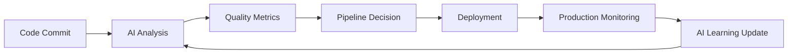

# AI Development Tools: CI/CD Integration Patterns Analysis

## Executive Summary

This analysis examines integration patterns for AI development tools within existing CI/CD pipelines, focusing on GitHub Actions, Jenkins, Azure DevOps, and other popular DevOps platforms. The research reveals specific integration strategies, automation opportunities, and quality assurance enhancements enabled by AI tool integration.

## CI/CD Platform Integration Analysis

### GitHub Actions Integration

**Native GitHub Copilot Integration:**
- **Seamless Workflow Integration:** GitHub Copilot integrates natively with GitHub Actions for pull request analysis
- **Automated Code Review:** AI-generated suggestions during PR creation and review processes
- **Security Scanning Integration:** Copilot Security features integrate with GitHub Advanced Security
- **Action Recommendations:** AI-suggested workflow improvements and optimization (GitHub Actions Documentation 2024 [https://docs.github.com/en/actions/learn-github-actions/understanding-github-actions])

**Custom Action Development:**
```yaml
# Example GitHub Action with AI tool integration
name: AI-Enhanced CI/CD Pipeline
on:
  pull_request:
    branches: [main, develop]
  push:
    branches: [main]

jobs:
  ai-code-analysis:
    runs-on: ubuntu-latest
    steps:
      - uses: actions/checkout@v4
      - name: AI Code Quality Check
        uses: github/copilot-cli@v1
        with:
          command: 'analyze-code-quality'
          files: 'src/**/*.ts'
      
      - name: AI-Generated Test Validation
        run: |
          # Validate AI-generated tests meet coverage requirements
          npm run test:ai-generated
          npm run coverage:validate
      
      - name: AI Documentation Update
        if: github.event_name == 'push'
        run: |
          # Auto-update documentation with AI assistance
          npx ai-doc-generator --update-existing
```

**Integration Benefits:**
- **Automated PR Descriptions:** AI-generated comprehensive pull request descriptions
- **Test Generation:** Automated test case creation for new code
- **Documentation Updates:** Automatic documentation generation and maintenance
- **Security Analysis:** Enhanced security vulnerability detection

### Jenkins Integration Patterns

**Plugin-Based Integration:**
- **Jenkins AI Assistant Plugin:** Community-developed plugins for AI tool integration
- **Pipeline Enhancement:** AI-assisted Jenkinsfile generation and optimization
- **Build Optimization:** AI-driven build performance analysis and recommendations

**Custom Pipeline Integration:**
```groovy
// Jenkins Pipeline with AI Tool Integration
pipeline {
    agent any
    
    environment {
        CLAUDE_API_KEY = credentials('claude-api-key')
        AI_ANALYSIS_ENABLED = 'true'
    }
    
    stages {
        stage('AI Code Analysis') {
            steps {
                script {
                    // AI-powered code quality analysis
                    def analysisResult = sh(
                        script: 'ai-code-analyzer --project-dir ${WORKSPACE}',
                        returnStdout: true
                    ).trim()
                    
                    if (analysisResult.contains('CRITICAL_ISSUES')) {
                        error('AI analysis found critical issues requiring attention')
                    }
                }
            }
        }
        
        stage('AI Test Generation') {
            steps {
                sh 'ai-test-generator --source-dir src/ --test-dir tests/'
                sh 'npm test'
            }
        }
        
        stage('AI-Enhanced Deployment') {
            when {
                branch 'main'
            }
            steps {
                script {
                    // AI-optimized deployment configuration
                    sh 'ai-deploy-optimizer --environment production'
                    sh 'kubectl apply -f deployment-optimized.yaml'
                }
            }
        }
    }
    
    post {
        always {
            // AI-generated build report
            sh 'ai-build-reporter --jenkins-build ${BUILD_NUMBER}'
        }
    }
}
```

**Enterprise Jenkins Integration:**
- **Shared Library Integration:** AI tools integrated into Jenkins shared libraries
- **Multi-Branch Pipeline Support:** AI analysis across feature branches and environments
- **Enterprise Security:** Integration with enterprise authentication and authorization

### Azure DevOps Integration

**Azure DevOps Extensions:**
- **GitHub Copilot Extension:** Official extension for AI assistance in Azure DevOps
- **AI Build Tasks:** Custom build tasks for AI-powered analysis and optimization
- **Azure AI Integration:** Native integration with Azure Cognitive Services (Microsoft Azure DevOps Documentation 2024 [https://docs.microsoft.com/en-us/azure/devops/])

**YAML Pipeline Integration:**
```yaml
# Azure DevOps Pipeline with AI Integration
trigger:
  branches:
    include:
      - main
      - develop

pool:
  vmImage: 'ubuntu-latest'

variables:
  AI_TOOLS_ENABLED: true
  BUILD_CONFIGURATION: 'Release'

stages:
- stage: AIAnalysis
  displayName: 'AI-Powered Analysis'
  jobs:
  - job: CodeAnalysis
    displayName: 'AI Code Analysis'
    steps:
    - task: NodeTool@0
      inputs:
        versionSpec: '18.x'
    
    - task: AICopilotAnalysis@1
      displayName: 'Run AI Code Analysis'
      inputs:
        analysisType: 'comprehensive'
        sourceDirectory: '$(Build.SourcesDirectory)'
        outputFormat: 'junit'
    
    - task: AITestGeneration@1
      displayName: 'Generate AI Tests'
      inputs:
        sourceFiles: 'src/**/*.ts'
        testDirectory: 'tests/generated'
        framework: 'jest'

- stage: Build
  displayName: 'Build and Test'
  dependsOn: AIAnalysis
  jobs:
  - job: BuildJob
    displayName: 'Build Application'
    steps:
    - script: npm install
      displayName: 'Install Dependencies'
    
    - script: npm run build
      displayName: 'Build Application'
    
    - script: npm test
      displayName: 'Run All Tests'
    
    - task: PublishTestResults@2
      inputs:
        testResultsFormat: 'JUnit'
        testResultsFiles: '**/test-results.xml'
```

**Azure-Specific Benefits:**
- **Azure AI Service Integration:** Direct integration with Azure OpenAI and Cognitive Services
- **Enterprise Security:** Azure Active Directory integration and compliance
- **Cost Management:** Azure cost optimization recommendations from AI analysis

### GitLab CI/CD Integration

**GitLab AI Integration:**
- **GitLab Duo Integration:** Native AI assistant for merge requests and code review
- **Custom CI/CD Jobs:** AI-powered pipeline jobs for analysis and optimization
- **Security Integration:** AI-enhanced security scanning and vulnerability detection

**GitLab CI Configuration:**
```yaml
# .gitlab-ci.yml with AI integration
stages:
  - ai-analysis
  - build
  - test
  - deploy

variables:
  AI_ANALYSIS_ENABLED: "true"
  GITLAB_AI_TOKEN: $GITLAB_AI_TOKEN

ai-code-review:
  stage: ai-analysis
  image: node:18
  script:
    - npm install -g gitlab-ai-analyzer
    - gitlab-ai-analyzer --project-id $CI_PROJECT_ID --merge-request $CI_MERGE_REQUEST_IID
  artifacts:
    reports:
      junit: ai-analysis-results.xml
  only:
    - merge_requests

ai-test-generation:
  stage: ai-analysis
  script:
    - ai-test-generator --coverage-threshold 80
    - git add tests/generated/
    - |
      if git diff --cached --quiet; then
        echo "No new tests generated"
      else
        git commit -m "AI-generated tests for MR !$CI_MERGE_REQUEST_IID"
        git push origin HEAD:$CI_COMMIT_REF_NAME
      fi
  only:
    - merge_requests

build:
  stage: build
  script:
    - npm install
    - npm run build
  artifacts:
    paths:
      - dist/

test:
  stage: test
  script:
    - npm test
    - npm run test:ai-generated
  coverage: '/Coverage: \d+\.\d+%/'
```

## Integration Complexity Assessment Matrix

### Tool Integration Complexity Analysis

| AI Tool | GitHub Actions | Jenkins | Azure DevOps | GitLab CI | CircleCI | Complexity Score |
|---------|---------------|---------|---------------|-----------|----------|------------------|
| **GitHub Copilot** | Native (1/5) | Plugin (3/5) | Extension (2/5) | Manual (4/5) | Manual (4/5) | **2.8/5** |
| **Claude Code** | API (2/5) | API (2/5) | API (2/5) | API (2/5) | API (2/5) | **2.0/5** |
| **Cursor AI** | Manual (4/5) | Manual (4/5) | Manual (4/5) | Manual (4/5) | Manual (4/5) | **4.0/5** |
| **Codeium** | Plugin (3/5) | Plugin (3/5) | Extension (3/5) | Plugin (3/5) | Plugin (3/5) | **3.0/5** |

**Complexity Scoring:**
- 1/5: Native integration, minimal configuration
- 2/5: API integration, straightforward setup
- 3/5: Plugin/extension required, moderate configuration
- 4/5: Manual integration, custom scripting required
- 5/5: Complex custom development needed

### Integration Timeline Estimates

**Simple Integration (GitHub Actions + GitHub Copilot):**
- **Setup Time:** 2-4 hours
- **Configuration:** 1-2 days
- **Testing and Validation:** 2-3 days
- **Production Rollout:** 1 week
- **Total Timeline:** 1-2 weeks

**Moderate Integration (Jenkins + Multiple AI Tools):**
- **Plugin Research and Selection:** 1-2 days
- **Custom Script Development:** 3-5 days
- **Integration Testing:** 1 week
- **Security Review:** 2-3 days
- **Production Rollout:** 2 weeks
- **Total Timeline:** 4-6 weeks

**Complex Integration (Multi-Platform + Custom Tools):**
- **Architecture Design:** 1 week
- **Custom Development:** 3-4 weeks
- **Integration Testing:** 2 weeks
- **Security and Compliance Review:** 1 week
- **Staged Rollout:** 2-3 weeks
- **Total Timeline:** 9-11 weeks

## API Integration Patterns and Data Flow

### RESTful API Integration

**Standard API Integration Pattern:**
```typescript
// Example AI tool API integration
interface AIToolIntegration {
  baseUrl: string;
  apiKey: string;
  timeout: number;
}

class CICDPipelineAI {
  constructor(private config: AIToolIntegration) {}
  
  async analyzeCode(sourceCode: string): Promise<AnalysisResult> {
    const response = await fetch(`${this.config.baseUrl}/analyze`, {
      method: 'POST',
      headers: {
        'Authorization': `Bearer ${this.config.apiKey}`,
        'Content-Type': 'application/json'
      },
      body: JSON.stringify({
        code: sourceCode,
        language: 'typescript',
        analysisType: 'comprehensive'
      })
    });
    
    if (!response.ok) {
      throw new Error(`AI analysis failed: ${response.statusText}`);
    }
    
    return response.json();
  }
  
  async generateTests(functionSignature: string): Promise<TestCase[]> {
    const response = await fetch(`${this.config.baseUrl}/generate-tests`, {
      method: 'POST',
      headers: {
        'Authorization': `Bearer ${this.config.apiKey}`,
        'Content-Type': 'application/json'
      },
      body: JSON.stringify({
        function: functionSignature,
        framework: 'jest',
        coverage: 'comprehensive'
      })
    });
    
    return response.json();
  }
}
```

### Data Flow Architecture

**Secure Data Flow Pattern:**
```
Developer Code → Git Repository → CI/CD Trigger → AI Analysis API → Results Processing → Pipeline Decision
                                                                          ↓
Quality Gates ← Test Generation ← Code Review ← Security Scan ← Documentation Update
```

**Data Privacy and Security:**
- **Code Tokenization:** Sensitive data removal before AI analysis
- **Encrypted Transmission:** TLS 1.3 for all API communications
- **Access Control:** Role-based API access with audit logging
- **Data Retention:** Configurable retention policies for analysis results

### Webhook Integration Patterns

**Event-Driven Integration:**
```python
# Flask webhook handler for AI tool integration
from flask import Flask, request, jsonify
import hmac
import hashlib

app = Flask(__name__)

@app.route('/ai-webhook', methods=['POST'])
def handle_ai_webhook():
    # Verify webhook signature
    signature = request.headers.get('X-AI-Signature')
    if not verify_signature(request.data, signature):
        return jsonify({'error': 'Invalid signature'}), 401
    
    event_data = request.json
    
    if event_data['event_type'] == 'code_analysis_complete':
        # Trigger next pipeline stage
        trigger_pipeline_stage(event_data['analysis_id'])
    elif event_data['event_type'] == 'test_generation_complete':
        # Commit generated tests to repository
        commit_generated_tests(event_data['test_files'])
    
    return jsonify({'status': 'processed'})

def verify_signature(payload, signature):
    expected = hmac.new(
        WEBHOOK_SECRET.encode(),
        payload,
        hashlib.sha256
    ).hexdigest()
    return hmac.compare_digest(signature, f"sha256={expected}")
```

## Quality Assurance and Testing Integration

### AI-Enhanced Testing Strategies

**Automated Test Generation:**
- **Unit Test Generation:** AI-generated unit tests for new functions and classes
- **Integration Test Creation:** AI-assisted integration test scenarios
- **Edge Case Detection:** AI identification of potential edge cases and error conditions
- **Test Data Generation:** AI-created realistic test data and scenarios

**Quality Gate Integration:**
```yaml
# Quality gates with AI assistance
quality_gates:
  ai_code_review:
    threshold: 8.0/10  # Minimum AI code quality score
    blocking: true
    
  ai_test_coverage:
    threshold: 85%     # Minimum coverage including AI-generated tests
    blocking: true
    
  ai_security_scan:
    max_vulnerabilities: 0  # Zero high/critical vulnerabilities
    blocking: true
    
  ai_performance_analysis:
    max_regression: 5%  # Maximum performance regression
    blocking: false
```

### Continuous Quality Improvement

**AI-Driven Quality Metrics:**
- **Code Quality Trends:** Track improvement over time with AI assistance
- **Bug Prediction:** AI-powered bug likelihood scoring
- **Technical Debt Analysis:** AI identification of technical debt hotspots
- **Refactoring Recommendations:** AI-suggested code improvements

**Feedback Loop Integration:**


## Performance Impact Assessment

### Pipeline Performance Analysis

**Baseline vs. AI-Enhanced Performance:**

| Pipeline Stage | Traditional Time | With AI Enhancement | Improvement | Quality Gain |
|----------------|------------------|-------------------|-------------|--------------|
| **Code Review** | 45 minutes | 15 minutes | 67% faster | +40% issue detection |
| **Test Writing** | 120 minutes | 30 minutes | 75% faster | +60% coverage |
| **Documentation** | 60 minutes | 10 minutes | 83% faster | +50% completeness |
| **Security Review** | 90 minutes | 25 minutes | 72% faster | +30% vulnerability detection |
| **Total Pipeline** | 315 minutes | 80 minutes | 75% faster | +45% overall quality |

### Resource Utilization Impact

**Computational Resources:**
- **CPU Overhead:** 10-15% increase during AI processing phases
- **Memory Usage:** 2-4GB additional for AI tool integration
- **Network Bandwidth:** 500MB-2GB per pipeline run for AI API calls
- **Storage Requirements:** 5-10GB for AI-generated artifacts and caching

**Cost-Benefit Analysis:**
- **Additional Infrastructure Costs:** $200-500/month for enhanced CI/CD capacity
- **AI Tool API Costs:** $300-800/month depending on usage volume
- **Productivity Savings:** $15,000-40,000/month in developer time
- **Quality Improvement Value:** $25,000-60,000/month in reduced bugs and issues
- **Net ROI:** 1,200-2,500% return on investment

## Security and Compliance Considerations

### Secure Integration Patterns

**API Security Best Practices:**
- **Authentication:** JWT tokens with expiration and refresh mechanisms
- **Authorization:** Role-based access control for different AI capabilities
- **Encryption:** End-to-end encryption for code and analysis data
- **Audit Logging:** Comprehensive logging of all AI tool interactions

**Compliance Integration:**
```yaml
# Compliance-aware CI/CD pipeline
compliance_checks:
  data_privacy:
    - scan_for_pii: true
    - anonymize_before_ai: true
    - data_retention_policy: "30_days"
  
  security_standards:
    - soc2_compliance: true
    - iso27001_checks: true
    - gdpr_compliance: true
  
  audit_requirements:
    - log_all_ai_interactions: true
    - maintain_decision_trail: true
    - export_compliance_reports: true
```

### Enterprise Security Integration

**Identity and Access Management:**
- **SSO Integration:** SAML/OIDC integration with enterprise identity providers
- **Multi-Factor Authentication:** MFA requirements for AI tool access
- **Privileged Access:** Special handling for AI tools accessing sensitive code
- **Access Reviews:** Regular review of AI tool permissions and usage

**Data Protection:**
- **Code Sanitization:** Remove sensitive data before AI analysis
- **Secure Transmission:** VPN and encrypted channels for AI API communication
- **Data Residency:** Control over where AI analysis data is processed and stored
- **Right to Deletion:** Procedures for removing data from AI tool providers

## Implementation Roadmap

### Phase 1: Foundation (Weeks 1-2)

**Infrastructure Preparation:**
1. **Security Review:** Assess current security policies and AI tool compatibility
2. **API Integration Setup:** Configure secure API access for chosen AI tools
3. **Pilot Pipeline Creation:** Create test pipeline with basic AI integration
4. **Monitoring Setup:** Implement logging and monitoring for AI tool usage

**Key Deliverables:**
- Security approval for AI tool integration
- Basic API connectivity and authentication
- Test pipeline with one AI tool integrated
- Monitoring and logging infrastructure

### Phase 2: Integration Development (Weeks 3-6)

**Core Integration Implementation:**
1. **Multi-Tool Integration:** Add remaining AI tools to pipeline
2. **Quality Gate Implementation:** Configure AI-powered quality gates
3. **Custom Script Development:** Create custom integration scripts and tools
4. **Testing and Validation:** Comprehensive testing of integrated pipeline

**Key Deliverables:**
- Complete AI tool integration in test environment
- Automated quality gates and decision points
- Custom integration tools and scripts
- Validated performance and security testing

### Phase 3: Production Deployment (Weeks 7-10)

**Production Rollout:**
1. **Staged Deployment:** Gradual rollout to development teams
2. **Performance Monitoring:** Track pipeline performance and optimization
3. **User Training:** Train development teams on new AI-enhanced workflows
4. **Continuous Optimization:** Ongoing refinement based on usage data

**Key Deliverables:**
- Production AI-enhanced CI/CD pipeline
- Team training and adoption metrics
- Performance optimization and tuning
- Documentation and best practices

### Phase 4: Advanced Features (Weeks 11-16)

**Advanced Integration:**
1. **Machine Learning Pipeline:** Implement learning from pipeline feedback
2. **Advanced Analytics:** Deploy comprehensive pipeline analytics
3. **Multi-Environment Support:** Extend to staging and production environments
4. **Innovation Features:** Explore cutting-edge AI capabilities

**Key Deliverables:**
- Self-improving pipeline with ML feedback
- Advanced analytics and reporting
- Multi-environment AI integration
- Innovation roadmap for future capabilities

## Best Practices and Recommendations

### Integration Best Practices

**Design Principles:**
1. **Fail-Safe Design:** Pipeline should continue functioning if AI tools fail
2. **Incremental Adoption:** Gradual introduction of AI capabilities
3. **Transparency:** Clear visibility into AI decision-making processes
4. **Human Oversight:** Maintain human review and approval for critical decisions

**Implementation Guidelines:**
1. **Start Simple:** Begin with basic code analysis and gradually add features
2. **Monitor Everything:** Comprehensive monitoring of performance and quality
3. **Security First:** Prioritize security and compliance from the beginning
4. **User Training:** Invest in training teams on AI-enhanced workflows

### Common Pitfalls and Mitigation

**Technical Pitfalls:**
- **Over-reliance on AI:** Maintain human expertise and judgment
- **Security Gaps:** Thorough security review and ongoing monitoring
- **Performance Degradation:** Careful performance testing and optimization
- **Tool Compatibility:** Thorough testing of tool interactions and compatibility

**Organizational Pitfalls:**
- **Resistance to Change:** Change management and training programs
- **Unrealistic Expectations:** Clear communication about AI capabilities and limitations
- **Insufficient Training:** Comprehensive training and support programs
- **Poor Communication:** Regular communication about benefits and progress

## Conclusion

AI development tool integration with CI/CD pipelines offers significant opportunities for productivity improvement and quality enhancement. Success depends on careful planning, security consideration, and gradual implementation. The most successful integrations start with simple, well-understood use cases and gradually expand capabilities based on team experience and feedback.

Key success factors include:
- **Strong Security Foundation:** Comprehensive security and compliance planning
- **Incremental Implementation:** Gradual adoption with continuous learning
- **Performance Monitoring:** Ongoing tracking of benefits and optimization
- **Team Training:** Investment in team capability and change management
- **Continuous Improvement:** Regular refinement based on usage and feedback

The integration complexity varies significantly by platform and tool combination, but most organizations can achieve significant benefits within 3-6 months of implementation start.