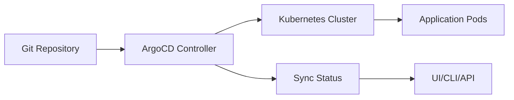

# ArgoCD GitOps Deployment MCP Server

## Overview

The ArgoCD MCP Server enables GitOps-based continuous deployment through the Model Context Protocol, providing declarative, Git-based application delivery for Kubernetes. As a CNCF graduated project, it's the industry standard for Kubernetes GitOps with proven scalability and reliability.

## 🚀 GitOps Principles

### Core Concepts
- **Declarative**: Entire system described declaratively
- **Versioned**: Git as single source of truth
- **Automated**: Approved changes automatically applied
- **Observable**: Easy to observe system state

### ArgoCD Architecture


## 🎯 Quick Start (30 minutes)

### 1. Install ArgoCD
```bash
# Create namespace
kubectl create namespace argocd

# Install ArgoCD
kubectl apply -n argocd -f https://raw.githubusercontent.com/argoproj/argo-cd/stable/manifests/install.yaml

# Or using Helm
helm repo add argo https://argoproj.github.io/argo-helm
helm install argocd argo/argo-cd -n argocd
```

### 2. Access ArgoCD UI
```bash
# Port forward
kubectl port-forward svc/argocd-server -n argocd 8080:443

# Get admin password
kubectl -n argocd get secret argocd-initial-admin-secret \
  -o jsonpath="{.data.password}" | base64 -d

# Login at https://localhost:8080
# Username: admin
```

### 3. Install MCP Server
```bash
npm install -g @argoproj/argocd-mcp
```

### 4. Create First Application
```yaml
# app.yaml
apiVersion: argoproj.io/v1alpha1
kind: Application
metadata:
  name: my-app
  namespace: argocd
spec:
  project: default
  source:
    repoURL: https://github.com/myorg/my-app
    targetRevision: HEAD
    path: kubernetes/
  destination:
    server: https://kubernetes.default.svc
    namespace: production
  syncPolicy:
    automated:
      prune: true
      selfHeal: true
```

## 💡 Deployment Patterns

### Multi-Environment Promotion
```yaml
# Dev → Staging → Production
# environments/dev/kustomization.yaml
apiVersion: kustomize.config.k8s.io/v1beta1
kind: Kustomization

resources:
  - ../../base

patchesStrategicMerge:
  - replica-count.yaml
  - resource-limits.yaml

configMapGenerator:
  - name: app-config
    literals:
      - environment=dev
```

### Progressive Delivery
```yaml
# Canary deployment with Flagger
apiVersion: flagger.app/v1beta1
kind: Canary
metadata:
  name: my-app
spec:
  targetRef:
    apiVersion: apps/v1
    kind: Deployment
    name: my-app
  progressDeadlineSeconds: 60
  service:
    port: 80
  analysis:
    interval: 30s
    threshold: 5
    maxWeight: 50
    stepWeight: 10
    metrics:
      - name: request-success-rate
        thresholdRange:
          min: 99
        interval: 1m
```

### Blue-Green Deployment
```bash
# Using ArgoCD with Argo Rollouts
apiVersion: argoproj.io/v1alpha1
kind: Rollout
metadata:
  name: my-app
spec:
  replicas: 5
  strategy:
    blueGreen:
      activeService: my-app-active
      previewService: my-app-preview
      autoPromotionEnabled: false
      scaleDownDelaySeconds: 30
      prePromotionAnalysis:
        templates:
          - templateName: smoke-tests
```

## 🔄 Sync Strategies

### Automated Sync
```yaml
syncPolicy:
  automated:
    prune: true      # Delete resources not in Git
    selfHeal: true   # Revert manual changes
    allowEmpty: false
  syncOptions:
    - CreateNamespace=true
    - PrunePropagationPolicy=foreground
```

### Manual Sync with Hooks
```yaml
apiVersion: batch/v1
kind: Job
metadata:
  annotations:
    argocd.argoproj.io/hook: PreSync
    argocd.argoproj.io/hook-delete-policy: HookSucceeded
spec:
  template:
    spec:
      containers:
        - name: db-migration
          image: migrate/migrate
          command: ["migrate", "-path", "/migrations", "-database", "postgres://..."]
```

## 📊 Monitoring & Observability

### Prometheus Metrics
```yaml
# Key metrics to monitor
argocd_app_health_total         # Application health status
argocd_app_sync_total          # Sync operations
argocd_git_request_duration    # Git operation latency
argocd_kubectl_exec_duration   # Kubectl execution time
```

### Grafana Dashboard
```json
{
  "dashboard": {
    "title": "ArgoCD Operations",
    "panels": [
      {
        "title": "Application Health",
        "targets": [{
          "expr": "sum by (health_status) (argocd_app_health_total)"
        }]
      },
      {
        "title": "Sync Operations/Hour",
        "targets": [{
          "expr": "rate(argocd_app_sync_total[1h])"
        }]
      }
    ]
  }
}
```

## 🔒 Security Best Practices

### RBAC Configuration
```yaml
# AppProject with restrictions
apiVersion: argoproj.io/v1alpha1
kind: AppProject
metadata:
  name: production
spec:
  description: Production applications
  sourceRepos:
    - https://github.com/myorg/*
  destinations:
    - namespace: 'prod-*'
      server: https://kubernetes.default.svc
  clusterResourceWhitelist:
    - group: ''
      kind: Namespace
  roles:
    - name: developers
      policies:
        - p, proj:production:developers, applications, get, production/*, allow
        - p, proj:production:developers, applications, sync, production/*, allow
```

### Secret Management
```yaml
# Using Sealed Secrets
apiVersion: bitnami.com/v1alpha1
kind: SealedSecret
metadata:
  name: mysecret
spec:
  encryptedData:
    password: AgBvA8N1... # Encrypted value
```

## 🏢 Enterprise Features

### Multi-Cluster Management
```yaml
# Register external cluster
argocd cluster add my-cluster \
  --name production \
  --kubeconfig ~/.kube/production-config
```

### SSO Integration
```yaml
# OIDC configuration
apiVersion: v1
kind: ConfigMap
metadata:
  name: argocd-cm
data:
  oidc.config: |
    name: Okta
    issuer: https://company.okta.com
    clientId: argocd
    clientSecret: $oidc.okta.clientSecret
    requestedScopes: ["openid", "profile", "email", "groups"]
```

## 📈 Scaling & Performance

### High Availability Setup
```yaml
# 3 replica configuration
apiVersion: apps/v1
kind: Deployment
metadata:
  name: argocd-server
spec:
  replicas: 3
  template:
    spec:
      affinity:
        podAntiAffinity:
          requiredDuringSchedulingIgnoredDuringExecution:
            - topologyKey: kubernetes.io/hostname
```

### Performance Tuning
```yaml
# Controller settings
apiVersion: v1
kind: ConfigMap
metadata:
  name: argocd-cmd-params-cm
data:
  controller.status.processors: "50"
  controller.operation.processors: "25"
  controller.repo.server.timeout.seconds: "180"
  controller.self.heal.timeout.seconds: "5"
```

## 🎯 Best Practices

### Repository Structure
```
my-app/
├── base/                 # Base manifests
│   ├── deployment.yaml
│   ├── service.yaml
│   └── kustomization.yaml
├── overlays/
│   ├── dev/             # Dev overrides
│   ├── staging/         # Staging overrides
│   └── production/      # Production overrides
└── .argocd/
    └── config.yaml      # ArgoCD app config
```

### Deployment Strategy
1. **Commit to Git**: All changes via Git
2. **PR Review**: Peer review required
3. **Auto Sync**: ArgoCD detects changes
4. **Health Check**: Verify deployment health
5. **Rollback Ready**: Quick rollback capability

## 🔗 Related MCP Servers

**Complementary**:
- Kubernetes (Container orchestration)
- Terraform (Infrastructure provisioning)
- HashiCorp Vault (Secret management)

**CI/CD Integration**:
- GitHub Actions (CI pipeline)
- Jenkins (Build automation)
- Tekton (Cloud-native CI/CD)

## 📚 Resources

- [ArgoCD Documentation](https://argo-cd.readthedocs.io)
- [GitOps Guide](https://www.gitops.tech)
- [Best Practices](https://argoproj.github.io/argo-cd/user-guide/best_practices/)
- [Example Applications](https://github.com/argoproj/argocd-example-apps)

---

**Verdict**: The de facto standard for Kubernetes GitOps with excellent community support and enterprise features. Essential for teams practicing GitOps and managing Kubernetes applications at scale. The learning curve is justified by the operational benefits and improved deployment reliability.