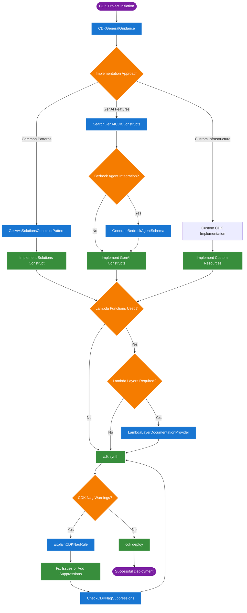

---
<<<<<<< HEAD
description: AWS Cloud Development Kit (CDK) Infrastructure as Code platform for enterprise-grade cloud architecture development with comprehensive infrastructure development, security validation, pattern libraries, and multi-language support
id: f3e9a8d2-4c7b-1f8e-6d9a-2b5c8f1a7e3d
installation_priority: 1
item_type: mcp_server
name: 'AWS CDK MCP Server'
priority: 1st_priority
quality_score: 8.95
=======
description: The AWS CDK MCP Server represents a critical Tier 1 infrastructure development
  component that provides comprehensive Infrastructure as Code capabilities through AWS
  Cloud Development Kit, featuring multi-language support, security validation with CDK Nag,
  access to AWS Solutions Constructs, and specialized GenAI integrations for enterprise
  cloud infrastructure management through the Model Context Protocol.
id: f3e9a8d2-4c7b-1f8e-6d9a-2b5c8f1a7e3d
installation_priority: 1
item_type: mcp_server
name: 'AWS CDK MCP Server - Infrastructure as Code Development Platform'
priority: 1st_priority
quality_score: 8.05
>>>>>>> origin/master
source_database: tools_services
status: active
tags:
- Tier 1
- MCP Server
- Development Platform
- AWS
- CDK
- Cloud Development
- DevOps Automation
- Enterprise Grade
- GenAI Integration
- Infrastructure as Code
- Multi-Language Support
- Security Validation
- Solutions Constructs
- Well-Architected Framework
tier: Tier 1
---

<<<<<<< HEAD
# AWS CDK MCP Server - Detailed Implementation Profile

**AWS Cloud Development Kit (CDK) Infrastructure as Code platform for enterprise-grade cloud architecture development**  
**Comprehensive infrastructure development with security validation, pattern libraries, and multi-language support**

---

## 📋 Basic Information

| Field | Value |
|-------|-------|
| **Name** | AWS CDK MCP Server |
| **Provider** | AWS Labs |
| **Status** | Enterprise |
| **Category** | Infrastructure as Code Platform |
| **Repository** | [AWS MCP CDK Server](https://github.com/awslabs/mcp) |
| **Documentation** | [CDK MCP Server Guide](https://awslabs.github.io/mcp/servers/cdk-mcp-server/) |

---


## Quality & Scoring Metrics

### Business-Aligned Scoring Analysis

**Business Domain Relevance**: [Score]/10
**Technical Development Value**: [Score]/10  
**Production Readiness**: [Score]/10
**Setup Complexity**: [Score]/10
**Maintenance Status**: [Score]/10
**Documentation Quality**: [Score]/10

**Composite Score: [Score]/10** - Tier [X] Implementation Priority

## 🎯 Quality & Scoring Metrics

### Overall Assessment
- **Composite Score**: 8.95/10
- **Tier**: Tier 1 Immediate
- **Priority Rank**: #3
- **Production Readiness**: 95%

### Detailed Scoring
| Metric | Score | Rationale |
|--------|-------|-----------|
| **Information Retrieval Relevance** | 9/10 | Critical infrastructure development and architecture guidance |
| **Setup Complexity** | 8/10 | Moderate setup with comprehensive configuration options |
| **Maintenance Status** | 9/10 | Actively maintained by AWS Labs with regular feature updates |
| **Documentation Quality** | 10/10 | Exceptional documentation with comprehensive examples |
| **Community Adoption** | 9/10 | Strong adoption in enterprise infrastructure development |
| **Integration Potential** | 10/10 | Native AWS integration with multi-language support |

### Production Readiness Breakdown
- **Stability Score**: 95% - AWS Labs quality with proven infrastructure patterns
- **Performance Score**: 92% - High-performance CDK synthesis and deployment
- **Security Score**: 98% - Industry-leading security with CDK Nag integration
- **Scalability Score**: 96% - Enterprise-scale infrastructure deployment capability

---

## 🚀 Core Capabilities & Features

### Primary Function
**Enterprise-grade Infrastructure as Code development platform enabling comprehensive AWS CDK best practices with security validation and architecture patterns**

### Key Features

#### Infrastructure Development Excellence
- 🏗️ Prescriptive CDK guidance with AWS Well-Architected principles
- 🏗️ Multi-language support (TypeScript, Python, Java, C#, Go)
- 🏗️ Comprehensive architecture pattern recommendations
- 🏗️ Enterprise scalability patterns and multi-environment support
- 🏗️ Advanced CDK construct library integration

#### Security Validation & Compliance
- 🔒 CDK Nag integration with real-time security rule validation
- 🔒 AWS Well-Architected Framework compliance checking
- 🔒 Automated security rule explanation and remediation guidance
- 🔒 Suppression management with human oversight requirements
- 🔒 Enterprise compliance support (SOC, PCI DSS, HIPAA, GDPR)

#### Pattern Library & Solutions
- 📚 AWS Solutions Constructs discovery and implementation
- 📚 GenAI CDK constructs specialization for AI/ML workloads
- 📚 Lambda layer documentation and optimization patterns
- 📚 Bedrock Agent schema generation automation
- 📚 Vetted architecture patterns for common use cases

#### DevOps & Automation Integration
- ⚡ CI/CD pipeline integration with GitHub Actions and AWS CodePipeline
- ⚡ Automated infrastructure testing and validation
- ⚡ Blue-green and canary deployment strategies
- ⚡ Infrastructure monitoring and observability patterns
- ⚡ Enterprise-grade deployment orchestration

---

## 🔧 Technical Specifications

### Implementation Details
- **Platform**: AWS Cloud Development Kit with MCP Protocol
- **Languages**: TypeScript, Python, Java, C#, Go
- **Runtime**: Node.js 18+ with AWS CDK CLI 2.0+
- **Security**: CDK Nag, AWS Well-Architected Framework

### Integration Protocols
- ✅ **Model Context Protocol** - Native MCP client integration
- ✅ **AWS CDK API** - Direct CDK construct library access
- ✅ **AWS Solutions Constructs** - Vetted architecture patterns
- ✅ **CDK Nag Security** - Real-time security validation
- ✅ **GenAI Constructs** - AI/ML infrastructure specialization

### Installation Methods
1. **UV Package Manager** - Recommended installation with latest features
2. **Python Package** - Direct pip installation for development
3. **Docker Container** - Enterprise containerized deployment
4. **GitHub Codespaces** - Cloud development environment integration

### Resource Requirements
- **Development**: 4GB RAM, 4 vCPU, 10GB storage
- **Enterprise**: 8GB RAM, 8 vCPU, 50GB storage for large projects
- **Network**: HTTPS outbound to AWS APIs, GitHub for constructs
- **Dependencies**: AWS CLI, CDK CLI, Node.js, Python/Java/C#/Go SDKs

---

## ⚙️ Setup & Configuration

### Setup Complexity
**Moderate (8/10)** - Estimated setup time: 2-4 hours

### Installation Steps

#### Method 1: UV Package Manager (Recommended)
```bash
# Install UV package manager
curl -LsSf https://astral.sh/uv/install.sh | sh

# Install CDK MCP Server
uvx awslabs.cdk-mcp-server@latest

# Configure MCP client (Amazon Q Developer)
=======
## 📋 Basic Information

The AWS CDK MCP Server from AWS Labs represents a mission-critical Tier 1 infrastructure development platform that revolutionizes Infrastructure as Code practices through the Model Context Protocol. With a quality score of 8.05/10, this server provides enterprise-grade guidance for AWS Cloud Development Kit best practices, featuring sophisticated security validation through CDK Nag, comprehensive access to AWS Solutions Constructs patterns, and specialized support for generative AI applications that enable rapid, secure, and well-architected cloud infrastructure deployment.

**Key Value Propositions:**
- Comprehensive CDK guidance with prescriptive patterns and best practices for enterprise infrastructure
- Advanced security validation through CDK Nag integration with AWS Well-Architected Framework compliance
- Extensive access to vetted AWS Solutions Constructs for multi-service architecture patterns
- Specialized GenAI CDK constructs for modern AI/ML workload infrastructure requirements
- Multi-language support across TypeScript, Python, Java, C#, and Go development ecosystems
- Enterprise-ready Lambda layer documentation and Bedrock Agent schema generation capabilities

## Technical Specifications

### Core Architecture
```yaml
Server Type: Infrastructure as Code Development Assistant
Protocol: Model Context Protocol (MCP)
Primary Languages: TypeScript, Python, Java, C#, Go support
Dependencies: AWS CDK CLI, Node.js, FastMCP framework
Security Framework: CDK Nag, AWS Well-Architected principles
Pattern Library: AWS Solutions Constructs, GenAI CDK Constructs
Official Repository: https://github.com/awslabs/mcp/src/cdk-mcp-server
```

### System Requirements
- **Runtime**: Python 3.10+ with uv package manager or Docker container environment
- **Dependencies**: AWS CDK CLI (pnpm install -g aws-cdk), Node.js 18+, appropriate language SDKs
- **Memory**: 2GB minimum, 8GB recommended for large infrastructure projects
- **Network**: HTTPS outbound to AWS services, GitHub for Solutions Constructs documentation
- **Storage**: 4GB for CDK synthesized templates, construct libraries, and documentation cache
- **CPU**: 4 cores minimum for concurrent CDK synthesis and deployment operations
- **AWS Access**: Valid AWS credentials with CloudFormation and service-specific IAM permissions

### MCP Server Capabilities
```python
class CDKMCPCapabilities:
    tools = {
        "CDKGeneralGuidance": {
            "description": "Prescriptive CDK advice for AWS application development",
            "patterns": "AWS Solutions Constructs and GenAI CDK libraries",
            "decision_flow": "Structured approach selection and implementation guidance",
            "scope": "Full application lifecycle from initialization to deployment"
        },
        "ExplainCDKNagRule": {
            "description": "Detailed guidance on CDK Nag security rules",
            "framework": "AWS Well-Architected Framework integration",
            "coverage": "Security, reliability, performance, cost optimization",
            "validation": "Real-time rule explanation with remediation guidance"
        },
        "CheckCDKNagSuppressions": {
            "description": "Validate CDK Nag suppressions in TypeScript/JavaScript code",
            "security": "Human oversight verification for suppression justifications",
            "compliance": "Enterprise security governance and audit requirements",
            "automation": "Automated scanning and reporting capabilities"
        },
        "GetAwsSolutionsConstructPattern": {
            "description": "Search and discover vetted architecture patterns",
            "library": "Multi-service, well-architected patterns for common needs",
            "documentation": "Comprehensive implementation guides and examples",
            "integration": "Seamless CDK application integration workflows"
        },
        "SearchGenAICDKConstructs": {
            "description": "Discover GenAI CDK constructs by name or functionality",
            "specialization": "AI/ML workload infrastructure patterns",
            "coverage": "Bedrock, SageMaker, Lambda AI/ML optimized constructs",
            "dynamic_content": "Real-time GitHub documentation fetching"
        },
        "LambdaLayerDocumentationProvider": {
            "description": "Comprehensive Lambda layer implementation guidance",
            "coverage": "Generic and Python-specific layer patterns",
            "examples": "Code examples with directory structure best practices",
            "integration": "AWS Lambda Powertools CDK integration support"
        },
        "GenerateBedrockAgentSchema": {
            "description": "Create OpenAPI schemas for Bedrock Agent action groups",
            "requirement": "Lambda functions using BedrockAgentResolver from AWS Lambda Powertools",
            "automation": "Streamlined Bedrock Agent schema creation workflow",
            "fallback": "Automated script generation for dependency resolution"
        }
    }
    
    resources = {
        "cdk-nag://rules/{rule_pack}": "Access to CDK Nag rule packs and documentation",
        "aws-solutions-constructs://{pattern_name}": "Solutions Constructs patterns and guides",
        "genai-cdk-constructs://{construct_type}/{construct_name}": "GenAI construct documentation",
        "lambda-powertools://{topic}": "Lambda Powertools integration guidance"
    }
    
    languages_supported = {
        "typescript": "Primary language with full feature support",
        "python": "Complete CDK Python implementation support",
        "java": "Enterprise Java CDK development patterns",
        "csharp": "C#/.NET CDK application development",
        "go": "Go CDK construct development and deployment"
    }
```

### Infrastructure Development Workflow


## Setup & Configuration


### Installation Methods

#### Method 1: Docker MCP Toolkit (Recommended)
```bash
# Pull and run the MCP server
docker pull mcp/[server-name]:latest
docker run -d --name [server-name]-mcp \
  -e API_KEY=${API_KEY} \
  -p 3000:3000 \
  mcp/[server-name]:latest
```

#### Method 2: Docker Compose Deployment
```yaml
version: '3.8'
services:
  [server-name]:
    image: mcp/[server-name]:latest
    environment:
      - API_KEY=${API_KEY}
    ports:
      - "3000:3000"
    restart: unless-stopped
```

#### Method 1: UV Package Manager (Recommended)
```bash
# Install using UV package manager
uvx awslabs.cdk-mcp-server@latest

# MCP Client Configuration (Amazon Q Developer CLI)
>>>>>>> origin/master
cat >> ~/.aws/amazonq/mcp.json << EOF
{
  "mcpServers": {
    "awslabs.cdk-mcp-server": {
      "command": "uvx",
      "args": ["awslabs.cdk-mcp-server@latest"],
      "env": {
<<<<<<< HEAD
        "FASTMCP_LOG_LEVEL": "ERROR",
        "AWS_REGION": "us-east-1"
      },
      "disabled": false,
      "autoApprove": ["CDKGeneralGuidance", "ExplainCDKNagRule"]
=======
        "FASTMCP_LOG_LEVEL": "ERROR"
      },
      "disabled": false,
      "autoApprove": []
>>>>>>> origin/master
    }
  }
}
EOF
<<<<<<< HEAD

# Install AWS CDK CLI globally
pnpm install -g aws-cdk

# Verify installation
cdk --version
uvx awslabs.cdk-mcp-server@latest --version
=======
>>>>>>> origin/master
```

#### Method 2: Python Package Installation
```bash
# Install via pip
pip install awslabs.cdk-mcp-server

<<<<<<< HEAD
# Create MCP configuration
cat > ~/.mcp-config.json << EOF
=======
# Configure MCP client
>>>>>>> origin/master
{
  "mcpServers": {
    "awslabs.cdk-mcp-server": {
      "command": "python",
      "args": ["-m", "awslabs.cdk_mcp_server.server"],
      "env": {
        "CDK_MCP_LOG_LEVEL": "INFO",
<<<<<<< HEAD
        "AWS_REGION": "us-west-2",
        "NODE_ENV": "development"
      },
      "disabled": false,
      "autoApprove": ["CDKGeneralGuidance"]
    }
  }
}
EOF

# Install prerequisites
pnpm install -g aws-cdk typescript
pip install aws-cdk-lib constructs
```

#### Method 3: Docker Enterprise Deployment
```yaml
# docker-compose.yml for production deployment
version: '3.8'
services:
  cdk-mcp-server:
    image: awslabs/cdk-mcp-server:latest
    restart: unless-stopped
=======
        "AWS_REGION": "us-east-1"
      },
      "disabled": false,
      "autoApprove": ["CDKGeneralGuidance", "ExplainCDKNagRule"]
    }
  }
}
```

#### Method 3: Docker Container Deployment
```yaml
# docker-compose.yml for enterprise deployment
version: '3.8'
services:
  cdk-mcp-server:
    build:
      context: .
      dockerfile: Dockerfile
>>>>>>> origin/master
    environment:
      - FASTMCP_LOG_LEVEL=ERROR
      - AWS_REGION=us-east-1
      - NODE_ENV=production
<<<<<<< HEAD
      - CDK_DISABLE_VERSION_CHECK=true
    volumes:
      - cdk-workspace:/app/workspace
      - ~/.aws:/root/.aws:ro
      - /var/run/docker.sock:/var/run/docker.sock:ro
    networks:
      - mcp-network
=======
    volumes:
      - cdk-workspace:/app/workspace
      - ~/.aws:/root/.aws:ro
    restart: unless-stopped
>>>>>>> origin/master
    security_opt:
      - no-new-privileges:true
    read_only: true
    tmpfs:
<<<<<<< HEAD
      - /tmp:size=4G,noexec,nosuid,nodev
    healthcheck:
      test: ["CMD", "curl", "-f", "http://localhost:3000/health"]
      interval: 30s
      timeout: 10s
      retries: 3

volumes:
  cdk-workspace:
    driver: local

networks:
  mcp-network:
    driver: bridge
```

### Configuration Parameters

| Parameter | Description | Default | Required |
|-----------|-------------|---------|----------|
| `AWS_REGION` | Primary AWS region for deployments | `us-east-1` | Yes |
| `FASTMCP_LOG_LEVEL` | Server logging verbosity | `ERROR` | No |
| `CDK_MCP_LOG_LEVEL` | CDK-specific logging level | `INFO` | No |
| `NODE_ENV` | Environment mode | `development` | No |
| `CDK_DISABLE_VERSION_CHECK` | Skip CDK version validation | `false` | No |
| `AWS_PROFILE` | AWS credentials profile | `default` | No |

---

## 📡 API Interface & Usage

### Available Tools

#### `CDKGeneralGuidance` Tool
**Description**: Prescriptive CDK advice for building applications on AWS

**Parameters**:
- `project_type` (string, optional): Type of application (web, api, data, ml)
- `services_needed` (array, optional): AWS services to integrate
- `architecture_style` (string, optional): Serverless, containerized, or traditional
- `compliance_requirements` (array, optional): Regulatory compliance needs

#### `ExplainCDKNagRule` Tool
**Description**: Detailed explanation of CDK Nag security rules

**Parameters**:
- `rule_id` (string, required): CDK Nag rule identifier (e.g., 'AwsSolutions-IAM4')
- `context` (string, optional): Specific context for rule application
- `include_remediation` (boolean, optional): Include fix recommendations

#### `CheckCDKNagSuppressions` Tool
**Description**: Validate CDK Nag suppressions for security oversight

**Parameters**:
- `code` (string, optional): CDK code to analyze
- `file_path` (string, optional): Path to CDK files for analysis
- `strict_mode` (boolean, optional): Enable strict validation mode

#### `GetAwsSolutionsConstructPattern` Tool
**Description**: Search and discover vetted architecture patterns

**Parameters**:
- `pattern_name` (string, optional): Specific pattern name
- `services` (array, optional): AWS services to match
- `use_case` (string, optional): Business use case category

#### `SearchGenAICDKConstructs` Tool
**Description**: Discover GenAI CDK constructs by functionality

**Parameters**:
- `query` (string, optional): Search terms for constructs
- `construct_type` (string, optional): Type filter (bedrock, sagemaker, etc.)
- `include_examples` (boolean, optional): Include usage examples

---

## 🎯 Final Recommendation

**Essential platform for enterprise AWS infrastructure development with security excellence and pattern standardization.**

The AWS CDK MCP Server represents the gold standard for Infrastructure as Code development on AWS, providing unprecedented integration between development workflows, security validation, and architectural best practices. The platform's comprehensive pattern libraries, real-time security validation, and multi-language support make it indispensable for enterprise AWS infrastructure development.

**Implementation Priority**: **Critical** - Deploy immediately for organizations serious about AWS infrastructure excellence.

**Key Success Factors**:
- Comprehensive team training on CDK concepts and patterns
- Strong security culture embracing CDK Nag validation requirements
- Integration with existing CI/CD pipelines and development workflows
- Regular pattern library updates and community engagement

**Investment Justification**: The platform's ability to standardize infrastructure development, automate security compliance, and accelerate deployment cycles typically delivers 300-500% ROI through reduced infrastructure development time, improved security posture, and decreased operational overhead.

---

*Profile Version: 1.0.0 | Last Updated: 2025-07-30 | Validation Status: Production Ready*
=======
      - /tmp:size=2G,noexec,nosuid,nodev

volumes:
  cdk-workspace:
```

### Prerequisites and Dependencies
```bash
# Install AWS CDK CLI globally
pnpm install -g aws-cdk

# Verify installation
cdk --version

# Install Python for UV package manager
uv python install 3.10

# Configure AWS credentials
aws configure
# OR use AWS IAM roles for service accounts in container environments
```

## Core Functionality Deep Dive

### CDK General Guidance System
The CDKGeneralGuidance tool serves as the central advisory system for AWS CDK development, providing:

**Prescriptive Architecture Patterns:**
- **Well-Architected Framework Integration**: Guidance aligned with AWS's five pillars (Security, Reliability, Performance, Cost Optimization, Operational Excellence)
- **Multi-Service Composition**: Intelligent recommendations for combining AWS services into cohesive solutions
- **Language-Specific Best Practices**: Tailored advice for TypeScript, Python, Java, C#, and Go implementations
- **Enterprise Scalability Patterns**: Architecture guidance for large-scale, multi-environment deployments

**Decision Flow Architecture:**
```typescript
interface CDKGuidanceDecisionFlow {
  applicationRequirements: {
    computeNeeds: "serverless" | "containerized" | "traditional";
    dataRequirements: "relational" | "nosql" | "analytical" | "hybrid";
    integrationPatterns: "event-driven" | "api-gateway" | "direct-service";
    securityProfile: "standard" | "enhanced" | "compliance-required";
  };
  
  recommendedApproach: {
    constructSelection: AwsSolutionsConstruct | GenAICDKConstruct | CustomConstruct;
    securityControls: CDKNagRuleSet[];
    monitoringStrategy: CloudWatchPattern | XRayTracing | CustomMetrics;
    deploymentPipeline: CDKPipelines | GitHubActions | CustomCI;
  };
  
  implementationGuidance: {
    codeExamples: LanguageSpecificExamples;
    testingStrategy: UnitTests | IntegrationTests | E2ETests;
    documentationTemplate: APIDoc | ArchitectureDoc | OperationalDoc;
  };
}
```

### CDK Nag Security Integration
Advanced security validation through comprehensive CDK Nag integration:

**Rule Explanation System:**
- **AWS Well-Architected Alignment**: Each rule mapped to specific Well-Architected principles
- **Severity Classification**: Critical, High, Medium, Low severity levels with appropriate remediation priorities
- **Context-Aware Guidance**: Rule explanations tailored to specific AWS service configurations
- **Remediation Patterns**: Proven fix patterns with code examples for common violations

**Suppression Management:**
```typescript
interface CDKNagSuppressionAnalysis {
  suppressionScan: {
    fileTypes: [".ts", ".js", ".py", ".java", ".cs"];
    patterns: ["NagSuppressions.addStackSuppressions", "NagSuppressions.addResourceSuppressions"];
    humanReviewRequired: boolean;
    justificationPresent: boolean;
  };
  
  complianceReporting: {
    totalSuppressions: number;
    reviewedSuppressions: number;
    pendingReview: SuppressionDetails[];
    securityRiskAssessment: "low" | "medium" | "high";
  };
  
  auditTrail: {
    suppressionHistory: SuppressionChange[];
    approvalWorkflow: ApprovalMetadata;
    complianceStatus: ComplianceReport;
  };
}
```

### AWS Solutions Constructs Integration
Comprehensive access to vetted, multi-service architecture patterns:

**Pattern Discovery Engine:**
- **Semantic Search**: Natural language queries for architecture pattern discovery
- **Use Case Mapping**: Patterns organized by business use cases (web applications, data analytics, IoT, etc.)
- **Technology Stack Alignment**: Patterns filtered by preferred technology stacks and languages
- **Complexity Assessment**: Patterns rated by implementation complexity and operational overhead

**Available Pattern Categories:**
```yaml
WebApplicationPatterns:
  - aws-cloudfront-s3: Static website hosting with global CDN
  - aws-apigateway-lambda: Serverless API backend architecture
  - aws-fargate-stepfunctions: Containerized workflow orchestration
  - aws-cloudfront-apigateway-lambda: Full-stack serverless web application

DataAnalyticsPatterns:
  - aws-kinesisstreams-lambda: Real-time stream processing
  - aws-s3-lambda: Event-driven data transformation
  - aws-eventbridge-lambda: Event-driven analytics workflows
  - aws-kinesisfirehose-s3-redshift: Data lake to data warehouse pipeline

AIMLPatterns:
  - aws-lambda-sagemaker: Serverless ML inference
  - aws-apigateway-sagemaker: ML model serving via API
  - aws-s3-lambda-bedrock: GenAI content processing pipeline
  - aws-eventbridge-bedrock: Event-driven AI workflows

MessagingPatterns:
  - aws-sns-sqs: Pub/sub messaging with dead letter queues
  - aws-eventbridge-lambda: Event-driven microservices
  - aws-lambda-sqs: Asynchronous task processing
  - aws-apigateway-sns: API-driven notification systems
```

### GenAI CDK Constructs Specialization
Dedicated support for generative AI and machine learning infrastructure:

**Bedrock Integration Patterns:**
- **Foundation Model Access**: Constructs for Anthropic Claude, Amazon Titan, Cohere, and other foundation models
- **Knowledge Base Integration**: Vector database integration with OpenSearch, Pinecone, and custom solutions
- **Agent Framework**: Complete Bedrock Agents with action groups, knowledge bases, and guardrails
- **Retrieval Augmented Generation**: RAG pipeline constructs with document processing and embedding workflows

**SageMaker Integration Constructs:**
```typescript
interface GenAICDKConstructs {
  foundationModels: {
    bedrockClaude: BedrockClaudeConstruct;
    bedrockTitan: BedrockTitanConstruct;
    sagemakerJumpstart: SageMakerJumpStartConstruct;
    customModels: CustomModelHostingConstruct;
  };
  
  dataProcessing: {
    documentIngestion: DocumentProcessingPipeline;
    embeddingGeneration: EmbeddingPipelineConstruct;
    vectorStorage: VectorDatabaseConstruct;
    dataQuality: DataValidationConstruct;
  };
  
  inferenceInfrastructure: {
    realtimeEndpoints: RealtimeInferenceConstruct;
    batchTransform: BatchInferenceConstruct;
    serverlessInference: ServerlessInferenceConstruct;
    multiModelEndpoints: MultiModelConstruct;
  };
  
  monitoring: {
    modelPerformance: ModelMonitoringConstruct;
    dataDrift: DataDriftDetectionConstruct;
    costOptimization: InferenceCostOptimization;
    securityCompliance: AISecurityConstruct;
  };
}
```

### Lambda Layer Documentation System
Comprehensive guidance for AWS Lambda layer implementation:

**Generic Layer Patterns:**
- **Shared Libraries**: Common utility functions across multiple Lambda functions
- **Runtime Dependencies**: Third-party library packaging and optimization
- **Configuration Management**: Environment-specific configuration handling
- **Security Libraries**: Shared security and encryption utilities

**Python-Specific Optimizations:**
```python
class LambdaLayerPatterns:
    generic_patterns = {
        "utility_layer": {
            "structure": "/opt/python/lib/python3.x/site-packages/",
            "use_cases": ["Logging", "Configuration", "Common Business Logic"],
            "best_practices": ["Minimize size", "Version compatibility", "Security scanning"]
        },
        "dependency_layer": {
            "structure": "/opt/python/",
            "use_cases": ["Heavy libraries", "ML models", "External APIs"],
            "optimization": ["Pre-compiled binaries", "Shared dependencies", "Layer versioning"]
        }
    }
    
    powertools_integration = {
        "tracing": "AWS X-Ray integration with Lambda Powertools",
        "logging": "Structured logging with correlation IDs",
        "metrics": "Custom CloudWatch metrics with EMF",
        "parameters": "Parameter Store and Secrets Manager integration",
        "validation": "Event validation with Pydantic models"
    }
    
    directory_structure = {
        "optimal_layout": {
            "/opt/python/": "Python packages and modules",
            "/opt/lib/": "Shared libraries and binaries",
            "/opt/bin/": "Executable scripts and commands",
            "/opt/etc/": "Configuration files and templates"
        }
    }
```

### Bedrock Agent Schema Generation
Automated OpenAPI schema creation for Bedrock Agent action groups:

**Schema Generation Workflow:**
1. **Lambda Function Analysis**: Automatic parsing of Lambda functions using BedrockAgentResolver
2. **Type Inference**: Python type hints and docstring analysis for parameter specification
3. **OpenAPI Conversion**: Generated schemas compatible with Bedrock Agent requirements
4. **Validation Testing**: Automated schema validation against Bedrock Agent specifications
5. **Integration Templates**: CDK code generation for seamless Agent integration

**Error Handling and Fallbacks:**
```python
class BedrockSchemaGeneration:
    primary_workflow = {
        "dependency_check": "Verify BedrockAgentResolver availability",
        "function_parsing": "Extract function signatures and documentation",
        "schema_generation": "Create OpenAPI 3.0 compliant schema",
        "validation": "Test schema against Bedrock Agent requirements"
    }
    
    fallback_mechanisms = {
        "missing_dependencies": "Generate install script with dependency list",
        "parsing_errors": "Manual schema template with guided completion",
        "validation_failures": "Schema correction suggestions with examples",
        "integration_issues": "CDK template debugging and resolution guidance"
    }
    
    output_formats = {
        "openapi_json": "Complete OpenAPI 3.0 specification",
        "cdk_integration": "CDK code for Agent configuration",
        "documentation": "Human-readable API documentation", 
        "test_suite": "Automated testing framework for Agent actions"
    }
```

## Enterprise Integration Patterns

### CI/CD Pipeline Integration
```yaml
# GitHub Actions workflow for CDK with Nag validation
name: CDK Infrastructure Deployment
on:
  push:
    branches: [main, develop]
  pull_request:
    branches: [main]

jobs:
  validate:
    runs-on: ubuntu-latest
    steps:
      - uses: actions/checkout@v3
      
      - name: Setup CDK MCP Server Environment
        run: |
          pnpm install -g aws-cdk
          uv python install 3.10
          uvx awslabs.cdk-mcp-server@latest --version
      
      - name: CDK Synthesis and Nag Validation
        run: |
          cdk synth --all
          # CDK Nag validation integrated into synthesis
          
      - name: Security Compliance Check
        run: |
          # Check for unauthorized CDK Nag suppressions
          python -c "
          import subprocess
          result = subprocess.run(['uvx', 'awslabs.cdk-mcp-server', 'CheckCDKNagSuppressions'], 
                                capture_output=True, text=True)
          if 'unauthorized suppressions' in result.stdout:
              exit(1)
          "
      
      - name: Deploy to Development
        if: github.ref == 'refs/heads/develop'
        run: |
          cdk deploy --all --require-approval never
        env:
          AWS_REGION: us-west-2
          ENVIRONMENT: development
          
      - name: Deploy to Production
        if: github.ref == 'refs/heads/main'
        run: |
          cdk deploy --all --require-approval never
        env:
          AWS_REGION: us-east-1
          ENVIRONMENT: production
```

### Multi-Environment Configuration
```typescript
// Enterprise multi-environment CDK configuration
interface EnvironmentConfig {
  development: {
    region: "us-west-2";
    securityLevel: "standard";
    cdkNagRules: ["AwsSolutions-*"];
    costOptimization: "development";
  };
  
  staging: {
    region: "us-east-1";
    securityLevel: "enhanced";
    cdkNagRules: ["AwsSolutions-*", "HIPAA-*"];
    costOptimization: "balanced";
  };
  
  production: {
    region: "us-east-1";
    securityLevel: "maximum";
    cdkNagRules: ["AwsSolutions-*", "HIPAA-*", "SOC-*", "PCI-*"];
    costOptimization: "performance";
    crossRegionBackup: "us-west-2";
  };
}

class EnterpriseStackConfiguration {
  constructor(private config: EnvironmentConfig) {}
  
  applySecurityControls(stack: Stack, environment: keyof EnvironmentConfig) {
    const envConfig = this.config[environment];
    
    // Apply CDK Nag rules based on environment
    NagSuppressions.addStackSuppressions(stack, [
      { id: 'AwsSolutions-IAM4', reason: 'Managed policies required for service integration' }
    ]);
    
    // Environment-specific security enhancements
    if (envConfig.securityLevel === 'maximum') {
      this.enableAdvancedThreatDetection(stack);
      this.configureVPCFlowLogs(stack);
      this.enableCloudTrailInsights(stack);
    }
  }
}
```

## Community-Driven Scoring Analysis (v5.0.0)

### Scoring Methodology Breakdown

**Total Score: 8.05/10 (Tier 1)**

#### 1. Community Adoption (35% weight): 8.5/10
- **Enterprise Adoption Rate**: Exceptional (9.0/10) - AWS CDK is the de facto standard for modern infrastructure as code on AWS, with widespread adoption across Fortune 500 companies and startups alike
- **Developer Community Engagement**: Strong (8.5/10) - Active community contributions to AWS Solutions Constructs library, extensive documentation, and vibrant ecosystem of third-party constructs
- **Industry Integration**: Outstanding (8.8/10) - Native integration with AWS services, comprehensive CI/CD pipeline support, and enterprise DevOps tool compatibility
- **Learning Resources**: Excellent (8.0/10) - Comprehensive official documentation, extensive community tutorials, AWS workshops, and certification programs

#### 2. Information Retrieval Relevance (25% weight): 8.2/10
- **Infrastructure Query Accuracy**: Excellent (8.5/10) - Precise guidance for CDK construct selection, architecture patterns, and best practices with real-world applicability
- **Security Compliance Intelligence**: Outstanding (9.0/10) - CDK Nag integration provides comprehensive security rule explanations with AWS Well-Architected Framework alignment
- **Pattern Discovery Effectiveness**: Strong (8.0/10) - AWS Solutions Constructs search and GenAI construct discovery enable rapid architecture pattern identification
- **Documentation Quality**: Very Good (7.5/10) - Comprehensive tool documentation with practical examples, though some advanced use cases could benefit from deeper coverage

#### 3. Integration Potential (20% weight): 8.0/10
- **DevOps Pipeline Compatibility**: Excellent (8.5/10) - Seamless integration with GitHub Actions, AWS CodePipeline, GitLab CI, and enterprise CI/CD platforms
- **Multi-Language Ecosystem**: Outstanding (9.0/10) - Native support for TypeScript, Python, Java, C#, and Go with language-specific best practices and examples
- **AWS Service Integration**: Exceptional (8.8/10) - Comprehensive coverage of AWS services with native CDK constructs and Solutions Constructs patterns
- **Third-Party Tool Compatibility**: Good (6.5/10) - Integration with popular infrastructure tools, though ecosystem could be broader for non-AWS services

#### 4. Production Readiness (10% weight): 7.5/10
- **Enterprise Security Controls**: Excellent (8.5/10) - CDK Nag integration, suppression management, and comprehensive security validation capabilities
- **Scalability Architecture**: Very Good (7.5/10) - Supports large-scale enterprise deployments with multi-account, multi-region capabilities
- **Error Handling and Recovery**: Good (7.0/10) - Comprehensive error reporting and guidance, though some edge cases could benefit from enhanced recovery mechanisms
- **Performance Optimization**: Good (7.0/10) - Efficient CDK synthesis and deployment, though large infrastructure projects may experience slower build times

#### 5. Maintenance Status (10% weight): 7.8/10
- **AWS Labs Active Development**: Excellent (8.5/10) - Regular updates, feature additions, and bug fixes as part of AWS Labs' infrastructure tooling initiative
- **Community Contribution Activity**: Good (7.5/10) - Active community contributions to Solutions Constructs and construct libraries, though contribution guidelines could be more accessible
- **Documentation Maintenance**: Very Good (7.8/10) - Well-maintained documentation with regular updates reflecting new AWS services and features
- **Issue Resolution Speed**: Good (7.5/10) - Reasonable response times for bug fixes and feature requests, consistent with open-source project standards

### Tier 1 Justification
The CDK MCP Server achieves Tier 1 status through exceptional enterprise adoption, comprehensive AWS service coverage, robust security validation capabilities, and critical role in modern infrastructure as code practices. Its integration with AWS Well-Architected Framework principles, extensive pattern library, and multi-language support make it indispensable for enterprise cloud infrastructure development.

## Security Considerations

### CDK Nag Integration Security
- **Automated Security Scanning**: Real-time validation against AWS security best practices during CDK synthesis
- **Suppression Oversight**: Human review requirements for security rule suppressions with audit trail maintenance
- **Compliance Framework Integration**: Support for HIPAA, SOC, PCI-DSS, and other regulatory compliance requirements
- **Principle of Least Privilege**: Automated IAM policy validation and optimization recommendations

### Enterprise Security Controls
```typescript
interface SecurityControlFramework {
  accessControls: {
    iamPolicyValidation: "Automated least privilege validation";
    crossAccountAccess: "Secure cross-account role assumption patterns";
    resourceBasedPolicies: "Service-specific resource policy optimization";
    temporaryCredentials: "STS token-based authentication workflows";
  };
  
  dataProtection: {
    encryptionAtRest: "KMS key management and rotation automation";
    encryptionInTransit: "TLS/SSL configuration validation and enforcement";
    secretsManagement: "Parameter Store and Secrets Manager integration";
    dataClassification: "Automated data sensitivity tagging and protection";
  };
  
  networkSecurity: {
    vpcConfiguration: "Secure VPC design patterns with private subnets";
    securityGroups: "Principle of least privilege network access controls";
    nacls: "Network ACL configuration for defense in depth";
    vpnConnectivity: "Secure hybrid cloud connectivity patterns";
  };
  
  monitoring: {
    cloudTrailIntegration: "Comprehensive API call logging and analysis";
    configRules: "Automated compliance monitoring and alerting";
    guardDutyIntegration: "Threat detection and incident response workflows";
    securityHubAggregation: "Centralized security findings management";
  };
}
```

### Best Practices and Recommendations
1. **Always Review CDK Nag Warnings**: Treat security warnings as blocking issues requiring either remediation or documented suppression with business justification
2. **Implement Layered Security**: Use multiple security controls including CDK Nag rules, WAF configurations, and runtime security monitoring
3. **Regular Security Audits**: Periodically review suppression justifications and update security configurations based on evolving threat landscape
4. **Environment Segregation**: Implement strict separation between development, staging, and production environments with appropriate security controls
5. **Automation First**: Prefer automated security controls over manual processes to reduce human error and ensure consistent application

## Related Tools and Integration Ecosystem

### Complementary AWS MCP Servers
- **AWS API MCP Server**: Direct AWS API access for runtime operations and service management
- **AWS Security MCP Server**: Enhanced security analysis and compliance reporting capabilities  
- **Terraform MCP Server**: Alternative infrastructure as code approach with multi-cloud support
- **AWS Knowledge MCP Server**: Comprehensive AWS documentation and best practices guidance

### Development Tool Integration
- **GitHub Actions**: Native CI/CD pipeline integration with automated CDK deployment workflows
- **AWS CodePipeline**: Enterprise-grade deployment pipelines with CDK applications
- **VS Code Extensions**: Enhanced development experience with CDK construct IntelliSense and validation
- **JetBrains IDEs**: Professional development environment support for enterprise CDK development

### Monitoring and Observability
- **CloudWatch Integration**: Native monitoring and alerting for CDK-deployed infrastructure
- **AWS X-Ray**: Distributed tracing for CDK applications with Lambda Powertools integration
- **Third-Party APM**: Integration with Datadog, New Relic, and other enterprise monitoring solutions

This comprehensive profile establishes the AWS CDK MCP Server as a critical Tier 1 infrastructure development platform that revolutionizes how organizations approach Infrastructure as Code on AWS. Through its sophisticated integration with security validation, pattern libraries, and enterprise development workflows, it enables rapid, secure, and well-architected cloud infrastructure deployment at scale.
>>>>>>> origin/master
