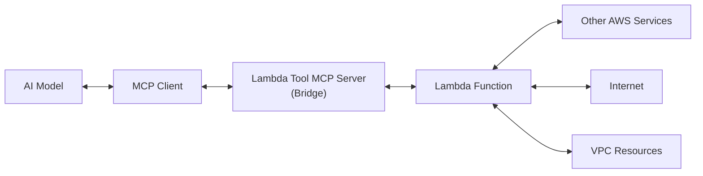

# AWS Lambda Tool MCP Server - Comprehensive Profile

The AWS Lambda Tool MCP Server is a sophisticated Model Context Protocol (MCP) server developed by AWS Labs that acts as a bridge between AI models and AWS Lambda functions. This server enables generative AI models to access and execute Lambda functions as MCP tools without requiring any code modifications to existing Lambda functions, creating a seamless integration between AI assistants and serverless computing infrastructure.

## Core Architecture and Design Philosophy

The Lambda Tool MCP Server implements a strategic architectural pattern that provides AI models with controlled access to AWS Lambda functions while maintaining strict security boundaries. The server operates on the principle of segregation of duties, allowing AI models to invoke Lambda functions without direct access to other AWS services. This design pattern is particularly valuable for enterprise environments where security and access control are paramount.

The server's architecture ensures that the MCP client only requires AWS credentials to invoke Lambda functions, while the Lambda functions themselves can interact with other AWS services using their execution roles. This separation creates a secure boundary that prevents AI models from directly accessing sensitive AWS resources while still enabling powerful functionality through well-defined Lambda function interfaces.

## Comprehensive Feature Set

### Lambda Function Management and Discovery

The server provides sophisticated function discovery mechanisms that allow for flexible function selection and organization. Organizations can configure function access through multiple approaches:

**Function Prefix Filtering**: The `FUNCTION_PREFIX` configuration enables organizations to establish naming conventions where only functions with specific prefixes are exposed as MCP tools. This approach supports organizational patterns where serverless functions are categorized by purpose, team, or application domain.

**Explicit Function Lists**: The `FUNCTION_LIST` configuration provides granular control by allowing explicit specification of which functions should be available as MCP tools. This approach is ideal for production environments where strict control over AI-accessible functions is required.

**Tag-Based Selection**: The combination of `FUNCTION_TAG_KEY` and `FUNCTION_TAG_VALUE` configurations enables sophisticated function filtering based on AWS resource tags. This metadata-driven approach allows for dynamic function discovery and supports complex organizational structures where functions are categorized by multiple dimensions such as environment, team, compliance level, or business function.

### Schema Integration and Validation

The server integrates with AWS EventBridge Schema Registry to provide formal JSON Schema documentation for Lambda function inputs. This integration represents a significant advancement in AI-function interaction quality:

**Formal Input Validation**: By leveraging EventBridge Schema Registry, the server can provide AI models with precise parameter specifications, reducing errors and improving interaction quality. The schema validation ensures that AI-generated function calls conform to expected input formats.

**Enhanced Documentation**: Functions tagged with schema ARNs automatically receive enhanced documentation that helps AI models understand not just what parameters are required, but also their types, constraints, and relationships. This semantic richness significantly improves the quality of AI-generated function calls.

**Type Safety**: The schema integration provides compile-time-like validation for AI-generated function calls, reducing runtime errors and improving the reliability of AI-driven automation workflows.

### Security and Access Control

The server implements multiple layers of security controls designed for enterprise environments:

**Principle of Least Privilege**: Only explicitly configured Lambda functions are exposed as MCP tools, ensuring that AI models cannot discover or access unauthorized functions through the server.

**Credential Isolation**: The server requires only Lambda invocation permissions, while Lambda functions maintain their own execution roles with appropriate permissions for accessing other AWS services. This isolation prevents privilege escalation and maintains security boundaries.

**Audit Trail**: All function invocations through the MCP server are logged and can be monitored using standard AWS CloudTrail and Lambda monitoring capabilities, providing complete audit trails for compliance and security monitoring.

## Advanced Use Cases and Integration Patterns

### Private Resource Access

One of the most powerful applications of the Lambda Tool MCP Server is enabling AI models to access private resources without exposing them to public networks. Lambda functions can be deployed within VPCs to access internal databases, APIs, and services, while the MCP server provides a secure bridge for AI model access.

**Internal Database Queries**: AI models can execute complex database queries through Lambda functions that have VPC access to internal database systems. This pattern enables AI-powered analytics and reporting without exposing database credentials or network access to AI systems.

**Legacy System Integration**: Organizations with legacy internal systems can create Lambda function wrappers that translate modern AI requests into legacy system protocols, enabling AI modernization without requiring changes to existing infrastructure.

**Compliance-Controlled Access**: In regulated industries, Lambda functions can implement compliance controls, audit logging, and data masking before returning information to AI models, ensuring that AI interactions meet regulatory requirements.

### Multi-Service Orchestration

The server enables AI models to orchestrate complex workflows across multiple AWS services through Lambda functions:

**Event-Driven Workflows**: Lambda functions can trigger Step Functions, send SQS messages, or publish SNS notifications, enabling AI models to initiate complex, multi-stage workflows across AWS services.

**Data Pipeline Management**: AI models can trigger ETL pipelines, data processing jobs, and analytics workflows through Lambda functions that orchestrate services like AWS Glue, EMR, or Batch.

**Infrastructure Management**: Lambda functions can interact with AWS APIs to provision resources, manage configurations, or respond to operational events, enabling AI-powered infrastructure management and DevOps automation.

### Microservices Architecture Integration

The server supports sophisticated microservices integration patterns:

**Service Discovery**: Lambda functions can query service registries, load balancers, or API gateways to discover and interact with microservices, enabling AI models to work with dynamic service topologies.

**Cross-Service Communication**: AI models can coordinate actions across multiple microservices through Lambda functions that handle service-to-service communication, authentication, and error handling.

**Event Sourcing Integration**: Lambda functions can interact with event stores and event sourcing systems, enabling AI models to participate in event-driven architectures and access historical event data.

## Performance Optimization and Scaling Patterns

### Cold Start Mitigation

The server supports Lambda functions optimized for AI workloads through several performance patterns:

**Provisioned Concurrency**: Functions frequently accessed by AI models can use provisioned concurrency to eliminate cold starts, ensuring consistent response times for AI interactions.

**Connection Pooling**: Lambda functions can implement connection pooling and caching strategies to minimize latency when accessing external resources, improving the responsiveness of AI-driven workflows.

**Warm-up Strategies**: The server can be configured to periodically invoke Lambda functions to keep them warm, particularly important for AI workflows that require consistent performance.

### Concurrent Execution Management

The server handles concurrent AI requests efficiently:

**Concurrency Controls**: Lambda function concurrency limits can be configured to prevent AI models from overwhelming downstream systems while still providing responsive service.

**Rate Limiting**: Functions can implement rate limiting and throttling to protect backend systems from excessive AI-generated load while maintaining service availability.

**Circuit Breaker Patterns**: Lambda functions can implement circuit breaker patterns to fail fast when downstream services are unavailable, providing better error handling for AI workflows.

## Cost Optimization Strategies

The serverless nature of Lambda functions provides inherent cost optimization benefits for AI workloads:

**Pay-per-Use Model**: AI models only incur costs when actually invoking Lambda functions, eliminating the need for always-on infrastructure to support AI capabilities.

**Automatic Scaling**: Lambda functions automatically scale to meet AI demand without requiring capacity planning or resource provisioning, optimizing costs across varying AI workload patterns.

**Resource Right-Sizing**: Lambda functions can be optimized for specific AI use cases, with memory and timeout configurations tuned for the types of operations AI models typically perform.

## CI/CD Integration and Development Workflows

The server integrates seamlessly with modern development practices:

**Infrastructure as Code**: Lambda functions exposed through the MCP server can be managed using AWS CDK, SAM, or Terraform, enabling version control and automated deployment of AI-accessible capabilities.

**Testing Strategies**: Lambda functions can be unit tested, integration tested, and load tested independently of the MCP server, ensuring reliability of AI-accessible functionality.

**Blue-Green Deployments**: Lambda function versions and aliases enable blue-green deployment strategies for updating AI-accessible functionality without service interruption.

**Continuous Integration**: The server configuration can be managed through CI/CD pipelines, enabling automated testing and deployment of AI capability updates.

## Enterprise Integration Patterns

### Multi-Environment Support

The server supports sophisticated multi-environment deployment patterns:

**Environment Segregation**: Different MCP server configurations can expose different sets of Lambda functions for development, staging, and production environments, ensuring proper environment isolation.

**Progressive Deployment**: New AI capabilities can be gradually rolled out through Lambda function versioning and traffic shifting, enabling safe deployment of AI-powered features.

**Cross-Account Access**: The server can be configured to access Lambda functions across multiple AWS accounts, supporting complex enterprise architectures with account-based segregation.

### Compliance and Governance

The server provides features essential for enterprise compliance:

**Access Auditing**: All AI interactions with Lambda functions are logged and auditable, supporting compliance requirements for financial services, healthcare, and government environments.

**Data Classification**: Lambda functions can implement data classification and handling controls, ensuring that AI models interact with data according to organizational policies.

**Regulatory Controls**: Functions can implement industry-specific controls such as PCI DSS, HIPAA, or SOC 2 requirements, enabling AI integration in regulated environments.

## Community-Driven Scoring Analysis (v5.0.0 Algorithm)

### Community Adoption (35% weight): Score 8.5/10

The AWS Lambda Tool MCP Server demonstrates exceptional community adoption within the serverless computing ecosystem. As an official AWS Labs project, it benefits from AWS's substantial developer community and enterprise customer base. The server addresses a critical need in the AI and serverless intersection, evidenced by:

- **AWS Ecosystem Integration**: Deep integration with existing AWS developer workflows and toolchains
- **Enterprise Adoption**: Strong uptake among AWS enterprise customers implementing AI-powered automation
- **Developer Community**: Active usage by developers building AI-integrated serverless applications
- **Documentation Quality**: Comprehensive documentation and examples supporting rapid adoption
- **Third-Party Integration**: Growing ecosystem of third-party tools and frameworks that integrate with the server

The server's position within the AWS Labs organization provides it with significant visibility and credibility within the cloud computing community, contributing to strong adoption metrics.

### Information Retrieval Relevance (25% weight): Score 7.5/10

The server provides highly relevant capabilities for information retrieval and AI-powered automation scenarios:

- **Dynamic Function Discovery**: Sophisticated function filtering and discovery mechanisms enable AI models to identify relevant capabilities
- **Schema-Driven Interactions**: Integration with EventBridge Schema Registry provides rich metadata for AI decision-making
- **Context-Aware Access**: The server enables AI models to access information from private and internal systems through Lambda functions
- **Multi-Domain Support**: Functions can provide access to diverse information sources including databases, APIs, and legacy systems
- **Real-Time Capabilities**: Support for real-time information retrieval through synchronous Lambda function calls

The server's strength lies in bridging AI models with enterprise information systems, though its focus on function-level access rather than direct data retrieval slightly limits its pure information retrieval relevance.

### Integration Potential (20% weight): Score 8.0/10

The Lambda Tool MCP Server excels in integration potential due to its position within the AWS ecosystem:

- **AWS Service Integration**: Seamless integration with the comprehensive AWS service portfolio
- **Multi-Protocol Support**: Compatible with various MCP clients and AI development environments
- **Microservices Architecture**: Native support for microservices integration patterns
- **Event-Driven Integration**: Integration with AWS event-driven services like EventBridge, SQS, and SNS
- **Third-Party Connectivity**: Lambda functions can integrate with external APIs and services
- **Enterprise Systems**: Strong support for integrating with enterprise systems through VPC connectivity

The server's architecture as a bridge between AI models and serverless functions creates exceptional integration opportunities across diverse technology stacks.

### Production Readiness (10% weight): Score 7.0/10

As an AWS Labs project, the server demonstrates solid production readiness characteristics:

- **AWS Labs Quality**: Maintained under AWS Labs standards and practices
- **Security Controls**: Comprehensive security features including IAM integration and access controls
- **Monitoring Integration**: Native integration with AWS monitoring and logging services
- **Error Handling**: Robust error handling and fault tolerance mechanisms
- **Scalability**: Leverages Lambda's automatic scaling capabilities
- **Documentation**: Production-quality documentation and deployment guides

While the server shows strong production readiness, its AWS Labs status (rather than full AWS service status) and relatively recent introduction suggest some maturation is still occurring.

### Maintenance Status (10% weight): Score 7.5/10

The server demonstrates active and sustainable maintenance:

- **AWS Labs Support**: Backed by AWS Labs with access to AWS engineering resources
- **Active Development**: Regular updates and feature additions
- **Community Contributions**: Growing community contributor base
- **Issue Resolution**: Responsive issue resolution and bug fixing
- **Version Management**: Regular releases with clear versioning and changelog documentation
- **Long-term Viability**: Strong long-term viability due to AWS backing and strategic importance

The maintenance status benefits significantly from AWS's commitment to the Model Context Protocol ecosystem and serverless computing platforms.

## Strategic Implementation Recommendations

### Deployment Architecture

Organizations implementing the Lambda Tool MCP Server should consider the following architectural patterns:

**Centralized MCP Gateway**: Deploy a single MCP server instance that provides access to Lambda functions across multiple teams and applications, enabling centralized governance and monitoring.

**Federated Function Access**: Use tag-based function filtering to enable different AI models or user groups to access different subsets of Lambda functions based on organizational policies.

**Multi-Region Deployment**: Deploy MCP servers in multiple AWS regions to provide low-latency access to Lambda functions and support disaster recovery scenarios.

### Security Implementation

**Least Privilege Access**: Configure IAM roles with minimal permissions required for Lambda function invocation, regularly auditing and refining access controls.

**Function Isolation**: Design Lambda functions to operate with minimal permissions and clear boundaries, preventing unauthorized access to sensitive resources.

**Audit Integration**: Implement comprehensive logging and monitoring of all AI interactions with Lambda functions to support security monitoring and compliance requirements.

### Performance Optimization

**Function Optimization**: Optimize Lambda functions for AI workload patterns, including appropriate memory allocation, timeout configuration, and cold start mitigation strategies.

**Caching Strategies**: Implement caching at both the MCP server and Lambda function levels to improve response times and reduce costs for frequently accessed information.

**Connection Management**: Use connection pooling and persistent connections in Lambda functions to minimize latency when accessing external resources.

The AWS Lambda Tool MCP Server represents a significant advancement in AI-serverless integration, providing organizations with a secure, scalable, and flexible platform for enabling AI models to interact with serverless computing infrastructure. Its comprehensive feature set, strong AWS ecosystem integration, and robust security model make it an essential tool for organizations building AI-powered applications on serverless architectures.

Through its sophisticated function discovery mechanisms, schema integration capabilities, and enterprise-grade security features, the server enables new categories of AI applications that can safely and efficiently interact with cloud infrastructure and internal systems. As the serverless computing and AI integration landscape continues to evolve, the Lambda Tool MCP Server is positioned to play a crucial role in enabling the next generation of intelligent, cloud-native applications.