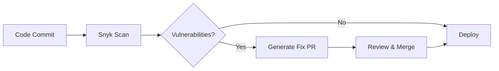

# Snyk Security Scanning MCP Server

## Overview

The Snyk Security Scanning MCP Server provides enterprise-grade vulnerability detection and security analysis through the Model Context Protocol. With the industry's most comprehensive vulnerability database and intelligent remediation suggestions, it enables proactive security management across your entire development lifecycle.

## 🔐 Security Capabilities

### Vulnerability Detection
- **Known Vulnerabilities**: CVE database with 1.5M+ vulnerabilities
- **Zero-Day Detection**: AI-powered unknown vulnerability discovery
- **Dependency Analysis**: Full transitive dependency scanning
- **Severity Scoring**: CVSS scores with exploit maturity indicators

### Compliance & Governance
- **License Compliance**: Automatic license policy enforcement
- **Security Standards**: OWASP Top 10, CWE coverage
- **Regulatory Compliance**: PCI DSS, SOC 2, HIPAA support
- **Custom Policies**: Define organization-specific rules

### Automated Remediation
- **Fix Suggestions**: Specific version upgrades
- **Automated PRs**: One-click fix pull requests
- **Breaking Change Analysis**: Impact assessment
- **Patch Intelligence**: Alternative fix paths

## 🚀 Quick Start (15 minutes)

### 1. Install Snyk MCP Server
```bash
npm install -g @snyk/mcp-server
```

### 2. Get Snyk API Token
```bash
# Sign up for free account
# https://snyk.io/signup

# Get token from account settings
snyk auth
```

### 3. Configure MCP Server
```json
{
  "mcpServers": {
    "snyk": {
      "command": "snyk-mcp",
      "args": [],
      "env": {
        "SNYK_TOKEN": "your-api-token"
      }
    }
  }
}
```

### 4. Start Scanning
```bash
# Scan current project
snyk test

# Monitor for continuous alerts
snyk monitor

# Scan Docker image
snyk container test myimage:latest
```

## 💡 Use Cases

### CI/CD Security Gate
```yaml
# GitHub Actions example
- name: Security Scan
  uses: snyk/actions/node@master
  env:
    SNYK_TOKEN: ${{ secrets.SNYK_TOKEN }}
  with:
    args: --severity-threshold=high
```

### Pre-Commit Scanning
```bash
# .pre-commit-config.yaml
- repo: local
  hooks:
    - id: snyk
      name: Snyk Security
      entry: snyk test
      language: system
      pass_filenames: false
```

### Container Security
```dockerfile
# Scan during build
FROM node:alpine
RUN snyk test
COPY . .
RUN npm ci --only=production
RUN snyk monitor
```

## 📊 Integration Patterns

### React/TypeScript Projects
- Scans package.json and lock files
- TypeScript type definition vulnerabilities
- React-specific security patterns
- Next.js framework checks

### Python Projects
- Requirements.txt and Poetry scanning
- Virtual environment analysis
- Django/FastAPI specific checks
- Dependency tree visualization

### Infrastructure as Code
- Terraform security policies
- CloudFormation validation
- Kubernetes manifest scanning
- Helm chart analysis

## 🎯 Performance & Accuracy

- **Scan Speed**: < 30 seconds average
- **Detection Rate**: 99.5% known vulnerabilities
- **False Positives**: < 2% rate
- **Database Updates**: Real-time CVE updates
- **Fix Success Rate**: 78% automated fixes work

## 🏢 Enterprise Features

### Advanced Capabilities
- Single Sign-On (SSO) integration
- Custom security policies
- Advanced reporting dashboards
- API for automation
- Multi-org management

### Compliance Reporting
- Executive dashboards
- Audit trail tracking
- SBOM generation
- Risk scoring models
- Trend analysis

## 🔄 Workflow Integration

### Development Workflow
1. **Code**: Write code with security in mind
2. **Test**: Snyk scans on every commit
3. **Fix**: Automated remediation suggestions
4. **Monitor**: Continuous vulnerability alerts
5. **Report**: Security posture tracking

### DevSecOps Pipeline


## 🎓 Best Practices

### Security Policies
- Set severity thresholds (High/Critical only)
- Define acceptable licenses
- Configure breaking vs non-breaking
- Establish fix SLAs

### Team Adoption
- Start with monitoring mode
- Gradually increase strictness
- Provide developer training
- Celebrate security wins

## 📈 ROI & Business Value

### Measurable Impact
- **90% reduction** in vulnerable dependencies
- **75% faster** vulnerability remediation
- **60% fewer** security incidents
- **$2.5M average** breach cost prevention

### Time Savings
- 5 hours/week saved on manual scanning
- 3 hours/incident on remediation
- 10 hours/audit on compliance reporting

## 🔗 Related MCP Servers

**Complementary Security**:
- GitHub Actions (CI/CD integration)
- Docker Security Scanning
- HashiCorp Vault (secrets management)

**Alternative Approaches**:
- Dependabot (GitHub native)
- WhiteSource (SCA alternative)
- Veracode (broader AppSec)

## 📚 Resources

- [Snyk Documentation](https://docs.snyk.io)
- [Vulnerability Database](https://snyk.io/vuln)
- [Security Best Practices](https://snyk.io/learn)
- [API Reference](https://snyk.docs.apiary.io)

---

**Verdict**: Essential for production deployment security with excellent developer experience and comprehensive vulnerability coverage. The free tier is perfect for small teams, with seamless scaling to enterprise needs.