# Domain Adaptive Method

## Source References
**Method Implementation**: research/orchestrator/methods/existing/domain_adaptive.md  
**Claude Desktop Research**: Domain-specific expertise adaptation pattern  
**Tree-Leaf Architecture**: Universal execution paths for domain specialization research

## Method Overview

The Domain Adaptive method provides intelligent domain specialization for both tree and leaf agents, automatically adapting methodology, expertise, and approach based on research domain while maintaining quality standards across technical, business, academic, and operational contexts.

### Method Characteristics
- **Adaptation Scope**: Multi-domain expertise with intelligent specialization
- **Execution Style**: Domain-aware coordination (tree) or enhanced domain templates (leaf)
- **Quality Focus**: Domain expertise with specialized knowledge application
- **Complexity Support**: Moderate to complex domain-specific research requirements
- **Execution Time**: 40-65 minutes (tree adaptive) or 50-75 minutes (leaf enhanced)

## Hybrid Adaptive Architecture

### Intelligent Domain Specialization Framework

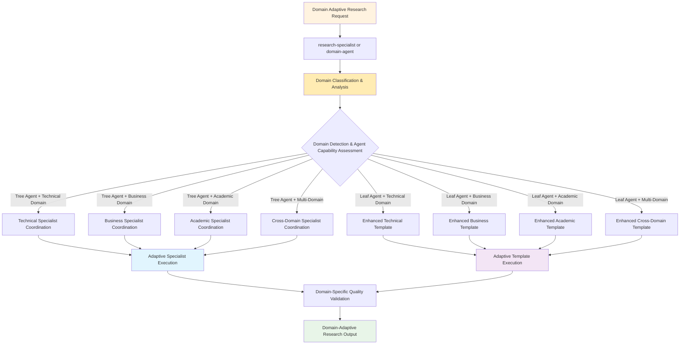

## Tree Agent Execution (Domain Specialist Coordination)

### Technical Domain Specialist Coordination

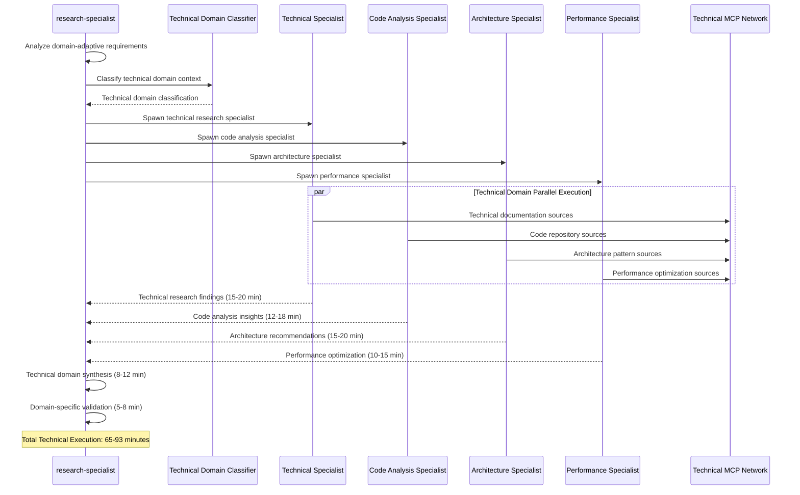

### Business Domain Specialist Coordination

### Academic Domain Specialist Coordination

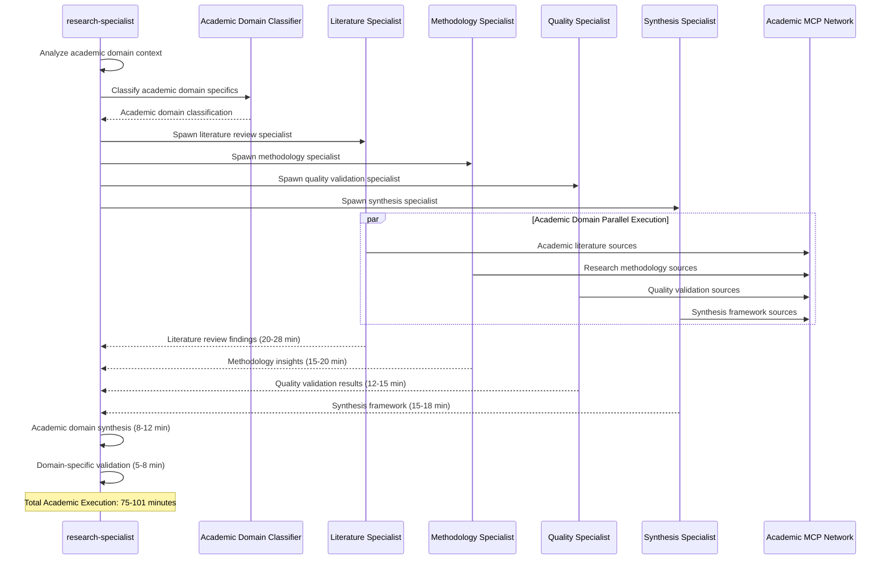

## Leaf Agent Execution (Enhanced Domain Templates)

### Technical Domain Enhanced Template

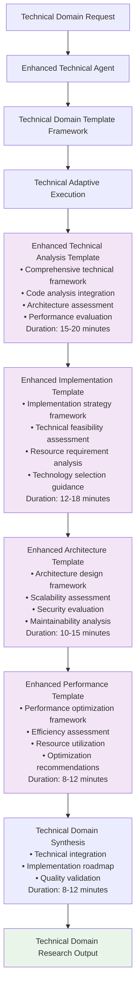

### Business Domain Enhanced Template

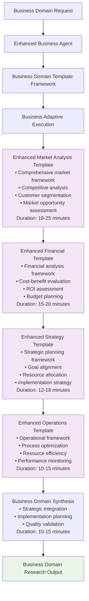

### Academic Domain Enhanced Template

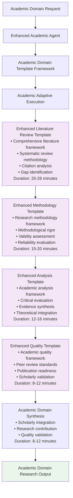

## Domain Classification Framework

### Intelligent Domain Detection

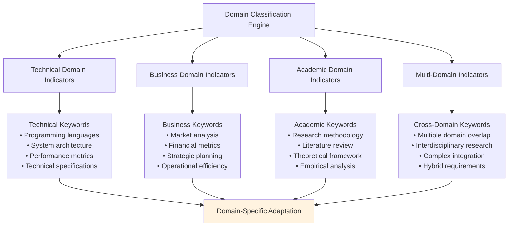

### Domain-Specific MCP Coordination

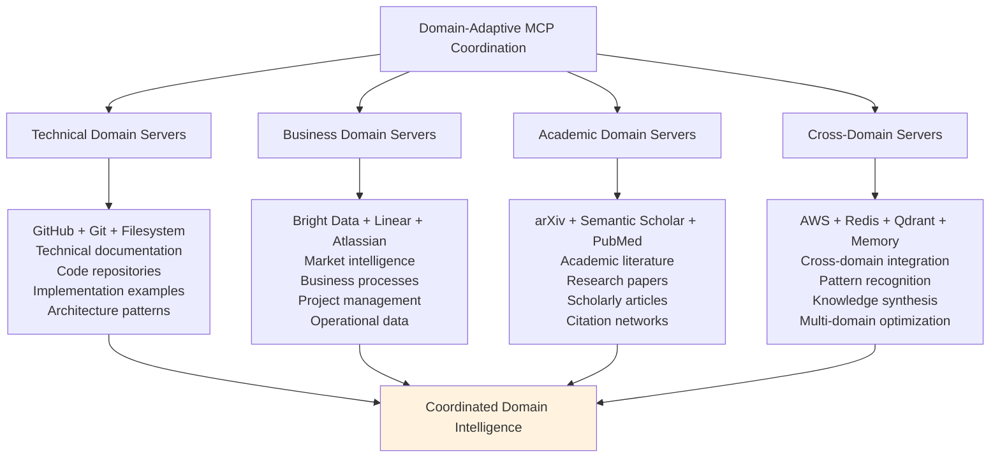

## Adaptive Quality Framework

### Domain-Specific Quality Standards

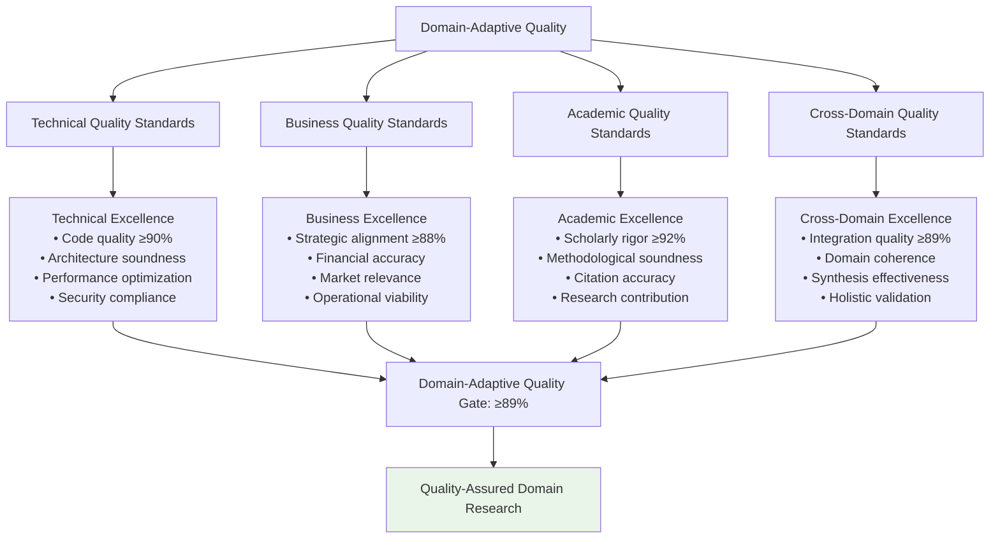

### Constitutional AI Compliance by Domain

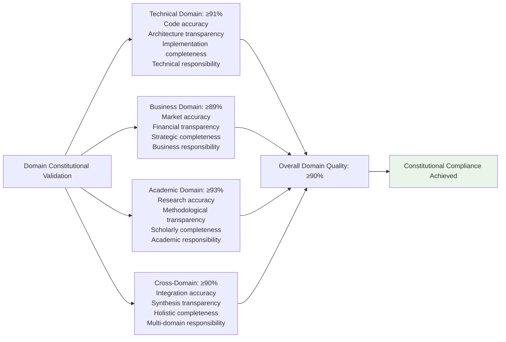

## Performance Characteristics

### Domain-Adaptive Execution Metrics

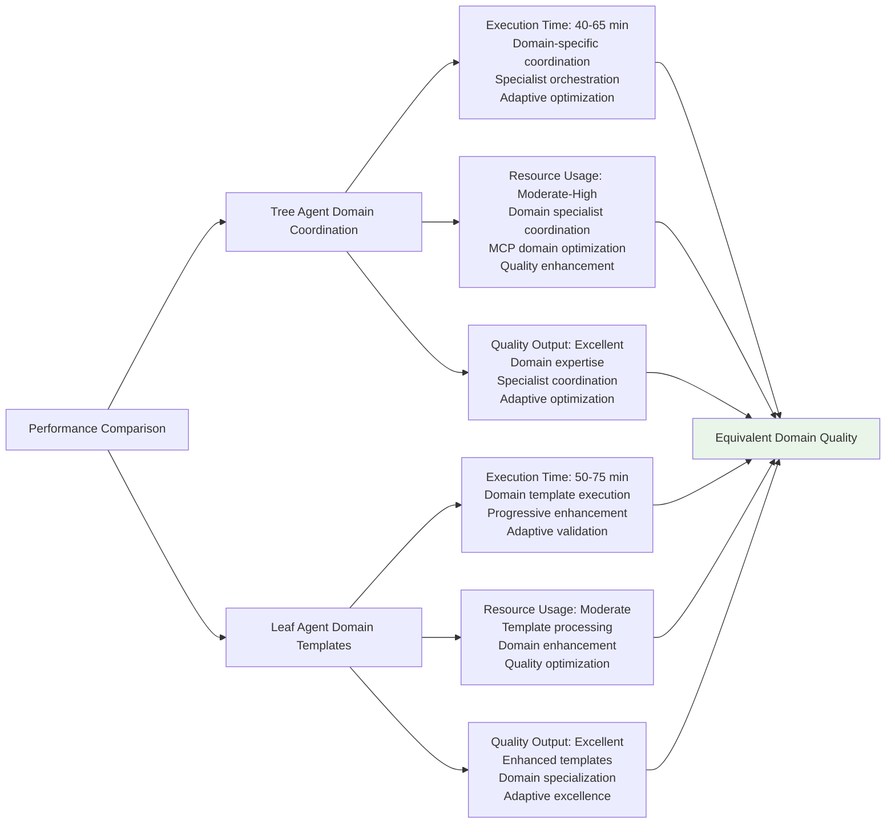

## Domain Application Examples

### Technical Domain: Cloud Architecture Analysis
- **Context**: "Evaluate microservices architecture for high-scale e-commerce platform"
- **Adaptation**: Technical specialists (architecture, performance, security, scalability)
- **Output**: Domain-expert technical analysis with implementation roadmap

### Business Domain: Market Entry Strategy
- **Context**: "Develop SaaS market entry strategy for European expansion"
- **Adaptation**: Business specialists (market, financial, strategy, operations)
- **Output**: Domain-expert business strategy with comprehensive planning

### Academic Domain: Research Synthesis
- **Context**: "Systematic literature review on AI ethics in healthcare applications"
- **Adaptation**: Academic specialists (literature, methodology, analysis, quality)
- **Output**: Domain-expert academic research with scholarly rigor

### Cross-Domain: Digital Transformation
- **Context**: "Plan digital transformation combining technical, business, and organizational aspects"
- **Adaptation**: Multi-domain specialists with cross-domain integration
- **Output**: Domain-expert comprehensive transformation strategy

## Implementation Guidelines

### For Tree Agents
1. **Domain Classification**: Implement intelligent domain detection with appropriate specialist coordination
2. **Specialist Coordination**: Coordinate domain-specific specialists with clear expertise boundaries
3. **Adaptive Optimization**: Optimize coordination patterns based on domain requirements
4. **Quality Integration**: Apply domain-specific quality standards throughout coordination
5. **Cross-Domain Synthesis**: Ensure effective integration across multiple domain specializations

### For Leaf Agents
1. **Template Adaptation**: Use enhanced domain-specific templates with specialized frameworks
2. **Domain Enhancement**: Apply comprehensive domain expertise through enhanced templates
3. **Adaptive Excellence**: Maintain domain specialization throughout template execution
4. **Quality Focus**: Apply domain-specific validation throughout adaptive execution
5. **Specialization Mastery**: Achieve domain expertise through enhanced template specialization

### Universal Quality Standards
1. **Domain Expertise**: Ensure authentic domain specialization is achieved
2. **Adaptive Quality**: Maintain domain-appropriate quality standards
3. **Quality Excellence**: Achieve ≥89% constitutional compliance score
4. **Specialization Value**: Deliver domain-expert insights and recommendations
5. **Adaptive Integration**: Provide effective synthesis across domain boundaries

This Domain Adaptive method demonstrates sophisticated specialization patterns for domain-expert research while maintaining quality excellence across different agent execution capabilities and domain requirements.