# Iterative Research Refinement Method

## Source References
**Method Implementation**: research/orchestrator/methods/advanced/iterative_research_refinement.md  
**Claude Desktop Research**: Self-improvement and quality progression pattern  
**Tree-Leaf Architecture**: Universal execution paths for iterative research methodology

## Method Overview

The Iterative Research Refinement method provides systematic quality progression through multiple improvement cycles for both tree and leaf agents, enabling continuous enhancement, error correction, and quality optimization through structured feedback loops and progressive refinement cycles.

### Method Characteristics
- **Iteration Cycles**: 2-4 progressive refinement cycles
- **Execution Style**: Systematic improvement cycles with quality progression
- **Quality Focus**: Progressive enhancement with error reduction
- **Complexity Support**: Simple to complex research requiring quality optimization
- **Execution Time**: 60-90 minutes (tree coordinated) or 70-100 minutes (leaf progressive)

## Hybrid Refinement Architecture

### Progressive Quality Enhancement Framework

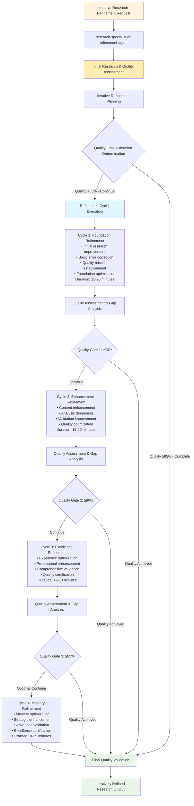

## Tree Agent Execution (Coordinated Refinement)

### Multi-Cycle Quality Coordination

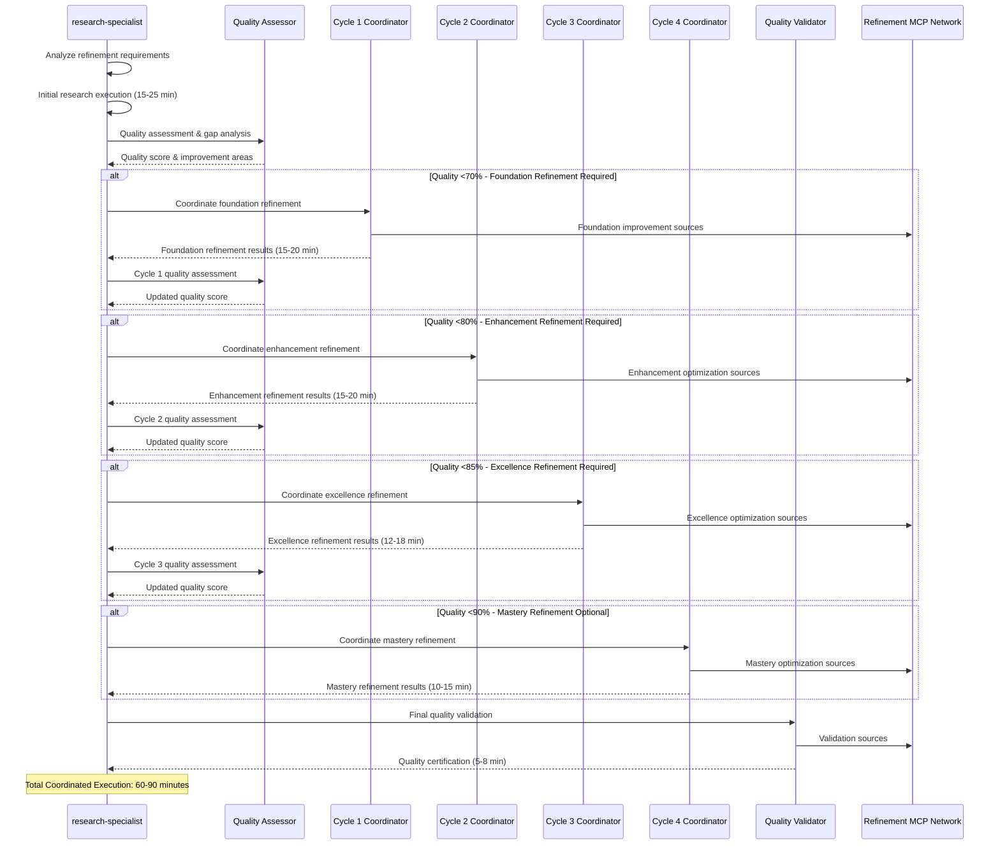

### Progressive Quality Gate System

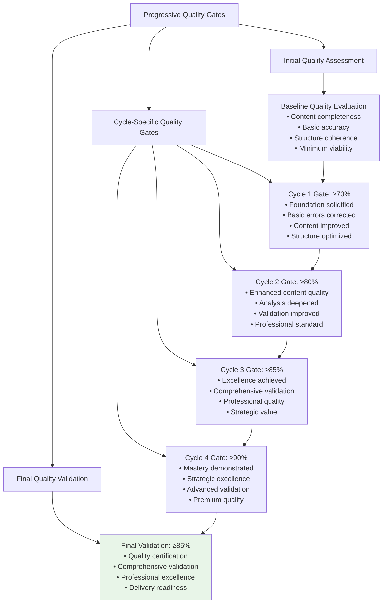

### Refinement MCP Coordination Strategy

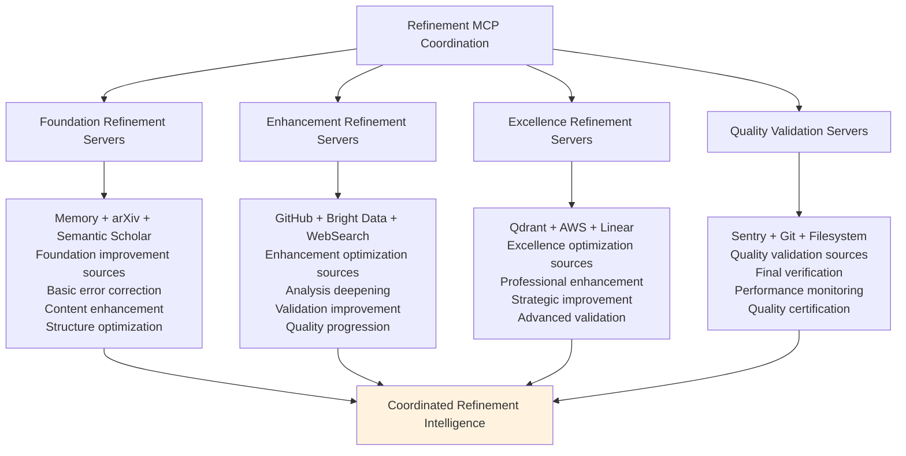

## Leaf Agent Execution (Progressive Template Refinement)

### Enhanced Iterative Template Framework

```mermaid
flowchart TD
    A[Iterative Research Refinement Request] --> B[Enhanced Refinement Agent]
    B --> C[Progressive Refinement Template]
    C --> D[Enhanced Iterative Framework Execution]
    
    D --> E[Enhanced Initial Research Template<br/>• Comprehensive initial framework<br/>• Foundation establishment<br/>• Baseline quality development<br/>• Quality assessment integration<br/>Duration: 18-25 minutes]
    
    E --> F[Enhanced Cycle 1 Template<br/>• Foundation refinement framework<br/>• Error correction system<br/>• Content improvement cycles<br/>• Quality progression tracking<br/>Duration: 16-22 minutes]
    
    F --> G[Enhanced Cycle 2 Template<br/>• Enhancement refinement framework<br/>• Analysis deepening system<br/>• Professional quality development<br/>• Validation improvement<br/>Duration: 16-22 minutes]
    
    G --> H[Enhanced Cycle 3 Template<br/>• Excellence refinement framework<br/>• Strategic enhancement system<br/>• Comprehensive validation<br/>• Quality certification<br/>Duration: 14-20 minutes]
    
    H --> I[Enhanced Final Validation Template<br/>• Quality certification framework<br/>• Comprehensive assessment<br/>• Final optimization<br/>• Delivery preparation<br/>Duration: 6-10 minutes]
    
    I --> J[Iteratively Refined Research Output]
    
    style E fill:#f3e5f5
    style F fill:#f3e5f5
    style G fill:#f3e5f5
    style H fill:#f3e5f5
    style I fill:#f3e5f5
    style J fill:#e8f5e8
```

### Progressive Template Enhancement Strategy

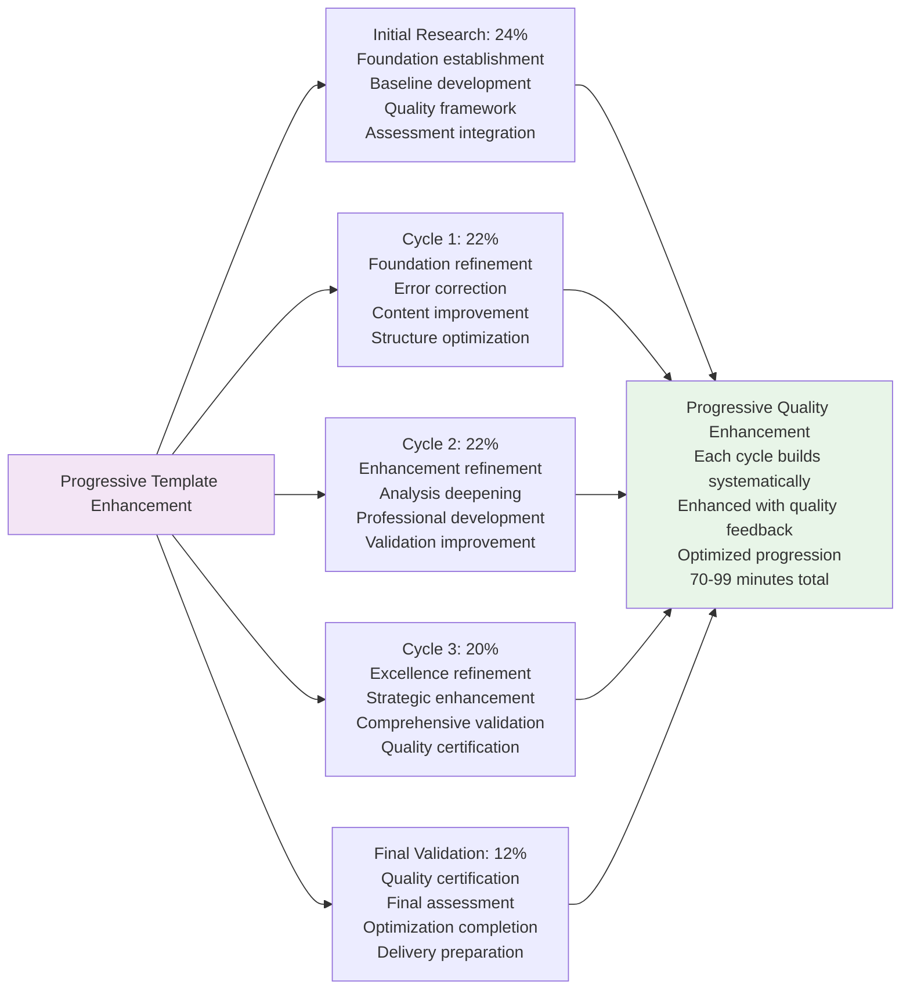

## Refinement Cycle Patterns

### Cycle 1: Foundation Refinement

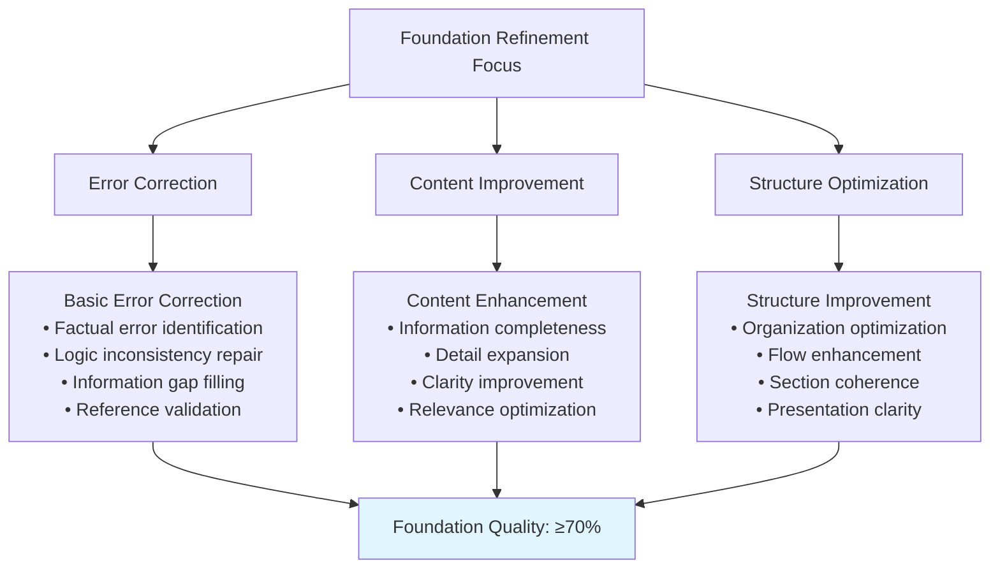

### Cycle 2: Enhancement Refinement

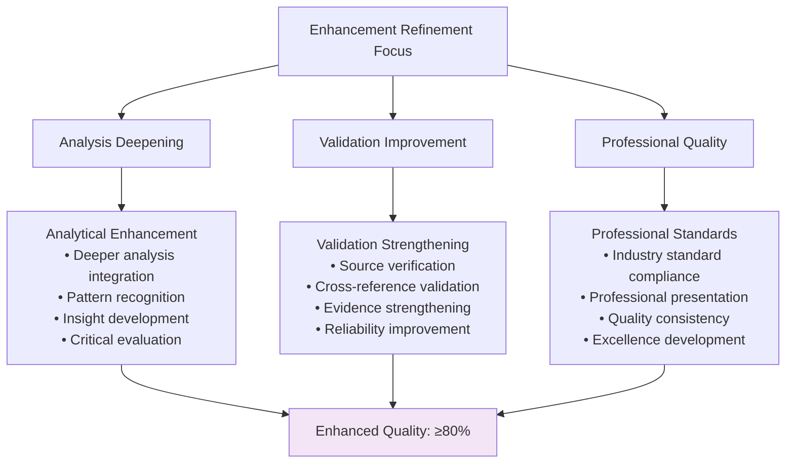

### Cycle 3: Excellence Refinement

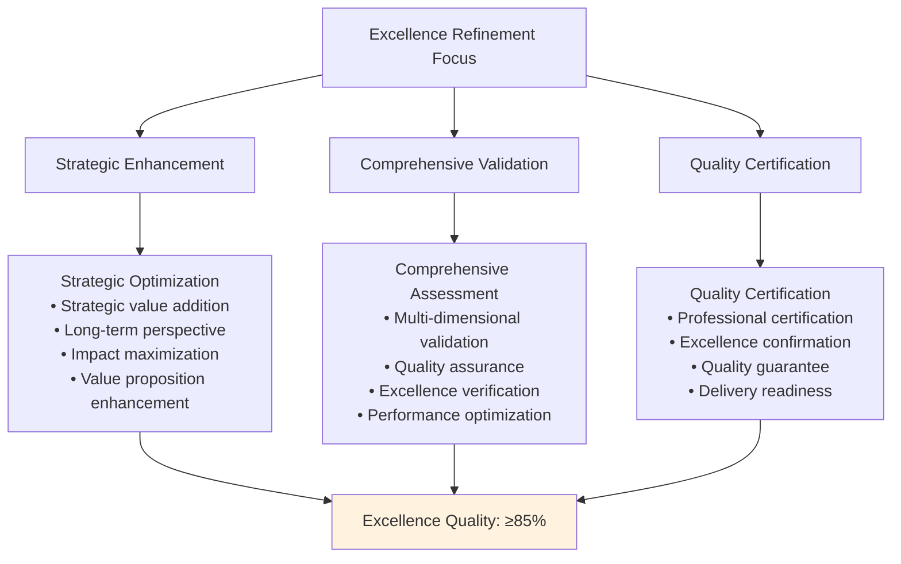

### Cycle 4: Mastery Refinement (Optional)

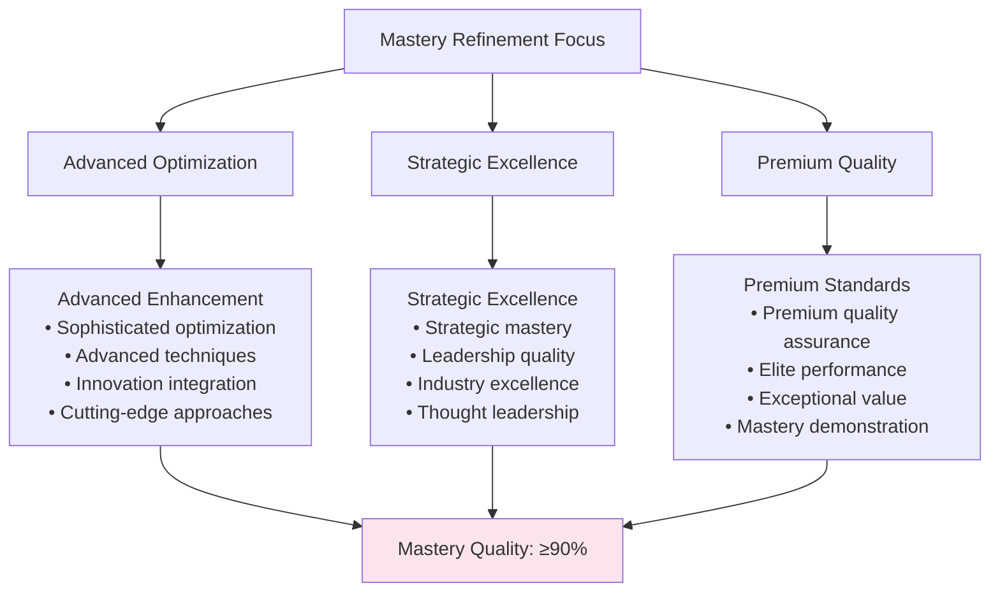

## Quality Assessment Framework

### Multi-Dimensional Quality Evaluation

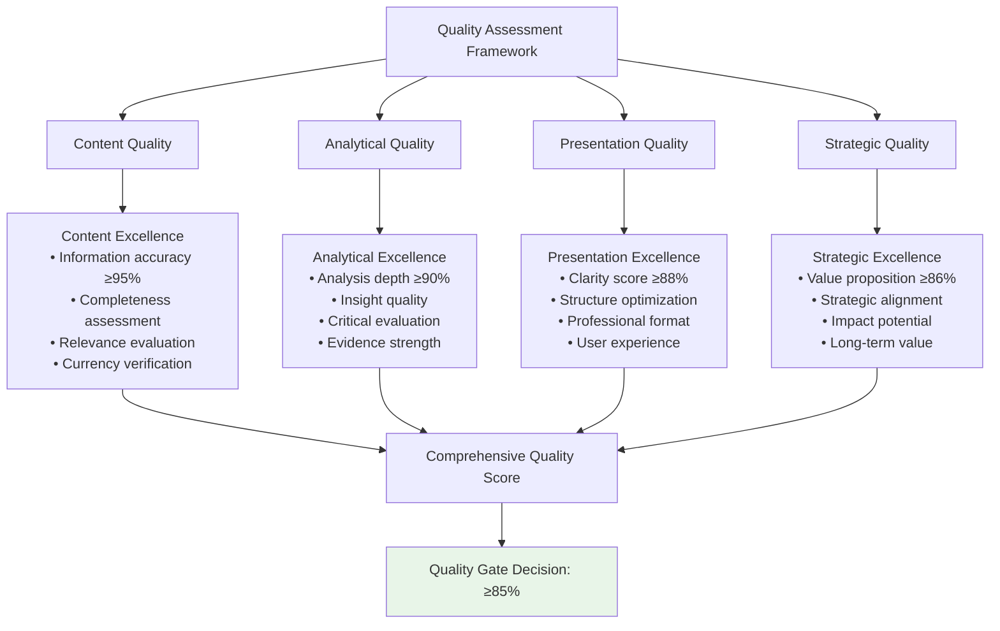

### Progressive Quality Tracking

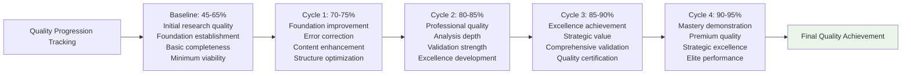

## Quality Gate System

### Automated Quality Assessment

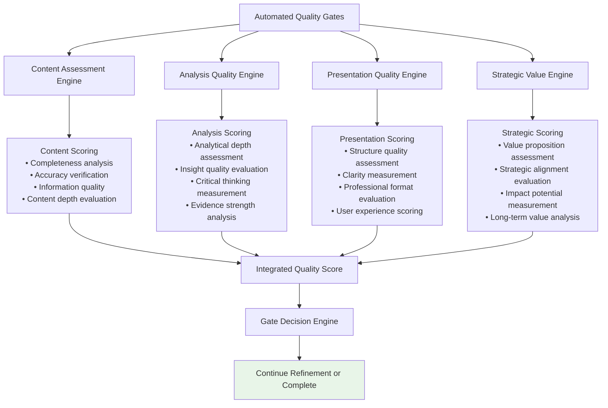

### Quality Improvement Feedback Loop

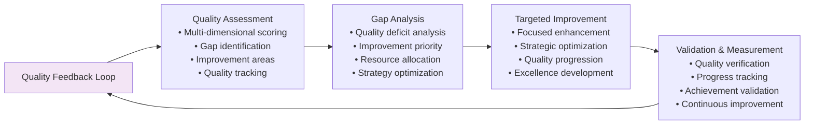

## Performance Characteristics

### Iterative Execution Metrics

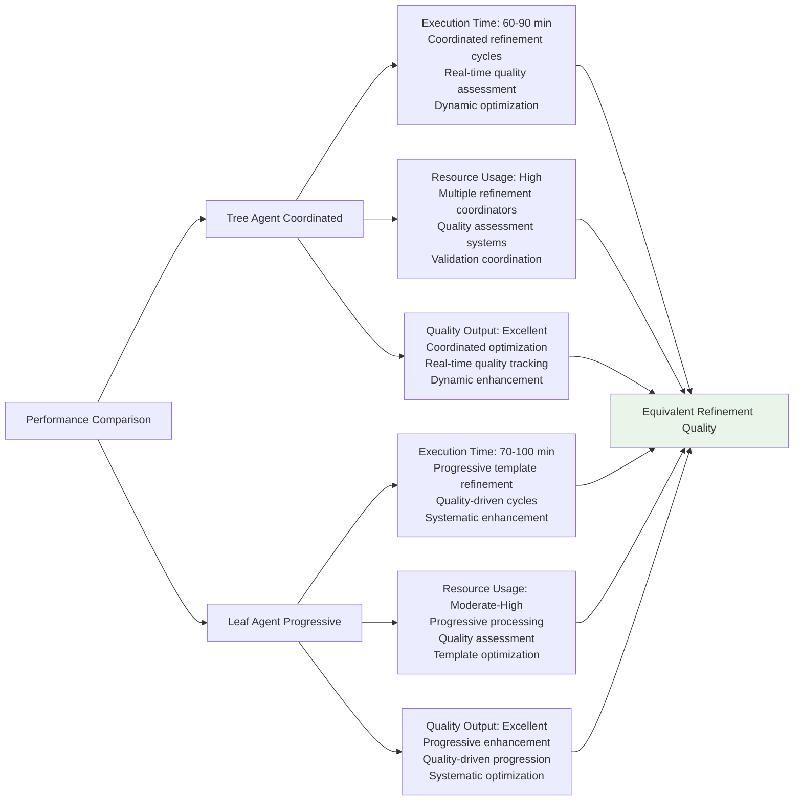

## Constitutional AI Compliance

### Progressive Constitutional Validation

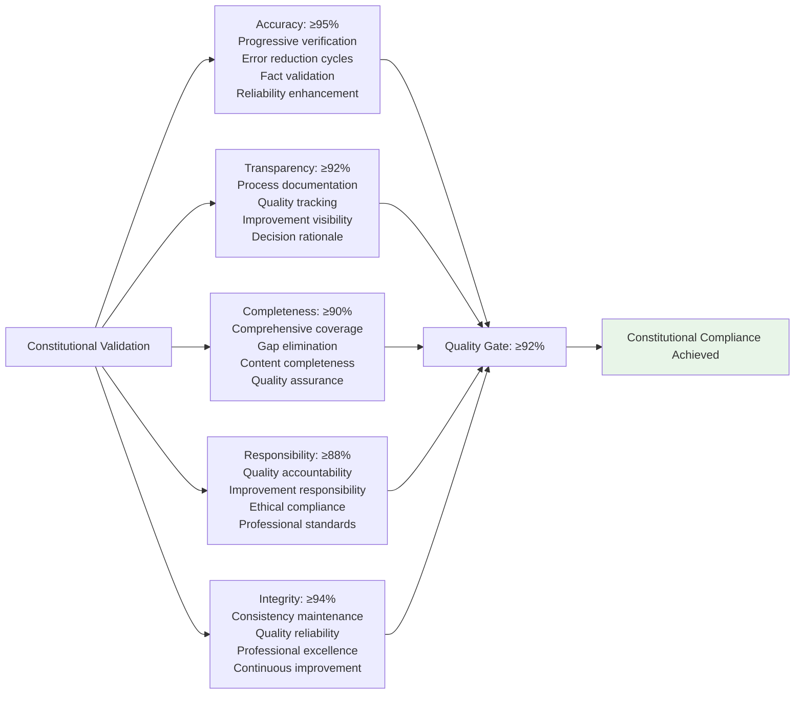

## Iterative Application Examples

### Technology Implementation Strategy
- **Context**: "Develop comprehensive cloud migration strategy with quality optimization"
- **Cycles**: Initial strategy (baseline), Risk refinement (Cycle 1), Cost optimization (Cycle 2), Strategic enhancement (Cycle 3)
- **Output**: Iteratively refined migration strategy with progressive quality enhancement

### Academic Research Analysis
- **Context**: "Conduct systematic literature review with quality progression"
- **Cycles**: Initial literature survey (baseline), Methodology refinement (Cycle 1), Analysis enhancement (Cycle 2), Scholarly excellence (Cycle 3)
- **Output**: Progressively refined academic research with publication-ready quality

### Business Process Optimization
- **Context**: "Design operational efficiency improvement with iterative refinement"
- **Cycles**: Process analysis (baseline), Efficiency refinement (Cycle 1), Quality enhancement (Cycle 2), Strategic optimization (Cycle 3)
- **Output**: Iteratively optimized business process with measurable improvement

## Implementation Guidelines

### For Tree Agents
1. **Coordinated Refinement**: Implement systematic quality coordination across refinement cycles
2. **Real-Time Assessment**: Apply continuous quality monitoring throughout coordination
3. **Dynamic Optimization**: Adapt refinement strategies based on quality progression
4. **Resource Coordination**: Efficiently manage MCP resources across refinement cycles
5. **Excellence Orchestration**: Achieve systematic quality improvement through coordinated refinement

### For Leaf Agents
1. **Progressive Enhancement**: Execute enhanced refinement templates with systematic quality progression
2. **Quality-Driven Cycles**: Apply quality gates to determine refinement cycle progression
3. **Systematic Improvement**: Build quality systematically through progressive template enhancement
4. **Validation Integration**: Apply comprehensive quality assessment throughout progression
5. **Excellence Achievement**: Maintain quality focus while achieving systematic improvement

### Universal Quality Standards
1. **Progressive Excellence**: Ensure each refinement cycle achieves measurable quality improvement
2. **Quality Gate Compliance**: Meet quality thresholds before cycle progression
3. **Quality Excellence**: Achieve ≥92% constitutional compliance score
4. **Systematic Improvement**: Provide measurable quality enhancement through iterative refinement
5. **Professional Excellence**: Deliver systematically optimized research through progressive quality enhancement

This Iterative Research Refinement method demonstrates sophisticated quality progression patterns for systematic research improvement while maintaining excellence across different agent execution capabilities and quality optimization requirements.