# Modular Task Decomposition Method

## Source References
**Method Implementation**: research/orchestrator/methods/advanced/modular_task_decomposition.md  
**Claude Desktop Research**: Task breakdown and parallel planning pattern  
**Tree-Leaf Architecture**: Universal execution paths for modular research methodology

## Method Overview

The Modular Task Decomposition method provides intelligent task breakdown and parallel planning for both tree and leaf agents, decomposing complex research into independent modules, enabling parallel execution, and synthesizing results while maintaining coherence across distributed analysis.

### Method Characteristics
- **Decomposition Scope**: 3-7 independent research modules
- **Execution Style**: Parallel module execution (tree) or sequential enhanced templates (leaf)
- **Quality Focus**: Modular excellence with integrated synthesis
- **Complexity Support**: Moderate to complex research requiring systematic breakdown
- **Execution Time**: 45-70 minutes (tree parallel) or 55-80 minutes (leaf sequential)

## Hybrid Decomposition Architecture

### Intelligent Task Breakdown Framework

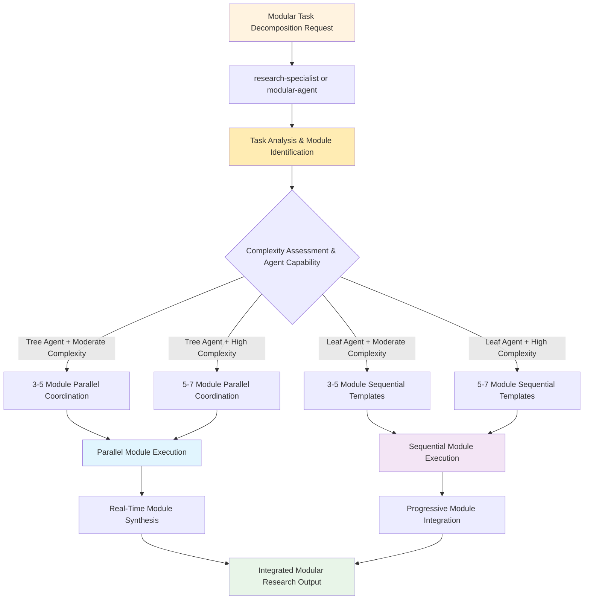

## Tree Agent Execution (Parallel Module Coordination)

### 5-Module Parallel Research Coordination

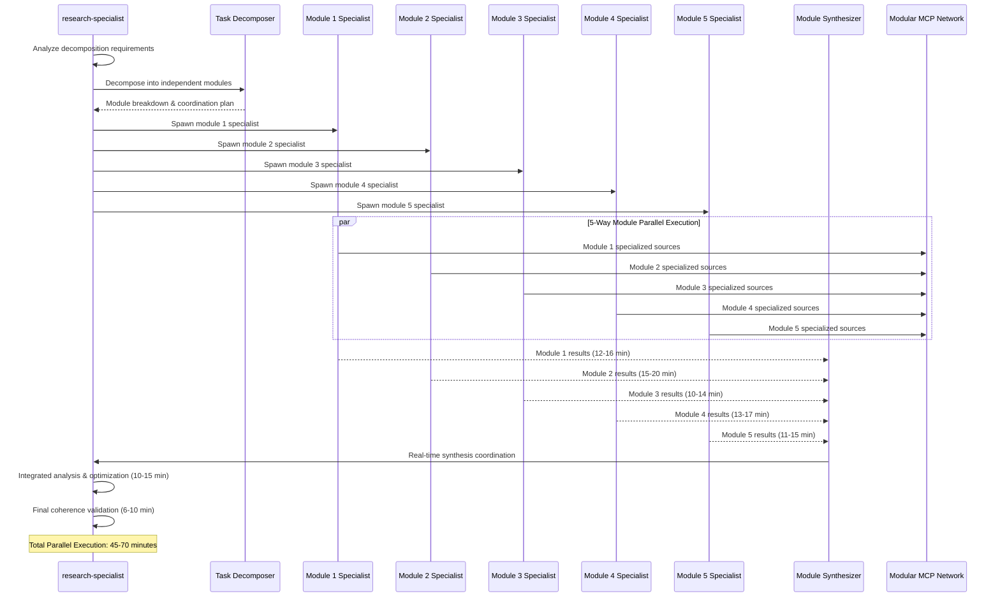

### 7-Module Complex Research Coordination

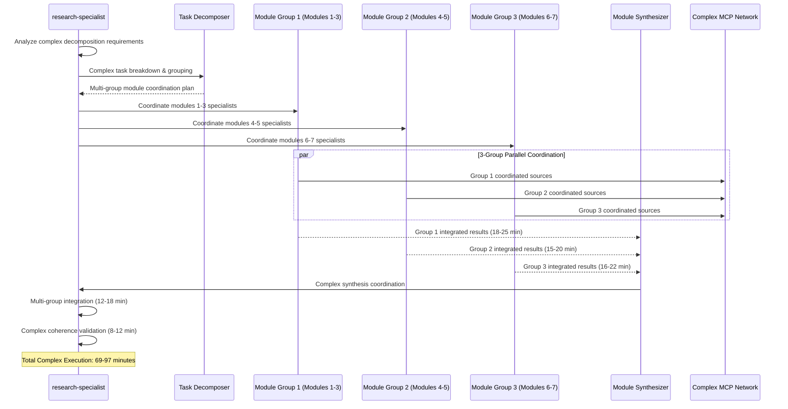

### Modular MCP Coordination Strategy

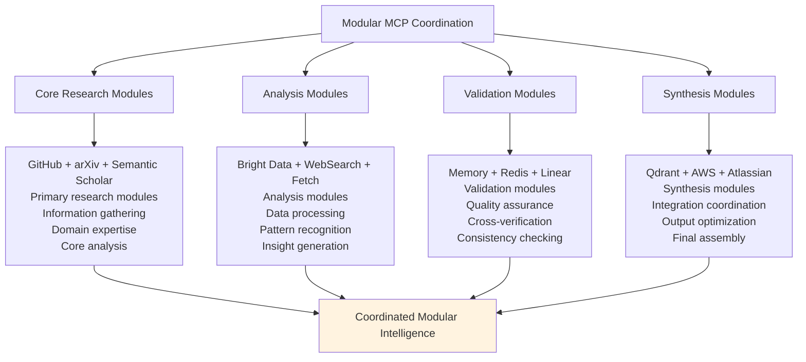

## Leaf Agent Execution (Sequential Module Templates)

### Enhanced Modular Template Framework

```mermaid
flowchart TD
    A[Modular Task Decomposition Request] --> B[Enhanced Modular Agent]
    B --> C[Modular Sequential Template]
    C --> D[Enhanced Module Framework Execution]
    
    D --> E[Enhanced Module Planning Template<br/>• Comprehensive task analysis<br/>• Module identification & boundaries<br/>• Dependency mapping<br/>• Integration strategy<br/>Duration: 8-12 minutes]
    
    E --> F[Enhanced Module 1 Template<br/>• Module-specific research framework<br/>• Specialized analysis approach<br/>• Domain expertise application<br/>• Targeted investigation<br/>Duration: 12-16 minutes]
    
    F --> G[Enhanced Module 2 Template<br/>• Complementary research framework<br/>• Alternative perspective analysis<br/>• Cross-domain investigation<br/>• Specialized insights<br/>Duration: 10-14 minutes]
    
    G --> H[Enhanced Module 3 Template<br/>• Additional analysis dimension<br/>• Comprehensive coverage<br/>• Expert domain focus<br/>• Quality enhancement<br/>Duration: 11-15 minutes]
    
    H --> I[Enhanced Module Integration Template<br/>• Module synthesis framework<br/>• Cross-module validation<br/>• Coherence optimization<br/>• Integration excellence<br/>Duration: 8-12 minutes]
    
    I --> J[Enhanced Quality Synthesis Template<br/>• Final integration validation<br/>• Output optimization<br/>• Coherence assurance<br/>• Quality certification<br/>Duration: 6-10 minutes]
    
    J --> K[Modular Research Output]
    
    style E fill:#f3e5f5
    style F fill:#f3e5f5
    style G fill:#f3e5f5
    style H fill:#f3e5f5
    style I fill:#f3e5f5
    style J fill:#f3e5f5
    style K fill:#e8f5e8
```

### Sequential Module Enhancement Strategy

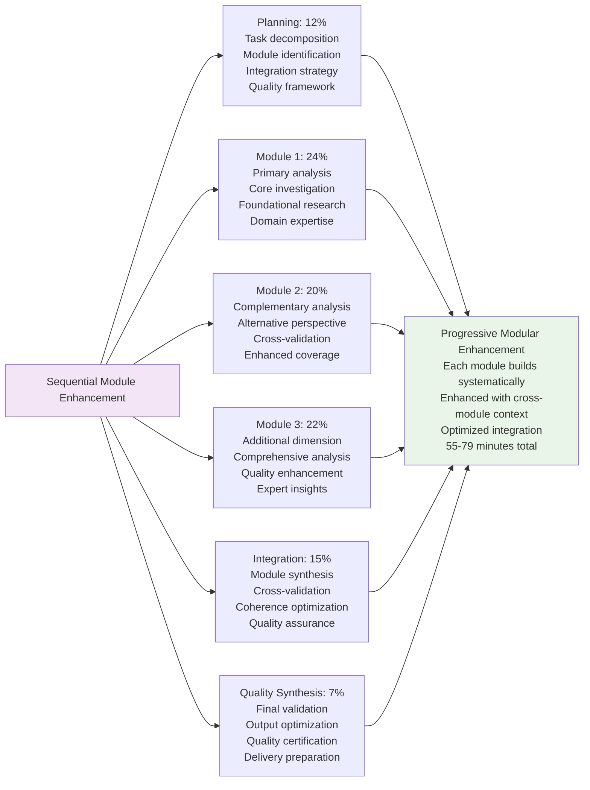

## Module Decomposition Patterns

### Research Domain Module Breakdown

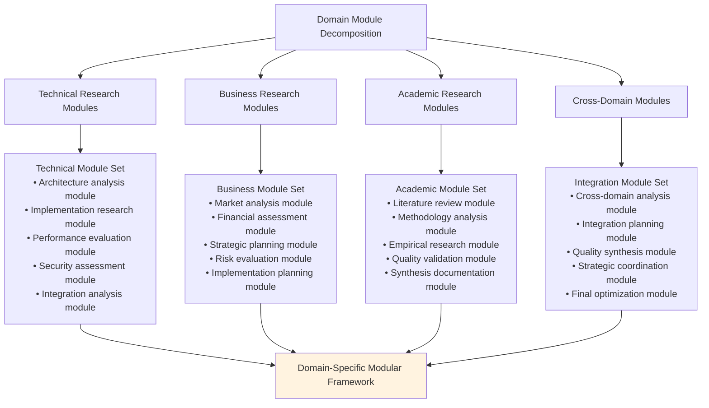

### Module Dependency Management

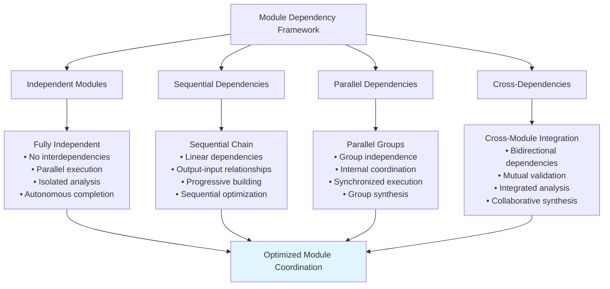

## Synthesis and Integration Framework

### Real-Time Module Synthesis (Tree Agents)

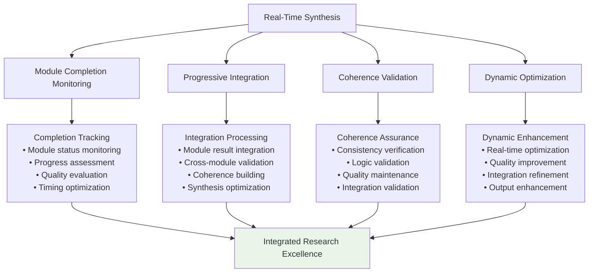

### Progressive Module Integration (Leaf Agents)

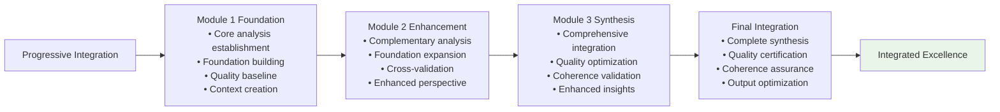

## Quality Assurance Framework

### Modular Quality Validation

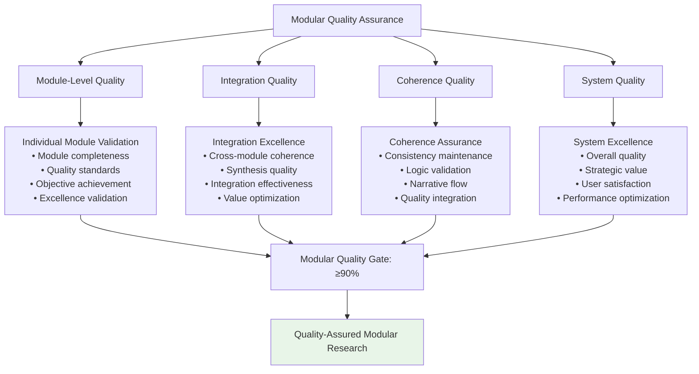

### Constitutional AI Compliance

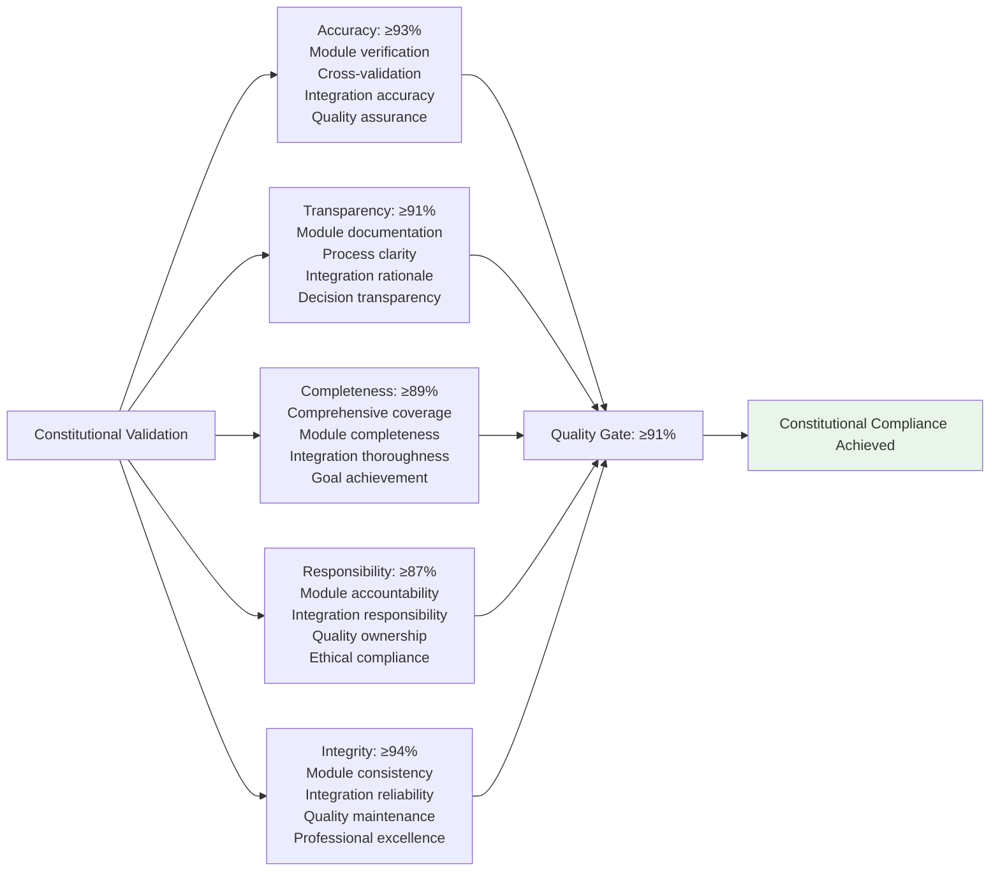

## Performance Characteristics

### Modular Execution Metrics

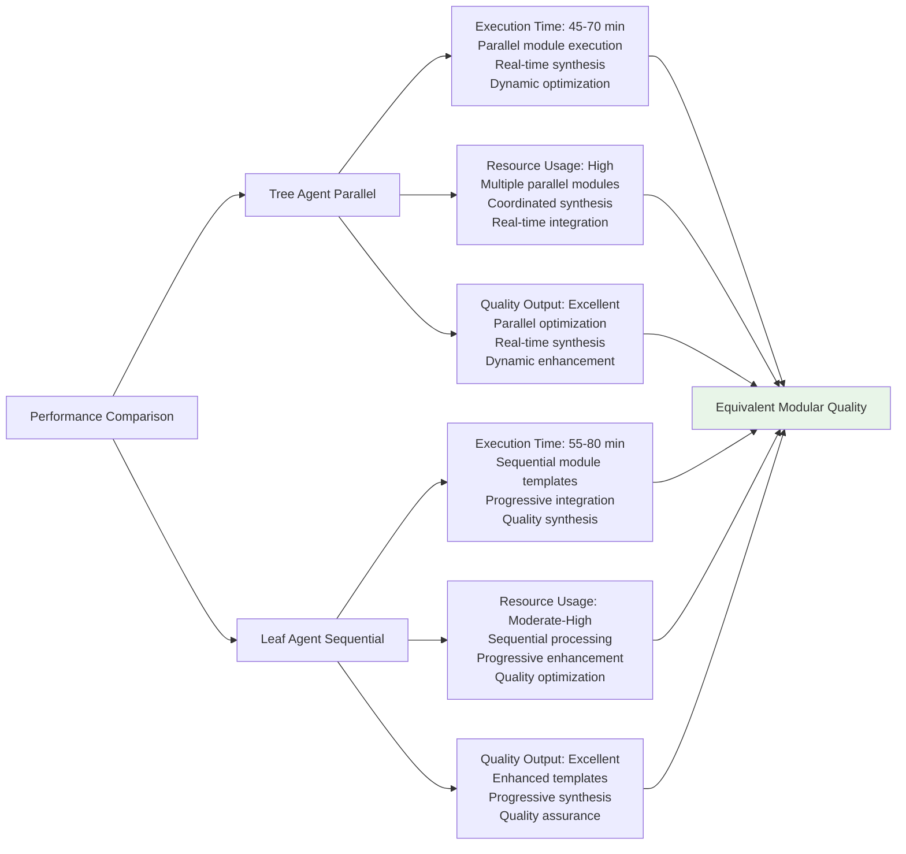

## Modular Application Examples

### Software Architecture Analysis
- **Context**: "Analyze microservices architecture for e-commerce platform"
- **Modules**: Architecture patterns (Module 1), Scalability assessment (Module 2), Security evaluation (Module 3), Performance optimization (Module 4), Implementation strategy (Module 5)
- **Output**: Comprehensive architecture analysis with modular expertise integration

### Market Entry Strategy Development
- **Context**: "Develop comprehensive market entry strategy for European expansion"
- **Modules**: Market analysis (Module 1), Competitive landscape (Module 2), Regulatory assessment (Module 3), Financial planning (Module 4), Implementation roadmap (Module 5)
- **Output**: Modular market entry strategy with integrated strategic planning

### Research Methodology Design
- **Context**: "Design comprehensive research methodology for user experience study"
- **Modules**: Literature review (Module 1), Methodology selection (Module 2), Data collection design (Module 3), Analysis framework (Module 4), Validation approach (Module 5)
- **Output**: Modular research methodology with systematic integration

## Implementation Guidelines

### For Tree Agents
1. **Module Coordination**: Implement intelligent task decomposition with parallel specialist coordination
2. **Real-Time Synthesis**: Apply dynamic integration throughout parallel execution
3. **Quality Orchestration**: Maintain modular quality standards while optimizing coordination
4. **Resource Management**: Efficiently allocate MCP resources across parallel modules
5. **Integration Excellence**: Achieve seamless synthesis through coordinated modular approach

### For Leaf Agents
1. **Template Modularity**: Execute enhanced modular templates with systematic progression
2. **Progressive Integration**: Build context systematically through sequential module enhancement
3. **Quality Focus**: Apply comprehensive validation throughout modular progression
4. **Coherence Maintenance**: Ensure integration quality through progressive synthesis
5. **Modular Excellence**: Achieve systematic coverage through enhanced template coordination

### Universal Quality Standards
1. **Module Excellence**: Ensure each module achieves comprehensive analysis within scope
2. **Integration Quality**: Maintain coherence and consistency across module synthesis
3. **Quality Excellence**: Achieve ≥91% constitutional compliance score
4. **Systematic Coverage**: Provide comprehensive analysis through modular decomposition
5. **Strategic Value**: Deliver integrated insights through modular expertise coordination

This Modular Task Decomposition method demonstrates sophisticated breakdown patterns for complex research while maintaining quality excellence across different agent execution capabilities and integration requirements.