# Complex Research Method

## Source References
**Method Implementation**: research/orchestrator/methods/multi-agent/complex_research.md  
**Claude Desktop Research**: Anthropic's modular business analysis coordination pattern  
**Tree-Leaf Architecture**: Universal execution paths for comprehensive business research

## Method Overview

The Complex Research method coordinates 5 specialized business module agents (tree) or executes 5 comprehensive module templates (leaf) to provide systematic business analysis covering market landscape, technical feasibility, risk assessment, financial impact, and implementation planning.

### Method Characteristics
- **Module Count**: 5 distinct business analysis modules
- **Coordination Style**: Modular specialists (tree) or structured templates (leaf)
- **Quality Focus**: Comprehensive business coverage with systematic integration
- **Complexity Support**: Complex business and strategic research requirements
- **Execution Time**: 60-90 minutes (tree) or 100-140 minutes (leaf)

## Tree Agent Execution (5 Parallel Business Modules)

### Modular Business Analysis Coordination

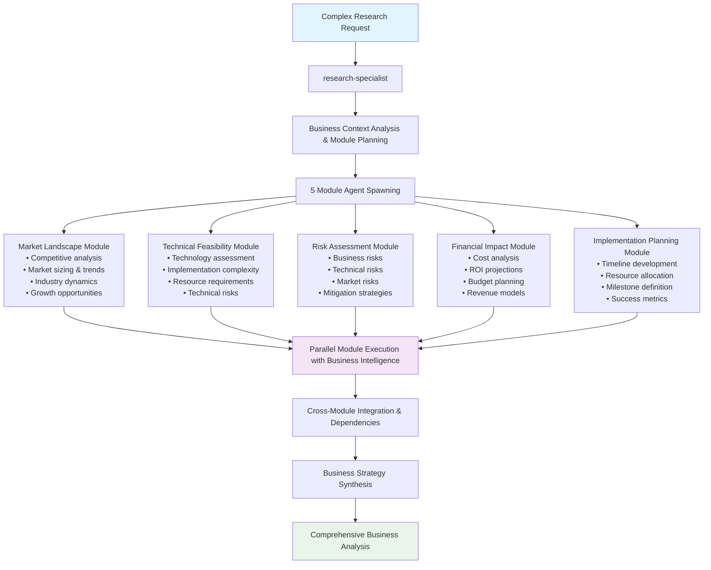

### Parallel Module Execution Flow

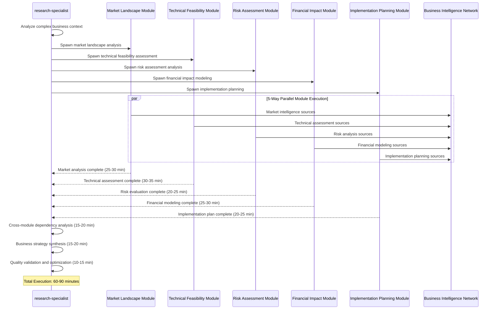

### MCP Server Coordination by Module

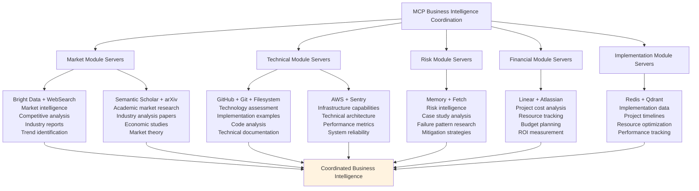

## Leaf Agent Execution (5 Sequential Module Templates)

### Comprehensive Module Template Progression

```mermaid
flowchart TD
    A[Complex Research Request] --> B[research-specialist]
    B --> C[Module Template Design & Business Framework]
    C --> D[Sequential 5-Module Execution]
    
    D --> E[Market Landscape Template<br/>• Enhanced with competitive intelligence<br/>• Market sizing framework<br/>• Industry dynamics analysis<br/>• Growth opportunity mapping<br/>Duration: 20-25 minutes]
    
    E --> F[Technical Feasibility Template<br/>• Enhanced with technology assessment<br/>• Implementation complexity matrix<br/>• Resource requirement analysis<br/>• Technical risk evaluation<br/>Duration: 25-30 minutes]
    
    F --> G[Risk Assessment Template<br/>• Enhanced with comprehensive framework<br/>• Multi-dimensional risk analysis<br/>• Probability-impact assessment<br/>• Mitigation strategy development<br/>Duration: 18-22 minutes]
    
    G --> H[Financial Impact Template<br/>• Enhanced with advanced modeling<br/>• Cost-benefit analysis<br/>• ROI projections<br/>• Budget planning framework<br/>Duration: 22-28 minutes]
    
    H --> I[Implementation Planning Template<br/>• Enhanced with project management<br/>• Timeline optimization<br/>• Resource allocation<br/>• Success measurement<br/>Duration: 18-22 minutes]
    
    I --> J[Cross-Module Integration<br/>• Module dependency analysis<br/>• Business strategy synthesis<br/>• Coherence validation<br/>Duration: 15-20 minutes]
    
    J --> K[Quality Validation<br/>• Constitutional compliance<br/>• Business logic verification<br/>• Strategic alignment<br/>Duration: 10-15 minutes]
    
    K --> L[Comprehensive Business Analysis]
    
    style E fill:#f3e5f5
    style F fill:#f3e5f5
    style G fill:#f3e5f5
    style H fill:#f3e5f5
    style I fill:#f3e5f5
    style L fill:#e8f5e8
```

### Module Template Enhancement Strategy

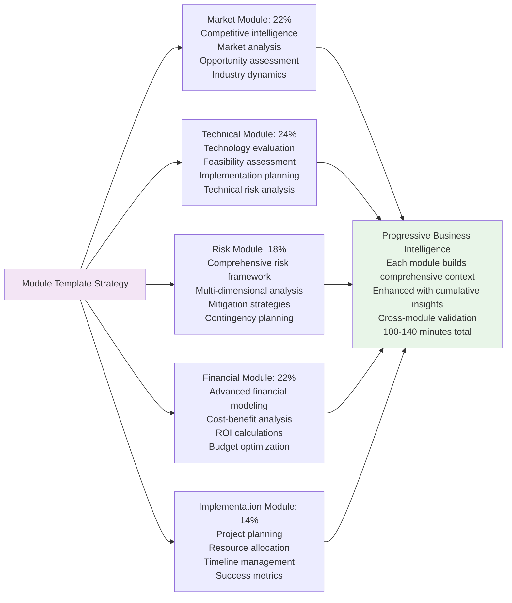

## Module-Specific Analysis Patterns

### Market Landscape Module

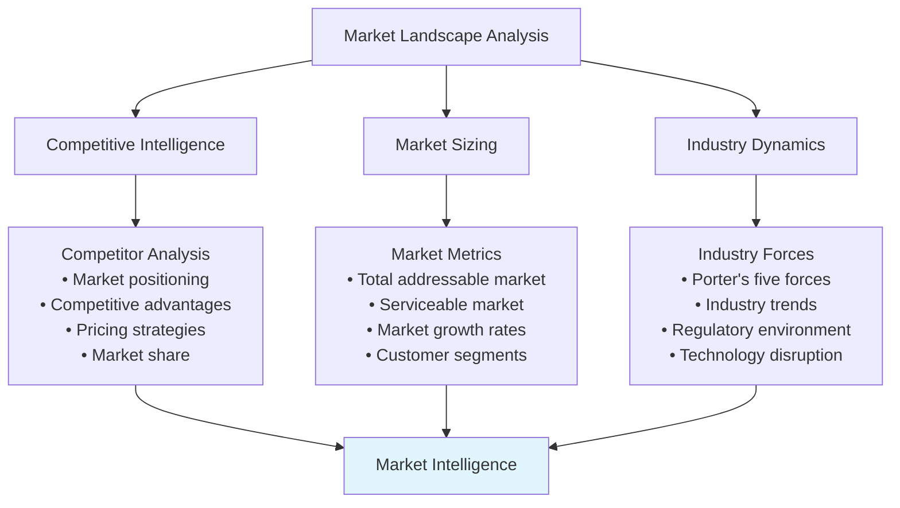

### Technical Feasibility Module

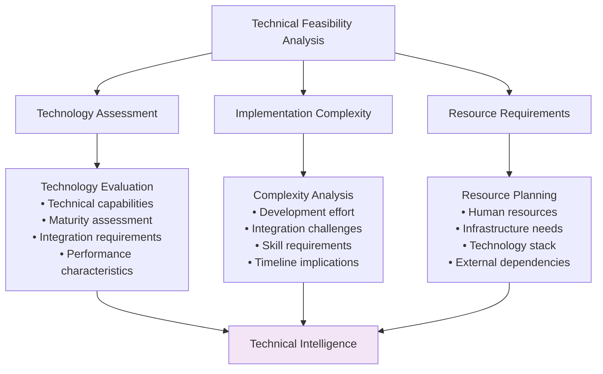

### Risk Assessment Module

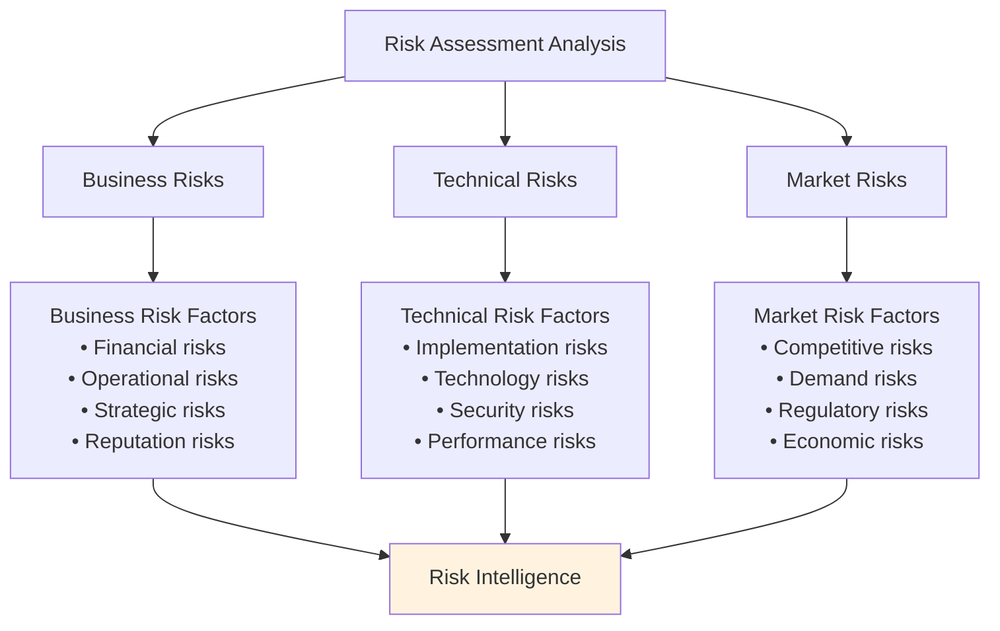

### Financial Impact Module

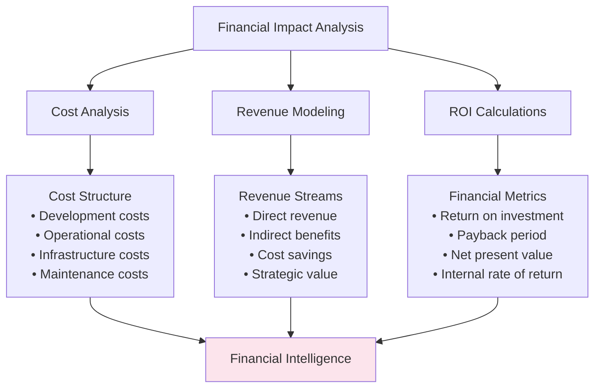

### Implementation Planning Module

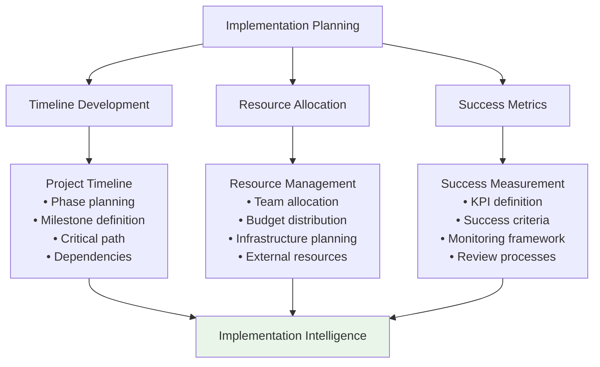

## Cross-Module Integration Patterns

### Dependency Analysis Framework

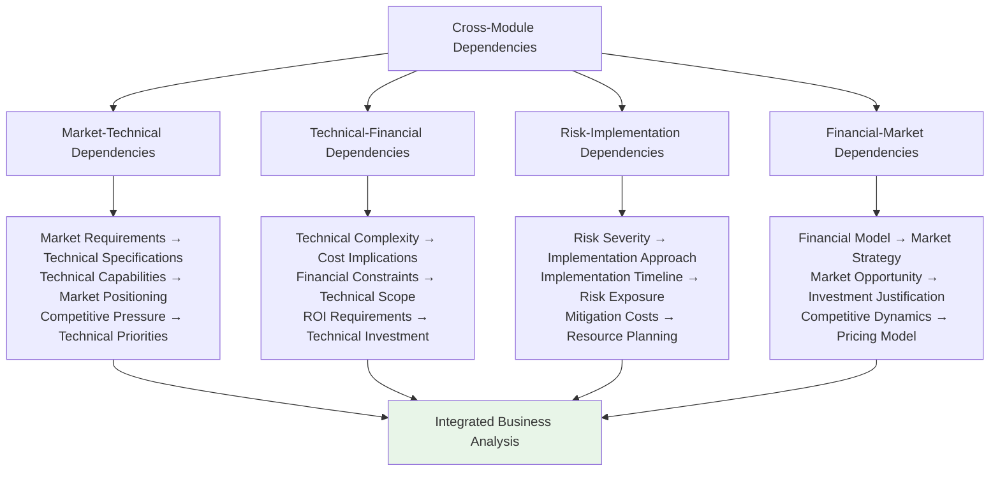

### Business Strategy Synthesis

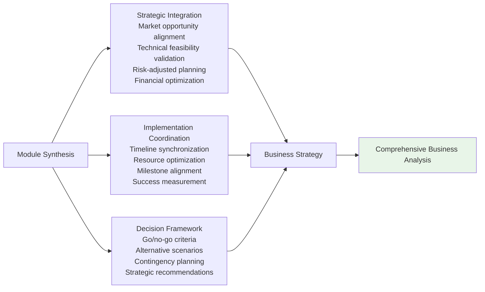

## Quality Integration and Validation

### Constitutional AI Compliance for Business Analysis

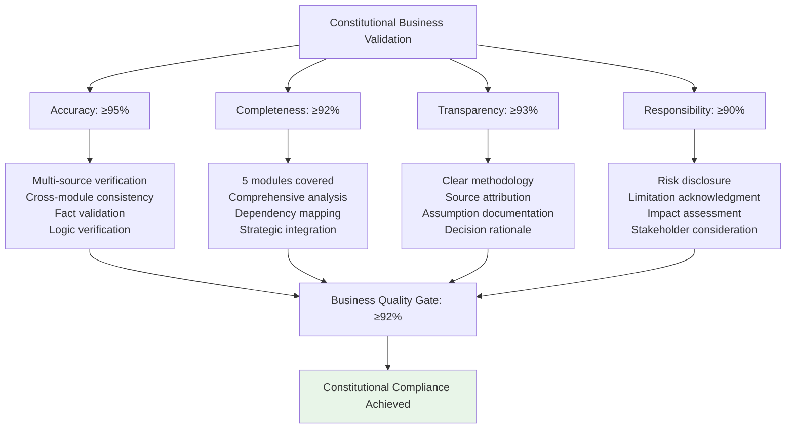

### Cross-Module Validation Framework

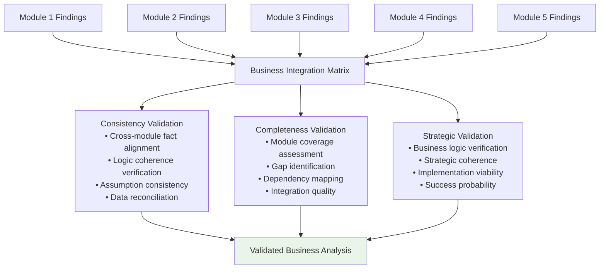

## Performance Characteristics

### Execution Metrics Comparison

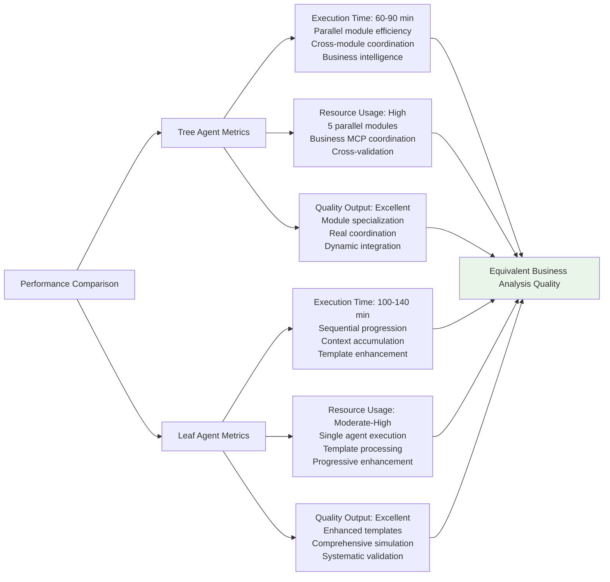

## Business Application Examples

### Technology Investment Decision
- **Context**: "Should we invest $2M in AI-powered customer service automation?"
- **Modules**: Market opportunity, technical feasibility, risk assessment, financial impact, implementation planning
- **Output**: Comprehensive business case with go/no-go recommendation

### Market Entry Strategy
- **Context**: "Evaluate entry into European SaaS market with localized offering"
- **Modules**: Market landscape, technical localization, regulatory risks, financial projections, launch planning
- **Output**: Strategic market entry plan with resource requirements

### Digital Transformation Initiative
- **Context**: "Plan comprehensive digital transformation for traditional manufacturing"
- **Modules**: Technology landscape, implementation complexity, operational risks, investment analysis, transformation roadmap
- **Output**: Multi-year transformation strategy with phased implementation

## Implementation Guidelines

### For Tree Agents
1. **Module Specialization**: Spawn 5 distinct business module agents with clear domain boundaries
2. **Parallel Optimization**: Maximize concurrent module execution while managing integration complexity
3. **Business Intelligence**: Coordinate business-focused MCP server access across modules
4. **Dependency Management**: Implement systematic cross-module dependency analysis
5. **Strategic Synthesis**: Ensure coherent business strategy emerges from module integration

### For Leaf Agents
1. **Template Sophistication**: Use enhanced business module templates with domain expertise
2. **Sequential Excellence**: Build comprehensive business context through module progression
3. **Business Simulation**: Maintain business focus throughout sequential execution
4. **Integration Emphasis**: Prioritize cross-module synthesis and business coherence
5. **Strategic Validation**: Apply business logic validation throughout analysis

### Universal Quality Standards
1. **Module Completeness**: Ensure all 5 business modules are thoroughly addressed
2. **Cross-Module Integration**: Achieve coherent business synthesis across modules
3. **Quality Excellence**: Maintain ≥92% constitutional compliance score
4. **Strategic Value**: Deliver actionable business insights and recommendations
5. **Implementation Viability**: Provide practical guidance for business execution

This complex research method demonstrates sophisticated coordination patterns for comprehensive business analysis while maintaining quality equivalence across different agent execution capabilities.