# Ensemble Methods

## Source References
**Method Implementation**: research/orchestrator/methods/advanced/ensemble_methods.md  
**Claude Desktop Research**: Anthropic's multi-method coordination pattern for robustness  
**Tree-Leaf Architecture**: Universal execution paths for method combination research

## Method Overview

The Ensemble Methods approach coordinates multiple research methods simultaneously (tree) or executes methods sequentially with aggregation (leaf) to provide robust, comprehensive analysis through method diversity and cross-validation for enhanced reliability and coverage.

### Method Characteristics
- **Method Count**: 3-5 different research methods combined
- **Coordination Style**: Parallel method coordination (tree) or sequential method execution (leaf)
- **Quality Focus**: Robustness through method diversity and cross-validation
- **Complexity Support**: Complex research requiring multiple methodological approaches
- **Execution Time**: 80-120 minutes (tree) or 130-180 minutes (leaf)

## Tree Agent Execution (Parallel Method Coordination)

### Multi-Method Orchestration Architecture

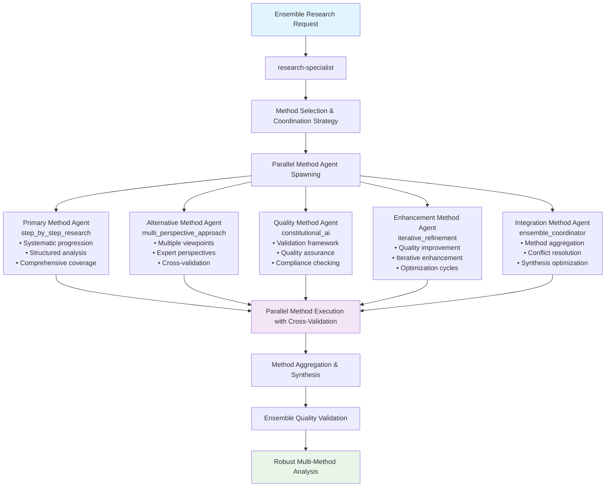

### Parallel Method Coordination Flow

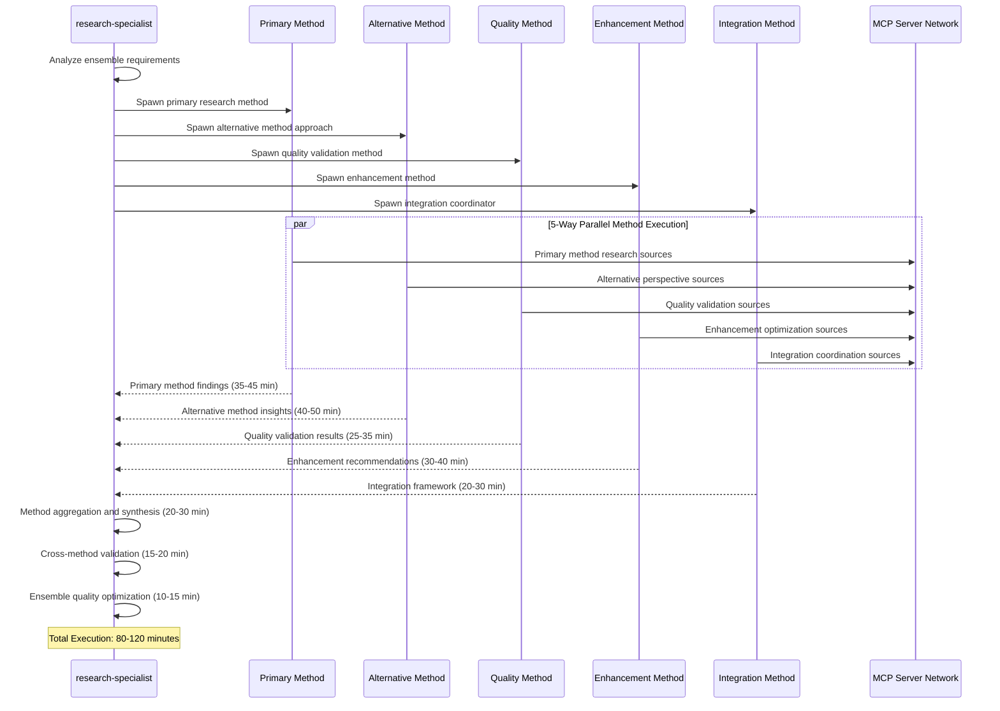

### MCP Server Distribution Across Methods

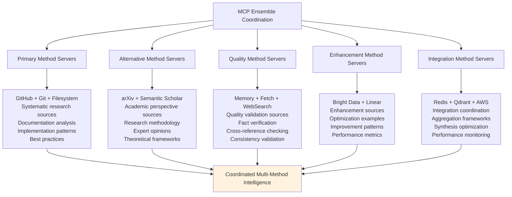

## Leaf Agent Execution (Sequential Method with Aggregation)

### Sequential Multi-Method Template Execution

```mermaid
flowchart TD
    A[Ensemble Research Request] --> B[research-specialist]
    B --> C[Method Sequence Design & Aggregation Strategy]
    C --> D[Sequential Multi-Method Execution]
    
    D --> E[Method 1: Step-by-Step Template<br/>• Enhanced systematic template<br/>• Structured progression<br/>• Comprehensive foundation<br/>Duration: 25-35 minutes]
    
    E --> F[Method 2: Multi-Perspective Template<br/>• Enhanced perspective simulation<br/>• Alternative viewpoints<br/>• Cross-validation framework<br/>Duration: 35-45 minutes]
    
    F --> G[Method 3: Constitutional AI Template<br/>• Enhanced validation framework<br/>• Quality assurance<br/>• Compliance verification<br/>Duration: 20-30 minutes]
    
    G --> H[Method 4: Iterative Refinement Template<br/>• Enhanced improvement cycles<br/>• Quality optimization<br/>• Progressive enhancement<br/>Duration: 25-35 minutes]
    
    H --> I[Method Aggregation & Synthesis<br/>• Cross-method integration<br/>• Conflict resolution<br/>• Ensemble optimization<br/>Duration: 20-25 minutes]
    
    I --> J[Ensemble Quality Validation<br/>• Multi-method consistency<br/>• Robustness verification<br/>• Final optimization<br/>Duration: 10-15 minutes]
    
    J --> K[Robust Multi-Method Analysis]
    
    style E fill:#f3e5f5
    style F fill:#f3e5f5
    style G fill:#f3e5f5
    style H fill:#f3e5f5
    style K fill:#e8f5e8
```

### Method Aggregation Strategy

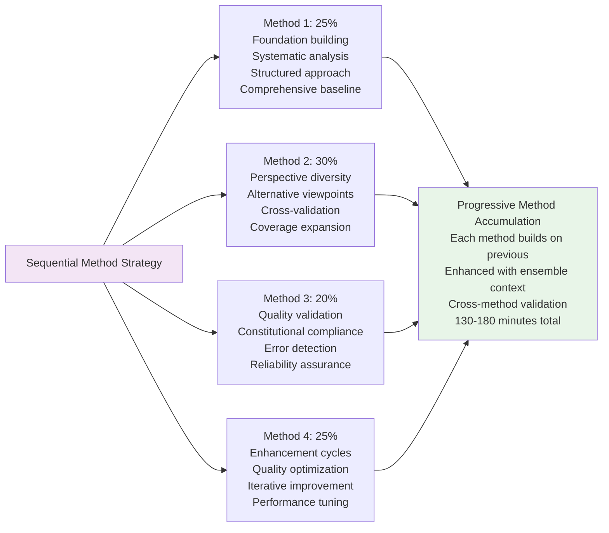

## Method Combination Patterns

### Primary Method Combinations

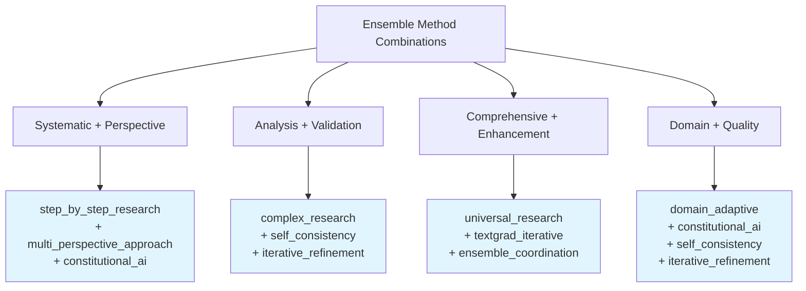

### Method Complementarity Matrix

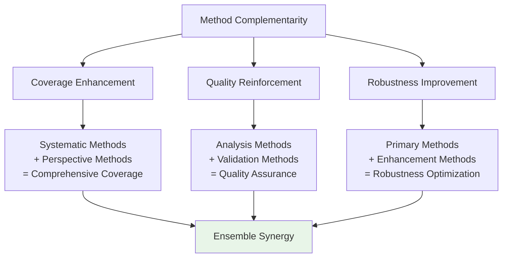

## Cross-Method Integration Patterns

### Method Aggregation Framework

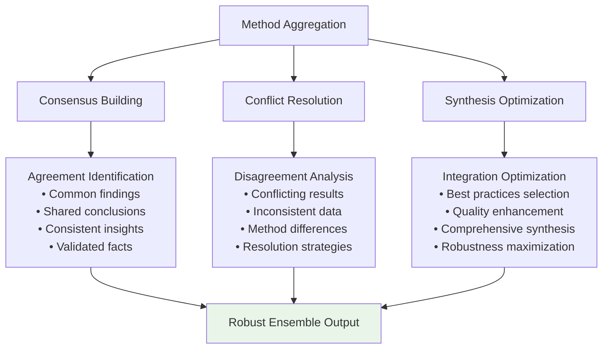

### Cross-Method Validation Framework

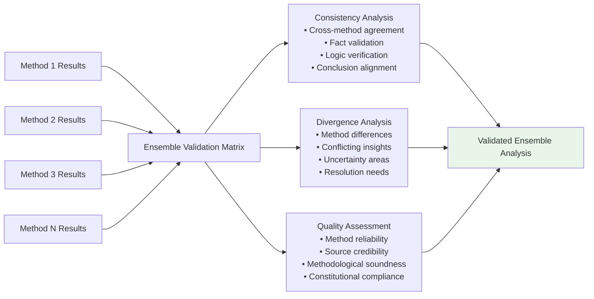

## Quality Assurance and Robustness

### Multi-Method Quality Framework

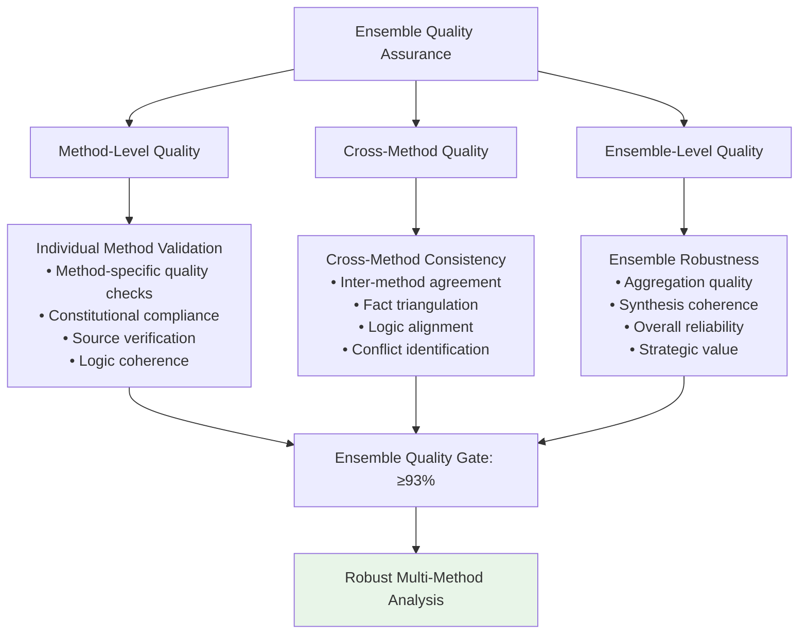

### Robustness Enhancement Patterns

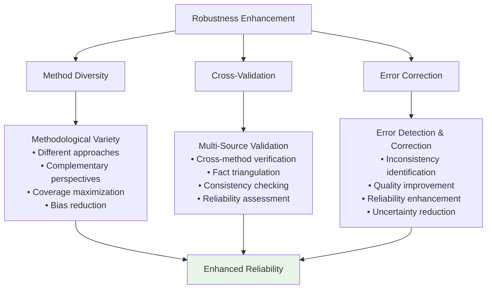

## Constitutional AI Compliance for Ensemble Methods

### Enhanced Compliance Framework

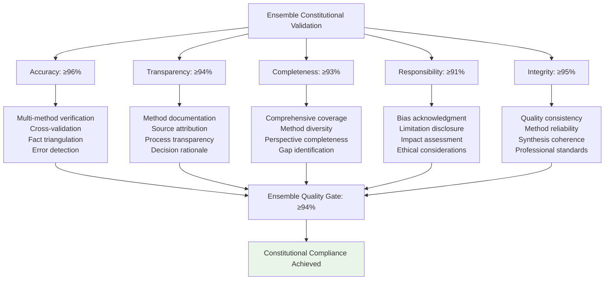

## Performance Characteristics

### Execution Metrics Comparison

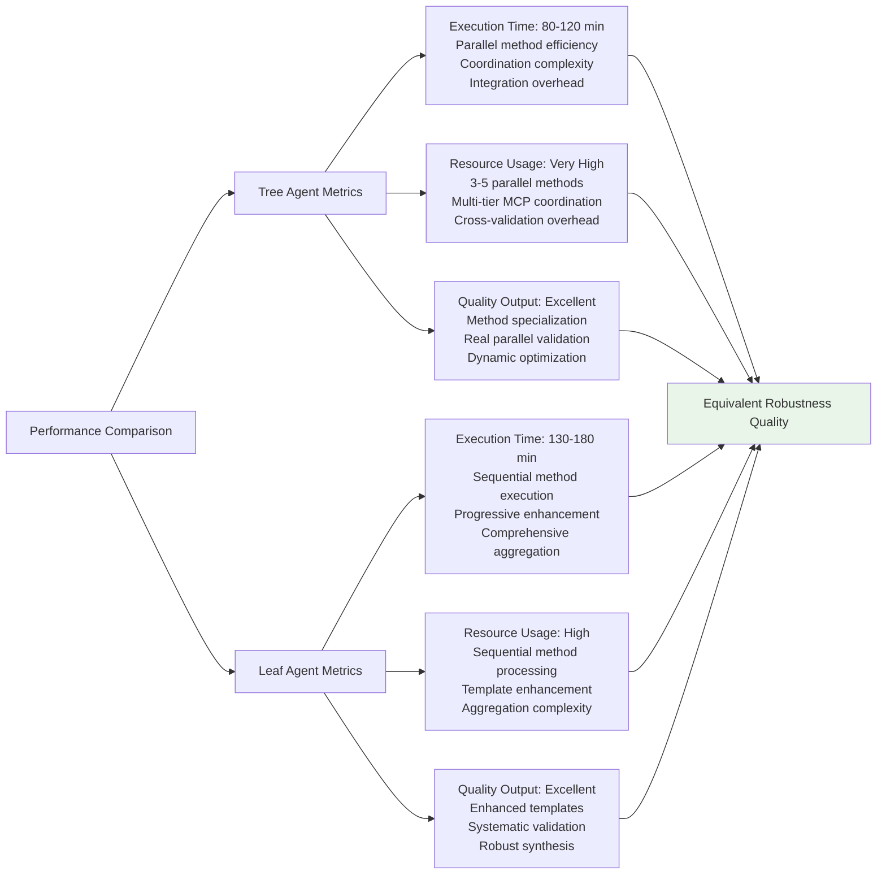

## Ensemble Application Examples

### Strategic Technology Decision
- **Context**: "Evaluate comprehensive cloud-native architecture adoption strategy"
- **Methods**: complex_research + multi_perspective_approach + constitutional_ai + iterative_refinement
- **Output**: Robust multi-method analysis with cross-validated recommendations

### Market Research Validation
- **Context**: "Validate market entry opportunity through multiple analytical approaches"
- **Methods**: step_by_step_research + domain_adaptive + self_consistency + ensemble_coordination
- **Output**: High-confidence market analysis with methodological diversity

### Risk Assessment Enhancement
- **Context**: "Comprehensive risk evaluation for major organizational transformation"
- **Methods**: universal_research + constitutional_ai + textgrad_iterative + cross_validation
- **Output**: Robust risk analysis with enhanced reliability through method diversity

## Implementation Guidelines

### For Tree Agents
1. **Method Coordination**: Orchestrate 3-5 complementary methods with clear differentiation
2. **Parallel Optimization**: Maximize concurrent method execution while managing integration complexity
3. **Cross-Validation**: Implement systematic validation across all coordinated methods
4. **Synthesis Excellence**: Ensure coherent aggregation of diverse methodological approaches
5. **Quality Assurance**: Apply enhanced validation standards across ensemble execution

### For Leaf Agents
1. **Sequential Mastery**: Execute multiple enhanced method templates with progressive enhancement
2. **Method Simulation**: Maintain methodological diversity throughout sequential execution
3. **Aggregation Focus**: Emphasize synthesis quality across multiple method outputs
4. **Validation Rigor**: Apply systematic validation throughout multi-method execution
5. **Robustness Enhancement**: Focus on reliability improvement through method diversity

### Universal Quality Standards
1. **Method Diversity**: Ensure complementary methodological approaches are employed
2. **Cross-Method Integration**: Achieve coherent synthesis across diverse methods
3. **Quality Excellence**: Maintain ≥94% constitutional compliance score
4. **Robustness Enhancement**: Deliver enhanced reliability through methodological diversity
5. **Strategic Value**: Provide high-confidence insights through validated ensemble approaches

This ensemble methods approach demonstrates sophisticated coordination patterns for robust multi-method research while maintaining quality excellence across different agent execution capabilities.