# Multi-Perspective Approach Method

## Source References
**Method Implementation**: research/orchestrator/methods/multi-agent/multi_perspective_approach.md  
**Claude Desktop Research**: Anthropic's 4-agent specialist coordination pattern  
**Tree-Leaf Architecture**: Universal execution paths for perspective-based analysis

## Method Overview

The Multi-Perspective Approach coordinates 4 specialized perspective agents (tree) or simulates 4 expert perspectives through enhanced templates (leaf) to provide comprehensive coverage of research topics from quantitative, qualitative, industry practice, and future trends viewpoints.

### Method Characteristics
- **Perspective Count**: 4 distinct expert viewpoints
- **Coordination Style**: Parallel specialists (tree) or sequential simulation (leaf)
- **Quality Focus**: Comprehensive coverage with perspective integration
- **Complexity Support**: Moderate to complex research requirements
- **Execution Time**: 45-75 minutes (tree) or 80-120 minutes (leaf)

## Tree Agent Execution (4 Parallel Specialists)

### Specialist Agent Coordination

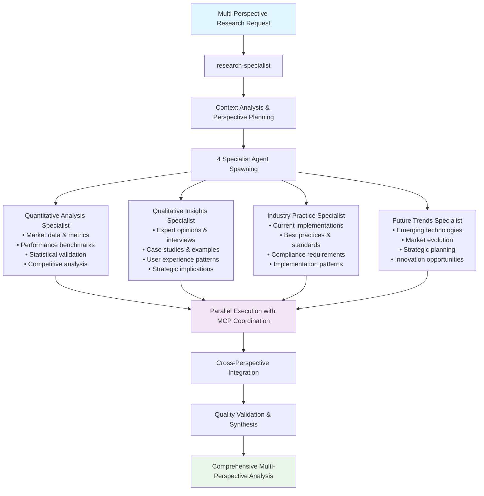

### Parallel Specialist Execution Flow

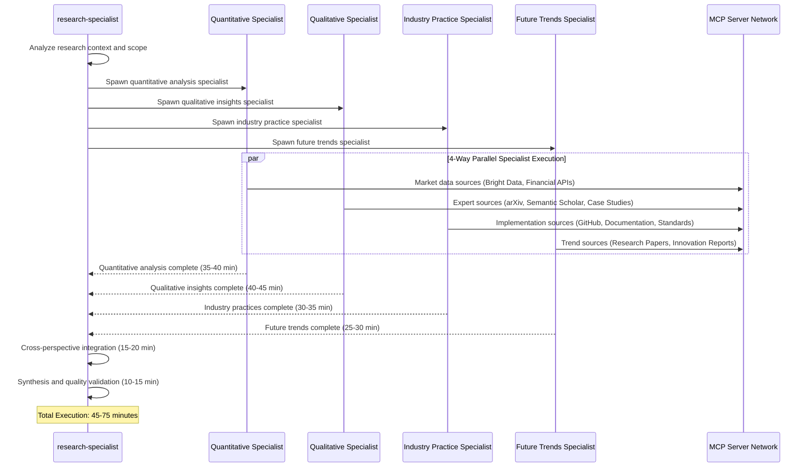

### MCP Server Coordination by Specialist

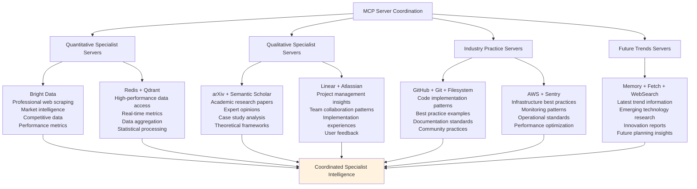

## Leaf Agent Execution (4 Sequential Perspective Templates)

### Enhanced Template Simulation

```mermaid
flowchart TD
    A[Multi-Perspective Request] --> B[research-specialist]
    B --> C[Template Design & Enhancement Strategy]
    C --> D[Sequential 4-Perspective Execution]
    
    D --> E[Quantitative Analysis Template<br/>• Enhanced with data focus<br/>• Statistical analysis framework<br/>• Metrics-driven approach<br/>• Competitive benchmarking<br/>Duration: 20-25 minutes]
    
    E --> F[Qualitative Insights Template<br/>• Enhanced with expert simulation<br/>• Case study integration<br/>• Experience synthesis<br/>• Strategic implications<br/>Duration: 25-30 minutes]
    
    F --> G[Industry Practice Template<br/>• Enhanced with implementation focus<br/>• Best practices compilation<br/>• Standards compliance<br/>• Practical guidance<br/>Duration: 20-25 minutes]
    
    G --> H[Future Trends Template<br/>• Enhanced with strategic analysis<br/>• Innovation mapping<br/>• Evolution planning<br/>• Opportunity identification<br/>Duration: 15-20 minutes]
    
    H --> I[Cross-Perspective Integration<br/>• Template synthesis<br/>• Perspective harmonization<br/>• Conflict resolution<br/>• Unified analysis<br/>Duration: 15-20 minutes]
    
    I --> J[Quality Validation<br/>• Constitutional compliance<br/>• Perspective completeness<br/>• Integration coherence<br/>Duration: 10-15 minutes]
    
    J --> K[Comprehensive Multi-Perspective Analysis]
    
    style E fill:#f3e5f5
    style F fill:#f3e5f5
    style G fill:#f3e5f5
    style H fill:#f3e5f5
    style K fill:#e8f5e8
```

### Template Enhancement Strategy

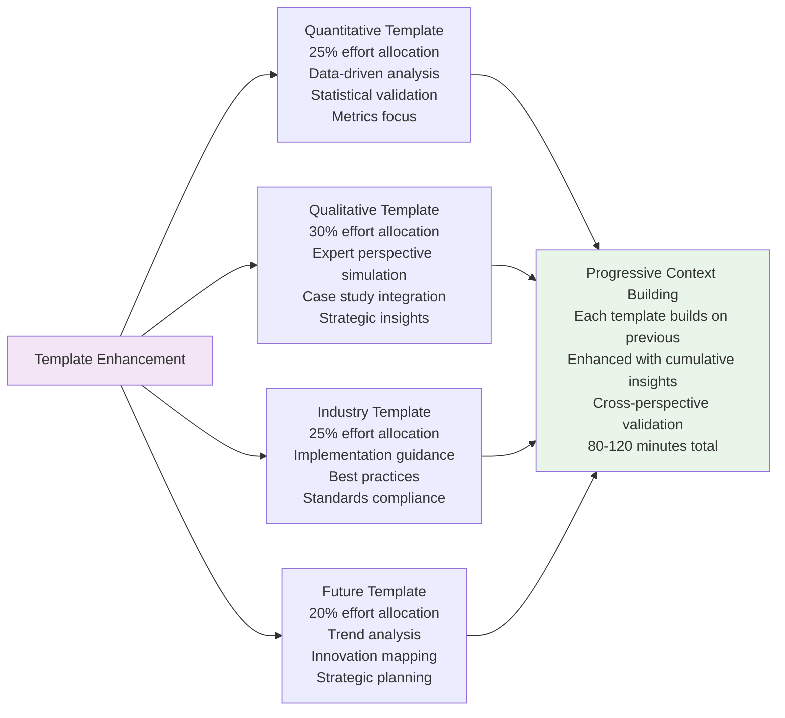

## Perspective-Specific Analysis Patterns

### Quantitative Analysis Perspective

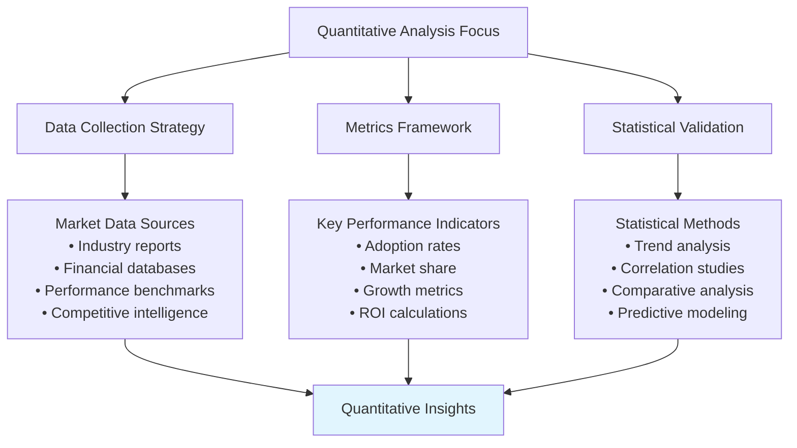

### Qualitative Insights Perspective

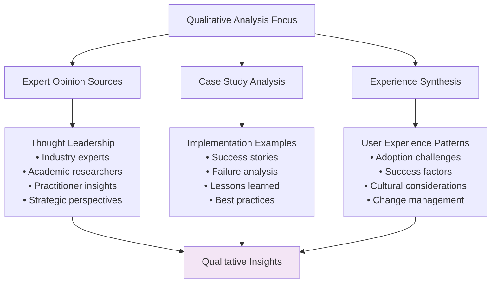

### Industry Practice Perspective

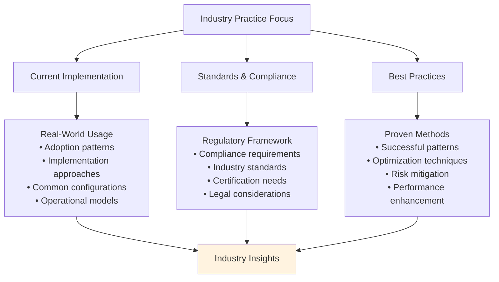

### Future Trends Perspective

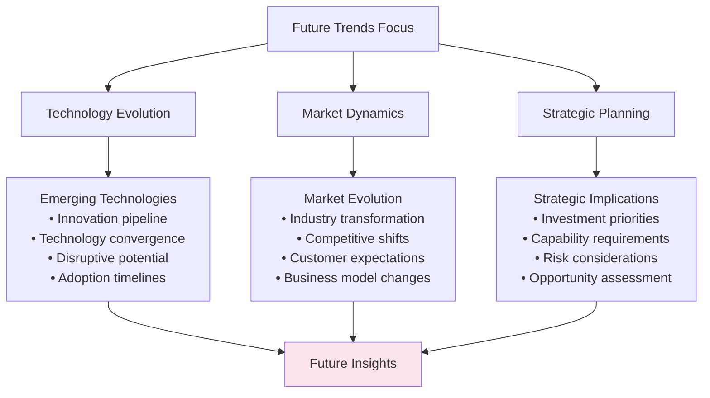

## Quality Integration Patterns

### Cross-Perspective Validation

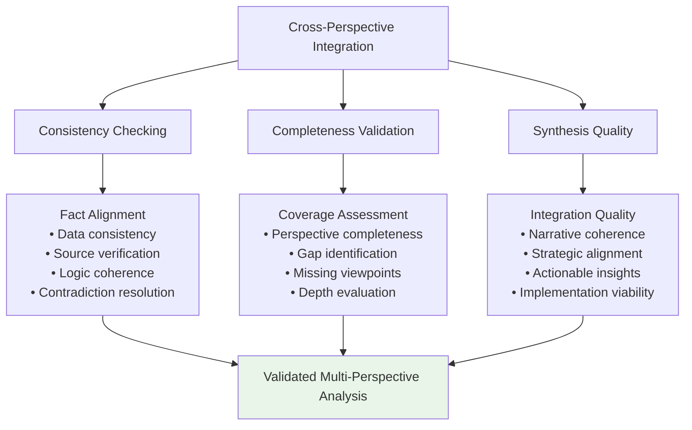

### Constitutional AI Compliance

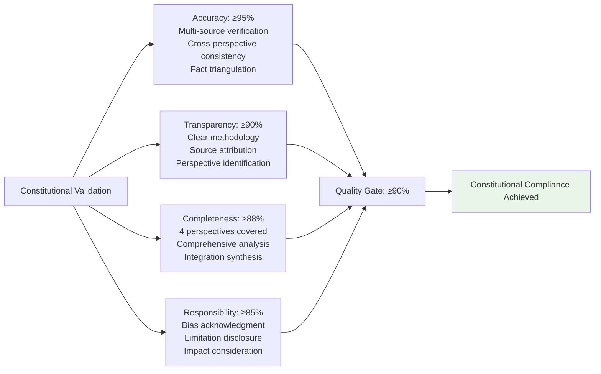

## Performance Characteristics

### Execution Metrics Comparison

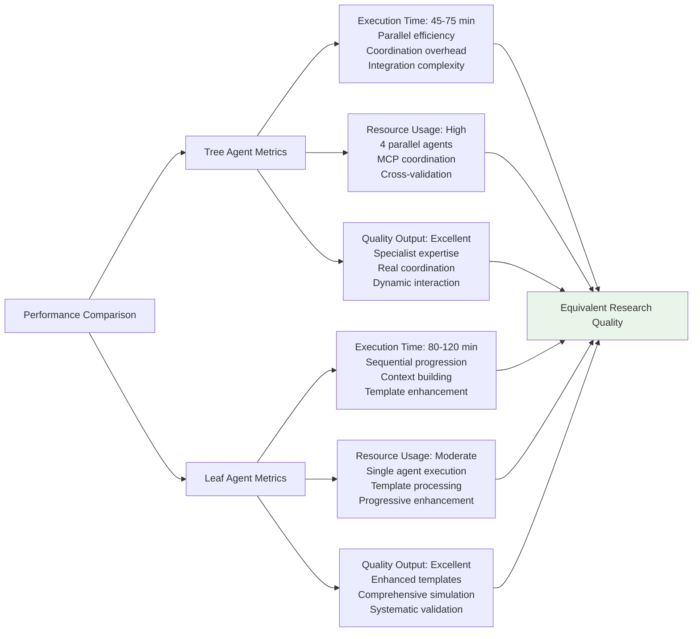

## Implementation Guidelines

### For Tree Agents
1. **Specialist Coordination**: Spawn 4 distinct specialist agents with clear perspective boundaries
2. **Parallel Optimization**: Maximize concurrent execution while ensuring perspective differentiation
3. **MCP Integration**: Coordinate domain-specific server access across specialists
4. **Cross-Validation**: Implement systematic validation across specialist findings
5. **Quality Synthesis**: Ensure coherent integration of diverse perspectives

### For Leaf Agents
1. **Template Sophistication**: Use enhanced perspective templates with expert simulation
2. **Sequential Excellence**: Build context progressively through perspective sequence
3. **Perspective Simulation**: Maintain distinct viewpoints throughout sequential execution
4. **Integration Focus**: Emphasize synthesis quality across perspective templates
5. **Validation Rigor**: Apply comprehensive validation throughout perspective analysis

### Universal Quality Standards
1. **Perspective Completeness**: Ensure all 4 perspectives are thoroughly addressed
2. **Cross-Perspective Integration**: Achieve coherent synthesis across viewpoints
3. **Quality Excellence**: Maintain ≥90% constitutional compliance score
4. **Strategic Value**: Deliver actionable insights from multiple perspectives
5. **Implementation Guidance**: Provide practical recommendations based on integrated analysis

This multi-perspective approach demonstrates sophisticated coordination patterns for comprehensive perspective-based research while maintaining quality equivalence across different agent execution capabilities.