# Tree of Thoughts Method

## Source References
**Method Implementation**: research/orchestrator/methods/advanced/tree_of_thoughts.md  
**Claude Desktop Research**: Anthropic's multi-path exploration coordination pattern  
**Tree-Leaf Architecture**: Universal execution paths for branching analysis research

## Method Overview

The Tree of Thoughts method coordinates multiple reasoning path agents (tree) or simulates multi-path exploration through enhanced branching templates (leaf) to provide comprehensive analysis through systematic exploration of alternative reasoning paths with backtracking and path optimization.

### Method Characteristics
- **Reasoning Paths**: 3-7 parallel exploration branches
- **Coordination Style**: Multi-path agents (tree) or branching simulation (leaf)
- **Quality Focus**: Comprehensive exploration with path optimization and backtracking
- **Complexity Support**: Complex research requiring systematic reasoning exploration
- **Execution Time**: 70-110 minutes (tree) or 120-160 minutes (leaf)

## Tree Agent Execution (Parallel Reasoning Path Coordination)

### Multi-Path Reasoning Architecture

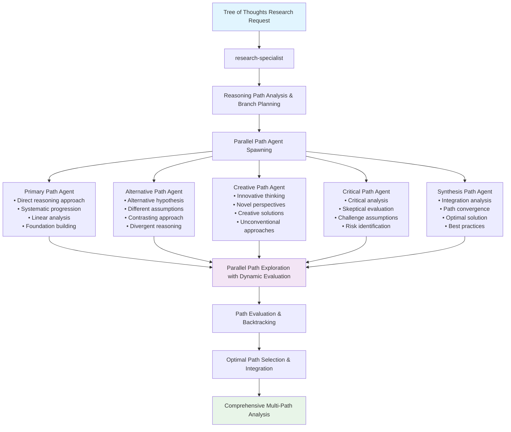

### Parallel Path Exploration Flow

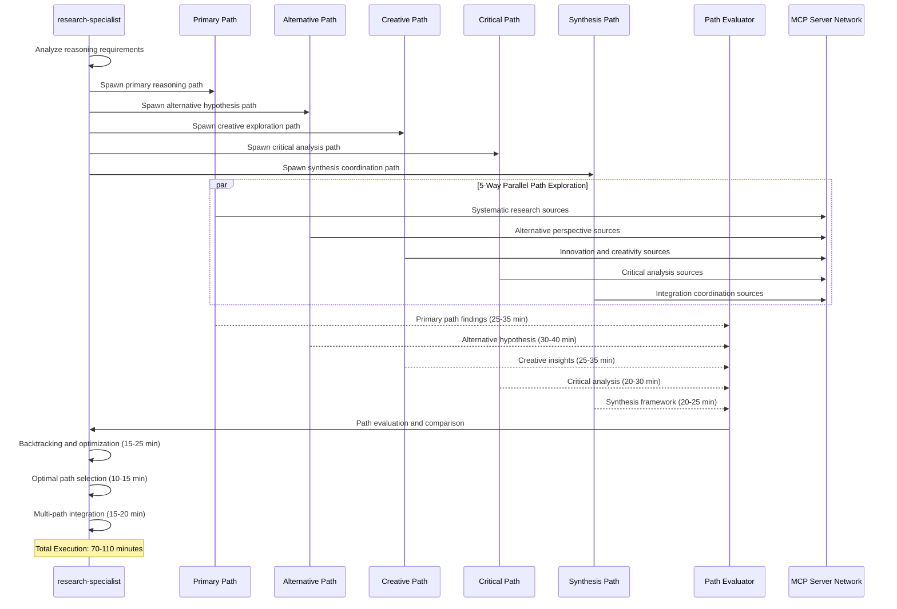

### MCP Server Coordination by Reasoning Path

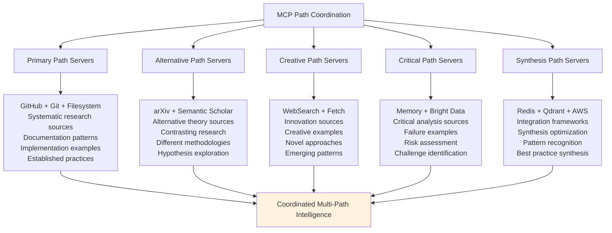

## Leaf Agent Execution (Sequential Branching Template)

### Enhanced Branching Template Simulation

```mermaid
flowchart TD
    A[Tree of Thoughts Request] --> B[research-specialist]
    B --> C[Branching Template Design & Path Strategy]
    C --> D[Sequential Multi-Path Exploration]
    
    D --> E[Primary Path Template<br/>• Enhanced systematic template<br/>• Direct reasoning approach<br/>• Linear progression<br/>• Foundation establishment<br/>Duration: 25-30 minutes]
    
    E --> F[Alternative Path Template<br/>• Enhanced hypothesis template<br/>• Alternative assumptions<br/>• Contrasting reasoning<br/>• Divergent exploration<br/>Duration: 30-35 minutes]
    
    F --> G[Creative Path Template<br/>• Enhanced innovation template<br/>• Novel perspective generation<br/>• Creative solution exploration<br/>• Unconventional approaches<br/>Duration: 25-30 minutes]
    
    G --> H[Critical Path Template<br/>• Enhanced analysis template<br/>• Systematic challenge<br/>• Risk identification<br/>• Assumption testing<br/>Duration: 20-25 minutes]
    
    H --> I[Path Evaluation & Comparison<br/>• Cross-path analysis<br/>• Strength assessment<br/>• Weakness identification<br/>• Optimal selection<br/>Duration: 15-20 minutes]
    
    I --> J[Path Integration & Synthesis<br/>• Multi-path convergence<br/>• Best elements selection<br/>• Optimized solution<br/>Duration: 15-20 minutes]
    
    J --> K[Comprehensive Multi-Path Analysis]
    
    style E fill:#f3e5f5
    style F fill:#f3e5f5
    style G fill:#f3e5f5
    style H fill:#f3e5f5
    style K fill:#e8f5e8
```

### Branching Template Strategy

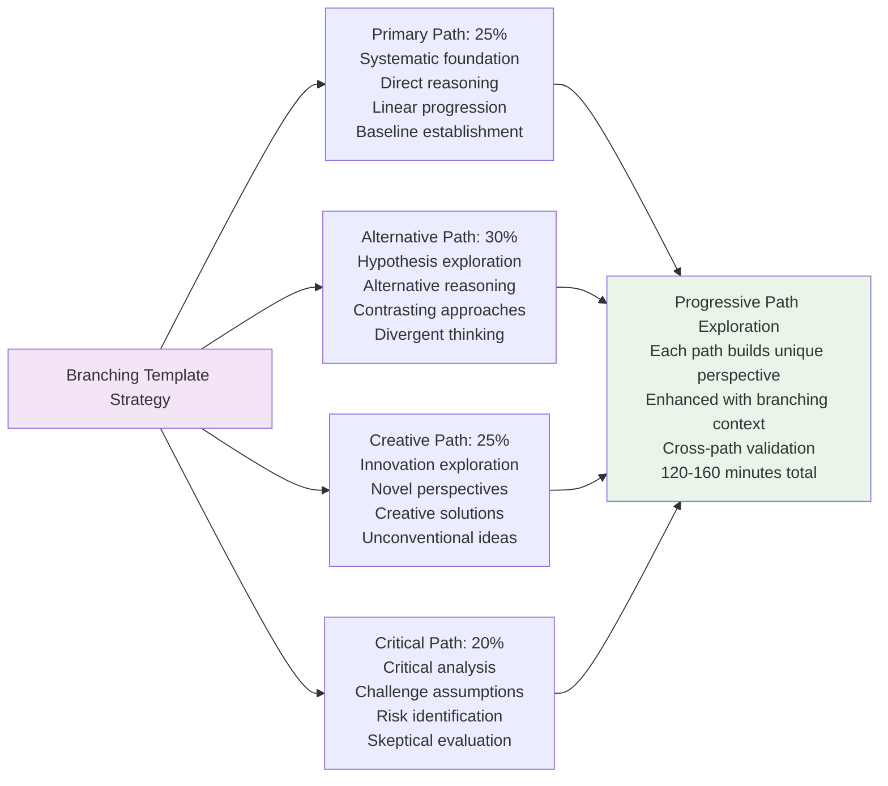

## Reasoning Path Patterns

### Primary Path Reasoning

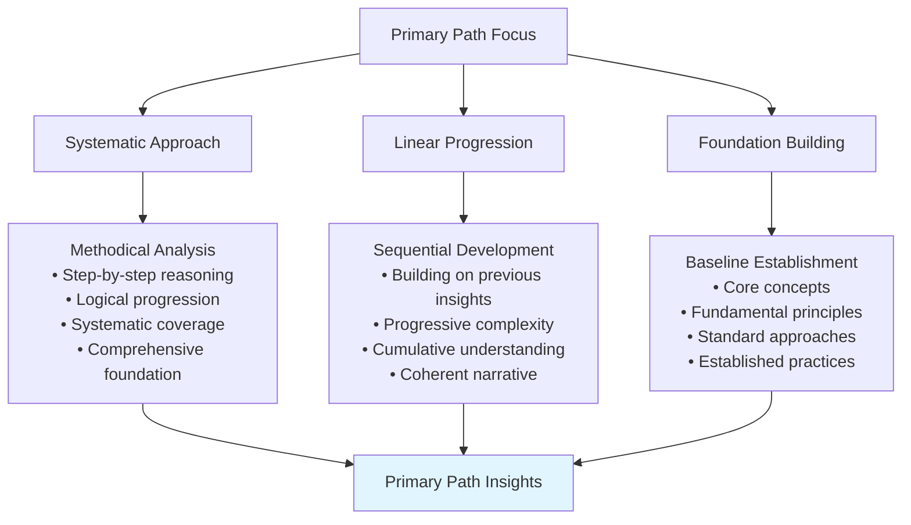

### Alternative Path Reasoning

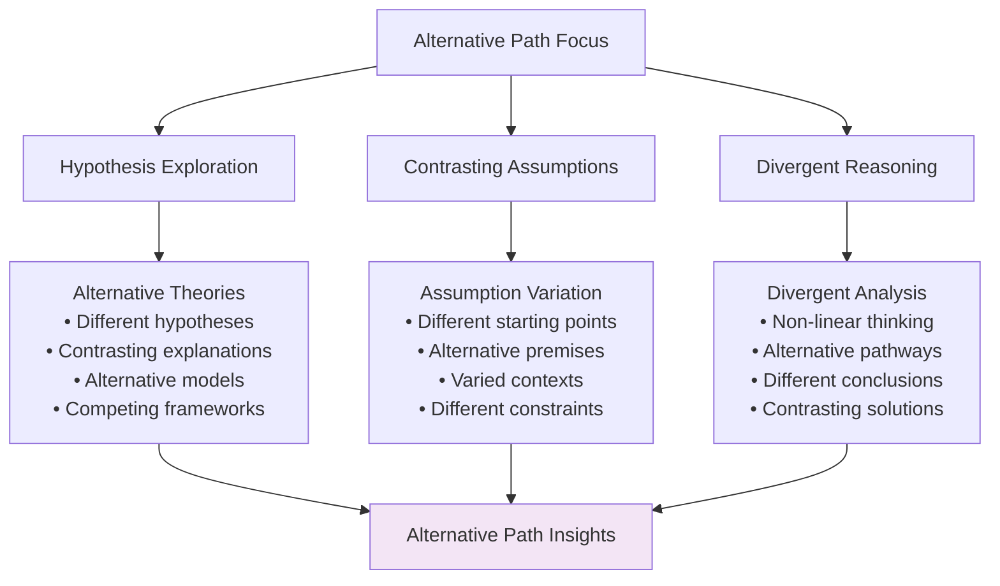

### Creative Path Reasoning

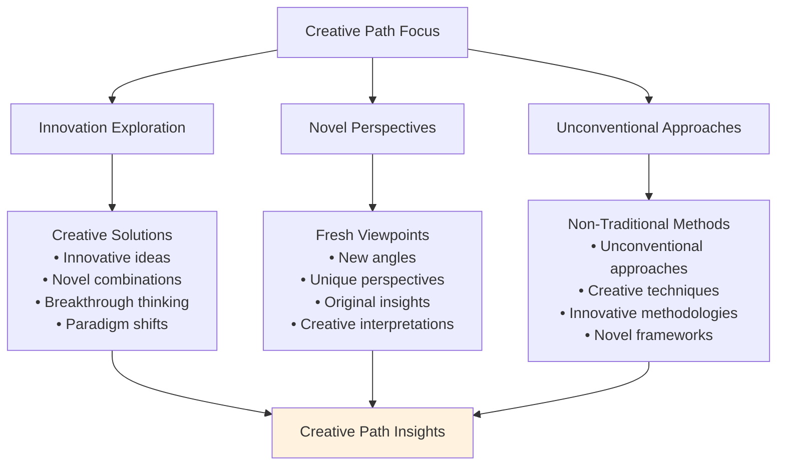

### Critical Path Reasoning

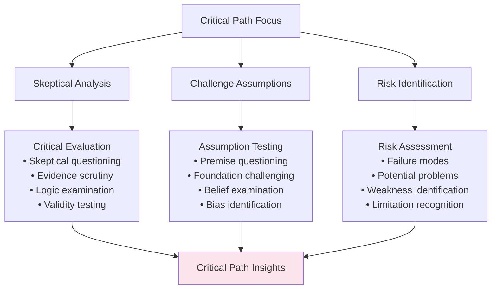

## Path Evaluation and Selection Framework

### Multi-Path Comparison Matrix

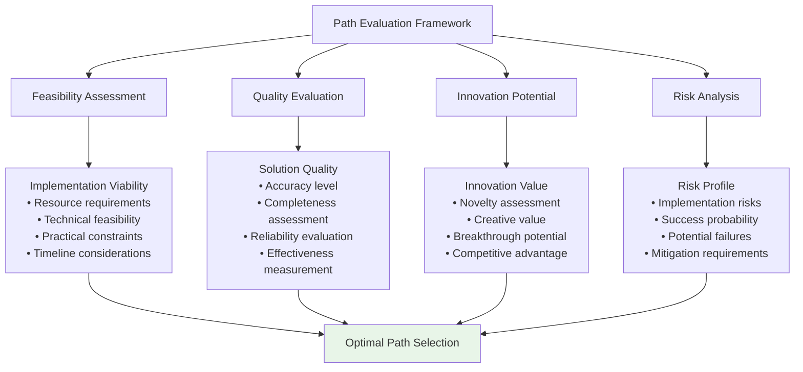

### Backtracking and Optimization Pattern

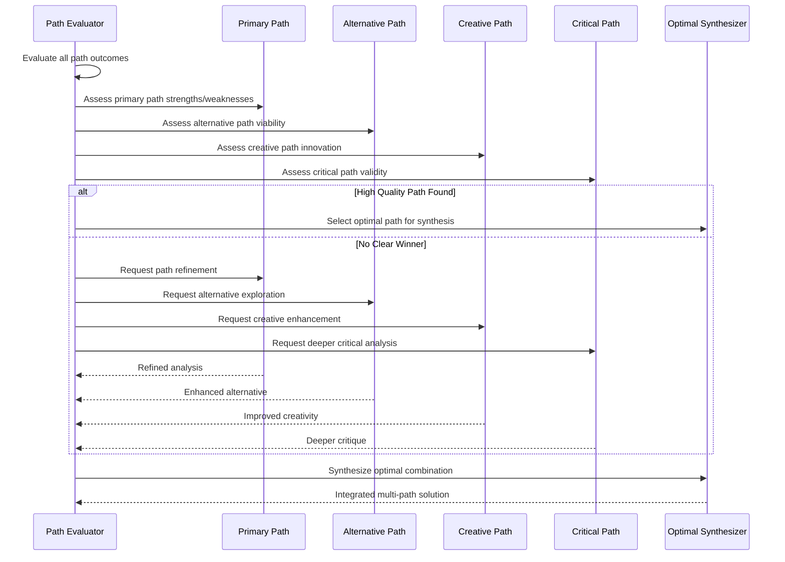

## Cross-Path Integration Patterns

### Path Synthesis Framework

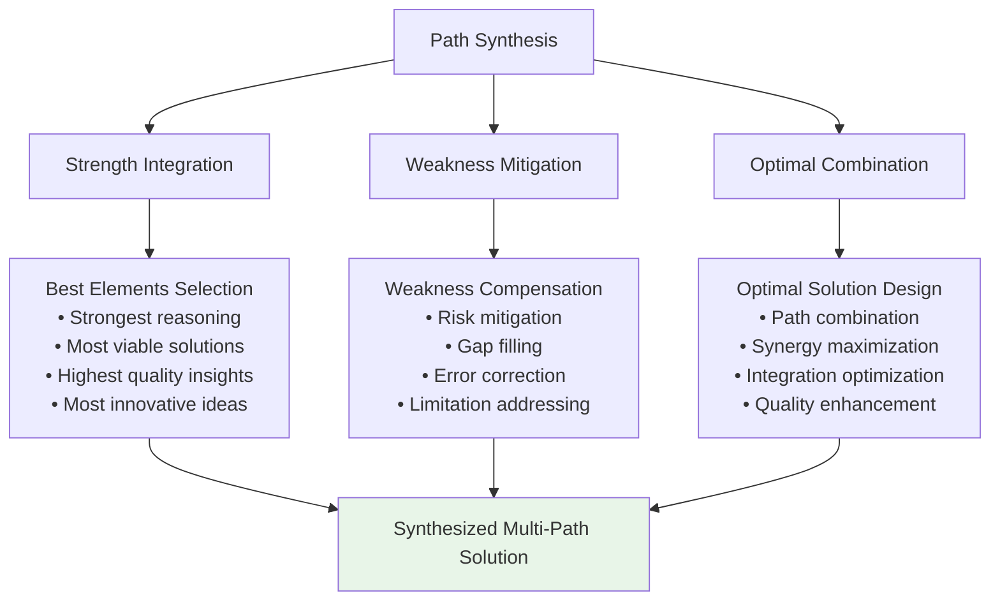

### Cross-Path Validation Framework

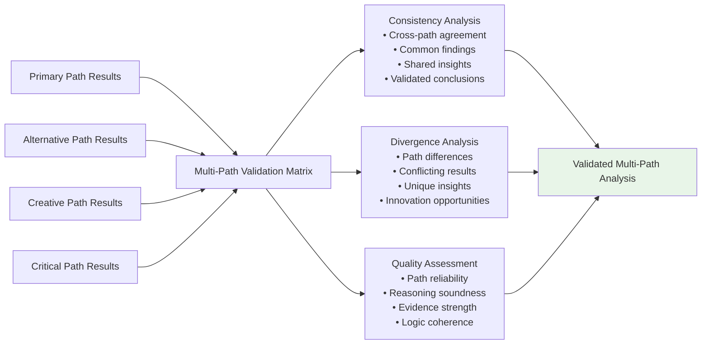

## Constitutional AI Compliance for Tree of Thoughts

### Enhanced Multi-Path Compliance

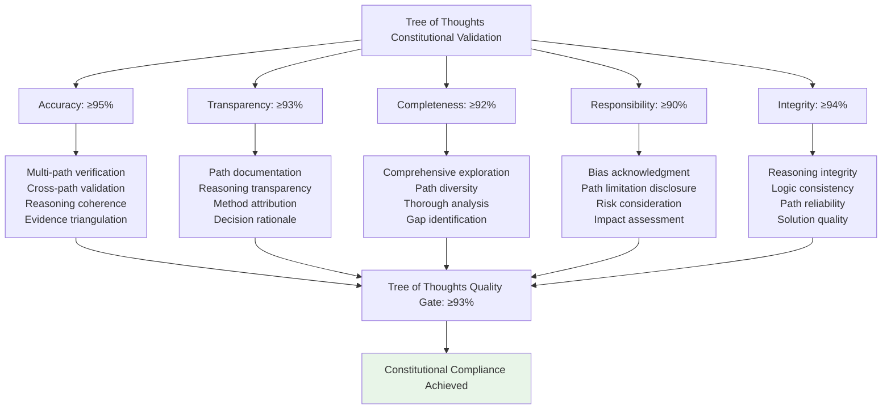

## Performance Characteristics

### Execution Metrics Comparison

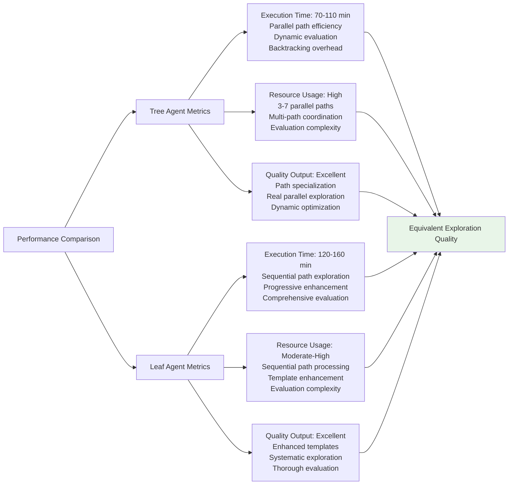

## Tree of Thoughts Application Examples

### Strategic Problem Solving
- **Context**: "Develop optimal strategy for digital transformation in traditional industry"
- **Paths**: Primary (systematic), Alternative (disruptive), Creative (innovative), Critical (risk-focused)
- **Output**: Multi-path strategic analysis with optimal solution synthesis

### Technology Architecture Decision
- **Context**: "Choose optimal microservices architecture for scalable platform"
- **Paths**: Primary (conventional), Alternative (serverless), Creative (edge-computing), Critical (reliability-focused)
- **Output**: Comprehensive architecture evaluation with path optimization

### Innovation Opportunity Assessment
- **Context**: "Evaluate AI integration opportunities for customer experience enhancement"
- **Paths**: Primary (incremental), Alternative (transformative), Creative (breakthrough), Critical (conservative)
- **Output**: Multi-dimensional innovation analysis with risk-optimized recommendations

## Implementation Guidelines

### For Tree Agents
1. **Path Coordination**: Orchestrate 3-7 distinct reasoning paths with clear differentiation
2. **Parallel Exploration**: Maximize concurrent path execution while managing evaluation complexity
3. **Dynamic Evaluation**: Implement real-time path assessment with backtracking capabilities
4. **Synthesis Excellence**: Ensure optimal combination of path strengths with weakness mitigation
5. **Quality Assurance**: Apply enhanced validation across all reasoning paths

### For Leaf Agents
1. **Sequential Mastery**: Execute multiple enhanced path templates with progressive exploration
2. **Path Simulation**: Maintain distinct reasoning approaches throughout sequential execution
3. **Evaluation Focus**: Emphasize systematic path comparison and optimal selection
4. **Integration Excellence**: Prioritize synthesis quality across multiple reasoning paths
5. **Optimization Emphasis**: Focus on finding optimal solutions through path combination

### Universal Quality Standards
1. **Path Diversity**: Ensure distinct reasoning approaches are explored systematically
2. **Cross-Path Integration**: Achieve optimal synthesis across diverse reasoning paths
3. **Quality Excellence**: Maintain ≥93% constitutional compliance score
4. **Exploration Completeness**: Provide thorough analysis through systematic path exploration
5. **Optimal Solutions**: Deliver best-possible outcomes through multi-path optimization

This Tree of Thoughts method demonstrates sophisticated coordination patterns for comprehensive reasoning exploration while maintaining quality excellence across different agent execution capabilities.