# Constitutional AI Method

## Source References
**Method Implementation**: research/orchestrator/methods/advanced/constitutional_ai.md  
**Claude Desktop Research**: Quality validation and self-correction pattern  
**Tree-Leaf Architecture**: Universal execution paths for constitutional compliance research

## Method Overview

The Constitutional AI method provides comprehensive quality validation and self-correction for both tree and leaf agents, ensuring ethical alignment, accuracy verification, and systematic compliance with constitutional principles throughout the research process.

### Method Characteristics
- **Validation Scope**: 6-phase constitutional compliance framework
- **Execution Style**: Self-correction with systematic validation cycles
- **Quality Focus**: Constitutional compliance with ethical alignment
- **Complexity Support**: Simple to complex research with quality assurance
- **Execution Time**: 25-40 minutes (tree enhanced) or 30-45 minutes (leaf native)

## Constitutional Framework Architecture

### 6-Phase Constitutional Compliance

```mermaid
graph TD
    A[Constitutional AI Research Request] --> B[research-specialist or constitutional-agent]
    B --> C[Constitutional Framework Activation]
    C --> D[6-Phase Constitutional Execution]
    
    D --> E[Phase 1: Principle Establishment<br/>• Constitutional principle identification<br/>• Ethical framework establishment<br/>• Quality standard definition<br/>• Compliance criteria setting<br/>Duration: 3-5 minutes]
    
    E --> F[Phase 2: Research with Constitutional Guidance<br/>• Principle-guided research execution<br/>• Ethical constraint application<br/>• Quality-focused information gathering<br/>• Constitutional compliance monitoring<br/>Duration: 8-12 minutes]
    
    F --> G[Phase 3: Constitutional Validation<br/>• Principle compliance verification<br/>• Ethical alignment assessment<br/>• Quality standard evaluation<br/>• Constitutional audit execution<br/>Duration: 5-8 minutes]
    
    G --> H[Phase 4: Self-Correction & Enhancement<br/>• Violation identification & correction<br/>• Quality improvement implementation<br/>• Principle alignment optimization<br/>• Constitutional enhancement<br/>Duration: 4-7 minutes]
    
    H --> I[Phase 5: Comprehensive Quality Assurance<br/>• Final constitutional validation<br/>• Quality standard verification<br/>• Ethical compliance confirmation<br/>• Excellence certification<br/>Duration: 3-5 minutes]
    
    I --> J[Phase 6: Constitutional Documentation<br/>• Compliance documentation<br/>• Quality certification<br/>• Ethical validation record<br/>• Constitutional guarantee<br/>Duration: 2-3 minutes]
    
    J --> K[Constitutionally Compliant Research Output]
    
    style E fill:#e1f5fe
    style F fill:#f3e5f5
    style G fill:#fff3e0
    style H fill:#fce4ec
    style I fill:#e8f5e8
    style J fill:#f0f4c3
    style K fill:#e8f5e8
```

## Tree Agent Enhancement (Constitutional Orchestration)

### Enhanced Constitutional Coordination

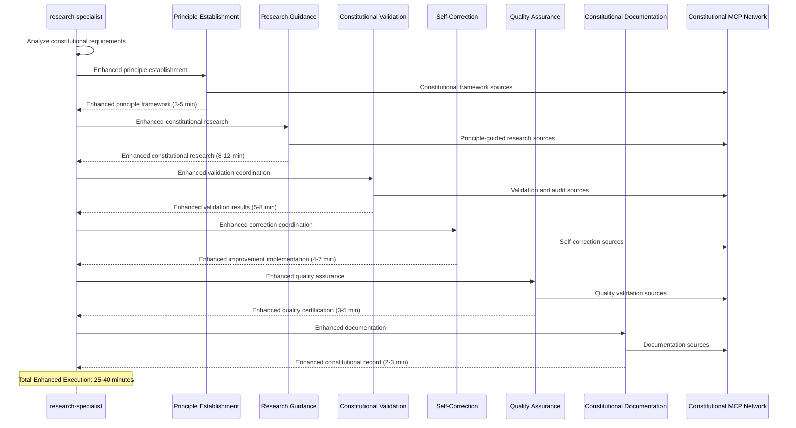

### Constitutional MCP Coordination

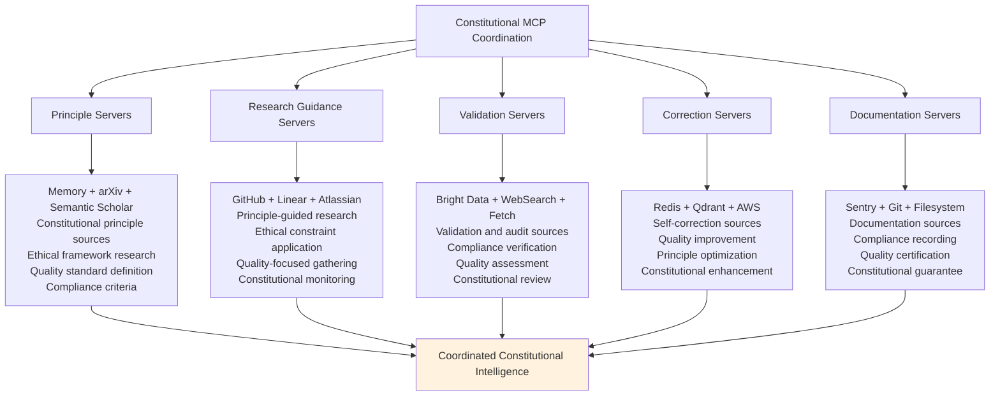

## Leaf Agent Native Execution (Constitutional Template)

### Enhanced Constitutional Template

```mermaid
flowchart TD
    A[Constitutional AI Request] --> B[Enhanced Constitutional Agent]
    B --> C[Constitutional Comprehensive Template]
    C --> D[Constitutional Framework Execution]
    
    D --> E[Enhanced Principle Template<br/>• Comprehensive principle framework<br/>• Ethical standard establishment<br/>• Quality criteria optimization<br/>• Constitutional foundation<br/>Duration: 4-6 minutes]
    
    E --> F[Enhanced Research Template<br/>• Principle-guided research framework<br/>• Ethical constraint integration<br/>• Quality-focused methodology<br/>• Constitutional compliance<br/>Duration: 10-15 minutes]
    
    F --> G[Enhanced Validation Template<br/>• Constitutional validation framework<br/>• Principle compliance verification<br/>• Quality standard assessment<br/>• Ethical alignment review<br/>Duration: 6-9 minutes]
    
    G --> H[Enhanced Correction Template<br/>• Self-correction framework<br/>• Quality improvement cycles<br/>• Principle alignment optimization<br/>• Constitutional enhancement<br/>Duration: 5-8 minutes]
    
    H --> I[Enhanced Assurance Template<br/>• Quality assurance framework<br/>• Constitutional certification<br/>• Ethical validation<br/>• Excellence confirmation<br/>Duration: 3-5 minutes]
    
    I --> J[Enhanced Documentation Template<br/>• Compliance documentation framework<br/>• Constitutional recording<br/>• Quality certification<br/>• Ethical guarantee<br/>Duration: 2-3 minutes]
    
    J --> K[Constitutionally Compliant Research Output]
    
    style E fill:#f3e5f5
    style F fill:#f3e5f5
    style G fill:#f3e5f5
    style H fill:#f3e5f5
    style I fill:#f3e5f5
    style J fill:#f3e5f5
    style K fill:#e8f5e8
```

### Constitutional Template Enhancement Strategy

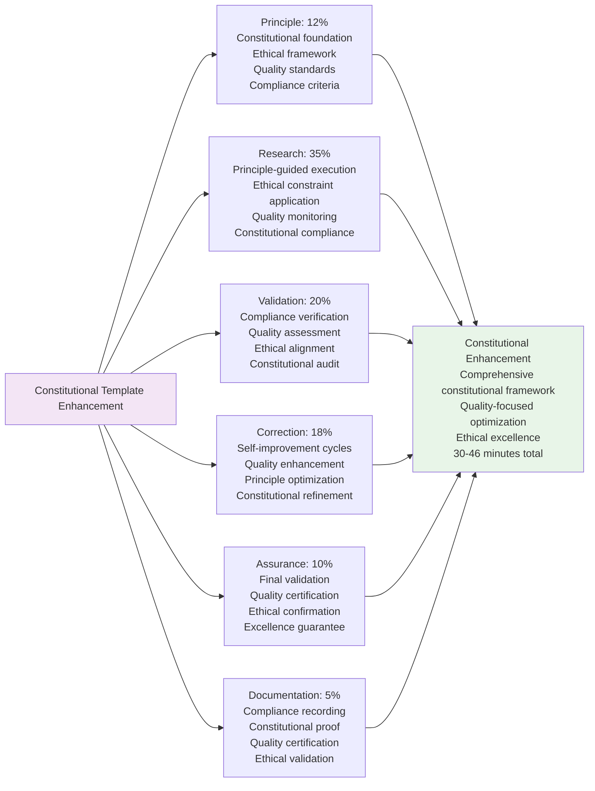

## Constitutional Principles Framework

### Core Constitutional Principles

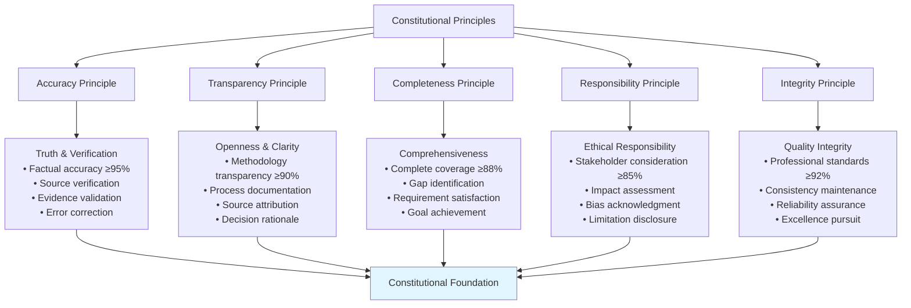

### Ethical Framework Integration

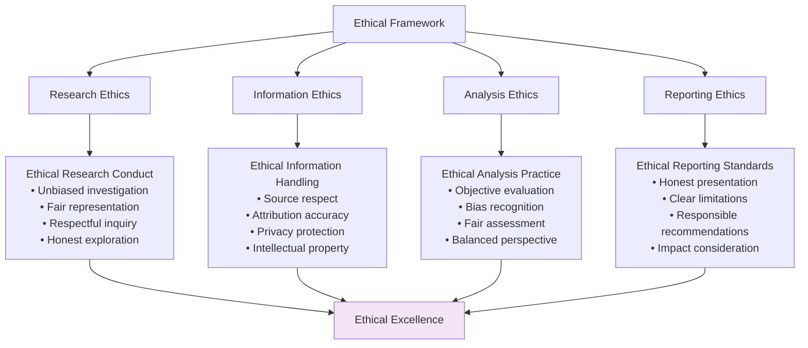

## Constitutional Validation Patterns

### Comprehensive Validation Framework

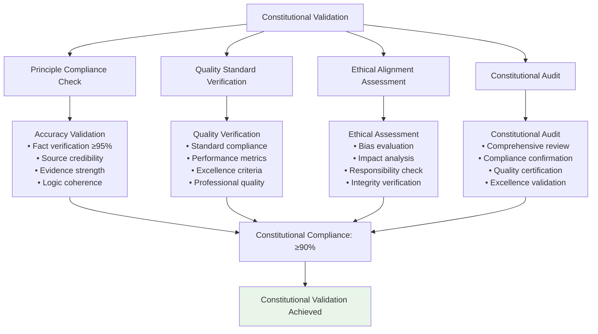

### Self-Correction Mechanism

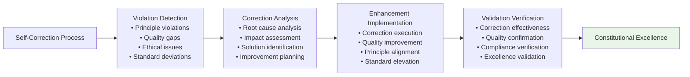

## Quality Assurance Integration

### Multi-Layer Constitutional Quality

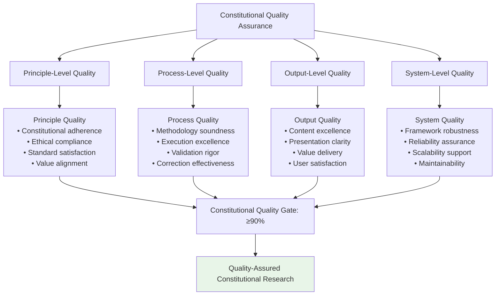

### Constitutional Compliance Scoring

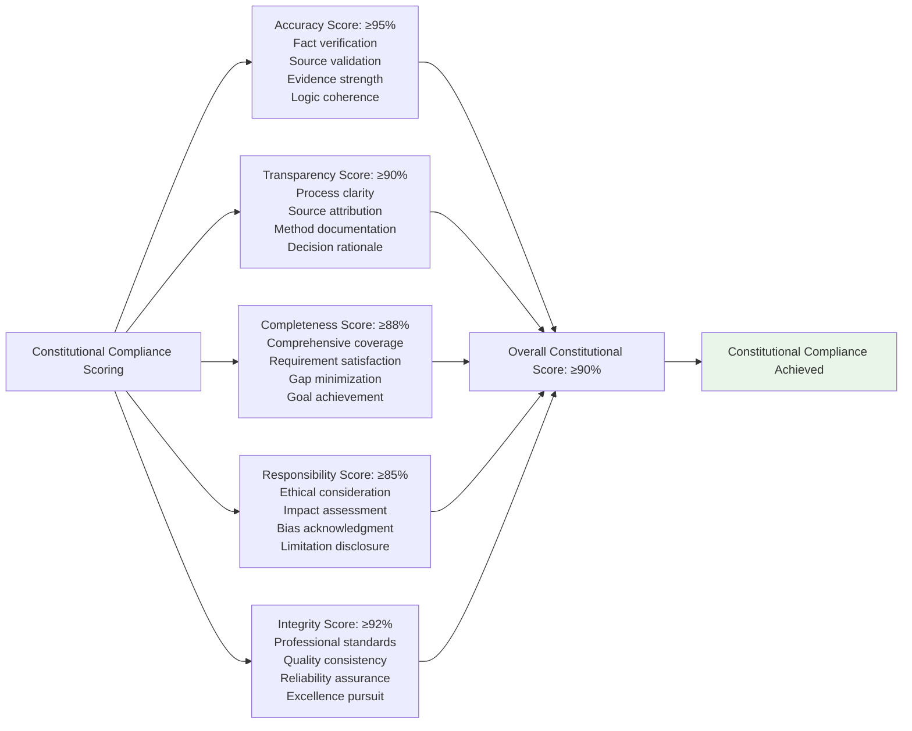

## Performance Characteristics

### Constitutional Execution Metrics

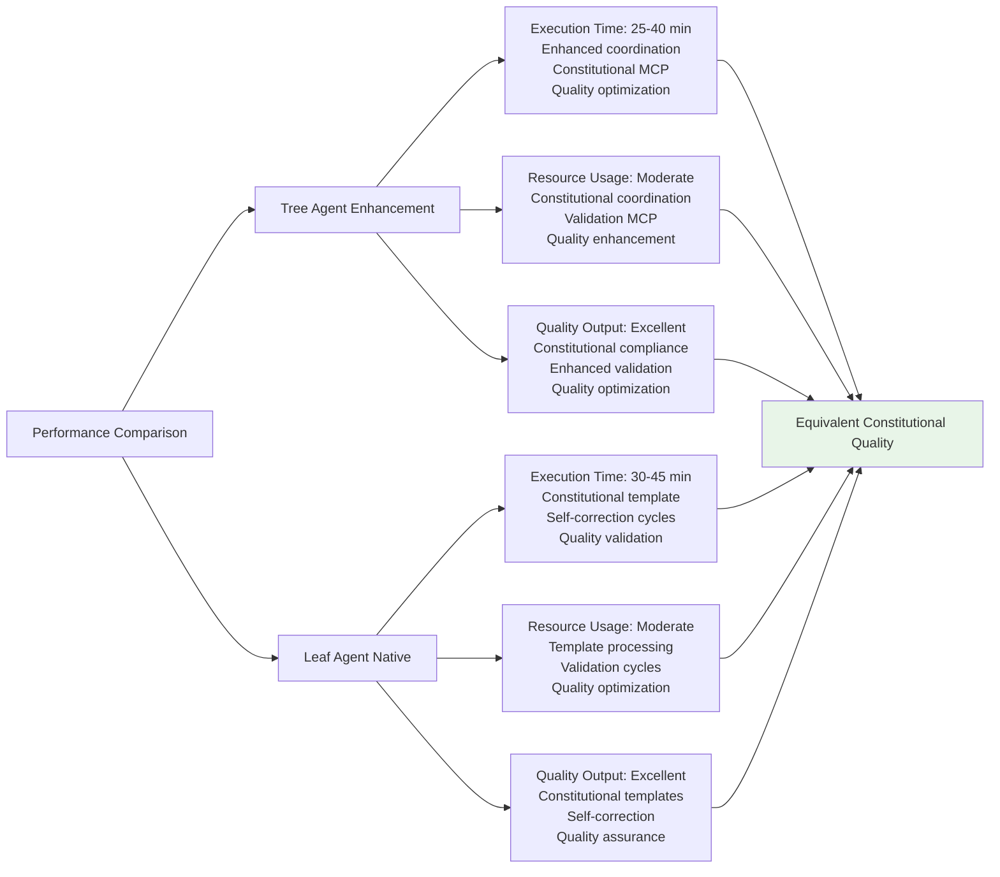

## Constitutional Application Examples

### Ethical Technology Assessment
- **Context**: "Evaluate AI technology adoption with ethical considerations"
- **Constitutional Focus**: Ethical alignment, bias assessment, social impact, responsible recommendations
- **Output**: Constitutionally compliant technology evaluation with ethical framework

### Quality-Assured Business Analysis
- **Context**: "Analyze market opportunity with comprehensive quality validation"
- **Constitutional Focus**: Accuracy verification, source validation, complete coverage, transparent methodology
- **Output**: Constitutional business analysis with quality certification

### Responsible Research Synthesis
- **Context**: "Synthesize research findings with constitutional compliance"
- **Constitutional Focus**: Truth verification, ethical consideration, comprehensive coverage, integrity assurance
- **Output**: Constitutional research synthesis with responsible recommendations

## Implementation Guidelines

### For Tree Agents
1. **Constitutional Coordination**: Enhance all phases with constitutional MCP server coordination
2. **Principle Integration**: Apply constitutional principles throughout coordinated execution
3. **Quality Enhancement**: Maintain constitutional standards while enhancing coordination
4. **Validation Rigor**: Apply systematic constitutional validation across coordination
5. **Excellence Pursuit**: Achieve constitutional compliance through enhanced orchestration

### For Leaf Agents
1. **Constitutional Mastery**: Execute enhanced constitutional templates with comprehensive frameworks
2. **Self-Correction Excellence**: Apply systematic self-correction throughout template execution
3. **Quality Integration**: Maintain constitutional compliance throughout template progression
4. **Validation Focus**: Emphasize constitutional validation throughout execution
5. **Constitutional Excellence**: Achieve quality assurance through constitutional framework

### Universal Constitutional Standards
1. **Principle Adherence**: Ensure all constitutional principles are systematically applied
2. **Quality Excellence**: Achieve ≥90% constitutional compliance score
3. **Ethical Alignment**: Maintain ethical standards throughout research execution
4. **Validation Rigor**: Apply comprehensive validation at all execution levels
5. **Constitutional Guarantee**: Provide constitutional compliance certification with research output

This Constitutional AI method demonstrates sophisticated quality validation patterns for ethical and constitutional research compliance while maintaining excellence across different agent execution capabilities.