# Self-Consistency Method

## Source References
**Method Implementation**: research/orchestrator/methods/advanced/self_consistency.md  
**Claude Desktop Research**: Consensus building and error reduction pattern  
**Tree-Leaf Architecture**: Universal execution paths for reliability enhancement research

## Method Overview

The Self-Consistency method provides reliability enhancement through consensus building for both tree and leaf agents, generating multiple reasoning paths, comparing outcomes, and building consensus to reduce errors and increase confidence in research findings.

### Method Characteristics
- **Reasoning Paths**: 3-5 independent reasoning approaches
- **Execution Style**: Multiple path generation with consensus building
- **Quality Focus**: Reliability enhancement through error reduction
- **Complexity Support**: Simple to complex research requiring high confidence
- **Execution Time**: 35-55 minutes (tree parallel) or 45-65 minutes (leaf sequential)

## Self-Consistency Architecture

### Multi-Path Consensus Framework

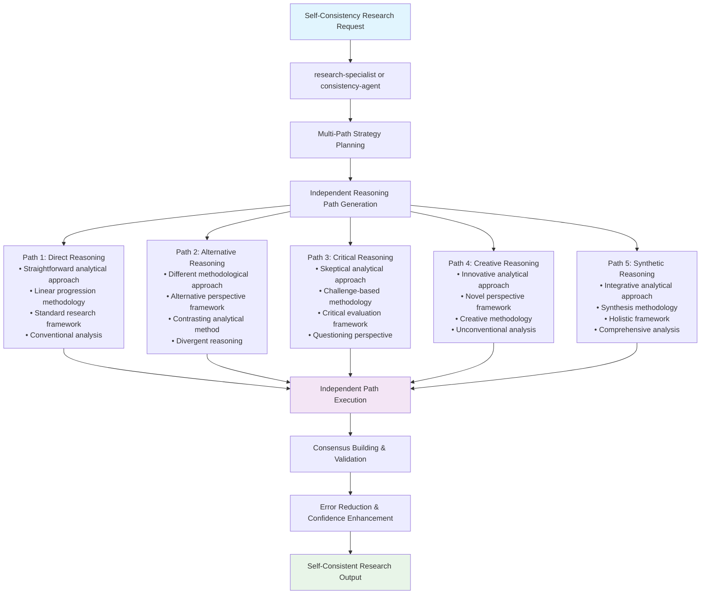

## Tree Agent Execution (Parallel Path Coordination)

### Parallel Reasoning Path Generation

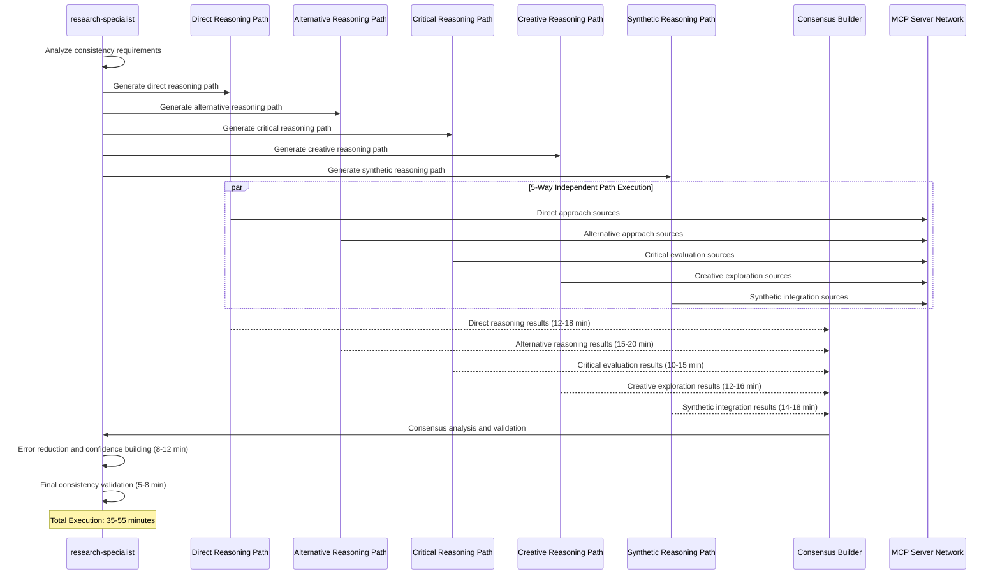

### MCP Server Coordination by Reasoning Path

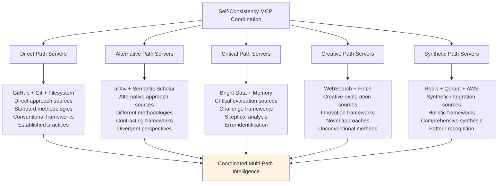

## Leaf Agent Execution (Sequential Path Generation)

### Sequential Multi-Path Consistency Template

```mermaid
flowchart TD
    A[Self-Consistency Request] --> B[Enhanced Consistency Agent]
    B --> C[Multi-Path Consistency Template]
    C --> D[Sequential Reasoning Path Execution]
    
    D --> E[Enhanced Direct Path Template<br/>• Comprehensive direct framework<br/>• Straightforward methodology<br/>• Standard analytical approach<br/>• Linear progression<br/>Duration: 12-16 minutes]
    
    E --> F[Enhanced Alternative Path Template<br/>• Alternative methodology framework<br/>• Different perspective approach<br/>• Contrasting analytical method<br/>• Divergent reasoning<br/>Duration: 15-19 minutes]
    
    F --> G[Enhanced Critical Path Template<br/>• Critical evaluation framework<br/>• Skeptical analysis approach<br/>• Challenge-based methodology<br/>• Error identification focus<br/>Duration: 10-14 minutes]
    
    G --> H[Enhanced Creative Path Template<br/>• Creative exploration framework<br/>• Innovative methodology<br/>• Novel approach development<br/>• Unconventional analysis<br/>Duration: 12-16 minutes]
    
    H --> I[Enhanced Synthetic Path Template<br/>• Synthesis framework<br/>• Integrative methodology<br/>• Holistic approach<br/>• Comprehensive analysis<br/>Duration: 14-18 minutes]
    
    I --> J[Consensus Building Template<br/>• Path comparison framework<br/>• Agreement identification<br/>• Consensus development<br/>Duration: 6-10 minutes]
    
    J --> K[Error Reduction Template<br/>• Inconsistency resolution<br/>• Confidence enhancement<br/>• Quality optimization<br/>Duration: 4-6 minutes]
    
    K --> L[Self-Consistent Research Output]
    
    style E fill:#f3e5f5
    style F fill:#f3e5f5
    style G fill:#f3e5f5
    style H fill:#f3e5f5
    style I fill:#f3e5f5
    style L fill:#e8f5e8
```

### Sequential Path Enhancement Strategy

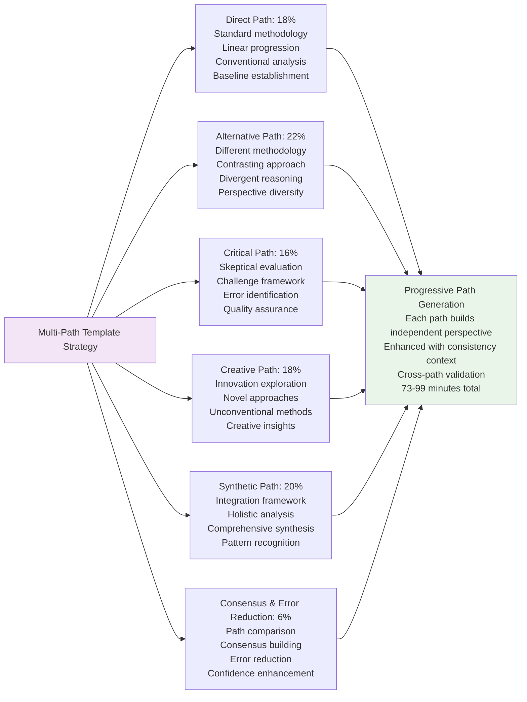

## Reasoning Path Patterns

### Direct Reasoning Path

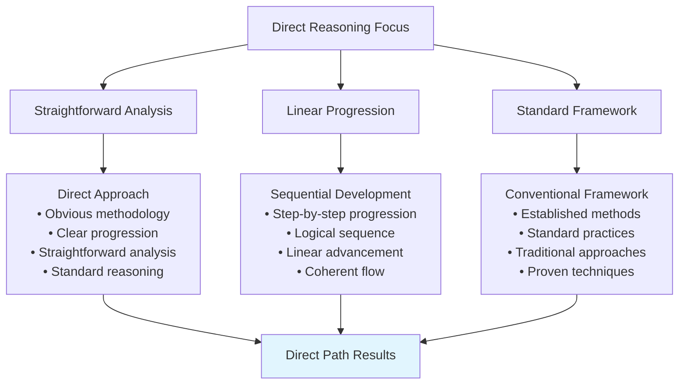

### Alternative Reasoning Path

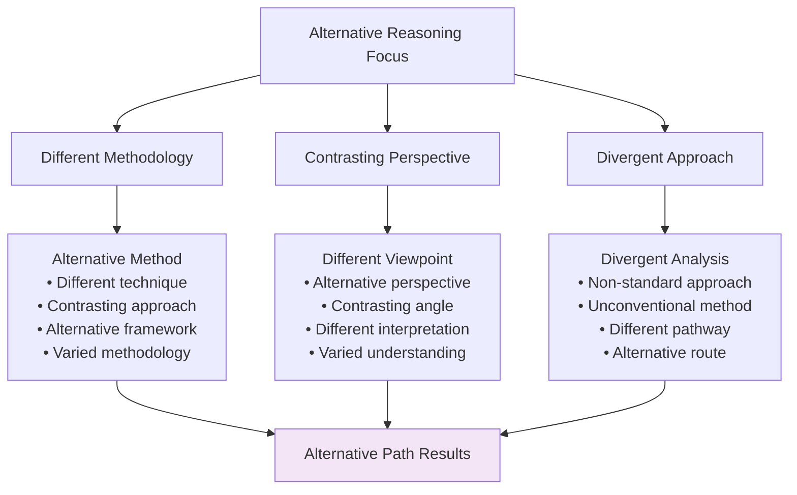

### Critical Reasoning Path

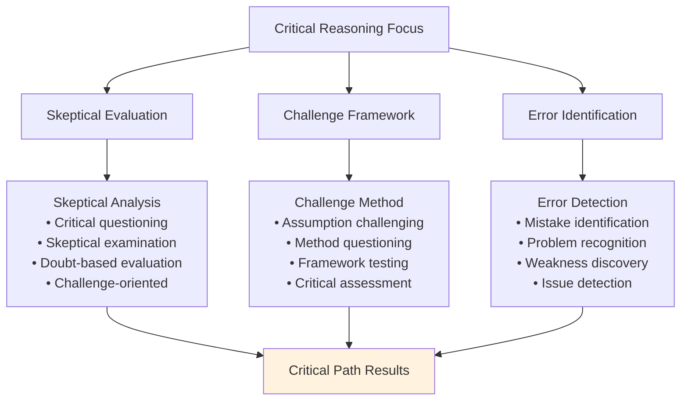

### Creative Reasoning Path

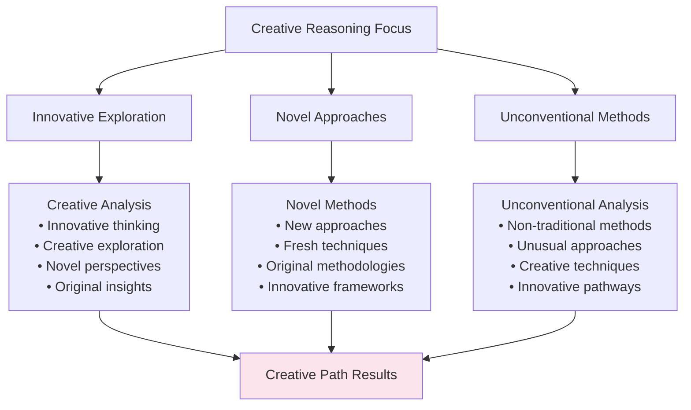

### Synthetic Reasoning Path

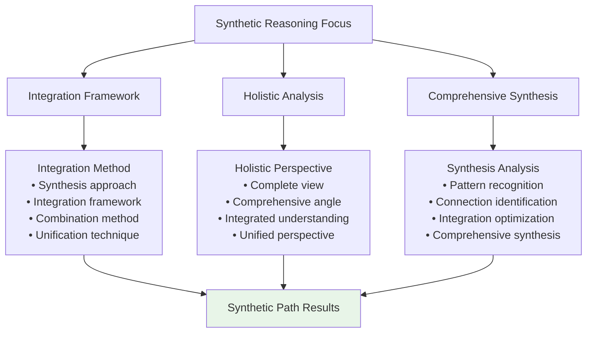

## Consensus Building Framework

### Multi-Path Consensus Analysis

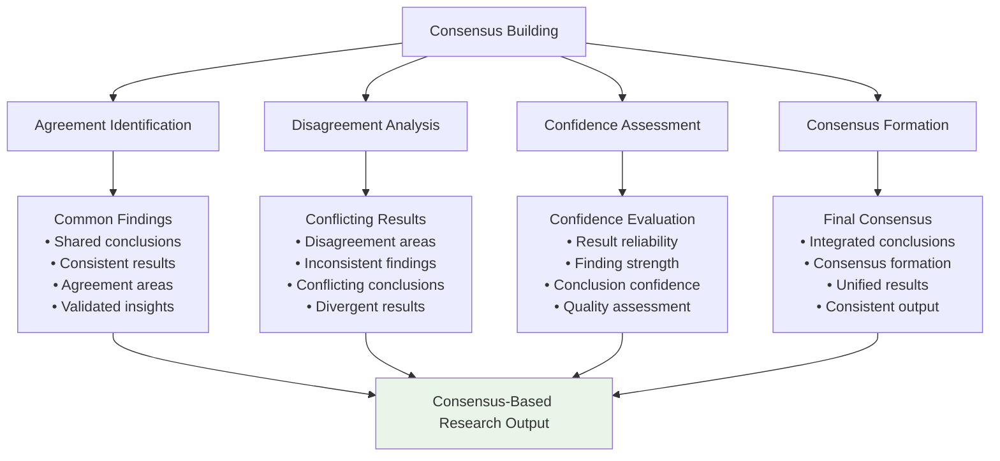

### Error Reduction Mechanism

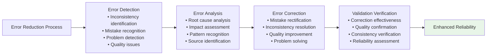

## Quality Assurance and Reliability

### Self-Consistency Quality Framework

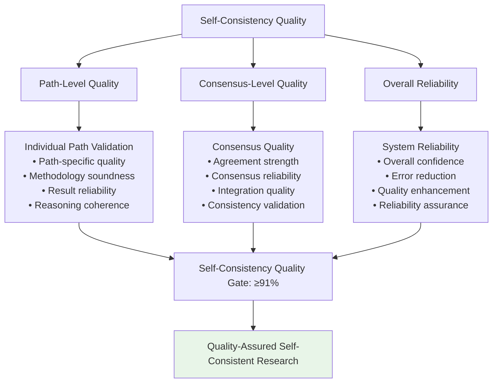

### Constitutional AI Compliance

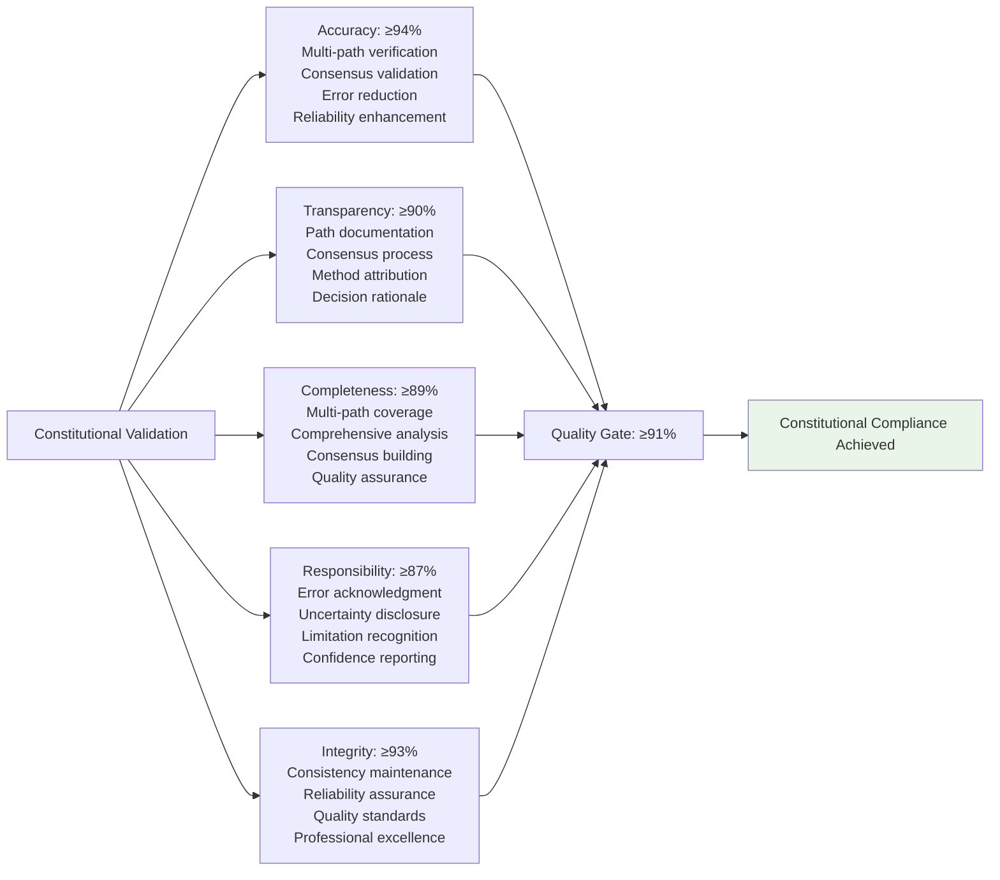

## Performance Characteristics

### Self-Consistency Execution Metrics

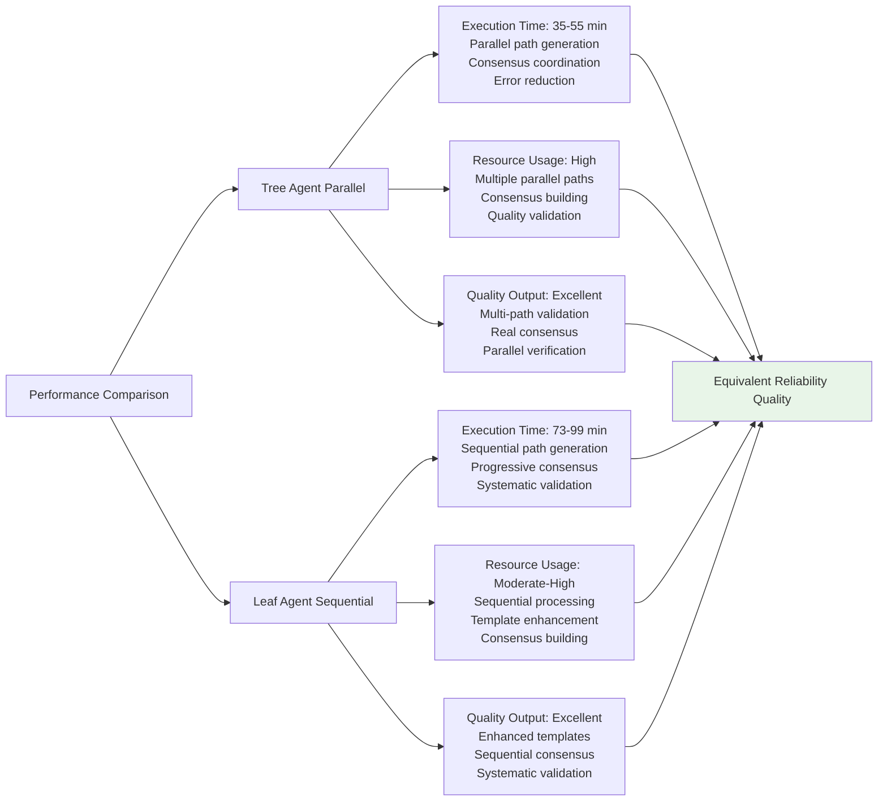

## Self-Consistency Application Examples

### High-Stakes Decision Analysis
- **Context**: "Evaluate critical technology architecture decision with high confidence requirement"
- **Paths**: Direct (standard evaluation), Alternative (different framework), Critical (risk analysis), Creative (innovative options), Synthetic (integrated approach)
- **Output**: High-confidence decision analysis with error reduction

### Research Validation Enhancement
- **Context**: "Validate research findings through multiple independent approaches"
- **Paths**: Direct (original methodology), Alternative (different approach), Critical (skeptical review), Creative (novel validation), Synthetic (comprehensive integration)
- **Output**: Validated research with enhanced reliability and reduced error probability

### Strategic Planning Reliability
- **Context**: "Develop strategic plan with maximum confidence and minimal uncertainty"
- **Paths**: Direct (conventional planning), Alternative (different strategy), Critical (risk assessment), Creative (innovative approach), Synthetic (holistic integration)
- **Output**: Reliable strategic plan with consensus-based confidence enhancement

## Implementation Guidelines

### For Tree Agents
1. **Path Coordination**: Generate 3-5 independent reasoning paths with clear differentiation
2. **Parallel Excellence**: Maximize concurrent path execution while maintaining independence
3. **Consensus Building**: Implement systematic consensus analysis with conflict resolution
4. **Error Reduction**: Apply systematic error detection and correction across paths
5. **Quality Assurance**: Maintain high reliability standards through multi-path validation

### For Leaf Agents
1. **Sequential Mastery**: Execute multiple enhanced path templates with clear independence
2. **Path Simulation**: Maintain distinct reasoning approaches throughout sequential execution
3. **Consensus Focus**: Emphasize systematic consensus building across path results
4. **Error Detection**: Apply systematic error identification and reduction techniques
5. **Reliability Enhancement**: Focus on confidence building through path validation

### Universal Quality Standards
1. **Path Independence**: Ensure truly independent reasoning paths are generated
2. **Consensus Quality**: Achieve reliable consensus through systematic comparison
3. **Quality Excellence**: Maintain ≥91% constitutional compliance score
4. **Error Reduction**: Provide enhanced reliability through systematic error reduction
5. **Confidence Enhancement**: Deliver high-confidence results through multi-path validation

This Self-Consistency method demonstrates sophisticated reliability enhancement patterns for high-confidence research while maintaining quality excellence across different agent execution capabilities.