# Step-by-Step Research Method

## Source References
**Method Implementation**: research/orchestrator/methods/existing/step_by_step_research.md  
**Claude Desktop Research**: Systematic progression pattern for structured analysis  
**Tree-Leaf Architecture**: Universal execution paths for systematic research methodology

## Method Overview

The Step-by-Step Research method provides systematic 5-phase progression for both tree and leaf agents, offering structured analytical framework with clear progression through discovery, analysis, validation, synthesis, and quality assurance phases.

### Method Characteristics
- **Phase Count**: 5 distinct research phases
- **Execution Style**: Sequential progression with systematic validation
- **Quality Focus**: Structured analysis with comprehensive coverage
- **Complexity Support**: Simple to moderate research requirements
- **Execution Time**: 30-50 minutes (tree enhanced) or 35-55 minutes (leaf native)

## Universal Method Architecture

### 5-Phase Systematic Progression

```mermaid
graph TD
    A[Step-by-Step Research Request] --> B[research-specialist or enhanced-agent]
    B --> C[Systematic Phase Planning]
    C --> D[5-Phase Sequential Execution]
    
    D --> E[Phase 1: Discovery & Exploration<br/>• Initial research & information gathering<br/>• Source identification & accessibility<br/>• Scope definition & boundary setting<br/>• Context establishment & framework<br/>Duration: 8-12 minutes]
    
    E --> F[Phase 2: Deep Analysis & Investigation<br/>• Comprehensive information analysis<br/>• Pattern identification & connection<br/>• Evidence evaluation & verification<br/>• Critical examination & assessment<br/>Duration: 10-15 minutes]
    
    F --> G[Phase 3: Validation & Verification<br/>• Fact checking & source validation<br/>• Cross-reference verification<br/>• Logic consistency examination<br/>• Quality assurance protocols<br/>Duration: 6-10 minutes]
    
    G --> H[Phase 4: Synthesis & Integration<br/>• Information integration & synthesis<br/>• Conclusion development & reasoning<br/>• Recommendation formulation<br/>• Strategic insight generation<br/>Duration: 8-12 minutes]
    
    H --> I[Phase 5: Quality Review & Optimization<br/>• Final quality assessment<br/>• Output optimization & refinement<br/>• Presentation enhancement<br/>• Delivery preparation<br/>Duration: 5-8 minutes]
    
    I --> J[Systematic Research Output]
    
    style E fill:#e1f5fe
    style F fill:#f3e5f5
    style G fill:#fff3e0
    style H fill:#fce4ec
    style I fill:#e8f5e8
    style J fill:#e8f5e8
```

## Tree Agent Enhancement (Orchestrated Execution)

### Enhanced Systematic Coordination

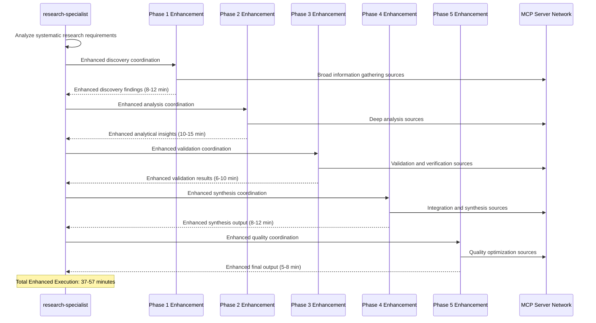

### Tree Agent MCP Coordination by Phase

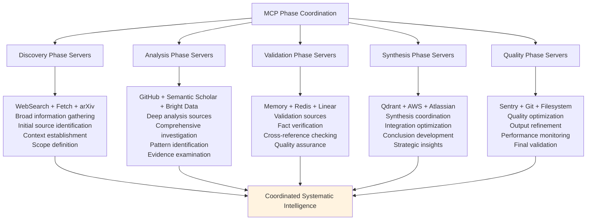

## Leaf Agent Native Execution (Template-Based)

### Enhanced Systematic Template

```mermaid
flowchart TD
    A[Step-by-Step Research Request] --> B[Enhanced Single Agent]
    B --> C[Comprehensive Systematic Template]
    C --> D[Enhanced 5-Phase Execution]
    
    D --> E[Enhanced Phase 1 Template<br/>• Comprehensive discovery framework<br/>• Systematic source identification<br/>• Advanced scope definition<br/>• Context optimization<br/>Duration: 10-14 minutes]
    
    E --> F[Enhanced Phase 2 Template<br/>• Deep analysis framework<br/>• Advanced pattern recognition<br/>• Comprehensive investigation<br/>• Evidence optimization<br/>Duration: 12-16 minutes]
    
    F --> G[Enhanced Phase 3 Template<br/>• Advanced validation framework<br/>• Systematic verification<br/>• Quality assurance protocol<br/>• Reliability optimization<br/>Duration: 8-12 minutes]
    
    G --> H[Enhanced Phase 4 Template<br/>• Advanced synthesis framework<br/>• Integration optimization<br/>• Strategic insight generation<br/>• Conclusion enhancement<br/>Duration: 10-14 minutes]
    
    H --> I[Enhanced Phase 5 Template<br/>• Comprehensive quality framework<br/>• Output optimization<br/>• Presentation enhancement<br/>• Final validation<br/>Duration: 7-10 minutes]
    
    I --> J[Systematic Research Output]
    
    style E fill:#f3e5f5
    style F fill:#f3e5f5
    style G fill:#f3e5f5
    style H fill:#f3e5f5
    style I fill:#f3e5f5
    style J fill:#e8f5e8
```

### Template Enhancement Strategy

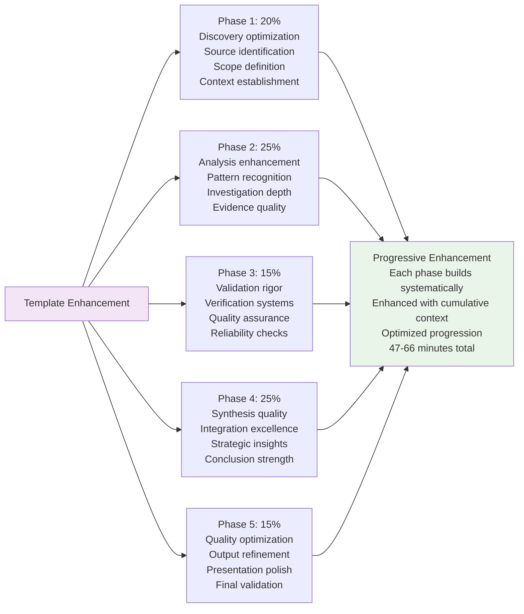

## Phase-Specific Analysis Patterns

### Phase 1: Discovery & Exploration

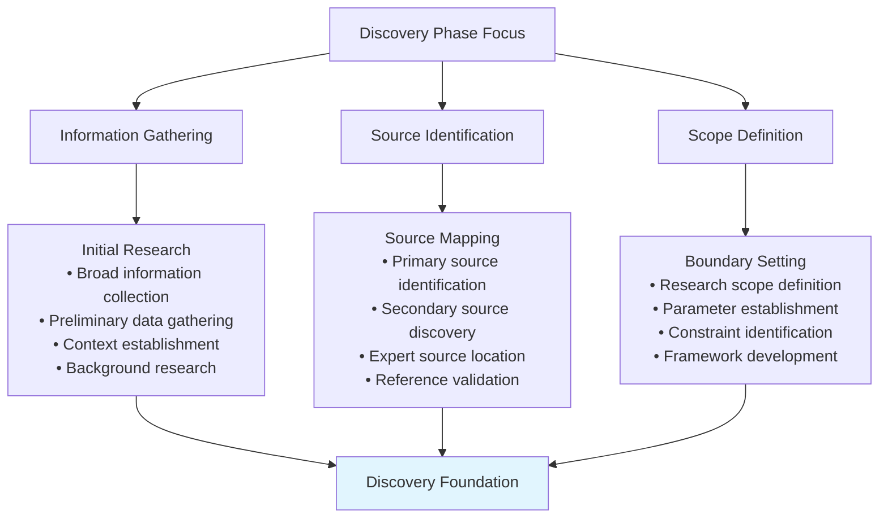

### Phase 2: Deep Analysis & Investigation

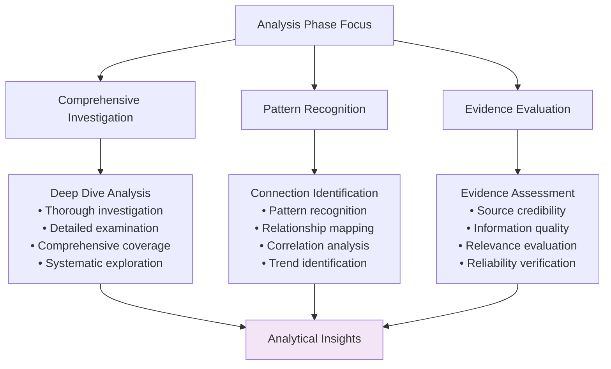

### Phase 3: Validation & Verification

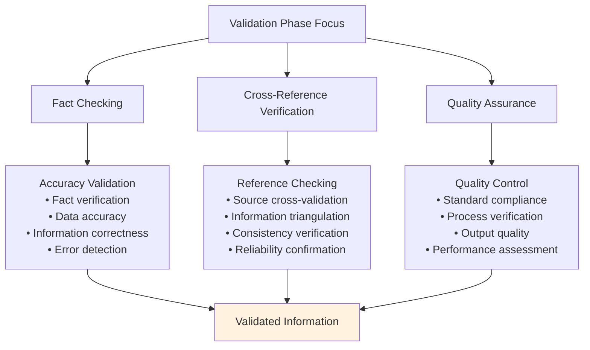

### Phase 4: Synthesis & Integration

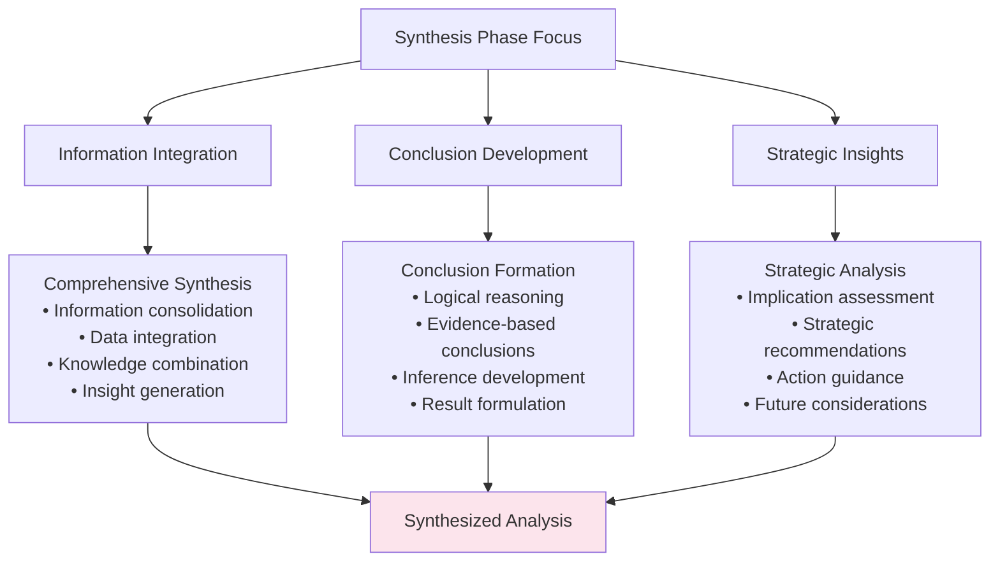

### Phase 5: Quality Review & Optimization

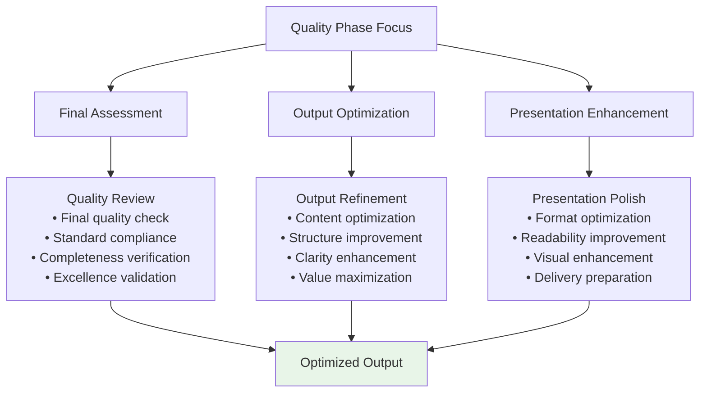

## Quality Assurance Framework

### Systematic Quality Validation

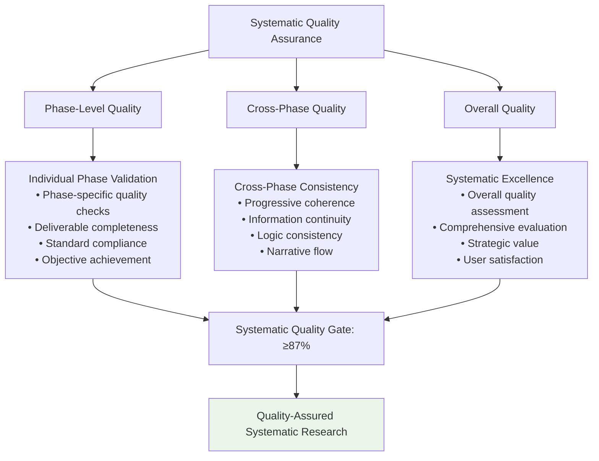

### Constitutional AI Compliance

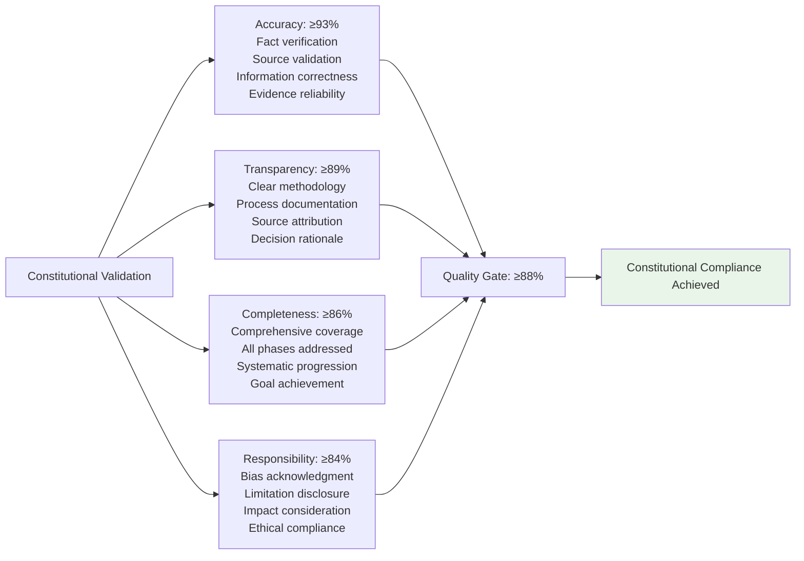

## Performance Characteristics

### Execution Metrics Comparison

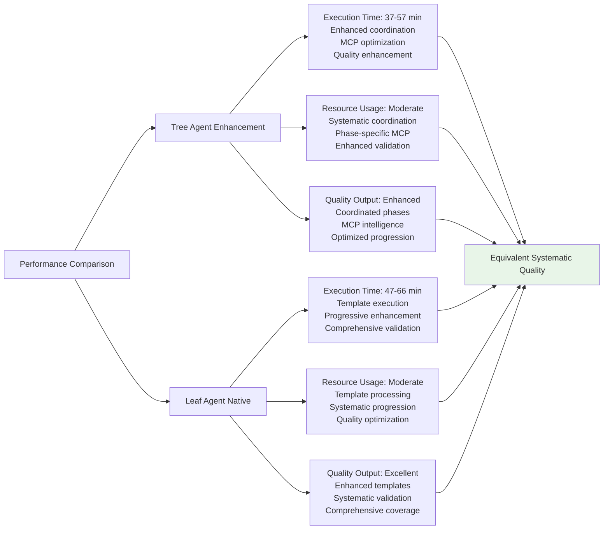

## Step-by-Step Application Examples

### Technology Evaluation
- **Context**: "Evaluate React vs Vue.js for new web application project"
- **Phases**: Discovery (frameworks comparison), Analysis (feature assessment), Validation (community support), Synthesis (recommendation), Quality (final review)
- **Output**: Systematic technology evaluation with clear recommendation

### Process Improvement Analysis
- **Context**: "Analyze current deployment process for optimization opportunities"
- **Phases**: Discovery (current process mapping), Analysis (bottleneck identification), Validation (impact assessment), Synthesis (improvement plan), Quality (implementation guidance)
- **Output**: Comprehensive process improvement strategy

### Market Research Investigation
- **Context**: "Research target market characteristics for product launch"
- **Phases**: Discovery (market identification), Analysis (demographic analysis), Validation (data verification), Synthesis (market strategy), Quality (actionable insights)
- **Output**: Systematic market research with strategic recommendations

## Implementation Guidelines

### For Tree Agents
1. **Phase Coordination**: Enhance each phase with appropriate MCP server coordination
2. **Progressive Enhancement**: Build context systematically through coordinated phases
3. **Quality Integration**: Apply validation at each phase with cumulative quality improvement
4. **Resource Optimization**: Allocate MCP resources efficiently across phases
5. **Systematic Excellence**: Maintain structured progression while enhancing depth

### For Leaf Agents
1. **Template Optimization**: Use enhanced systematic templates with comprehensive frameworks
2. **Progressive Building**: Develop context systematically through enhanced phase templates
3. **Quality Integration**: Apply systematic validation throughout phase progression
4. **Comprehensive Coverage**: Ensure thorough analysis through enhanced templates
5. **Systematic Mastery**: Execute structured progression with quality optimization

### Universal Quality Standards
1. **Phase Completeness**: Ensure all 5 phases are thoroughly executed
2. **Systematic Progression**: Maintain logical flow through phase sequence
3. **Quality Excellence**: Achieve ≥88% constitutional compliance score
4. **Comprehensive Coverage**: Provide thorough analysis through systematic approach
5. **Strategic Value**: Deliver actionable insights through structured methodology

This Step-by-Step Research method demonstrates systematic coordination patterns for structured analytical research while maintaining quality excellence across different agent execution capabilities.