# Universal Research Method

## Source References
**Method Implementation**: research/orchestrator/methods/existing/universal_research.md  
**Claude Desktop Research**: Comprehensive template approach for flexible research  
**Tree-Leaf Architecture**: Universal execution paths for comprehensive research methodology

## Method Overview

The Universal Research method provides a comprehensive template framework for both tree and leaf agents, offering flexible analytical structure that adapts to diverse research requirements with systematic coverage and validation across all research domains.

### Method Characteristics
- **Template Scope**: Comprehensive framework covering all research domains
- **Execution Style**: Flexible template adaptation with systematic validation
- **Quality Focus**: Comprehensive coverage with universal applicability
- **Complexity Support**: Simple to moderate research requirements across domains
- **Execution Time**: 35-55 minutes (tree enhanced) or 40-60 minutes (leaf native)

## Universal Method Architecture

### Comprehensive Template Framework

```mermaid
graph TD
    A[Universal Research Request] --> B[research-specialist or enhanced-agent]
    B --> C[Universal Template Adaptation]
    C --> D[Comprehensive Framework Execution]
    
    D --> E[Problem Definition & Scope<br/>• Clear problem articulation<br/>• Research scope establishment<br/>• Objective definition & criteria<br/>• Success metric identification<br/>Duration: 6-10 minutes]
    
    E --> F[Comprehensive Information Gathering<br/>• Multi-source information collection<br/>• Domain-specific research<br/>• Expert opinion integration<br/>• Evidence compilation<br/>Duration: 12-18 minutes]
    
    F --> G[Systematic Analysis & Evaluation<br/>• Information analysis & synthesis<br/>• Pattern recognition & insights<br/>• Critical evaluation & assessment<br/>• Implication identification<br/>Duration: 10-15 minutes]
    
    G --> H[Solution Development & Recommendations<br/>• Solution formulation & design<br/>• Recommendation development<br/>• Implementation guidance<br/>• Strategic planning<br/>Duration: 8-12 minutes]
    
    H --> I[Quality Validation & Optimization<br/>• Comprehensive quality review<br/>• Output validation & verification<br/>• Final optimization & refinement<br/>• Delivery preparation<br/>Duration: 5-8 minutes]
    
    I --> J[Universal Research Output]
    
    style E fill:#e1f5fe
    style F fill:#f3e5f5
    style G fill:#fff3e0
    style H fill:#fce4ec
    style I fill:#e8f5e8
    style J fill:#e8f5e8
```

## Tree Agent Enhancement (Orchestrated Universal Framework)

### Enhanced Universal Coordination

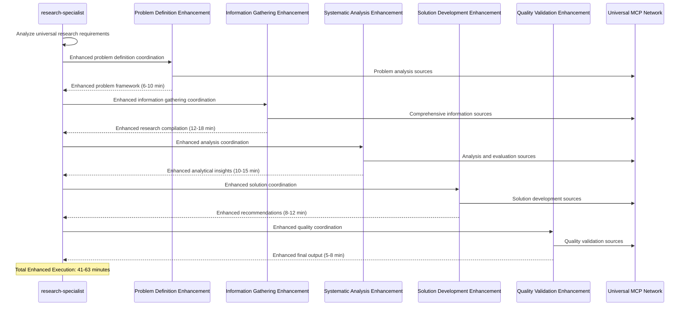

### Tree Agent Universal MCP Coordination

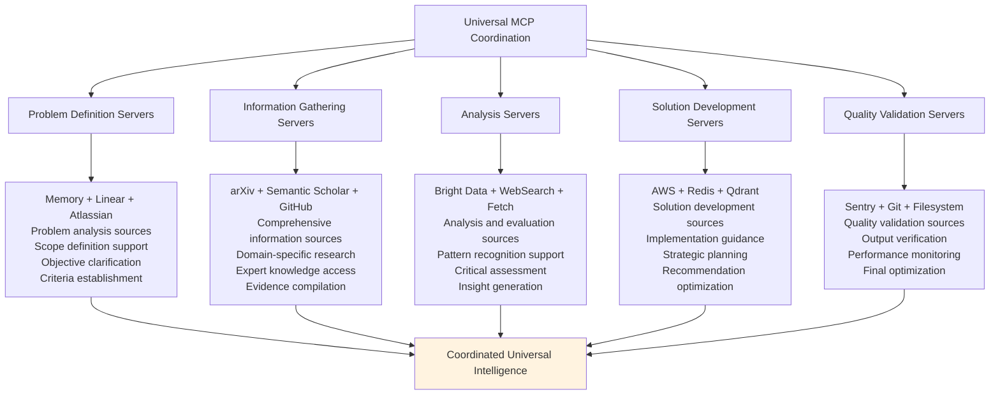

## Leaf Agent Native Execution (Universal Template)

### Comprehensive Universal Template

```mermaid
flowchart TD
    A[Universal Research Request] --> B[Enhanced Single Agent]
    B --> C[Universal Comprehensive Template]
    C --> D[Universal Framework Execution]
    
    D --> E[Enhanced Problem Definition Template<br/>• Comprehensive problem framework<br/>• Advanced scope definition<br/>• Objective optimization<br/>• Success criteria enhancement<br/>Duration: 8-12 minutes]
    
    E --> F[Enhanced Information Gathering Template<br/>• Multi-domain research framework<br/>• Comprehensive source integration<br/>• Expert knowledge compilation<br/>• Evidence optimization<br/>Duration: 15-20 minutes]
    
    F --> G[Enhanced Analysis Template<br/>• Advanced analytical framework<br/>• Pattern recognition optimization<br/>• Critical evaluation enhancement<br/>• Insight generation<br/>Duration: 12-16 minutes]
    
    G --> H[Enhanced Solution Template<br/>• Solution development framework<br/>• Recommendation optimization<br/>• Implementation guidance<br/>• Strategic enhancement<br/>Duration: 10-14 minutes]
    
    H --> I[Enhanced Quality Template<br/>• Comprehensive validation framework<br/>• Quality optimization<br/>• Output refinement<br/>• Final enhancement<br/>Duration: 7-10 minutes]
    
    I --> J[Universal Research Output]
    
    style E fill:#f3e5f5
    style F fill:#f3e5f5
    style G fill:#f3e5f5
    style H fill:#f3e5f5
    style I fill:#f3e5f5
    style J fill:#e8f5e8
```

### Universal Template Enhancement Strategy

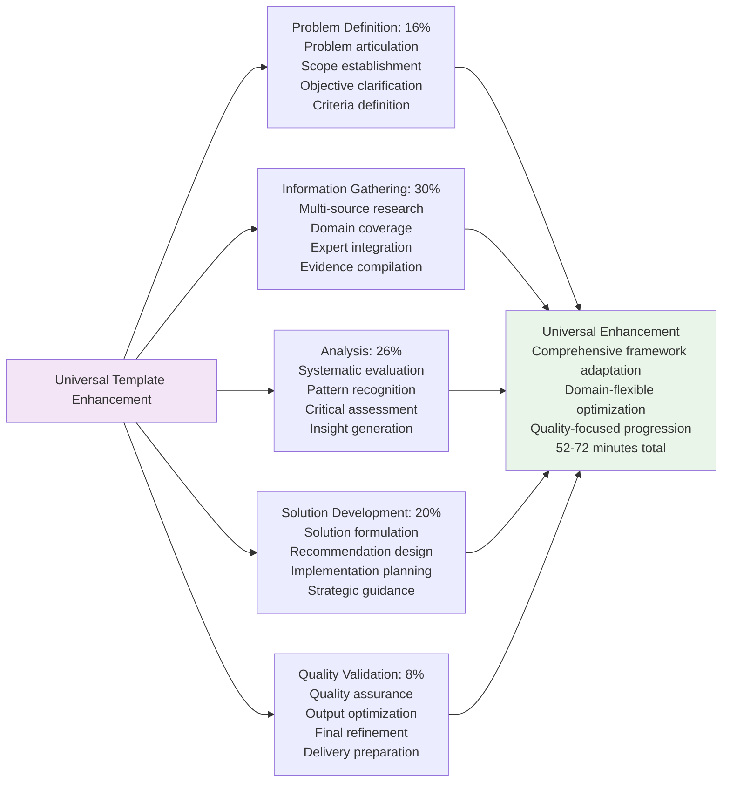

## Universal Framework Components

### Problem Definition & Scope

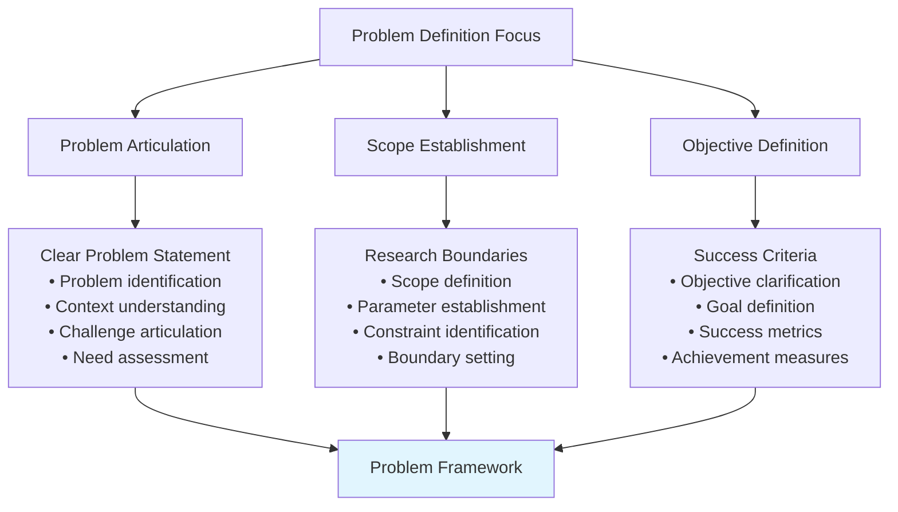

### Comprehensive Information Gathering

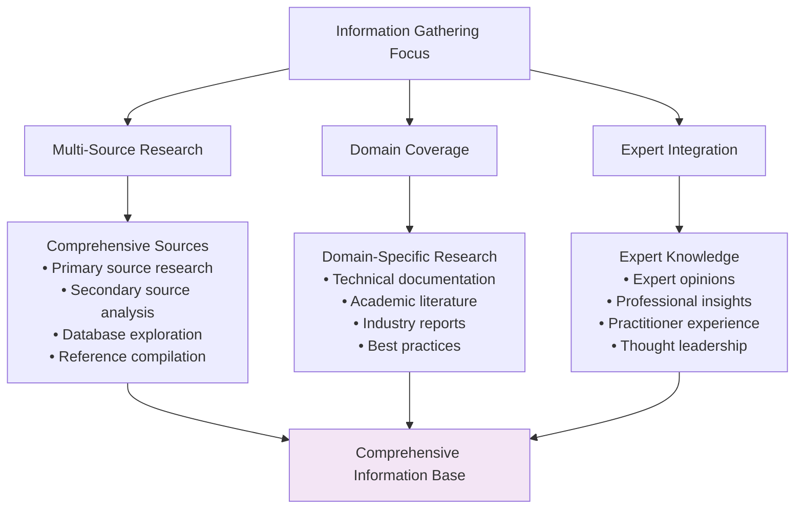

### Systematic Analysis & Evaluation

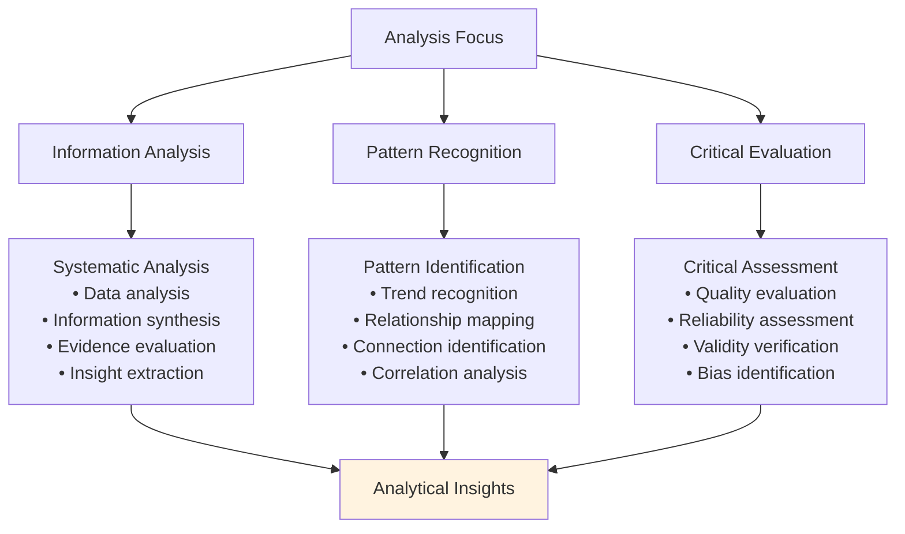

### Solution Development & Recommendations

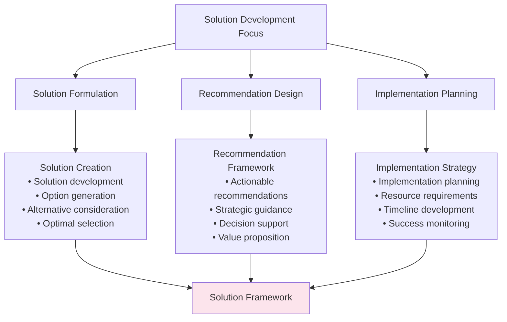

### Quality Validation & Optimization

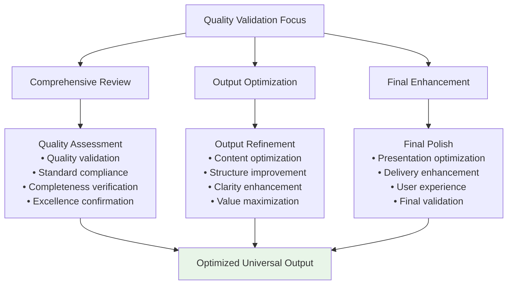

## Domain Adaptation Patterns

### Technology Domain Adaptation

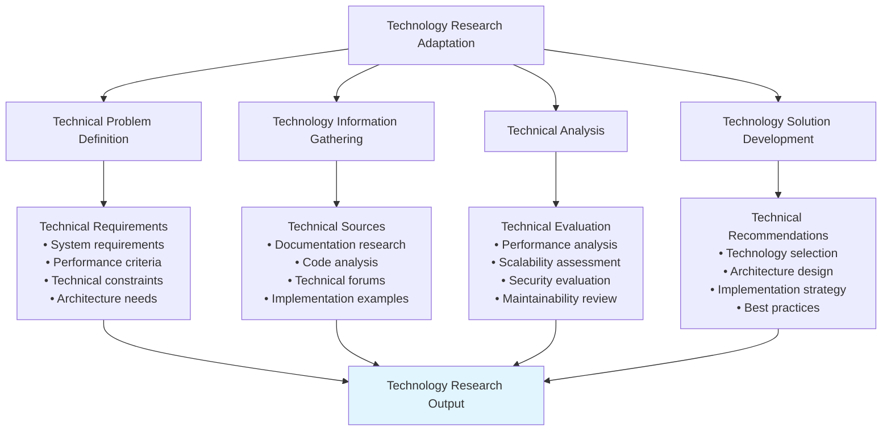

### Business Domain Adaptation

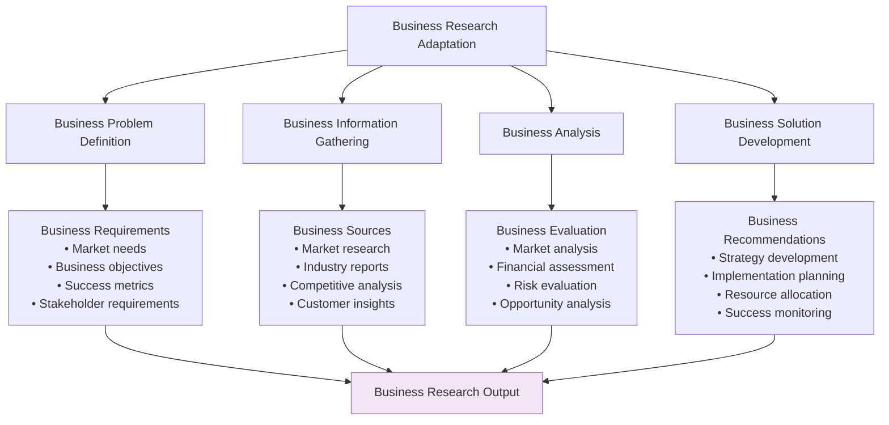

## Quality Assurance Framework

### Universal Quality Validation

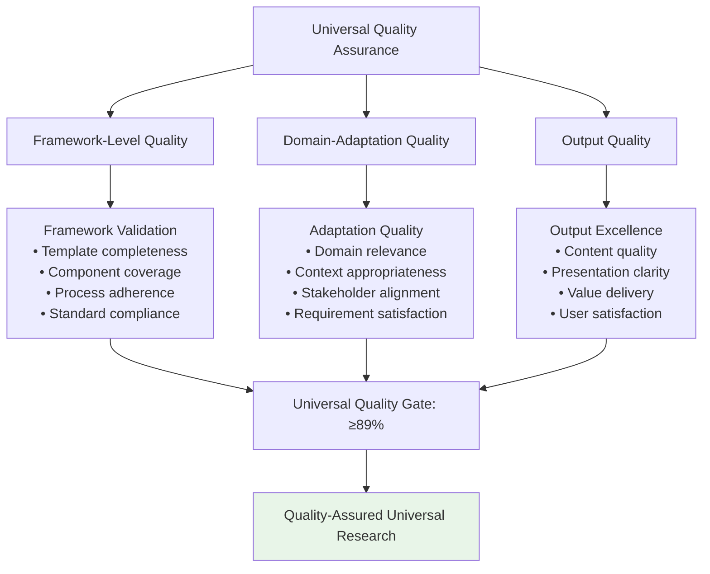

### Constitutional AI Compliance

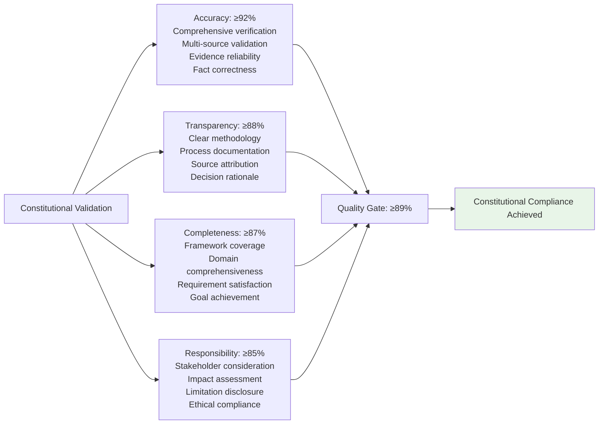

## Performance Characteristics

### Execution Metrics Comparison

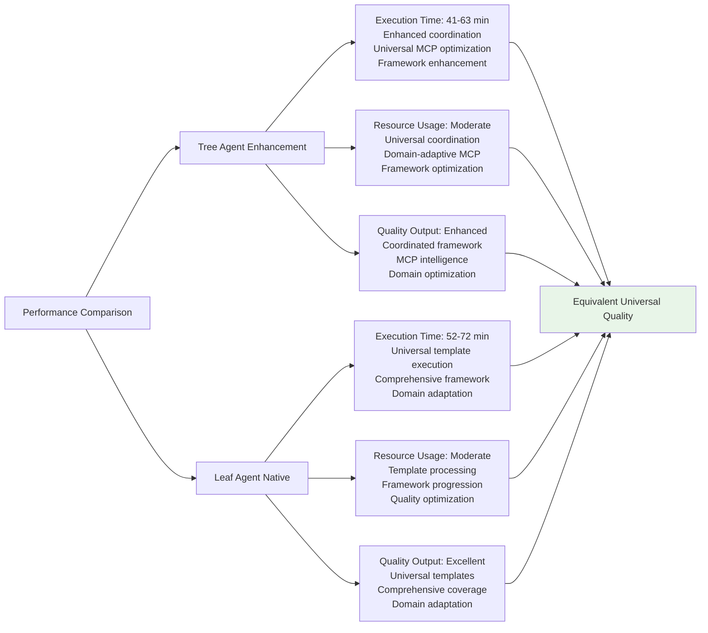

## Universal Application Examples

### Technology Assessment
- **Context**: "Evaluate cloud-native architecture options for enterprise application"
- **Framework**: Problem (requirements definition), Information (technology research), Analysis (option evaluation), Solution (architecture recommendation), Quality (implementation guidance)
- **Output**: Comprehensive technology assessment with strategic recommendations

### Business Strategy Development
- **Context**: "Develop market entry strategy for new product line"
- **Framework**: Problem (market opportunity), Information (market research), Analysis (competitive landscape), Solution (entry strategy), Quality (implementation plan)
- **Output**: Universal business strategy with comprehensive market analysis

### Process Optimization Analysis
- **Context**: "Analyze and optimize software development lifecycle processes"
- **Framework**: Problem (process challenges), Information (best practices research), Analysis (current state evaluation), Solution (optimization recommendations), Quality (implementation roadmap)
- **Output**: Universal process optimization with systematic improvement plan

## Implementation Guidelines

### For Tree Agents
1. **Universal Coordination**: Enhance framework components with appropriate MCP server coordination
2. **Domain Adaptation**: Adapt universal framework to specific domain requirements
3. **Comprehensive Enhancement**: Apply systematic enhancement across all framework components
4. **Quality Integration**: Maintain universal quality standards while adapting to domain needs
5. **Framework Excellence**: Deliver comprehensive coverage through coordinated universal approach

### For Leaf Agents
1. **Template Mastery**: Execute enhanced universal templates with comprehensive frameworks
2. **Domain Flexibility**: Adapt universal templates to specific domain requirements
3. **Comprehensive Coverage**: Ensure thorough analysis through universal framework approach
4. **Quality Optimization**: Apply systematic validation throughout universal execution
5. **Universal Excellence**: Maintain framework quality while achieving domain-specific goals

### Universal Quality Standards
1. **Framework Completeness**: Ensure all universal framework components are thoroughly addressed
2. **Domain Adaptation**: Successfully adapt universal approach to specific domain requirements
3. **Quality Excellence**: Achieve ≥89% constitutional compliance score
4. **Comprehensive Coverage**: Provide thorough analysis through universal methodology
5. **Strategic Value**: Deliver domain-appropriate insights through universal framework

This Universal Research method demonstrates comprehensive coordination patterns for flexible analytical research while maintaining quality excellence across different agent execution capabilities and domain requirements.