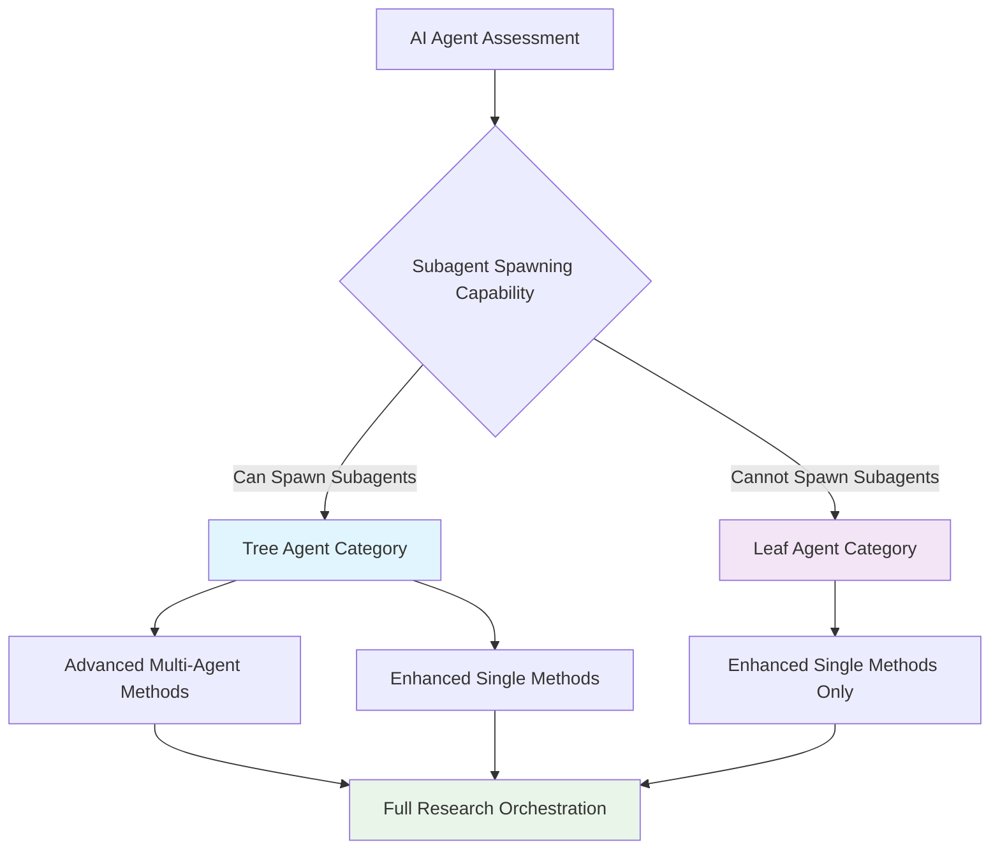
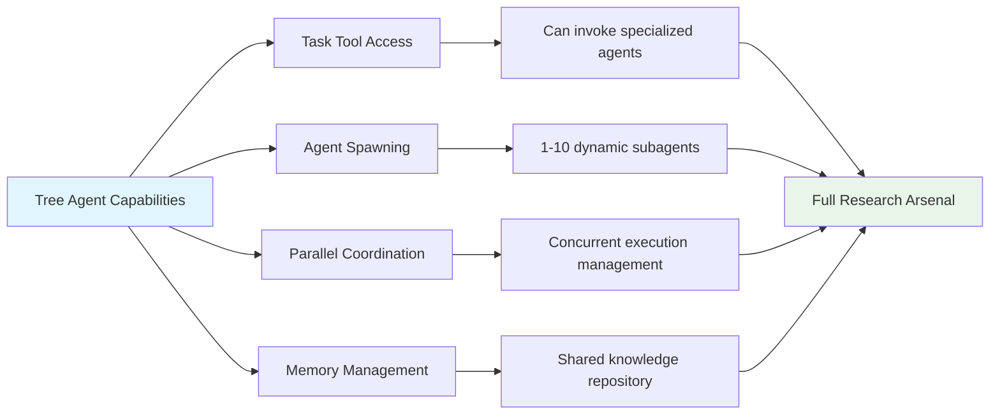
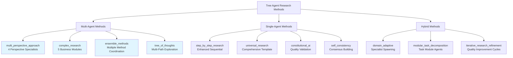
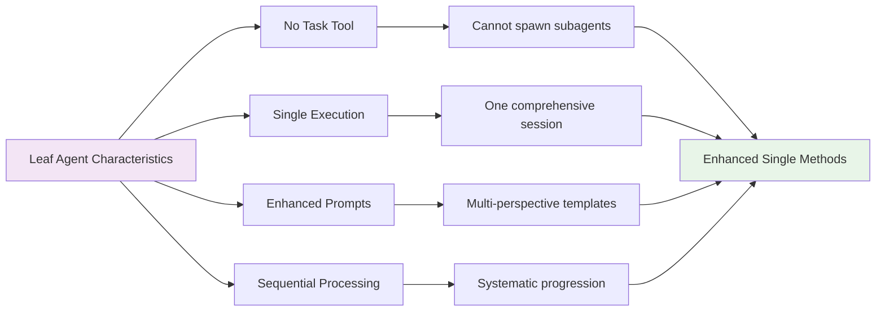
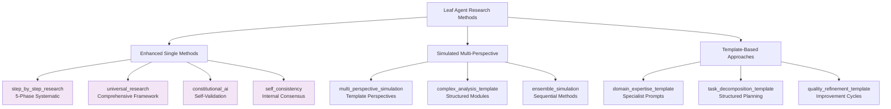
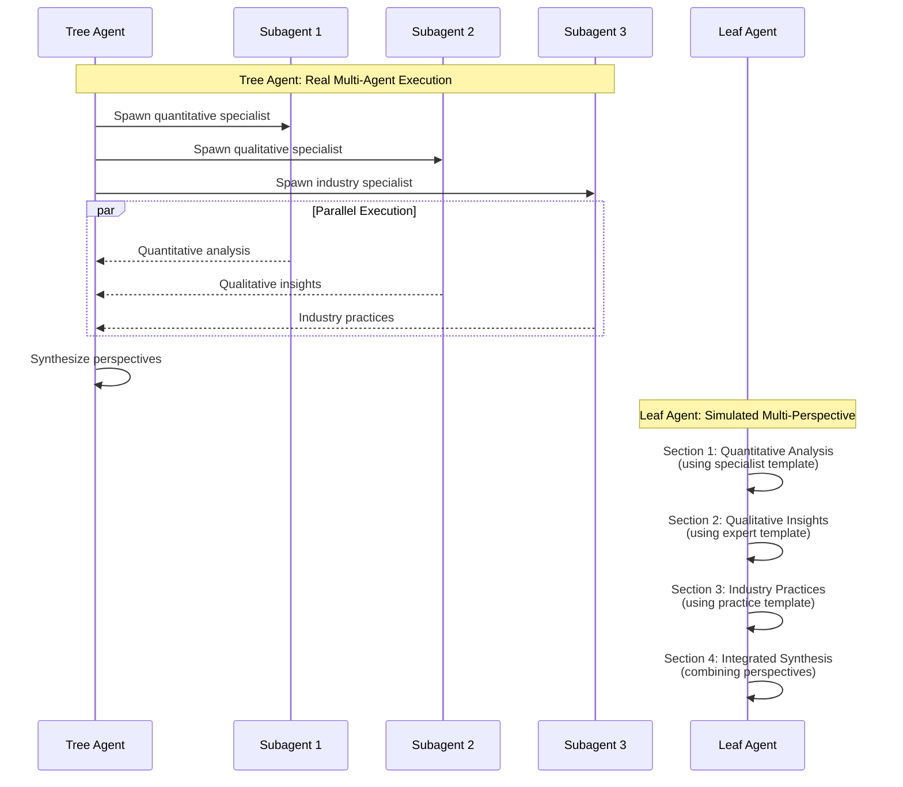
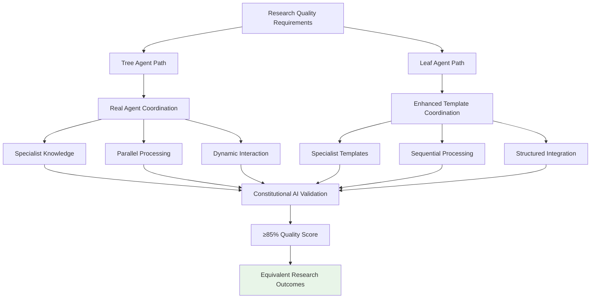
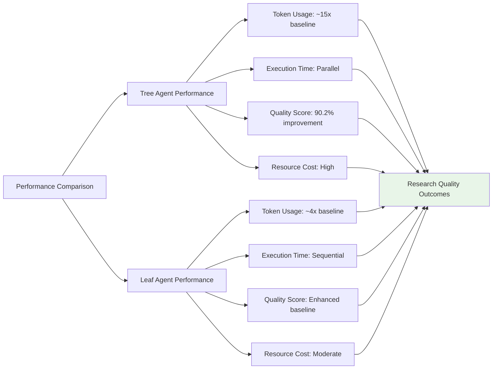
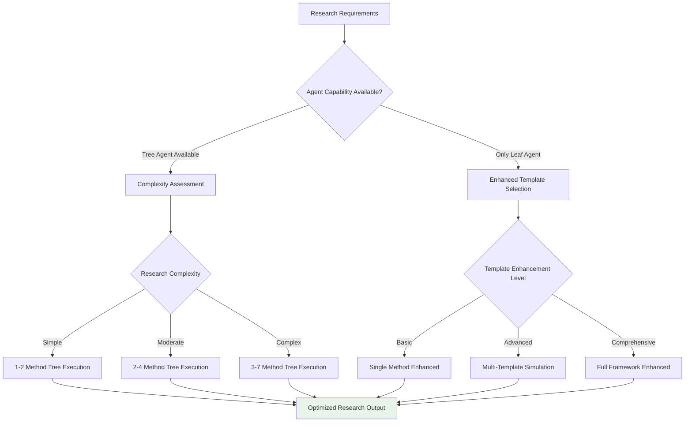
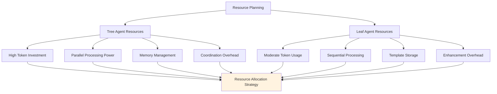

# Agent Capability Matrix

## Source References
**Claude Desktop Research**: Anthropic's capability analysis for different agent architectures  
**Method-Agent Integration**: Analysis of 15 research methods across execution modes  
**Tree-Leaf Architecture**: Universal compatibility framework for diverse agent capabilities

## Agent Classification Framework

The capability matrix categorizes AI agents based on their subagent spawning abilities and provides method compatibility guidance for optimal research execution.

## Tree Agents (Subagent-Capable)

### Characteristics and Capabilities

### Known Tree Agent Examples

| Agent | Environment | Subagent Limit | Coordination Style | Research Suitability |
|-------|-------------|----------------|-------------------|-------------------|
| **Claude Code** | CLI/Desktop | 1-10 agents | Lead orchestrator pattern | ⭐⭐⭐⭐⭐ Excellent |
| **SuperClaude** | Meta-framework | 3-7 agents | Method cluster coordination | ⭐⭐⭐⭐⭐ Excellent |
| **Advanced LLMs** | Custom frameworks | Variable | Implementation dependent | ⭐⭐⭐⭐ Very Good |
| **Custom Orchestrators** | Specialized environments | Configurable | Domain-specific patterns | ⭐⭐⭐ Good |

### Tree Agent Method Compatibility

## Leaf Agents (Non-Spawning)

### Characteristics and Limitations

### Known Leaf Agent Examples

| Agent | Environment | Template Support | Enhancement Level | Research Suitability |
|-------|-------------|------------------|------------------|-------------------|
| **Gemini** | Google AI Studio | Basic prompts | Comprehensive templates | ⭐⭐⭐⭐ Very Good |
| **Basic LLMs** | Limited environments | Simple templates | Enhanced instructions | ⭐⭐⭐ Good |
| **Constrained Systems** | Restricted access | Minimal templates | Basic guidance | ⭐⭐ Adequate |
| **Legacy Integrations** | Older frameworks | Manual prompts | Custom enhancement | ⭐⭐ Adequate |

### Leaf Agent Method Compatibility

## Method Execution Mapping

### Multi-Agent to Single-Agent Transformation

### Quality Equivalence Framework

## Capability-Method Compatibility Matrix

### Full Compatibility Chart

| Method | Tree Agent | Leaf Agent | Execution Mode | Quality Outcome |
|--------|------------|------------|----------------|-----------------|
| **multi_perspective_approach** | ✅ 4 Agents | ✅ 4 Templates | Parallel / Sequential | Equivalent |
| **complex_research** | ✅ 5 Modules | ✅ 5 Sections | Modular / Structured | Equivalent |
| **ensemble_methods** | ✅ Method Agents | ✅ Method Sequence | Coordinated / Linear | Equivalent |
| **tree_of_thoughts** | ✅ Path Agents | ✅ Path Template | Branching / Systematic | Equivalent |
| **step_by_step_research** | ✅ Enhanced | ✅ Native | Sequential / Sequential | Identical |
| **universal_research** | ✅ Enhanced | ✅ Native | Template / Template | Identical |
| **constitutional_ai** | ✅ Validation Agents | ✅ Self-Validation | Distributed / Internal | Equivalent |
| **self_consistency** | ✅ Consensus Agents | ✅ Internal Consensus | Parallel / Sequential | Equivalent |
| **domain_adaptive** | ✅ Domain Agents | ✅ Domain Templates | Specialized / Enhanced | Equivalent |
| **modular_task_decomposition** | ✅ Task Agents | ✅ Task Templates | Modular / Structured | Equivalent |
| **iterative_research_refinement** | ✅ Quality Agents | ✅ Quality Cycles | Iterative / Cyclical | Equivalent |
| **textgrad_iterative** | ✅ Feedback Agents | ✅ Feedback Loops | Interactive / Systematic | Equivalent |
| **adaptive_chain_of_thought** | ✅ Reasoning Agents | ✅ Reasoning Template | Dynamic / Structured | Equivalent |
| **domain_specific_research** | ✅ Expert Agents | ✅ Expert Templates | Specialized / Enhanced | Equivalent |
| **primary_research** | ✅ Enhanced | ✅ Native | Framework / Framework | Identical |

### Performance Characteristics

## Agent Selection Guidelines

### Selection Decision Framework

### Optimization Recommendations

#### For Tree Agents
1. **Leverage Parallel Processing**: Use multi-agent methods for complex research
2. **Dynamic Scaling**: Scale subagent count based on query complexity (1-10 agents)
3. **Specialized Coordination**: Assign domain-specific roles to subagents
4. **Memory Integration**: Use shared knowledge repository for cross-agent learning
5. **Quality Orchestration**: Implement constitutional AI validation across agents

#### For Leaf Agents
1. **Enhanced Template Usage**: Use comprehensive multi-perspective templates
2. **Systematic Progression**: Follow structured approaches like step-by-step research
3. **Quality Integration**: Apply constitutional AI self-validation
4. **Template Simulation**: Use enhanced prompts to simulate multi-agent perspectives
5. **Sequential Excellence**: Focus on depth over breadth in single execution

### Resource Planning

## Implementation Guidelines

### Tree Agent Implementation
1. **Capability Detection**: Verify Task tool availability and subagent limits
2. **Method Selection**: Choose multi-agent methods for complex research
3. **Orchestration Setup**: Configure lead orchestrator with specialized subagents
4. **Coordination Protocol**: Implement memory sharing and progress tracking
5. **Quality Assurance**: Apply distributed validation across agent network

### Leaf Agent Implementation
1. **Template Optimization**: Load comprehensive multi-perspective templates
2. **Enhancement Strategy**: Use specialist prompts for different perspectives
3. **Sequential Excellence**: Apply systematic progression through research phases
4. **Quality Integration**: Implement self-validation and consistency checking
5. **Simulation Fidelity**: Create equivalent research depth through enhanced prompts

### Universal Compatibility
1. **Agent Detection**: Automatically identify agent capabilities
2. **Method Adaptation**: Select appropriate execution mode for agent type
3. **Quality Standards**: Maintain equivalent research outcomes across agent types
4. **Resource Optimization**: Allocate resources based on agent capabilities
5. **Performance Monitoring**: Track quality and efficiency across implementations

This capability matrix ensures that research quality remains consistent across diverse AI agent architectures while optimizing resource usage and execution patterns for each agent type's unique capabilities.