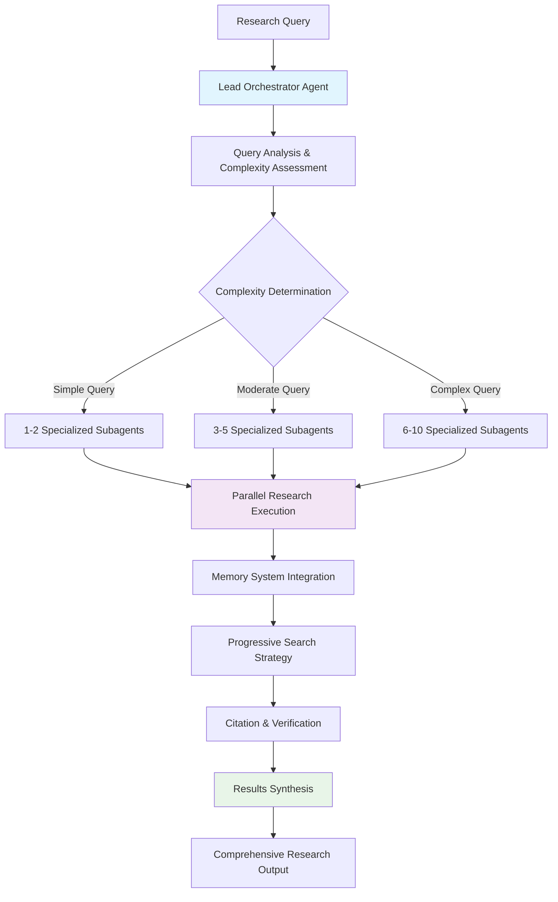
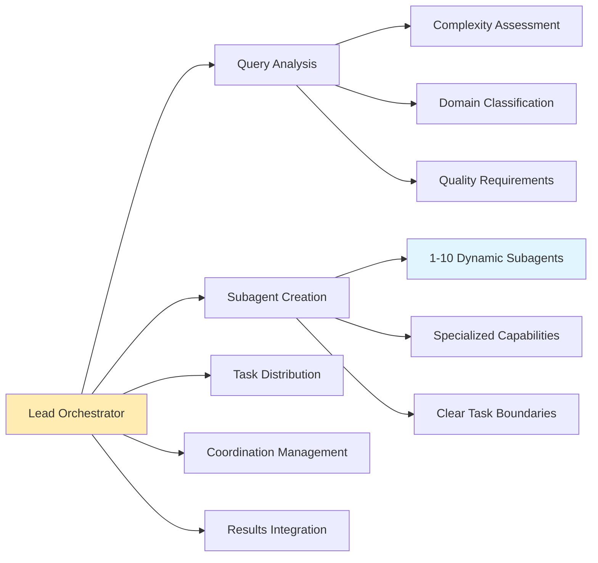
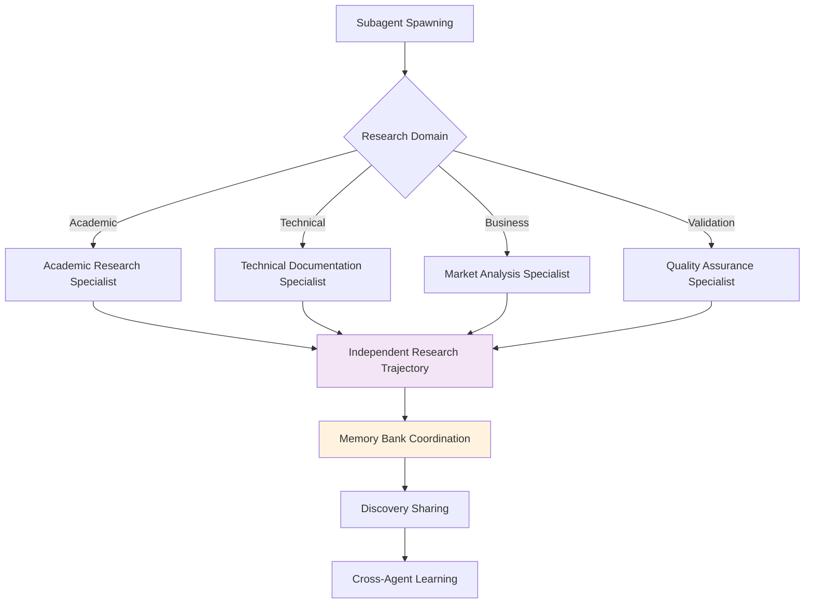
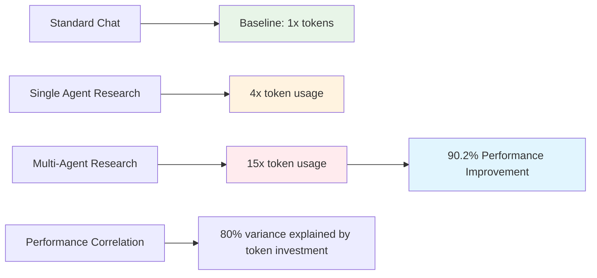
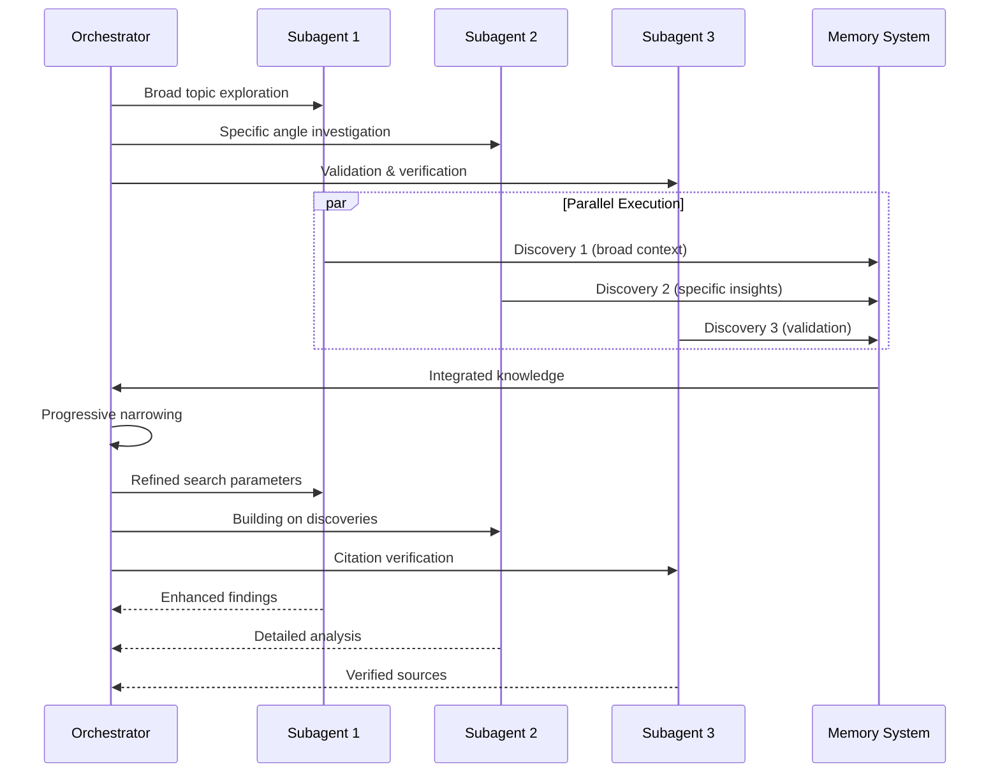
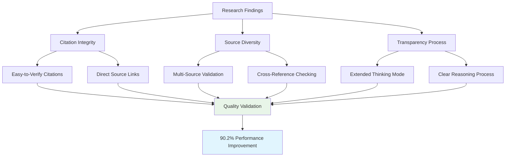
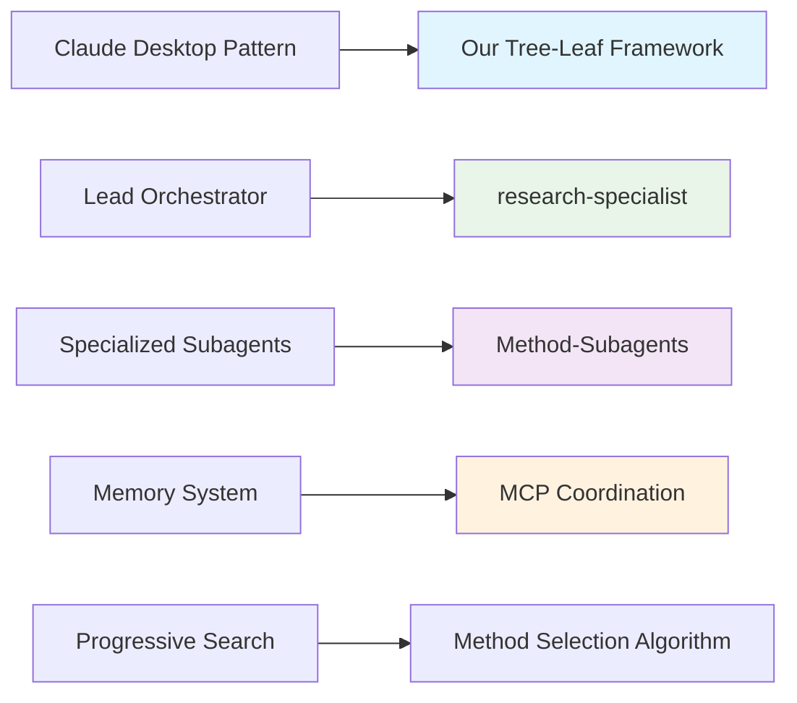

# Claude Desktop Research Pattern

## Source Reference
**Anthropic Engineering Documentation**: Official Claude Desktop research functionality implementation analysis  
**Performance Data**: 90.2% improvement over single-agent Claude Opus 4 in research evaluations  
**Token Analysis**: Multi-agent systems use ~15x more tokens than standard chats with 80% performance correlation

## Architecture Overview

Anthropic's proven orchestrator-worker pattern demonstrates how intelligent research coordination achieves significant performance improvements through specialized agent coordination.

## Core Components

### Lead Orchestrator Responsibilities

### Specialized Subagent Patterns

## Performance Architecture

### Token Usage Patterns

### Progressive Search Strategy

## Quality Assurance Framework

### Multi-Source Validation

## Key Performance Insights

### Orchestration Excellence
1. **Lead Orchestrator Pattern**: Single coordination point prevents complexity explosion
2. **Dynamic Scaling**: 1-10 agents based on query complexity prevents over-engineering  
3. **Memory Integration**: Shared knowledge repository enables cross-agent coordination
4. **Specialized Subagents**: Domain-specific agents provide deeper expertise than generalists

### Research Intelligence
1. **Agentic Behavior**: Autonomous decision-making about research direction and methodology
2. **Multi-Perspective Analysis**: Parallel investigation of different angles increases coverage
3. **Progressive Refinement**: Building knowledge through sequential discoveries improves depth
4. **Source Integration**: Comprehensive citation and verification systems ensure reliability

### Performance Optimization  
1. **Token Investment**: Higher token usage correlates strongly with research quality (80% variance)
2. **Parallel Execution**: Simultaneous investigation significantly improves breadth and speed
3. **Progressive Search**: Sequential building provides better results than single-shot research
4. **Citation Systems**: Verification infrastructure is essential for research credibility

## Implementation Implications

### For Our Research Framework
This proven architecture validates our tree-leaf approach:
- **Tree Agents**: Can implement full orchestrator-worker pattern with 1-7 method-subagents
- **Leaf Agents**: Use enhanced prompts to simulate multi-perspective analysis in single execution
- **Quality Standards**: Both paths achieve equivalent research outcomes through different coordination

### Architectural Alignment

This reference architecture demonstrates that sophisticated research coordination with measurable performance improvements is achievable through intelligent orchestration patterns that our framework successfully adapts to both tree and leaf agent capabilities.