# Tree-Leaf Architecture Overview

## Source References

**Claude Desktop Research Pattern**: Anthropic's orchestrator-worker pattern demonstrating 90.2% performance improvement
**Method-Agent Integration Analysis**: Discovery that research methods ARE the subagents in many cases
**Constitutional AI Framework**: Quality assurance and validation requirements for both execution paths

## Architecture Philosophy

The tree-leaf pattern solves a fundamental challenge: achieving equivalent research quality across AI agents with different subagent spawning capabilities.

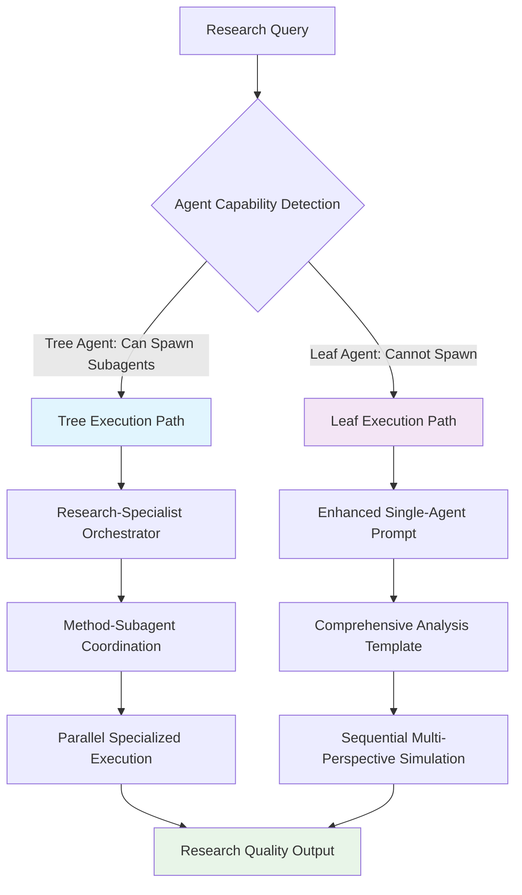

## Core Design Principles

### Universal Research Outcomes

Both execution paths achieve equivalent research quality through different coordination mechanisms:

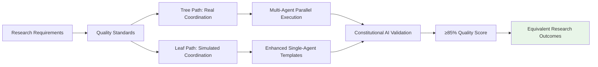

### Capability Detection Framework

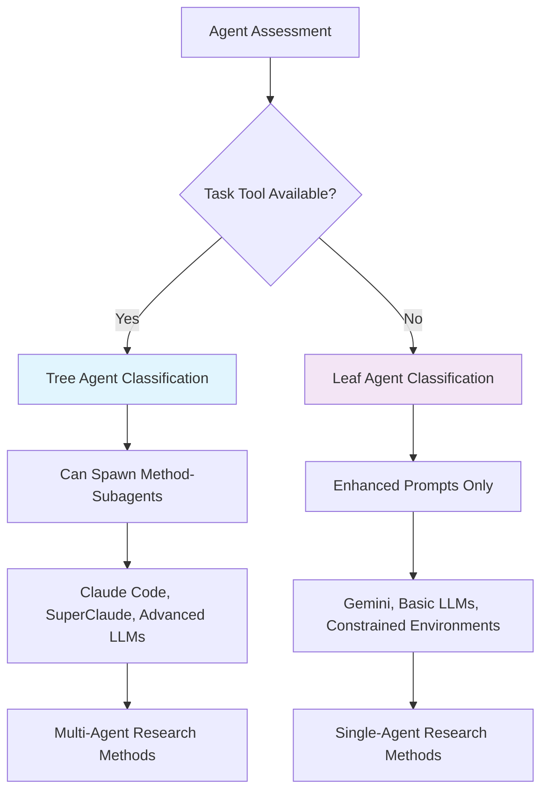

## Tree Execution Architecture

### Research-Specialist to Method-Subagent Coordination

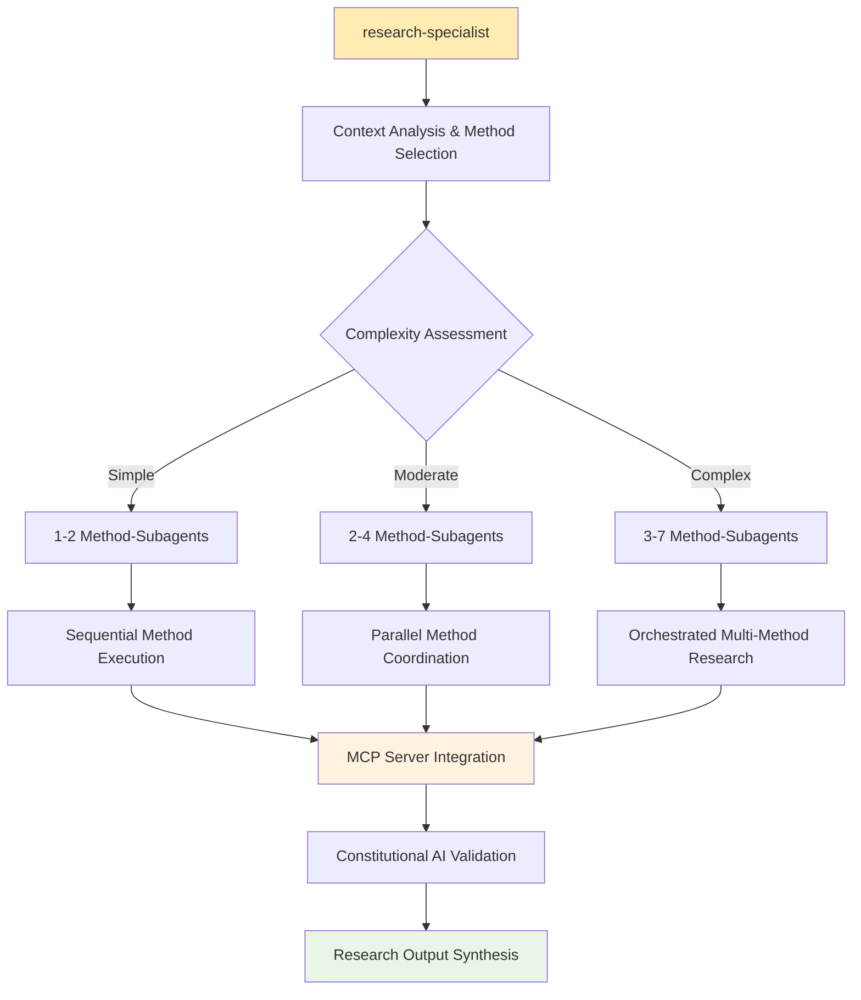

### Method-Subagent Spawning Pattern

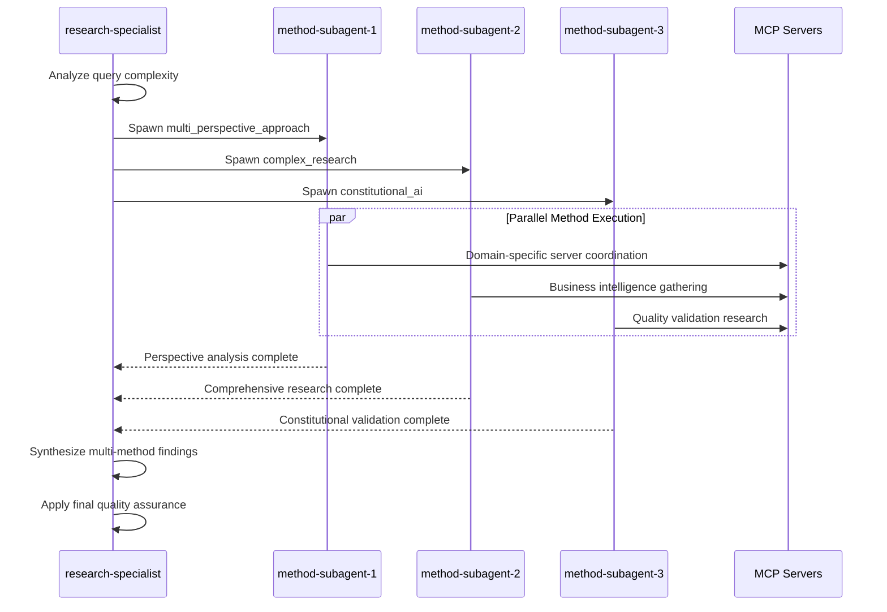

## Leaf Execution Architecture

### Enhanced Single-Agent Research Pattern

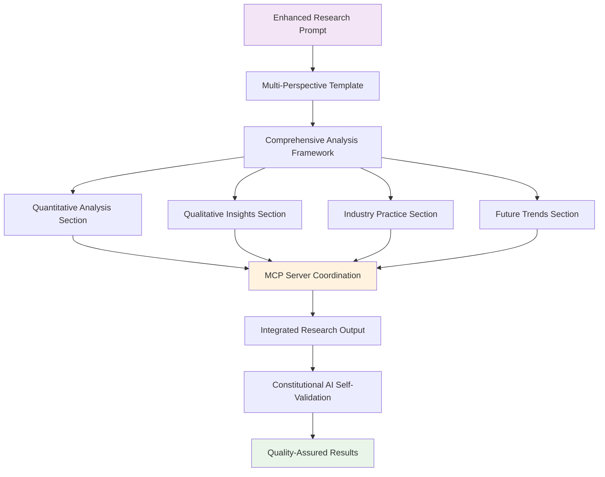

### Template-Based Multi-Perspective Simulation

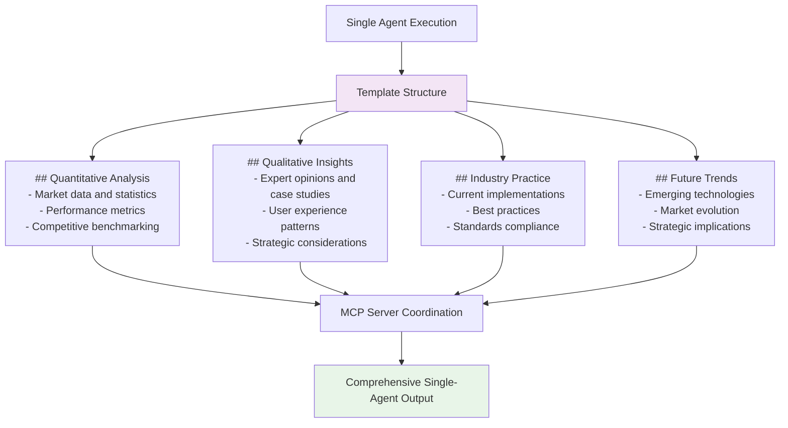

## Method Execution Patterns

### Multi-Agent Methods (Tree-Compatible)

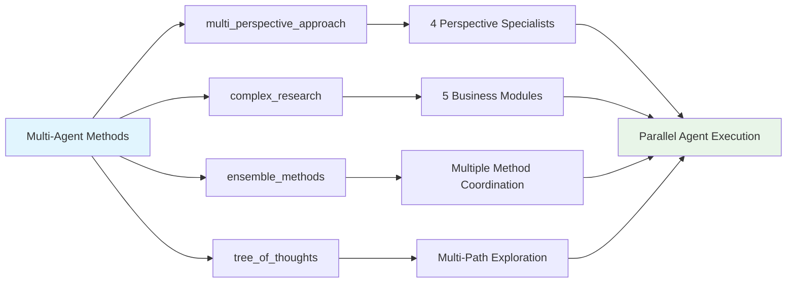

### Single-Agent Methods (Leaf-Compatible)

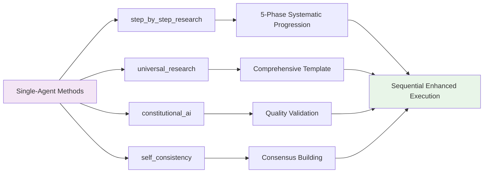

### Hybrid Methods (Adaptive)

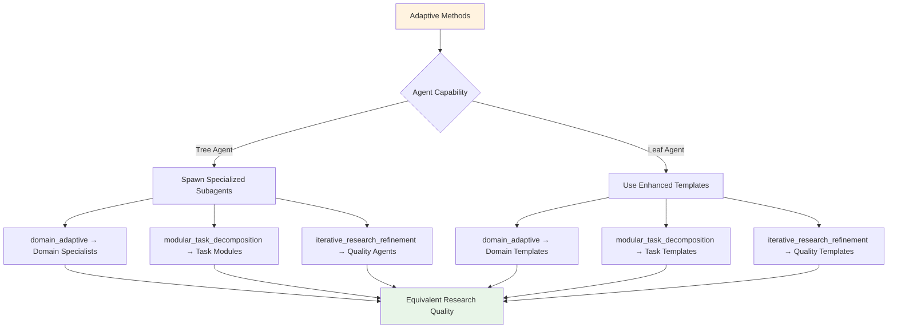

## Quality Assurance Framework

### Constitutional AI Validation (Both Paths)

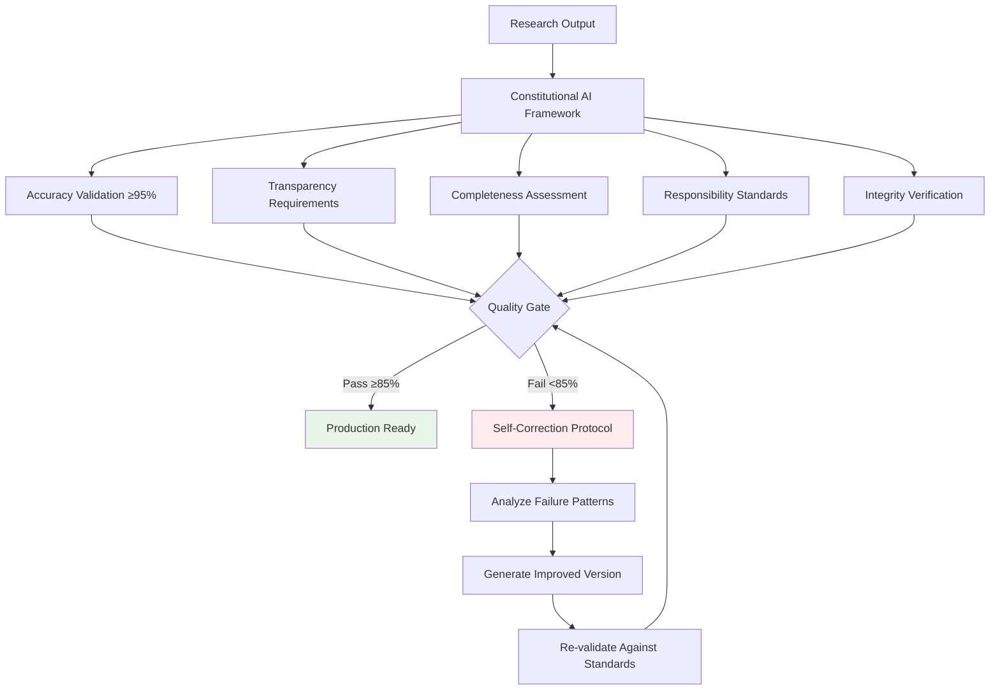

### MCP Intelligence Coordination

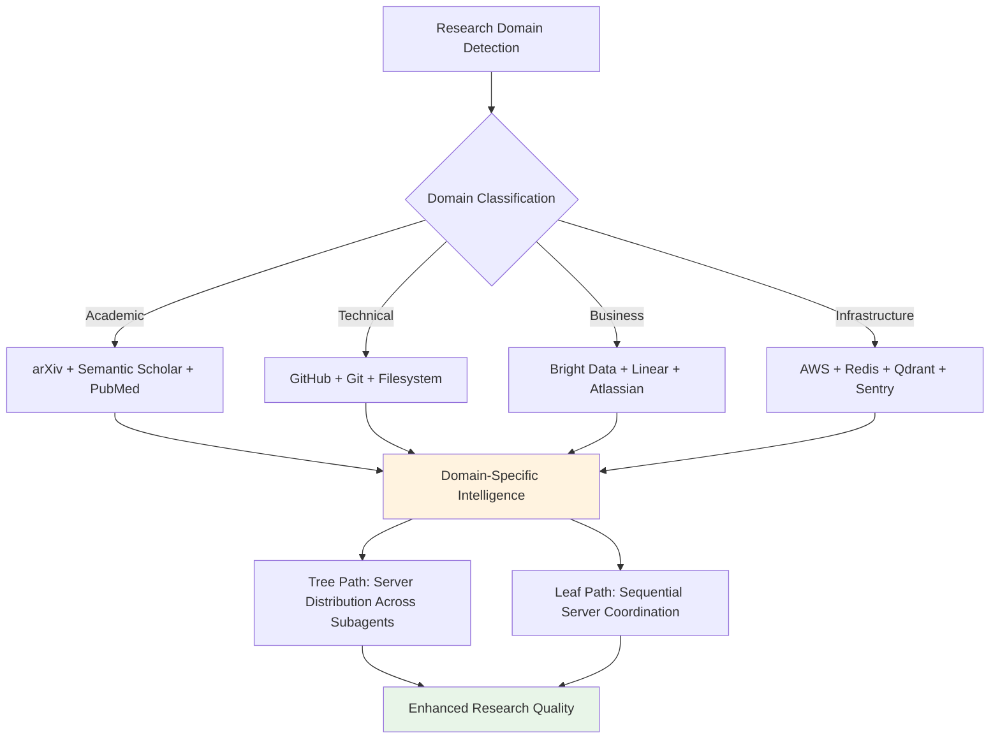

## Performance Optimization

### Resource Allocation Strategy

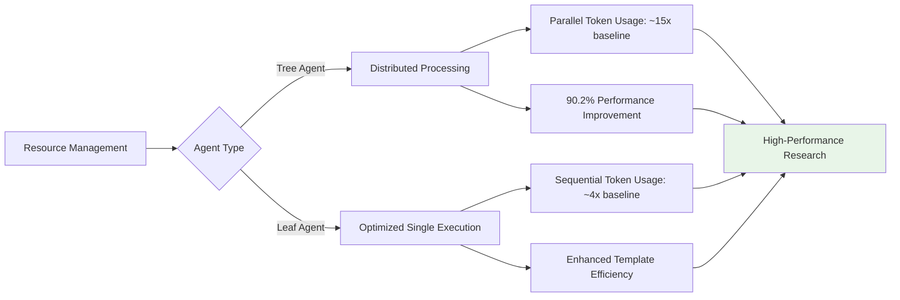

### Scalability Architecture

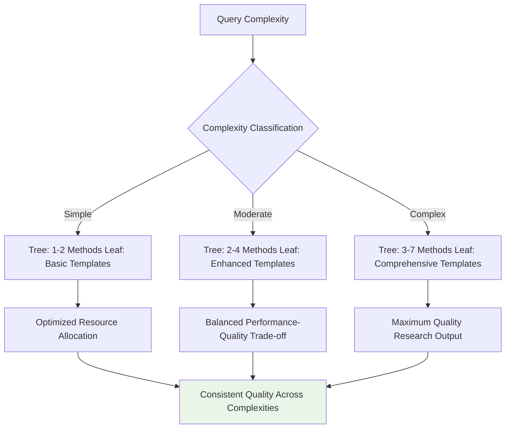

## Implementation Benefits

### Development Advantages

1. **Universal Compatibility**: Single framework works across all agent types
2. **Quality Consistency**: Equivalent research outcomes regardless of execution path
3. **Resource Optimization**: Appropriate resource allocation based on agent capabilities
4. **Maintainability**: Clear separation between coordination and execution logic

### Research Excellence

1. **Constitutional Compliance**: ≥85% quality scores with built-in validation
2. **MCP Intelligence**: Domain-specific server coordination for enhanced research quality
3. **Progressive Quality**: Self-improvement protocols with failure analysis and correction
4. **Comprehensive Coverage**: 15 research methods covering all complexity levels and domains

### Operational Efficiency

1. **Automatic Detection**: Agent capabilities detected and utilized optimally
2. **Seamless Execution**: No configuration changes needed between agent types
3. **Quality Assurance**: Built-in validation prevents quality degradation
4. **Performance Monitoring**: Continuous assessment and optimization opportunities

This tree-leaf architecture demonstrates that sophisticated research coordination with measurable quality outcomes is achievable across diverse AI agent capabilities through intelligent adaptation patterns and constitutional compliance frameworks.
