# Complex Research Flow

## Source References
**Claude Desktop Research**: Anthropic's orchestrator patterns for complex queries (6-10 specialized agents)  
**Method Selection Algorithm**: Context analysis for comprehensive research requirements  
**Tree-Leaf Architecture**: Universal execution paths for complex multi-domain research

## Complex Research Characteristics

Complex research addresses comprehensive multi-domain questions requiring orchestrated analysis across 3-7 specialized methods with sophisticated validation, cross-method integration, and strategic synthesis.

### Complexity Indicators
- **Multi-domain integration** (technology + business + strategic + operational)
- **Comprehensive analysis** requiring systematic coverage of all relevant aspects
- **Strategic decision support** with significant organizational or technical implications
- **Quality requirements** demanding rigorous validation and cross-verification
- **Integration complexity** requiring sophisticated synthesis of diverse perspectives
- **Stakeholder impact** affecting multiple groups or organizational levels

## Complex Research Orchestration Pattern

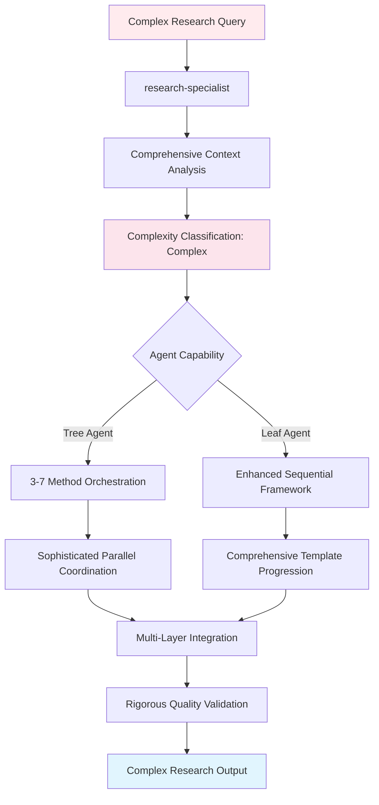

## Tree Agent Execution (3-7 Methods)

### Advanced Multi-Method Orchestration

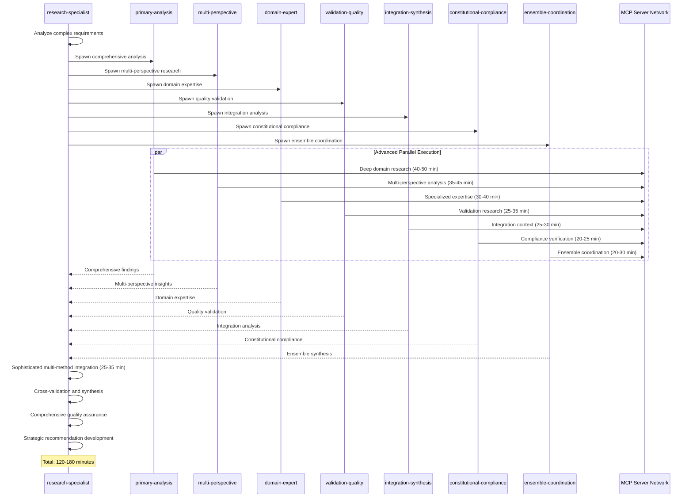

### Complex Research Method Combinations

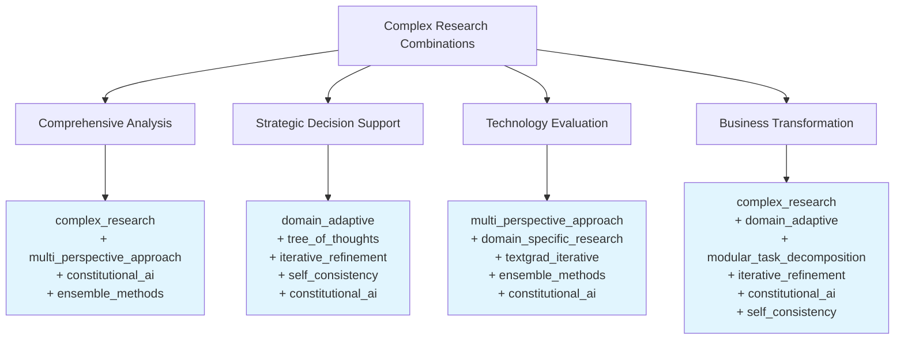

## Leaf Agent Execution (Enhanced Sequential Framework)

### Comprehensive Multi-Stage Template Progression

```mermaid
flowchart TD
    A[Enhanced Sequential Framework] --> B[Multi-Stage Orchestration]
    B --> C[Progressive Enhancement Strategy]
    
    C --> D[Stage 1: Foundation Analysis<br/>• Comprehensive domain template<br/>• Deep information architecture<br/>• Strategic context development<br/>Duration: 25-30 minutes]
    
    D --> E[Stage 2: Multi-Perspective Exploration<br/>• 4 perspective templates<br/>• Quantitative, qualitative, industry, future<br/>• Cross-perspective validation<br/>Duration: 40-50 minutes]
    
    E --> F[Stage 3: Domain Expertise Integration<br/>• Specialized domain templates<br/>• Expert context integration<br/>• Technical deep-dive<br/>Duration: 20-30 minutes]
    
    F --> G[Stage 4: Quality & Validation<br/>• Constitutional AI template<br/>• Self-consistency checking<br/>• Comprehensive validation<br/>Duration: 15-25 minutes]
    
    G --> H[Stage 5: Integration & Synthesis<br/>• Cross-stage synthesis template<br/>• Strategic recommendation<br/>• Implementation planning<br/>Duration: 20-25 minutes]
    
    H --> I[Stage 6: Final Enhancement<br/>• Quality refinement template<br/>• Final validation<br/>• Output optimization<br/>Duration: 10-15 minutes]
    
    I --> J[Complex Research Output]
    
    style D fill:#f3e5f5
    style E fill:#f3e5f5
    style F fill:#f3e5f5
    style G fill:#f3e5f5
    style H fill:#f3e5f5
    style I fill:#f3e5f5
    style J fill:#e8f5e8
```

### Template Sophistication Architecture

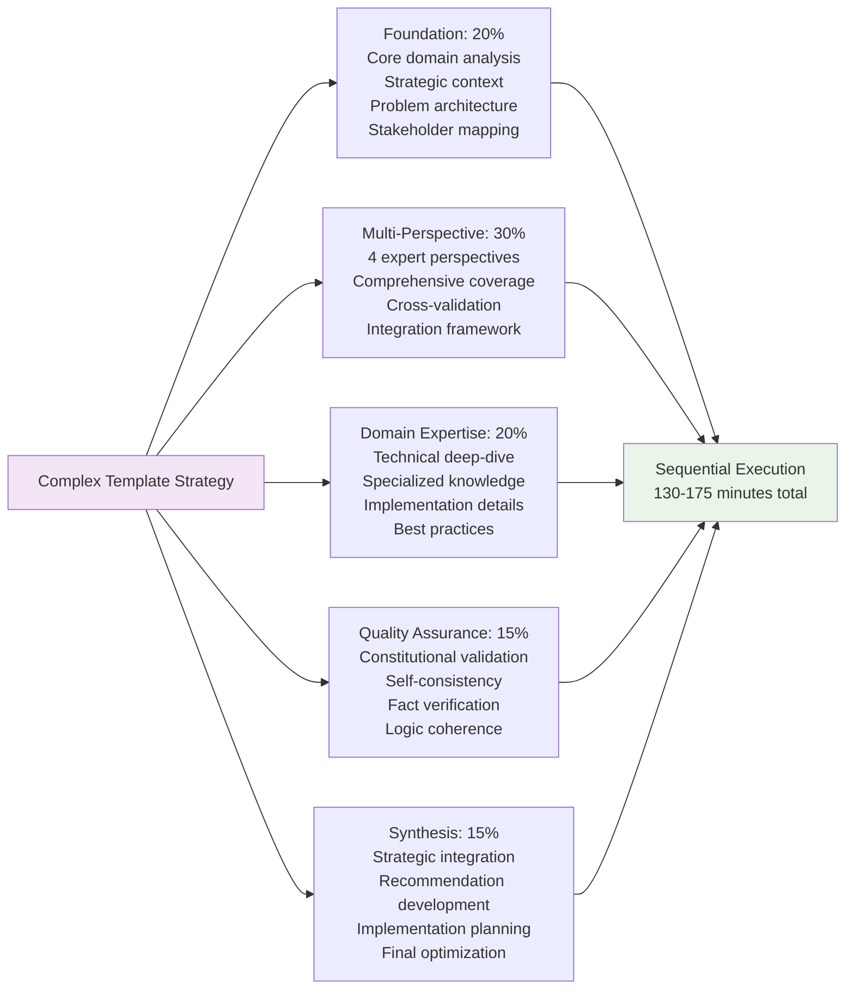

## Advanced Method Integration Patterns

### Complex Research Method Orchestration

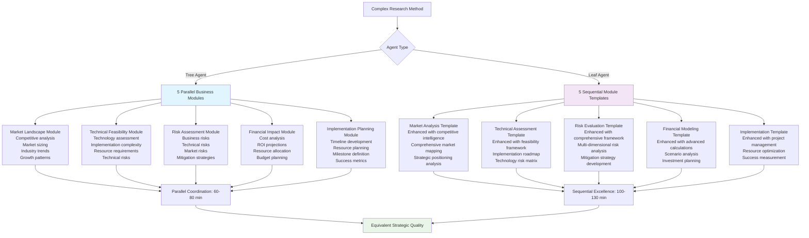

### Multi-Perspective Method Integration

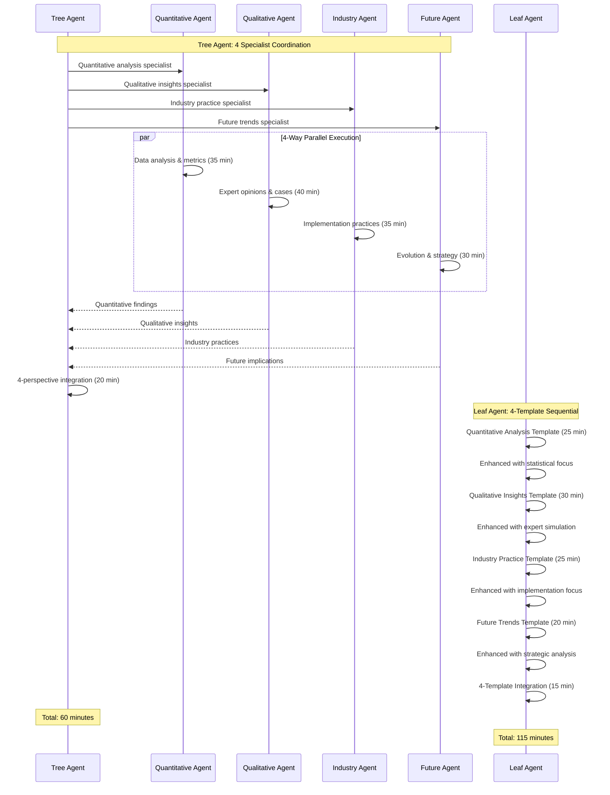

## Resource Allocation for Complex Research

### Tree Agent Advanced Resource Management

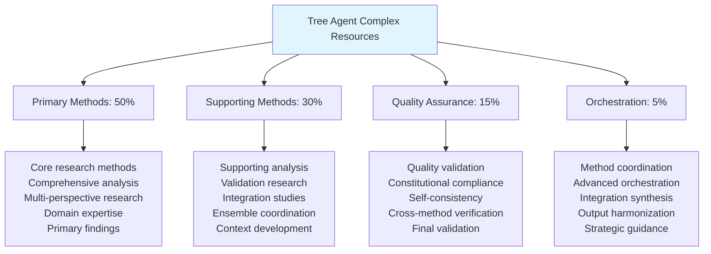

### Leaf Agent Sequential Resource Optimization

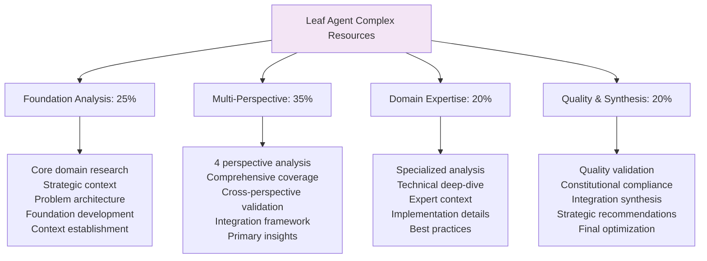

## Advanced Quality Standards for Complex Research

### Comprehensive Validation Framework

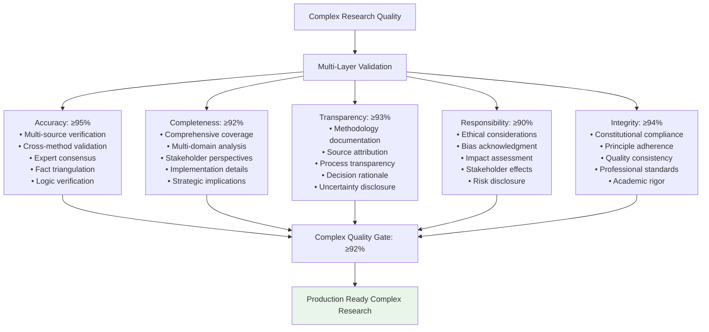

### Cross-Method Integration Validation

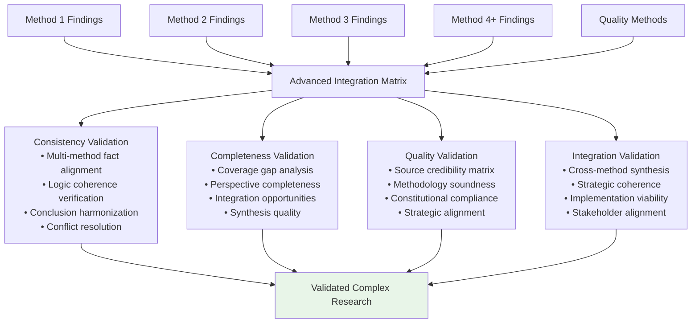

## Comprehensive MCP Server Orchestration

### Advanced Multi-Domain Server Coordination

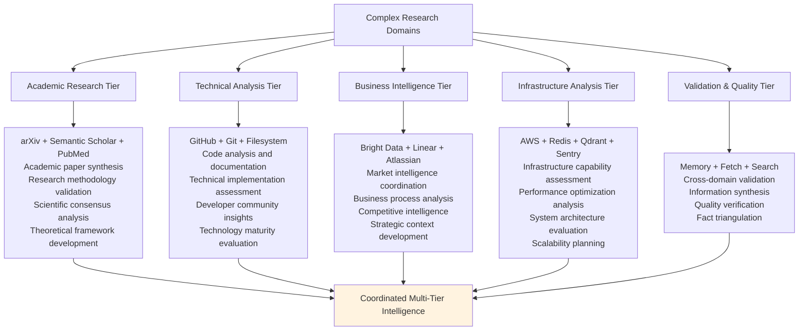

### Advanced Server Coordination Sequence

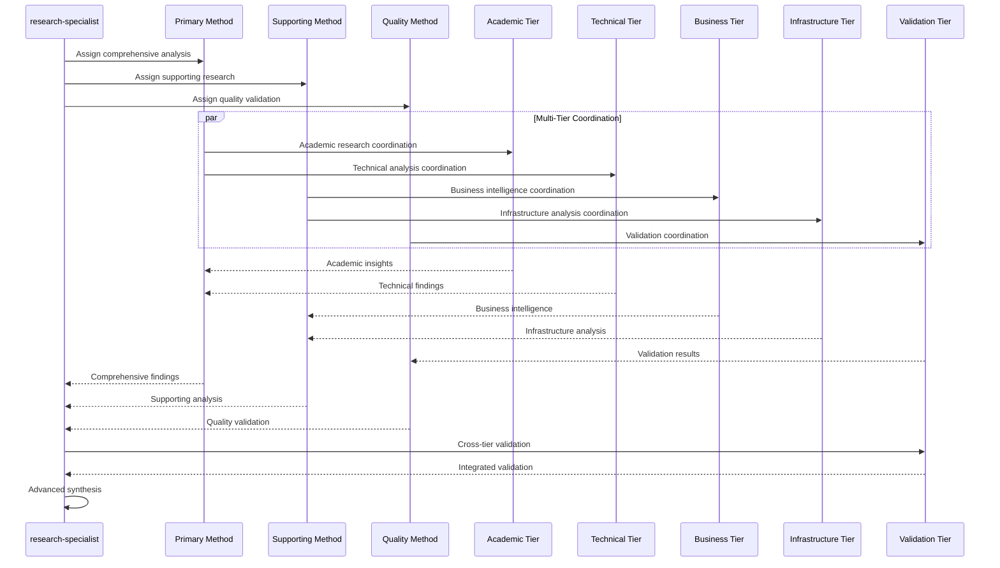

## Performance Metrics and Success Criteria

### Complex Research Excellence Framework

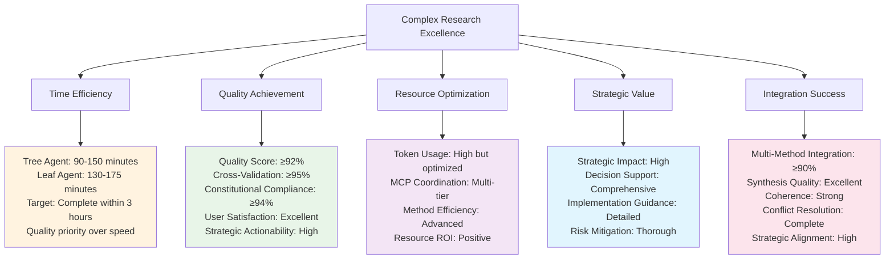

## Complex Research Application Examples

### Enterprise Technology Strategy
- **"Develop comprehensive AI adoption strategy for enterprise software company"**
  - Methods: complex_research + multi_perspective_approach + domain_adaptive + constitutional_ai + ensemble_methods
  - Duration: 120-160 minutes
  - Domains: Technology assessment, business impact, risk analysis, implementation planning, competitive positioning

### Market Entry Analysis
- **"Evaluate entry strategy for European fintech market with regulatory compliance"**
  - Methods: complex_research + tree_of_thoughts + iterative_refinement + self_consistency + constitutional_ai
  - Duration: 130-170 minutes
  - Domains: Market analysis, regulatory landscape, competitive analysis, operational planning, risk assessment

### Digital Transformation Strategy
- **"Design comprehensive digital transformation roadmap for traditional manufacturing company"**
  - Methods: multi_perspective_approach + domain_adaptive + modular_task_decomposition + textgrad_iterative + constitutional_ai + ensemble_methods
  - Duration: 140-180 minutes
  - Domains: Technology integration, operational transformation, change management, financial planning, timeline coordination

## Advanced Error Handling and Quality Recovery

### Complex Research Failure Management

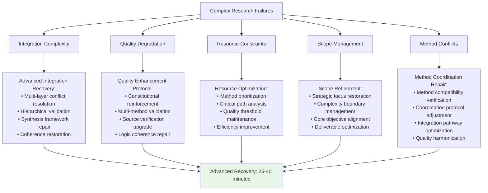

## Implementation Guidelines

### For Tree Agents
1. **Advanced Orchestration**: Use 3-7 methods with sophisticated coordination protocols
2. **Parallel Excellence**: Leverage advanced concurrent execution with cross-method integration
3. **Quality Assurance**: Apply comprehensive multi-layer validation across all methods
4. **Strategic Synthesis**: Ensure high-level integration maintains strategic coherence
5. **Resource Management**: Optimize token usage across complex method coordination

### For Leaf Agents
1. **Sequential Mastery**: Use advanced progression through sophisticated template frameworks
2. **Template Sophistication**: Apply domain-expert level templates with comprehensive enhancement
3. **Integration Excellence**: Emphasize high-quality synthesis across sequential stages
4. **Quality Rigor**: Apply systematic validation throughout multi-stage execution
5. **Strategic Focus**: Maintain strategic coherence throughout extended sequential processing

### Universal Principles
1. **Complexity Management**: Maintain sophisticated analysis while ensuring practical actionability
2. **Quality Excellence**: Achieve ≥92% validation score across all quality dimensions
3. **Strategic Value**: Deliver high-impact insights supporting major decisions
4. **Time Management**: Complete within 3-hour target while prioritizing quality over speed
5. **Integration Mastery**: Ensure sophisticated synthesis of multiple methods and perspectives

This complex research flow demonstrates advanced coordination patterns for comprehensive multi-domain analysis while maintaining quality excellence across different agent capabilities and sophisticated execution approaches.