# Moderate Research Flow

## Source References
**Claude Desktop Research**: Anthropic's orchestrator patterns for moderate complexity (3-5 specialized agents)  
**Method Selection Algorithm**: Context analysis for balanced research requirements  
**Tree-Leaf Architecture**: Universal execution paths for moderate complexity research

## Moderate Research Characteristics

Moderate research addresses multi-faceted questions requiring coordinated analysis across 2-4 specialized areas with systematic validation and cross-perspective integration.

### Complexity Indicators
- **Multi-domain analysis** (technology + business, technical + strategic)
- **Comparative evaluation** requiring multiple perspectives or methodologies
- **Strategic implications** beyond simple factual gathering
- **Quality requirements** needing systematic validation and cross-checking
- **Integration needs** with existing knowledge or systems

## Moderate Research Orchestration Pattern

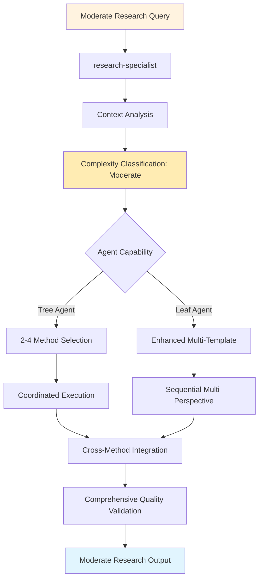

## Tree Agent Execution (2-4 Methods)

### Multi-Method Coordination Pattern

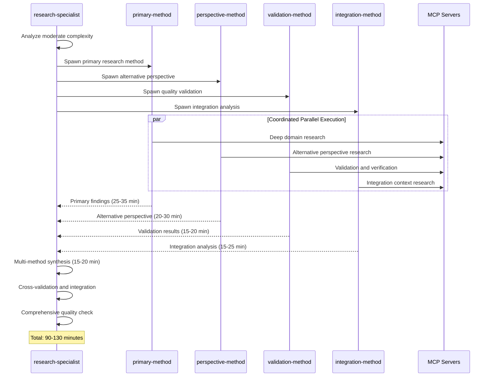

### Common Moderate Research Method Combinations

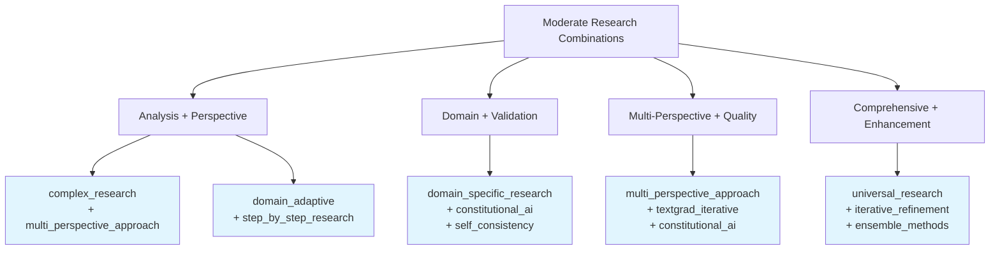

## Leaf Agent Execution (Enhanced Multi-Template)

### Sequential Multi-Perspective Approach

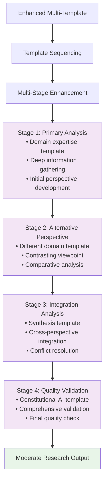

### Template Coordination Strategy

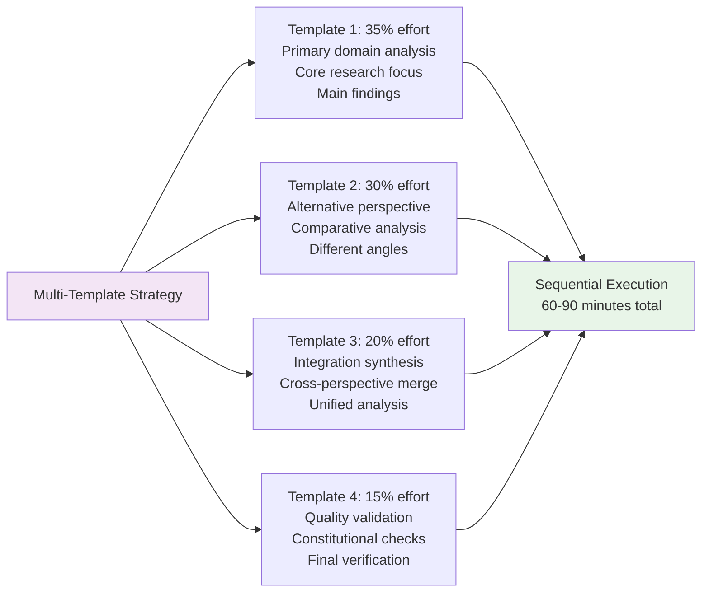

## Method-Specific Moderate Research Patterns

### Multi-Perspective Approach (Tree vs Leaf)

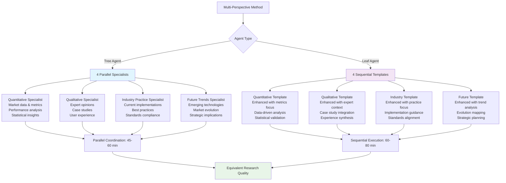

### Complex Research Method (Tree vs Leaf)

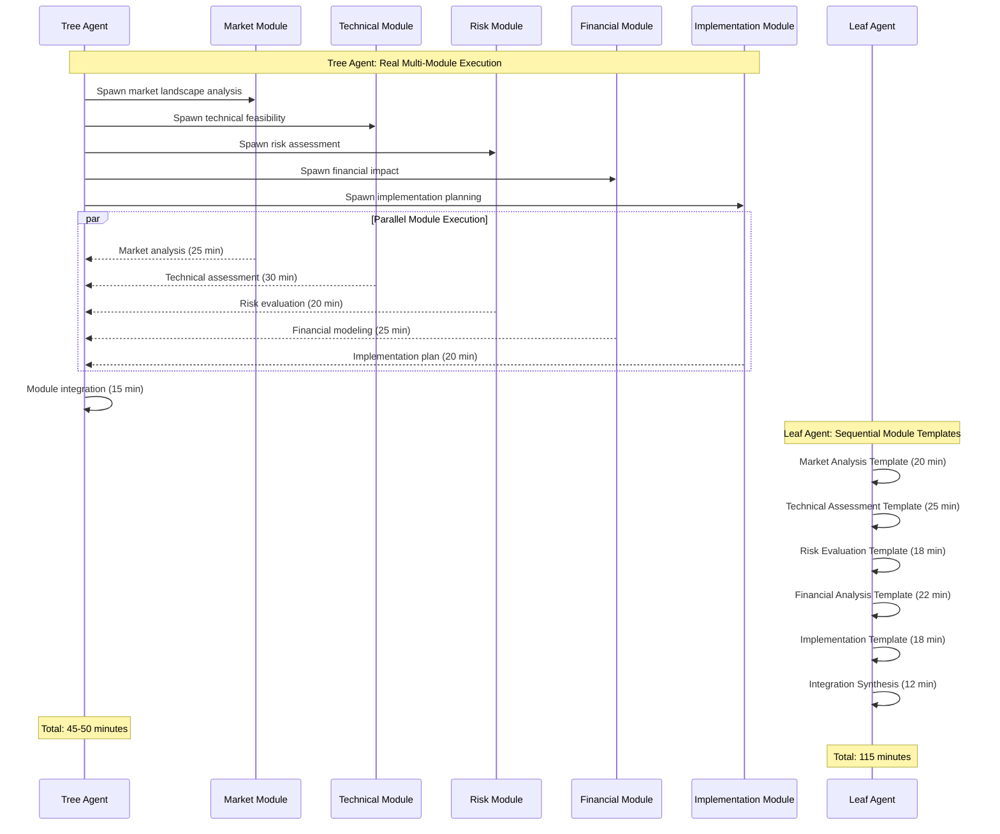

## Resource Allocation for Moderate Research

### Tree Agent Resource Distribution

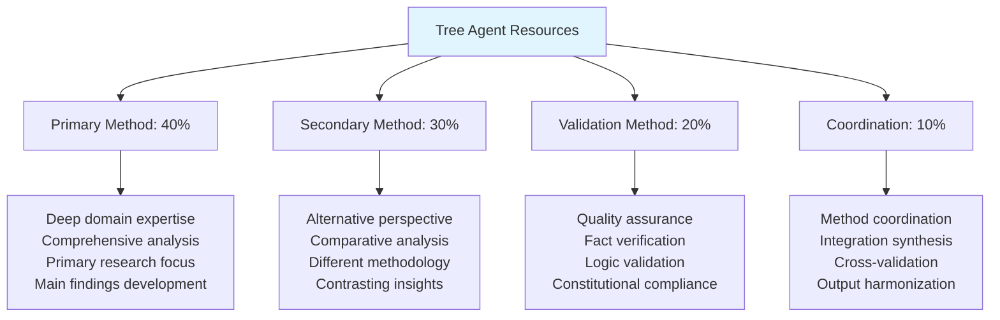

### Leaf Agent Resource Distribution

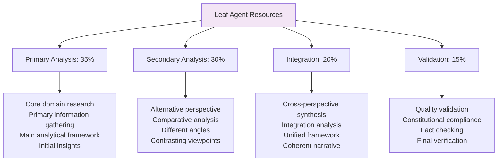

## Quality Standards for Moderate Research

### Enhanced Validation Framework

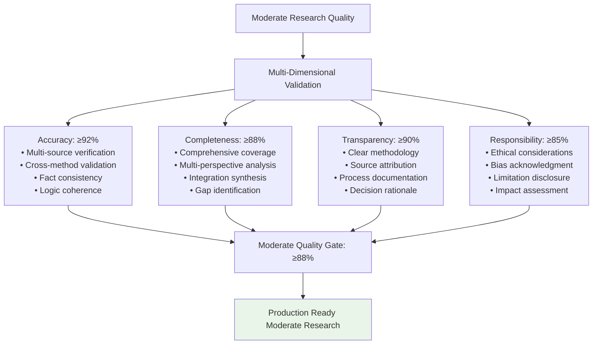

### Cross-Method Validation Pattern

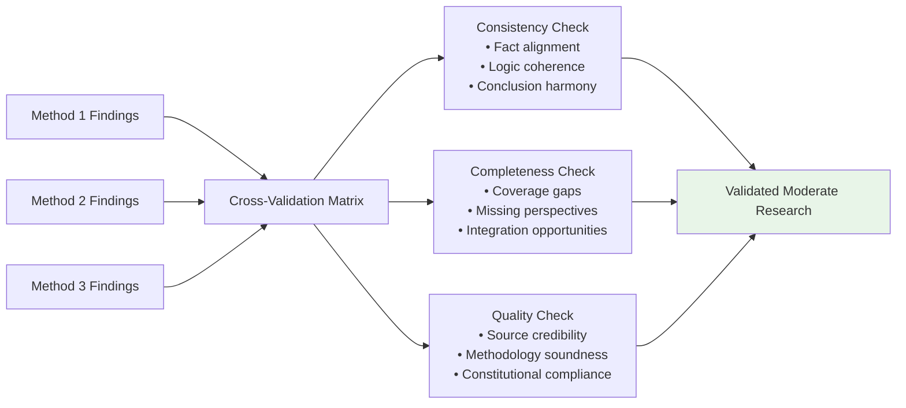

## MCP Server Coordination for Moderate Research

### Domain-Specific Server Mapping

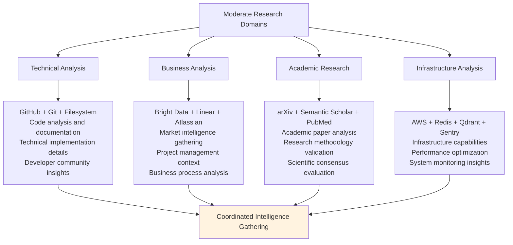

### Server Coordination Patterns

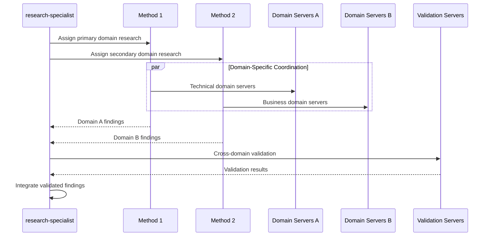

## Performance Metrics and Success Criteria

### Moderate Research Success Framework

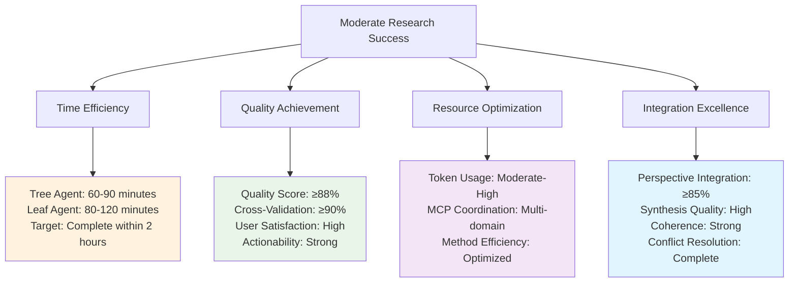

## Common Moderate Research Examples

### Technology + Business Analysis
- **"Should we adopt GraphQL for our e-commerce platform?"**
  - Methods: complex_research + multi_perspective_approach + constitutional_ai
  - Duration: 75-105 minutes
  - Domains: Technical feasibility, business impact, implementation complexity

### Strategic Decision Support
- **"What is the optimal cloud migration strategy for our microservices?"**
  - Methods: domain_adaptive + ensemble_methods + iterative_refinement
  - Duration: 90-120 minutes
  - Domains: Infrastructure, cost analysis, risk assessment, timeline planning

### Comparative Technology Evaluation
- **"React vs Vue.js vs Angular for enterprise application development"**
  - Methods: multi_perspective_approach + self_consistency + constitutional_ai
  - Duration: 80-110 minutes
  - Domains: Technical capabilities, ecosystem maturity, team expertise, business fit

## Error Handling and Quality Recovery

### Moderate Research Failure Patterns

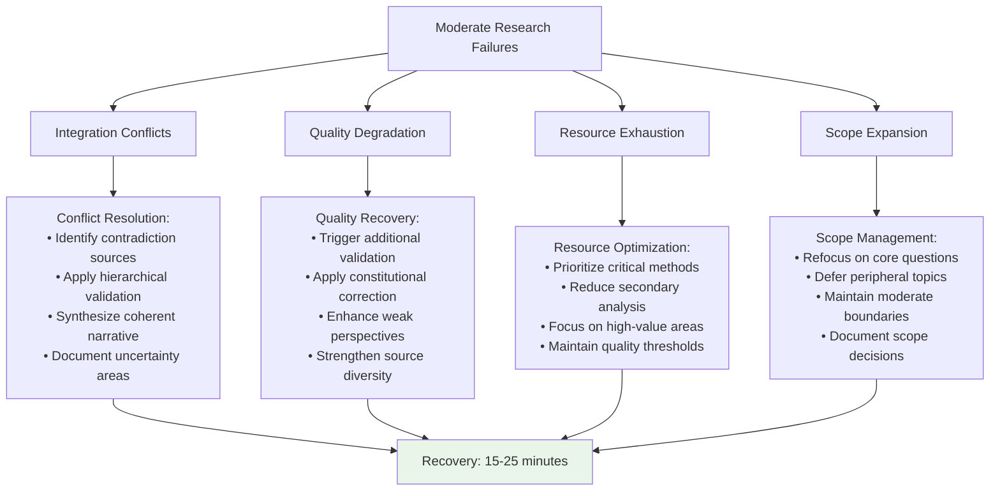

## Implementation Guidelines

### For Tree Agents
1. **Balanced Orchestration**: Use 2-4 methods with clear role differentiation
2. **Parallel Efficiency**: Leverage concurrent execution while managing coordination complexity
3. **Cross-Method Integration**: Ensure findings synthesis maintains coherence
4. **Quality Assurance**: Apply comprehensive validation across multiple perspectives

### For Leaf Agents
1. **Sequential Excellence**: Use structured progression through multiple enhanced templates
2. **Template Sophistication**: Apply domain-specific templates with advanced enhancement
3. **Integration Focus**: Emphasize synthesis quality in cross-template coordination
4. **Validation Rigor**: Apply systematic quality checks throughout sequential execution

### Universal Principles
1. **Scope Management**: Maintain moderate complexity boundaries while ensuring comprehensive coverage
2. **Quality Standards**: Achieve ≥88% validation score across all quality dimensions
3. **Time Management**: Complete within 2-hour target while maintaining quality standards
4. **Integration Excellence**: Ensure coherent synthesis of multiple perspectives and methodologies

This moderate research flow demonstrates sophisticated coordination patterns for multi-faceted queries while maintaining quality equivalence across different agent capabilities and execution approaches.