# Research Orchestration Patterns

## Source References
**Claude Desktop Research**: Anthropic's proven orchestration patterns with 90.2% performance improvement  
**Tree-Leaf Architecture**: Universal coordination frameworks for diverse agent capabilities  
**Method Framework**: 15-method research orchestrator with constitutional AI compliance

## Orchestration Architecture Overview

Research orchestration patterns define how the research-specialist coordinates multiple methods, manages resources, and ensures quality outcomes across different complexity levels and agent capabilities.

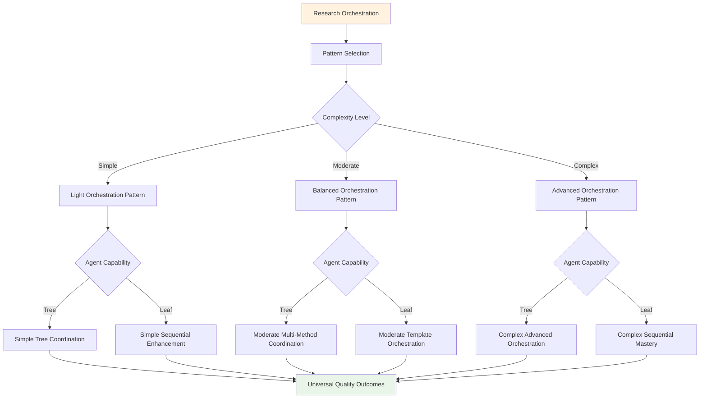
```mermaid
graph TD
    A[Research Orchestration] --> B[Pattern Selection]
    B --> C{Complexity Level}
    
    C -->|Simple| D[Light Orchestration Pattern]
    C -->|Moderate| E[Balanced Orchestration Pattern]
    C -->|Complex| F[Advanced Orchestration Pattern]
    
    D --> G{Agent Capability}
    E --> H{Agent Capability}
    F --> I{Agent Capability}
    
    G -->|Tree| J[Simple Tree Coordination]
    G -->|Leaf| K[Simple Sequential Enhancement]
    
    H -->|Tree| L[Moderate Multi-Method Coordination]
    H -->|Leaf| M[Moderate Template Orchestration]
    
    I -->|Tree| N[Complex Advanced Orchestration]
    I -->|Leaf| O[Complex Sequential Mastery]
    
    J --> P[Universal Quality Outcomes]
    K --> P
    L --> P
    M --> P
    N --> P
    O --> P
    
    style A fill:#fff3e0
    style P fill:#e8f5e8
```

## Core Orchestration Patterns

### 1. Lead Orchestrator Pattern (Tree Agents)

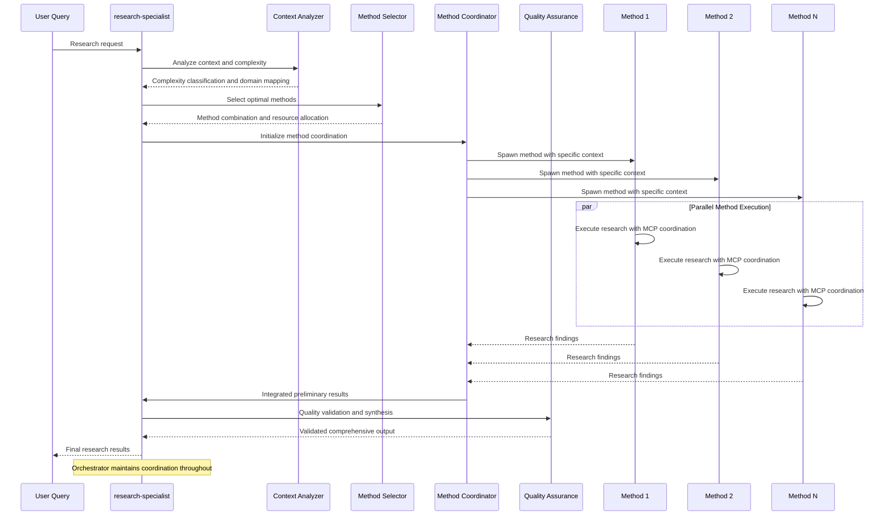
```mermaid
sequenceDiagram
    participant User as User Query
    participant RS as research-specialist
    participant CA as Context Analyzer
    participant MS as Method Selector
    participant MC as Method Coordinator
    participant QA as Quality Assurance
    participant M1 as Method 1
    participant M2 as Method 2
    participant MN as Method N
    
    User->>RS: Research request
    RS->>CA: Analyze context and complexity
    CA-->>RS: Complexity classification and domain mapping
    
    RS->>MS: Select optimal methods
    MS-->>RS: Method combination and resource allocation
    
    RS->>MC: Initialize method coordination
    MC->>M1: Spawn method with specific context
    MC->>M2: Spawn method with specific context
    MC->>MN: Spawn method with specific context
    
    par Parallel Method Execution
        M1->>M1: Execute research with MCP coordination
        M2->>M2: Execute research with MCP coordination
        MN->>MN: Execute research with MCP coordination
    end
    
    M1-->>MC: Research findings
    M2-->>MC: Research findings
    MN-->>MC: Research findings
    
    MC->>RS: Integrated preliminary results
    RS->>QA: Quality validation and synthesis
    QA-->>RS: Validated comprehensive output
    
    RS-->>User: Final research results
    
    Note over RS: Orchestrator maintains coordination throughout
```

### 2. Enhanced Sequential Pattern (Leaf Agents)

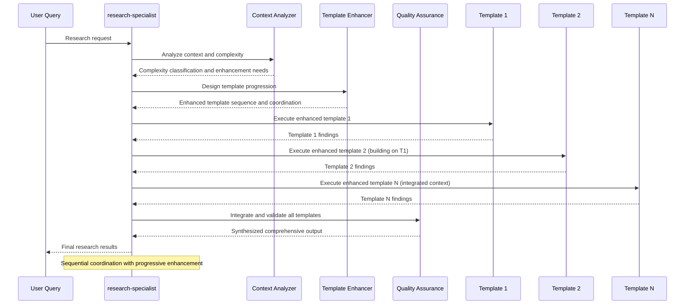
```mermaid
sequenceDiagram
    participant User as User Query
    participant RS as research-specialist
    participant CA as Context Analyzer
    participant TE as Template Enhancer
    participant QA as Quality Assurance
    participant T1 as Template 1
    participant T2 as Template 2
    participant TN as Template N
    
    User->>RS: Research request
    RS->>CA: Analyze context and complexity
    CA-->>RS: Complexity classification and enhancement needs
    
    RS->>TE: Design template progression
    TE-->>RS: Enhanced template sequence and coordination
    
    RS->>T1: Execute enhanced template 1
    T1-->>RS: Template 1 findings
    
    RS->>T2: Execute enhanced template 2 (building on T1)
    T2-->>RS: Template 2 findings
    
    RS->>TN: Execute enhanced template N (integrated context)
    TN-->>RS: Template N findings
    
    RS->>QA: Integrate and validate all templates
    QA-->>RS: Synthesized comprehensive output
    
    RS-->>User: Final research results
    
    Note over RS: Sequential coordination with progressive enhancement
```

## Orchestration Patterns by Complexity

### Simple Research Orchestration

#### Tree Agent Simple Coordination

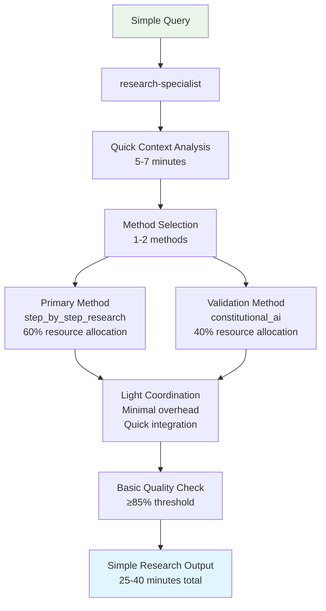
```mermaid
graph TD
    A[Simple Query] --> B[research-specialist]
    B --> C[Quick Context Analysis<br/>5-7 minutes]
    C --> D[Method Selection<br/>1-2 methods]
    
    D --> E[Primary Method<br/>step_by_step_research<br/>60% resource allocation]
    
    D --> F[Validation Method<br/>constitutional_ai<br/>40% resource allocation]
    
    E --> G[Light Coordination<br/>Minimal overhead<br/>Quick integration]
    F --> G
    
    G --> H[Basic Quality Check<br/>≥85% threshold]
    H --> I[Simple Research Output<br/>25-40 minutes total]
    
    style A fill:#e8f5e8
    style I fill:#e1f5fe
```

#### Leaf Agent Simple Enhancement

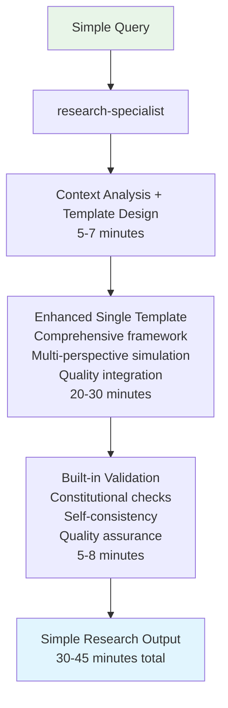
```mermaid
flowchart TD
    A[Simple Query] --> B[research-specialist]
    B --> C[Context Analysis + Template Design<br/>5-7 minutes]
    
    C --> D[Enhanced Single Template<br/>Comprehensive framework<br/>Multi-perspective simulation<br/>Quality integration<br/>20-30 minutes]
    
    D --> E[Built-in Validation<br/>Constitutional checks<br/>Self-consistency<br/>Quality assurance<br/>5-8 minutes]
    
    E --> F[Simple Research Output<br/>30-45 minutes total]
    
    style A fill:#e8f5e8
    style F fill:#e1f5fe
```

### Moderate Research Orchestration

#### Tree Agent Moderate Coordination

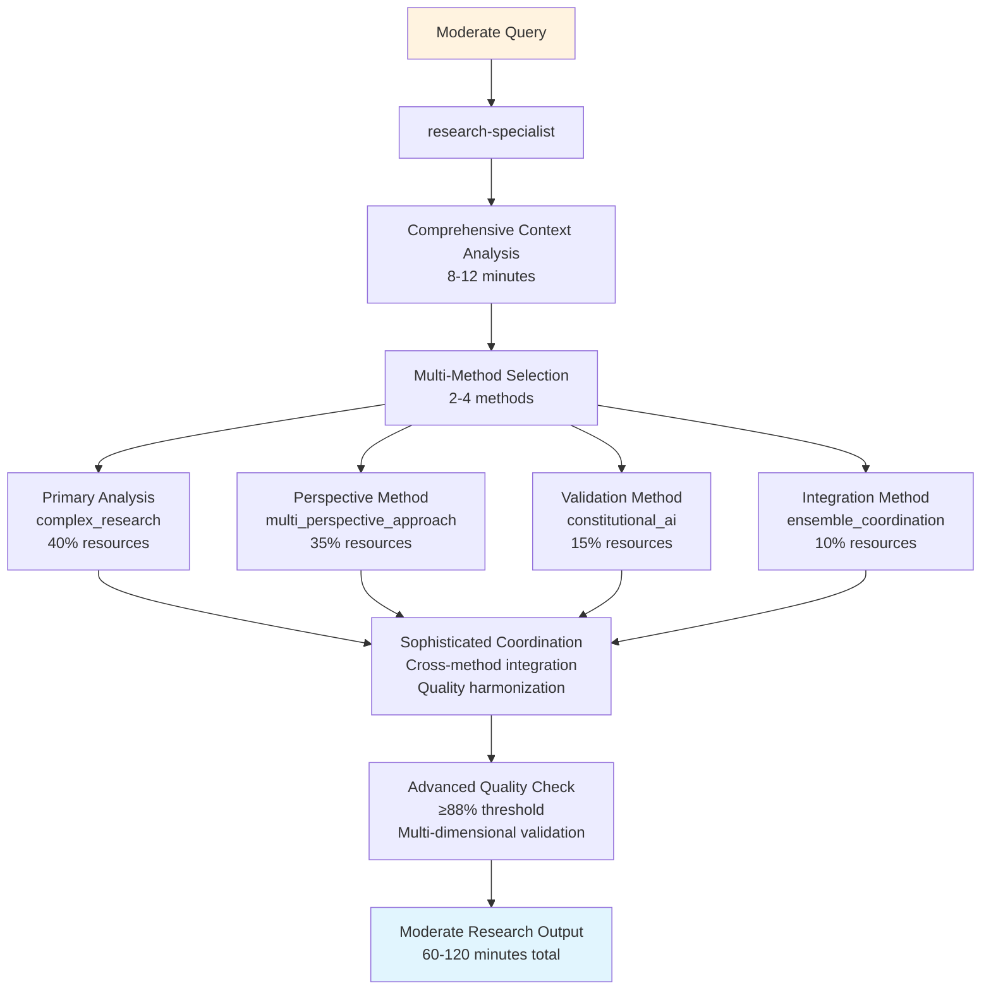
```mermaid
graph TD
    A[Moderate Query] --> B[research-specialist]
    B --> C[Comprehensive Context Analysis<br/>8-12 minutes]
    C --> D[Multi-Method Selection<br/>2-4 methods]
    
    D --> E[Primary Analysis<br/>complex_research<br/>40% resources]
    
    D --> F[Perspective Method<br/>multi_perspective_approach<br/>35% resources]
    
    D --> G[Validation Method<br/>constitutional_ai<br/>15% resources]
    
    D --> H[Integration Method<br/>ensemble_coordination<br/>10% resources]
    
    E --> I[Sophisticated Coordination<br/>Cross-method integration<br/>Quality harmonization]
    F --> I
    G --> I
    H --> I
    
    I --> J[Advanced Quality Check<br/>≥88% threshold<br/>Multi-dimensional validation]
    J --> K[Moderate Research Output<br/>60-120 minutes total]
    
    style A fill:#fff3e0
    style K fill:#e1f5fe
```

#### Leaf Agent Moderate Template Orchestration

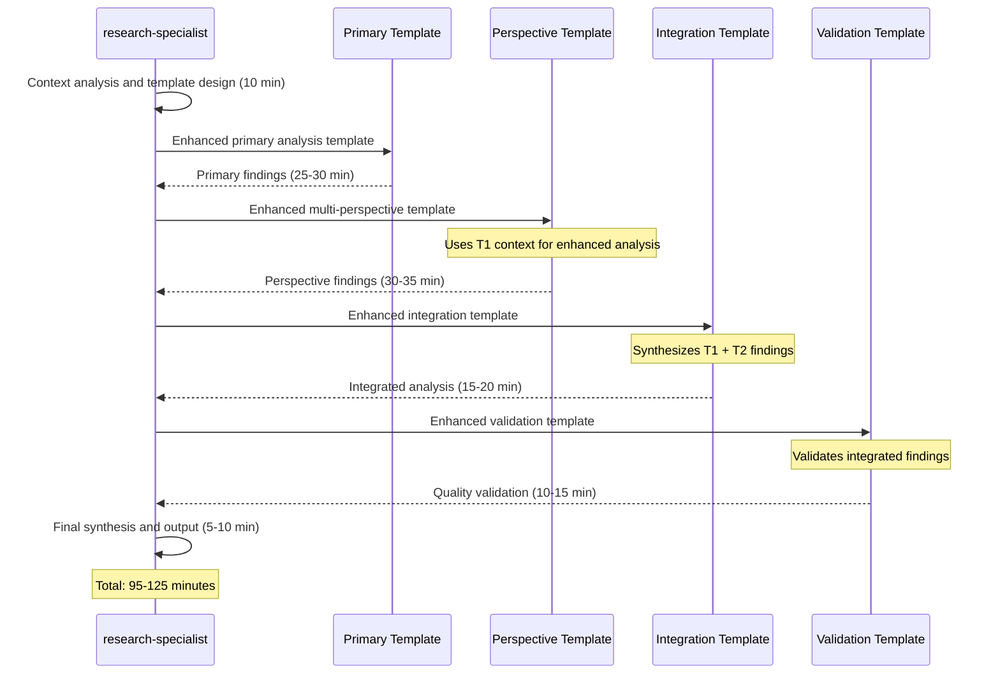
```mermaid
sequenceDiagram
    participant RS as research-specialist
    participant T1 as Primary Template
    participant T2 as Perspective Template
    participant T3 as Integration Template
    participant T4 as Validation Template
    
    RS->>RS: Context analysis and template design (10 min)
    
    RS->>T1: Enhanced primary analysis template
    T1-->>RS: Primary findings (25-30 min)
    
    RS->>T2: Enhanced multi-perspective template
    Note over T2: Uses T1 context for enhanced analysis
    T2-->>RS: Perspective findings (30-35 min)
    
    RS->>T3: Enhanced integration template
    Note over T3: Synthesizes T1 + T2 findings
    T3-->>RS: Integrated analysis (15-20 min)
    
    RS->>T4: Enhanced validation template
    Note over T4: Validates integrated findings
    T4-->>RS: Quality validation (10-15 min)
    
    RS->>RS: Final synthesis and output (5-10 min)
    
    Note over RS: Total: 95-125 minutes
```

### Complex Research Orchestration

#### Tree Agent Complex Advanced Orchestration

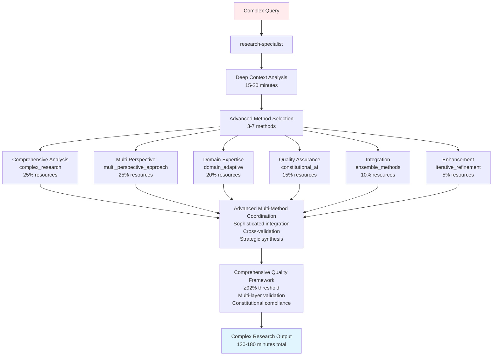
```mermaid
graph TD
    A[Complex Query] --> B[research-specialist]
    B --> C[Deep Context Analysis<br/>15-20 minutes]
    C --> D[Advanced Method Selection<br/>3-7 methods]
    
    D --> E[Comprehensive Analysis<br/>complex_research<br/>25% resources]
    
    D --> F[Multi-Perspective<br/>multi_perspective_approach<br/>25% resources]
    
    D --> G[Domain Expertise<br/>domain_adaptive<br/>20% resources]
    
    D --> H[Quality Assurance<br/>constitutional_ai<br/>15% resources]
    
    D --> I[Integration<br/>ensemble_methods<br/>10% resources]
    
    D --> J[Enhancement<br/>iterative_refinement<br/>5% resources]
    
    E --> K[Advanced Multi-Method Coordination<br/>Sophisticated integration<br/>Cross-validation<br/>Strategic synthesis]
    F --> K
    G --> K
    H --> K
    I --> K
    J --> K
    
    K --> L[Comprehensive Quality Framework<br/>≥92% threshold<br/>Multi-layer validation<br/>Constitutional compliance]
    
    L --> M[Complex Research Output<br/>120-180 minutes total]
    
    style A fill:#ffebee
    style M fill:#e1f5fe
```

#### Leaf Agent Complex Sequential Mastery

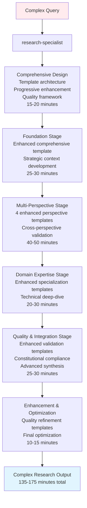
```mermaid
flowchart TD
    A[Complex Query] --> B[research-specialist]
    B --> C[Comprehensive Design<br/>Template architecture<br/>Progressive enhancement<br/>Quality framework<br/>15-20 minutes]
    
    C --> D[Foundation Stage<br/>Enhanced comprehensive template<br/>Strategic context development<br/>25-30 minutes]
    
    D --> E[Multi-Perspective Stage<br/>4 enhanced perspective templates<br/>Cross-perspective validation<br/>40-50 minutes]
    
    E --> F[Domain Expertise Stage<br/>Enhanced specialization templates<br/>Technical deep-dive<br/>20-30 minutes]
    
    F --> G[Quality & Integration Stage<br/>Enhanced validation templates<br/>Constitutional compliance<br/>Advanced synthesis<br/>25-30 minutes]
    
    G --> H[Enhancement & Optimization<br/>Quality refinement templates<br/>Final optimization<br/>10-15 minutes]
    
    H --> I[Complex Research Output<br/>135-175 minutes total]
    
    style A fill:#ffebee
    style I fill:#e1f5fe
```

## Method Coordination Patterns

### Parallel Coordination (Tree Agents)

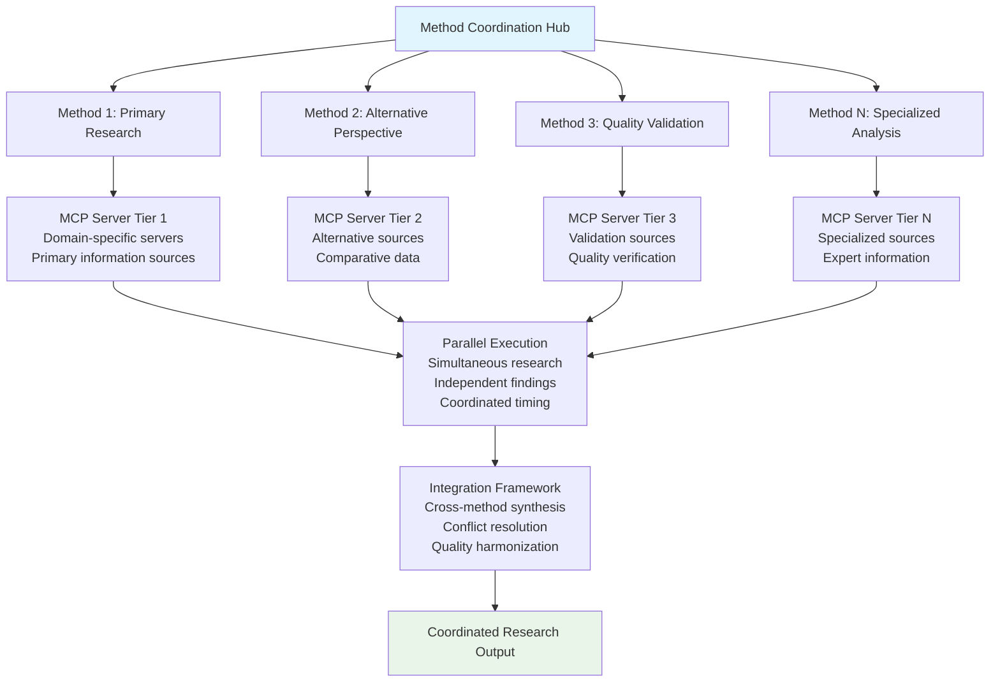
```mermaid
graph TD
    A[Method Coordination Hub] --> B[Method 1: Primary Research]
    A --> C[Method 2: Alternative Perspective]
    A --> D[Method 3: Quality Validation]
    A --> E[Method N: Specialized Analysis]
    
    B --> F[MCP Server Tier 1<br/>Domain-specific servers<br/>Primary information sources]
    
    C --> G[MCP Server Tier 2<br/>Alternative sources<br/>Comparative data]
    
    D --> H[MCP Server Tier 3<br/>Validation sources<br/>Quality verification]
    
    E --> I[MCP Server Tier N<br/>Specialized sources<br/>Expert information]
    
    F --> J[Parallel Execution<br/>Simultaneous research<br/>Independent findings<br/>Coordinated timing]
    G --> J
    H --> J
    I --> J
    
    J --> K[Integration Framework<br/>Cross-method synthesis<br/>Conflict resolution<br/>Quality harmonization]
    
    K --> L[Coordinated Research Output]
    
    style A fill:#e1f5fe
    style L fill:#e8f5e8
```

### Sequential Enhancement (Leaf Agents)

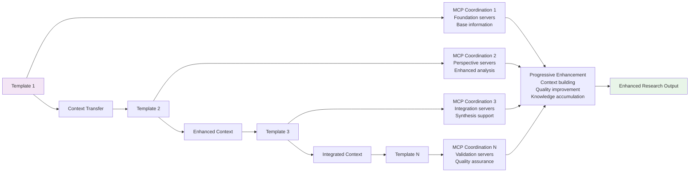
```mermaid
flowchart LR
    A[Template 1] --> B[Context Transfer]
    B --> C[Template 2]
    C --> D[Enhanced Context]
    D --> E[Template 3]
    E --> F[Integrated Context]
    F --> G[Template N]
    
    A --> H[MCP Coordination 1<br/>Foundation servers<br/>Base information]
    
    C --> I[MCP Coordination 2<br/>Perspective servers<br/>Enhanced analysis]
    
    E --> J[MCP Coordination 3<br/>Integration servers<br/>Synthesis support]
    
    G --> K[MCP Coordination N<br/>Validation servers<br/>Quality assurance]
    
    H --> L[Progressive Enhancement<br/>Context building<br/>Quality improvement<br/>Knowledge accumulation]
    I --> L
    J --> L
    K --> L
    
    L --> M[Enhanced Research Output]
    
    style A fill:#f3e5f5
    style M fill:#e8f5e8
```

## Quality Assurance Orchestration

### Multi-Layer Quality Framework

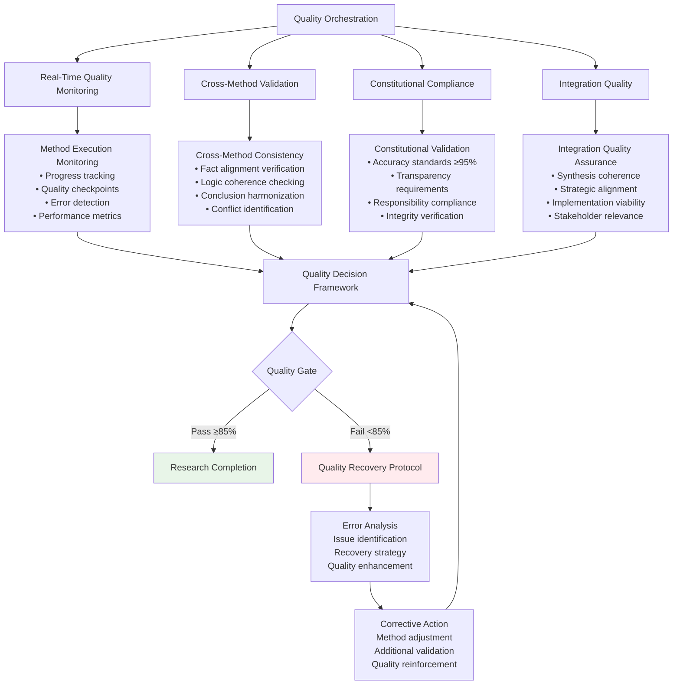
```mermaid
graph TD
    A[Quality Orchestration] --> B[Real-Time Quality Monitoring]
    A --> C[Cross-Method Validation]
    A --> D[Constitutional Compliance]
    A --> E[Integration Quality]
    
    B --> F[Method Execution Monitoring<br/>• Progress tracking<br/>• Quality checkpoints<br/>• Error detection<br/>• Performance metrics]
    
    C --> G[Cross-Method Consistency<br/>• Fact alignment verification<br/>• Logic coherence checking<br/>• Conclusion harmonization<br/>• Conflict identification]
    
    D --> H[Constitutional Validation<br/>• Accuracy standards ≥95%<br/>• Transparency requirements<br/>• Responsibility compliance<br/>• Integrity verification]
    
    E --> I[Integration Quality Assurance<br/>• Synthesis coherence<br/>• Strategic alignment<br/>• Implementation viability<br/>• Stakeholder relevance]
    
    F --> J[Quality Decision Framework]
    G --> J
    H --> J
    I --> J
    
    J --> K{Quality Gate}
    K -->|Pass ≥85%| L[Research Completion]
    K -->|Fail <85%| M[Quality Recovery Protocol]
    
    M --> N[Error Analysis<br/>Issue identification<br/>Recovery strategy<br/>Quality enhancement]
    
    N --> O[Corrective Action<br/>Method adjustment<br/>Additional validation<br/>Quality reinforcement]
    
    O --> J
    
    style L fill:#e8f5e8
    style M fill:#ffebee
```

### Quality Recovery Orchestration

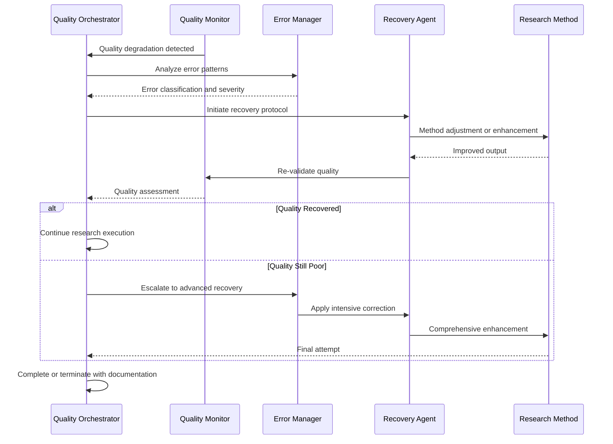
```mermaid
sequenceDiagram
    participant QO as Quality Orchestrator
    participant QM as Quality Monitor
    participant EM as Error Manager
    participant RA as Recovery Agent
    participant Method as Research Method
    
    QM->>QO: Quality degradation detected
    QO->>EM: Analyze error patterns
    EM-->>QO: Error classification and severity
    
    QO->>RA: Initiate recovery protocol
    RA->>Method: Method adjustment or enhancement
    Method-->>RA: Improved output
    
    RA->>QM: Re-validate quality
    QM-->>QO: Quality assessment
    
    alt Quality Recovered
        QO->>QO: Continue research execution
    else Quality Still Poor
        QO->>EM: Escalate to advanced recovery
        EM->>RA: Apply intensive correction
        RA->>Method: Comprehensive enhancement
        Method-->>QO: Final attempt
    end
    
    QO->>QO: Complete or terminate with documentation
```

## Resource Management Orchestration

### Dynamic Resource Allocation

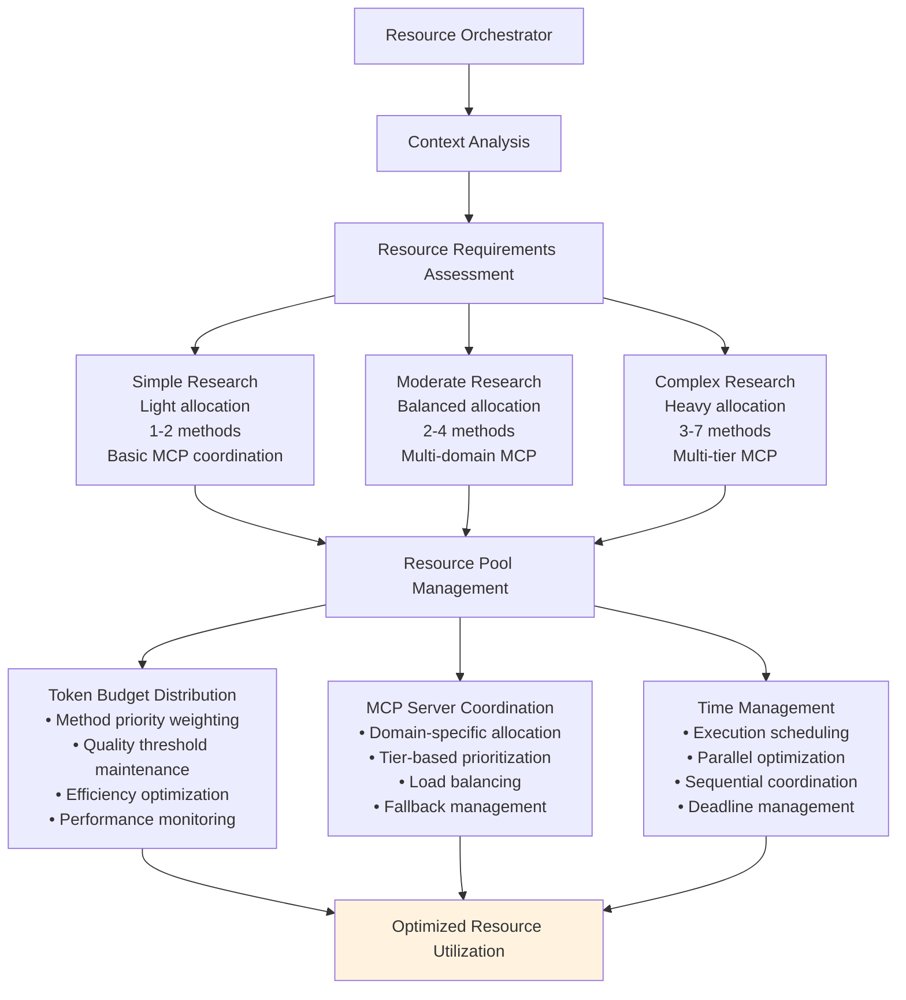
```mermaid
graph TD
    A[Resource Orchestrator] --> B[Context Analysis]
    B --> C[Resource Requirements Assessment]
    
    C --> D[Simple Research<br/>Light allocation<br/>1-2 methods<br/>Basic MCP coordination]
    
    C --> E[Moderate Research<br/>Balanced allocation<br/>2-4 methods<br/>Multi-domain MCP]
    
    C --> F[Complex Research<br/>Heavy allocation<br/>3-7 methods<br/>Multi-tier MCP]
    
    D --> G[Resource Pool Management]
    E --> G
    F --> G
    
    G --> H[Token Budget Distribution<br/>• Method priority weighting<br/>• Quality threshold maintenance<br/>• Efficiency optimization<br/>• Performance monitoring]
    
    G --> I[MCP Server Coordination<br/>• Domain-specific allocation<br/>• Tier-based prioritization<br/>• Load balancing<br/>• Fallback management]
    
    G --> J[Time Management<br/>• Execution scheduling<br/>• Parallel optimization<br/>• Sequential coordination<br/>• Deadline management]
    
    H --> K[Optimized Resource Utilization]
    I --> K
    J --> K
    
    style K fill:#fff3e0
```

### Performance Optimization Patterns

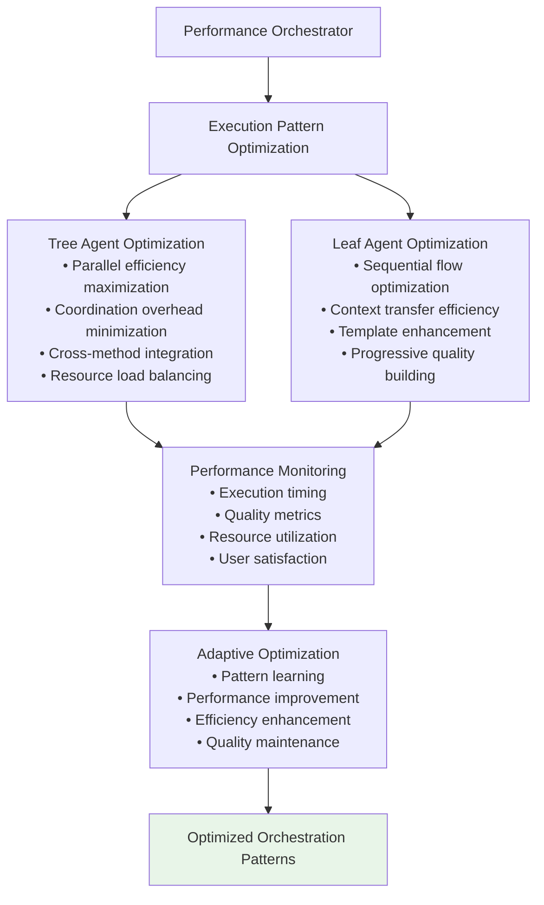
```mermaid
flowchart TD
    A[Performance Orchestrator] --> B[Execution Pattern Optimization]
    
    B --> C[Tree Agent Optimization<br/>• Parallel efficiency maximization<br/>• Coordination overhead minimization<br/>• Cross-method integration<br/>• Resource load balancing]
    
    B --> D[Leaf Agent Optimization<br/>• Sequential flow optimization<br/>• Context transfer efficiency<br/>• Template enhancement<br/>• Progressive quality building]
    
    C --> E[Performance Monitoring<br/>• Execution timing<br/>• Quality metrics<br/>• Resource utilization<br/>• User satisfaction]
    
    D --> E
    
    E --> F[Adaptive Optimization<br/>• Pattern learning<br/>• Performance improvement<br/>• Efficiency enhancement<br/>• Quality maintenance]
    
    F --> G[Optimized Orchestration Patterns]
    
    style G fill:#e8f5e8
```

## MCP Server Orchestration Patterns

### Tier-Based Server Coordination

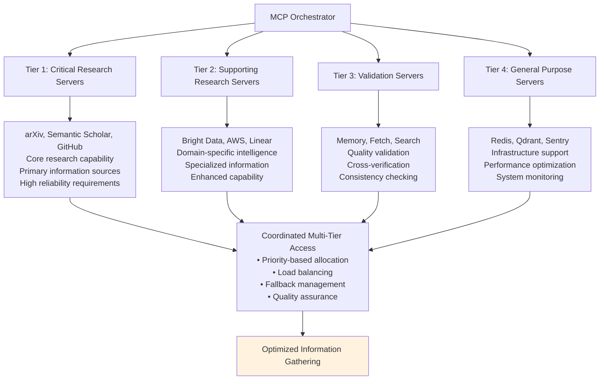
```mermaid
graph TD
    A[MCP Orchestrator] --> B[Tier 1: Critical Research Servers]
    A --> C[Tier 2: Supporting Research Servers]
    A --> D[Tier 3: Validation Servers]
    A --> E[Tier 4: General Purpose Servers]
    
    B --> F[arXiv, Semantic Scholar, GitHub<br/>Core research capability<br/>Primary information sources<br/>High reliability requirements]
    
    C --> G[Bright Data, AWS, Linear<br/>Domain-specific intelligence<br/>Specialized information<br/>Enhanced capability]
    
    D --> H[Memory, Fetch, Search<br/>Quality validation<br/>Cross-verification<br/>Consistency checking]
    
    E --> I[Redis, Qdrant, Sentry<br/>Infrastructure support<br/>Performance optimization<br/>System monitoring]
    
    F --> J[Coordinated Multi-Tier Access<br/>• Priority-based allocation<br/>• Load balancing<br/>• Fallback management<br/>• Quality assurance]
    G --> J
    H --> J
    I --> J
    
    J --> K[Optimized Information Gathering]
    
    style K fill:#fff3e0
```

### Server Coordination Sequence Patterns

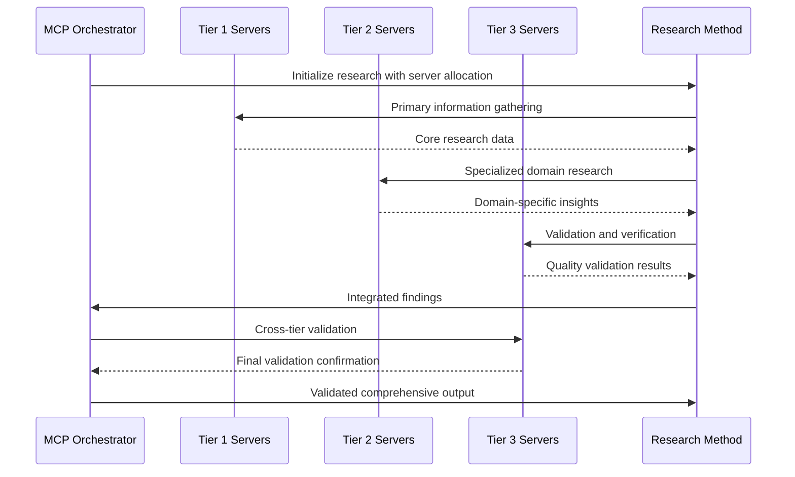
```mermaid
sequenceDiagram
    participant MO as MCP Orchestrator
    participant T1 as Tier 1 Servers
    participant T2 as Tier 2 Servers
    participant T3 as Tier 3 Servers
    participant Method as Research Method
    
    MO->>Method: Initialize research with server allocation
    Method->>T1: Primary information gathering
    T1-->>Method: Core research data
    
    Method->>T2: Specialized domain research
    T2-->>Method: Domain-specific insights
    
    Method->>T3: Validation and verification
    T3-->>Method: Quality validation results
    
    Method->>MO: Integrated findings
    MO->>T3: Cross-tier validation
    T3-->>MO: Final validation confirmation
    
    MO->>Method: Validated comprehensive output
```

## Error Handling and Recovery Orchestration

### Comprehensive Error Management

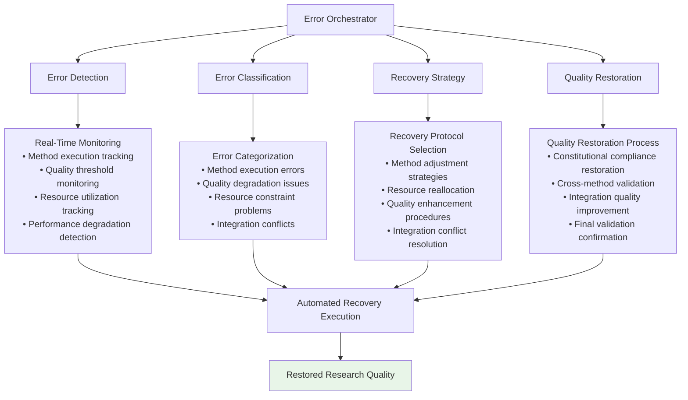
```mermaid
graph TD
    A[Error Orchestrator] --> B[Error Detection]
    A --> C[Error Classification]
    A --> D[Recovery Strategy]
    A --> E[Quality Restoration]
    
    B --> F[Real-Time Monitoring<br/>• Method execution tracking<br/>• Quality threshold monitoring<br/>• Resource utilization tracking<br/>• Performance degradation detection]
    
    C --> G[Error Categorization<br/>• Method execution errors<br/>• Quality degradation issues<br/>• Resource constraint problems<br/>• Integration conflicts]
    
    D --> H[Recovery Protocol Selection<br/>• Method adjustment strategies<br/>• Resource reallocation<br/>• Quality enhancement procedures<br/>• Integration conflict resolution]
    
    E --> I[Quality Restoration Process<br/>• Constitutional compliance restoration<br/>• Cross-method validation<br/>• Integration quality improvement<br/>• Final validation confirmation]
    
    F --> J[Automated Recovery Execution]
    G --> J
    H --> J
    I --> J
    
    J --> K[Restored Research Quality]
    
    style K fill:#e8f5e8
```

## Implementation Guidelines

### For Tree Agent Orchestration
1. **Lead Orchestrator Pattern**: Implement centralized coordination with distributed execution
2. **Parallel Optimization**: Maximize concurrent method execution while managing integration complexity
3. **Resource Management**: Balance method allocation based on complexity and quality requirements
4. **Quality Assurance**: Apply multi-layer validation across all coordinated methods
5. **Error Recovery**: Implement sophisticated error detection and recovery protocols

### For Leaf Agent Orchestration
1. **Sequential Mastery**: Optimize template progression with context transfer enhancement
2. **Progressive Enhancement**: Build quality through systematic template evolution
3. **Integration Focus**: Emphasize synthesis quality throughout sequential execution
4. **Validation Rigor**: Apply comprehensive validation at each stage
5. **Performance Optimization**: Maximize efficiency through optimized template sequencing

### Universal Orchestration Principles
1. **Quality First**: Prioritize research quality over execution speed
2. **Adaptive Coordination**: Adjust orchestration patterns based on complexity and requirements
3. **Resource Optimization**: Maximize value from available computational and information resources
4. **Constitutional Compliance**: Ensure all orchestration patterns maintain ethical and quality standards
5. **Continuous Improvement**: Learn from execution patterns to optimize future orchestration

This orchestration pattern framework provides comprehensive coordination strategies for achieving consistent high-quality research outcomes across diverse agent capabilities and complexity levels.