# Simple Research Flow

## Source References
**Claude Desktop Research**: Anthropic's orchestrator patterns for simple queries (1-2 specialized agents)  
**Method Selection Algorithm**: Context analysis for basic research requirements  
**Tree-Leaf Architecture**: Universal execution paths for simple complexity research

## Simple Research Characteristics

Simple research addresses focused questions with clear scope boundaries, requiring minimal method coordination and straightforward validation procedures.

### Complexity Indicators
- **Single domain focus** (technology, business, academic)
- **Factual information gathering** with limited analysis requirements
- **Clear boundaries** with well-defined success criteria
- **Basic validation needs** without complex verification requirements
- **Time-bounded** with expectation of quick resolution

## Simple Research Orchestration Pattern

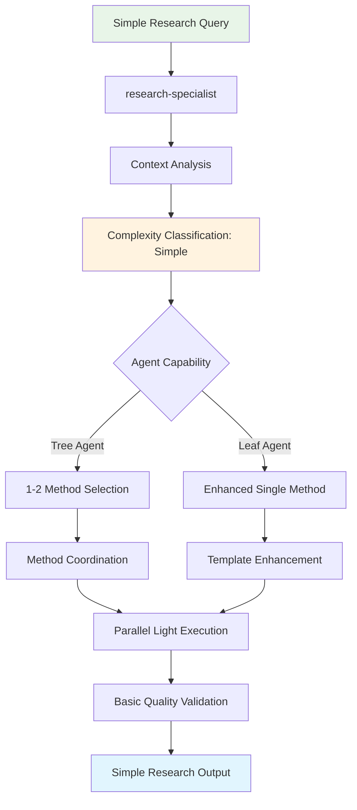

## Tree Agent Execution (1-2 Methods)

### Lightweight Multi-Method Coordination

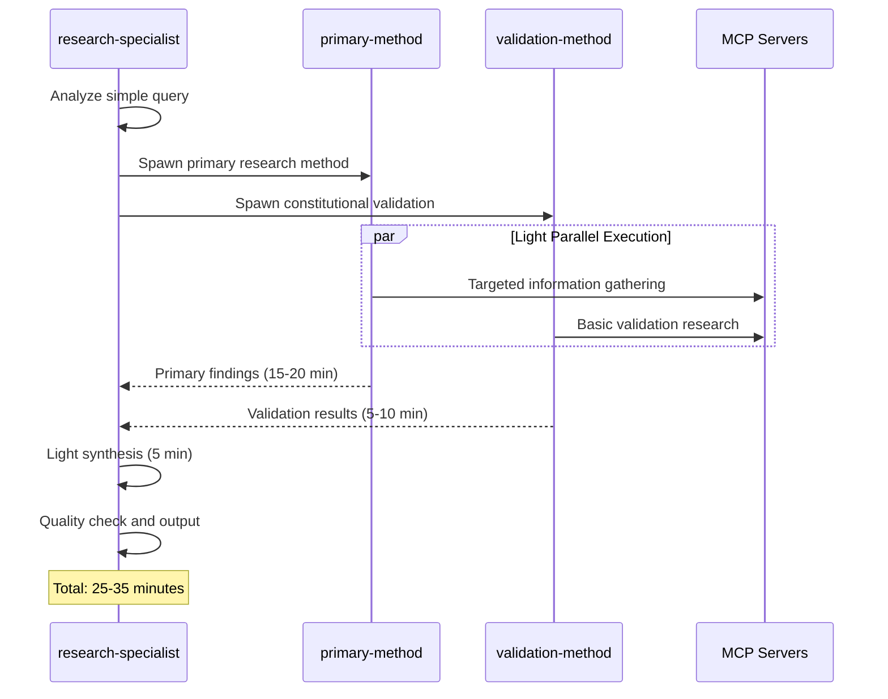

### Common Simple Research Method Combinations

```mermaid
graph TD
    A[Simple Research Methods] --> B[Primary + Validation]
    A --> C[Single Enhanced Method]
    A --> D[Domain + Quality]
    
    B --> E[step_by_step_research<br/>+ constitutional_ai]
    B --> F[universal_research<br/>+ self_consistency]
    
    C --> G[step_by_step_research<br/>(comprehensive enhancement)]
    C --> H[domain_specific_research<br/>(focused approach)]
    
    D --> I[domain_adaptive<br/>+ iterative_refinement]
    D --> J[primary_research<br/>+ constitutional_ai]
    
    style E fill:#e1f5fe
    style F fill:#e1f5fe
    style G fill:#f3e5f5
    style H fill:#f3e5f5
```

## Leaf Agent Execution (Enhanced Single Method)

### Template-Based Simple Research

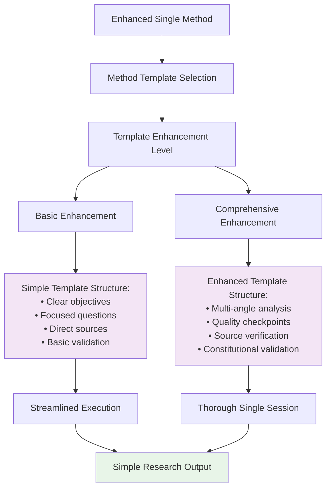

## Method-Specific Simple Research Patterns

### Step-by-Step Research (Optimized for Simple Queries)

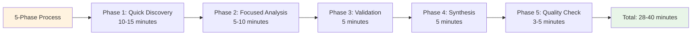

### Universal Research (Simple Query Adaptation)

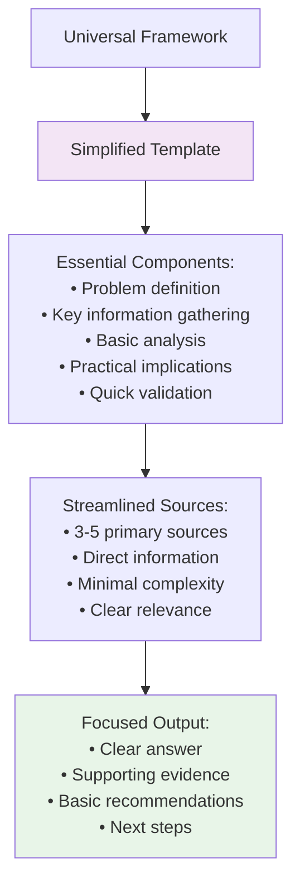

### Constitutional AI (Simple Validation)

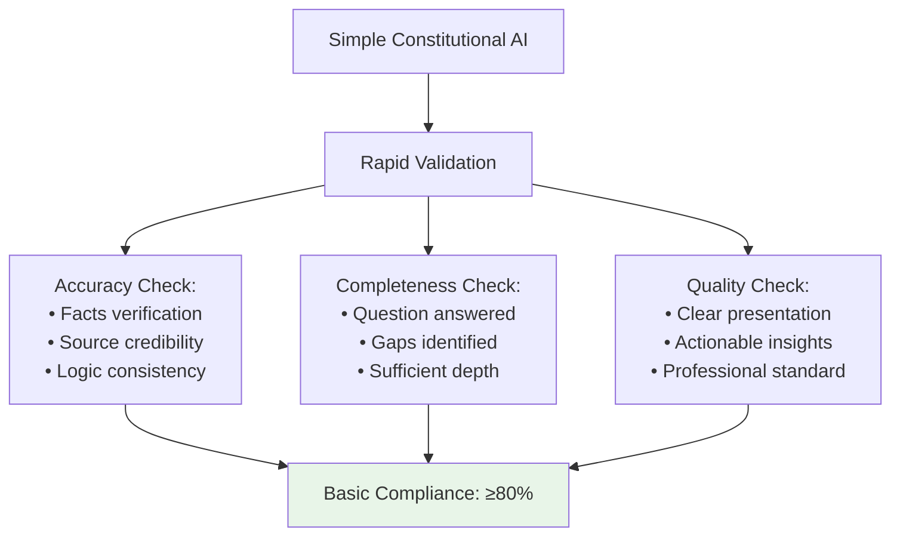

## Resource Allocation for Simple Research

### Tree Agent Resource Pattern

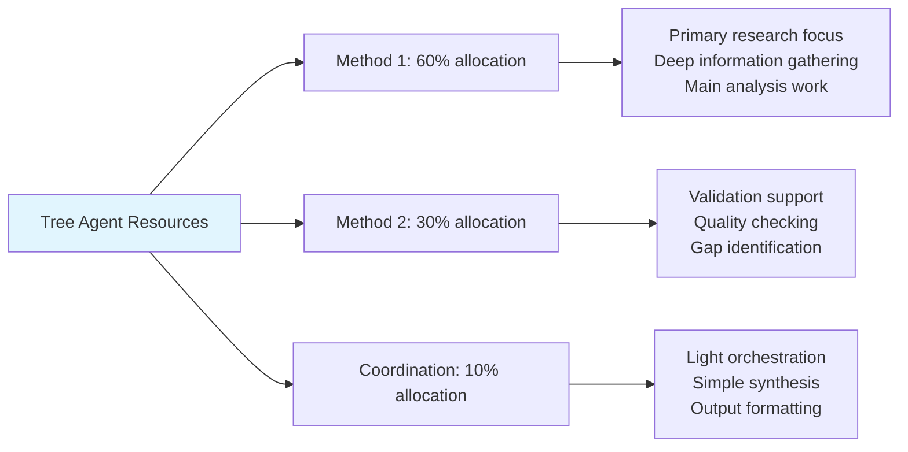

### Leaf Agent Resource Pattern

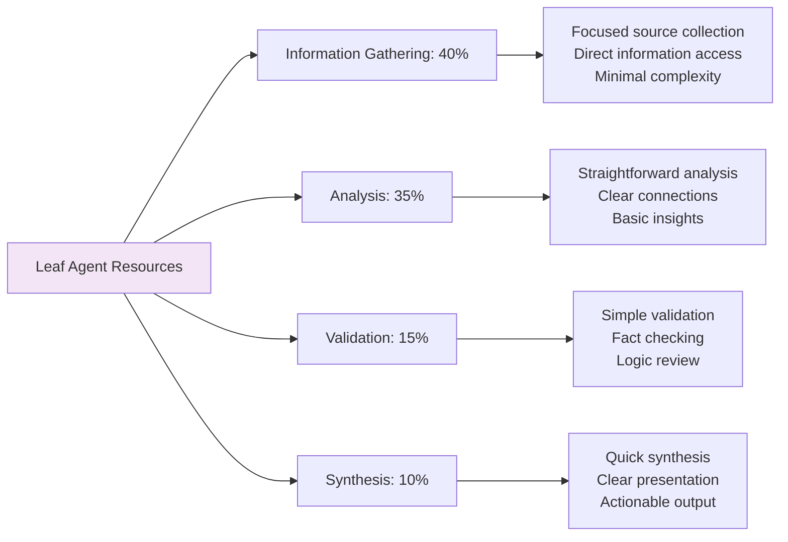

## Quality Standards for Simple Research

### Validation Framework (Simplified)

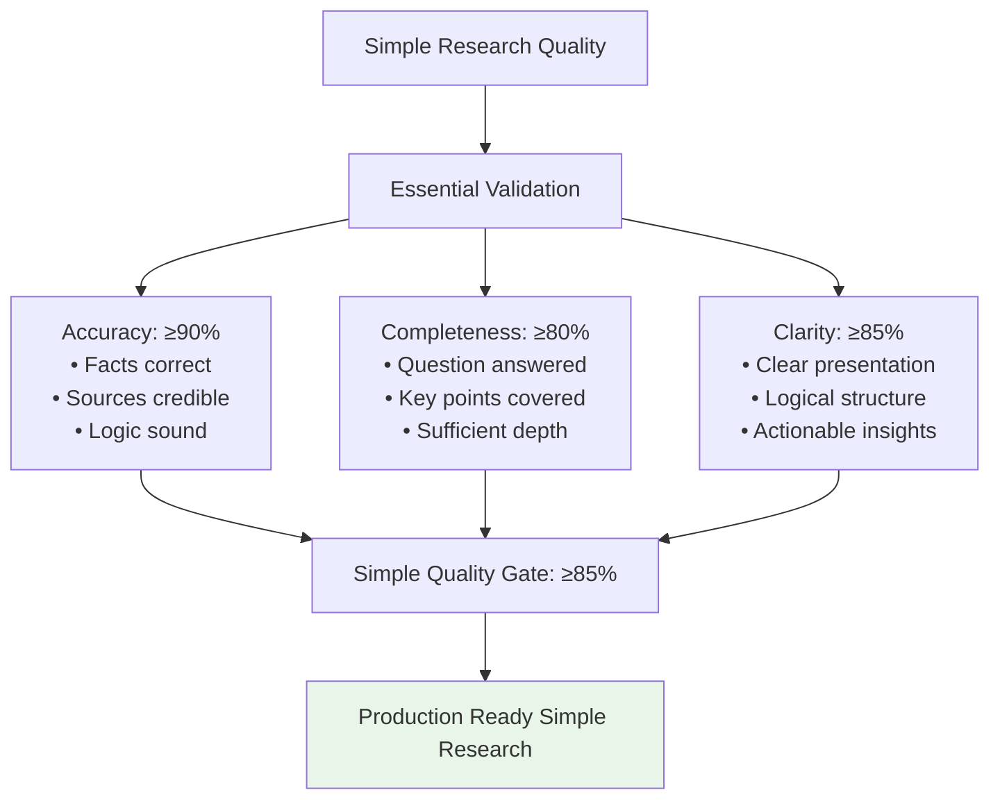

### Success Metrics

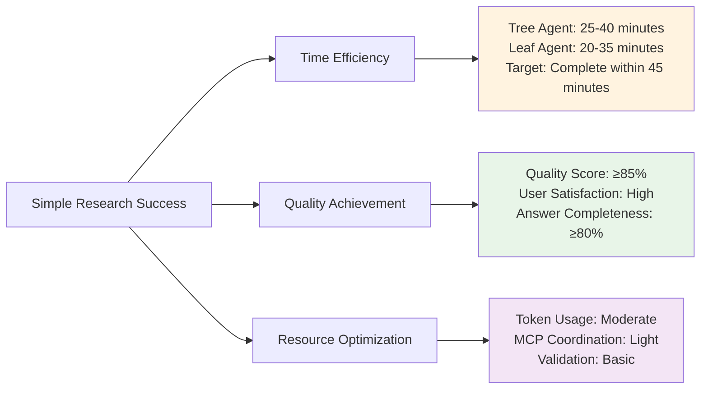

## Common Simple Research Examples

### Technology Questions
- **"What is React Server Components?"**
  - Method: step_by_step_research + constitutional_ai
  - Duration: 25-35 minutes
  - Sources: Official docs, GitHub, community discussions

### Business Information
- **"How does Stripe handle international payments?"**
  - Method: universal_research enhanced
  - Duration: 20-30 minutes
  - Sources: Stripe docs, case studies, implementation guides

### Process Understanding
- **"What are the steps for AWS Lambda deployment?"**
  - Method: domain_specific_research + validation
  - Duration: 30-40 minutes
  - Sources: AWS docs, tutorials, best practices

## Error Handling and Recovery

### Simple Research Failure Patterns

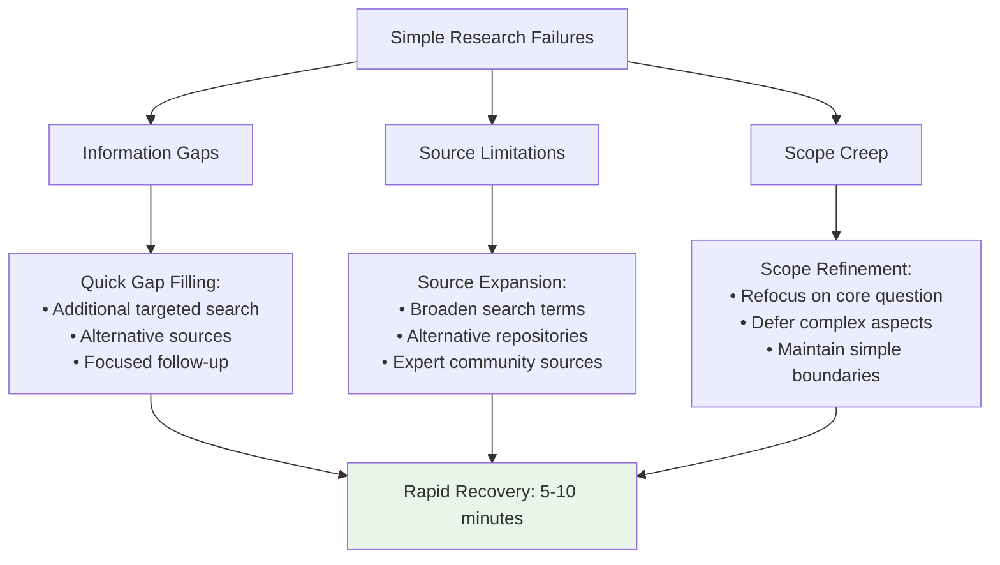

### Recovery Procedures
1. **Quick Assessment**: Identify specific failure point within 2 minutes
2. **Targeted Fix**: Apply focused solution without full restart
3. **Validation**: Ensure fix maintains simple research quality standards
4. **Completion**: Deliver within extended timeframe (max 60 minutes total)

## Implementation Guidelines

### For Tree Agents
1. **Light Orchestration**: Use minimal coordination overhead for simple queries
2. **Focused Methods**: Select 1-2 highly relevant methods rather than broad coverage
3. **Parallel Efficiency**: Leverage parallel execution for time optimization
4. **Quality Gates**: Apply basic validation without over-engineering

### For Leaf Agents
1. **Enhanced Templates**: Use comprehensive single-method templates
2. **Systematic Approach**: Follow structured progression through simple research phases
3. **Quality Integration**: Build validation into template execution
4. **Resource Focus**: Concentrate effort on high-value information gathering and analysis

### Universal Principles
1. **Scope Discipline**: Maintain focus on simple research boundaries
2. **Time Management**: Complete within 45-minute target timeframe
3. **Quality Standards**: Achieve ≥85% validation score
4. **User Value**: Provide clear, actionable answers to simple questions

This simple research flow demonstrates efficient coordination patterns for focused queries while maintaining quality standards across different agent capabilities.