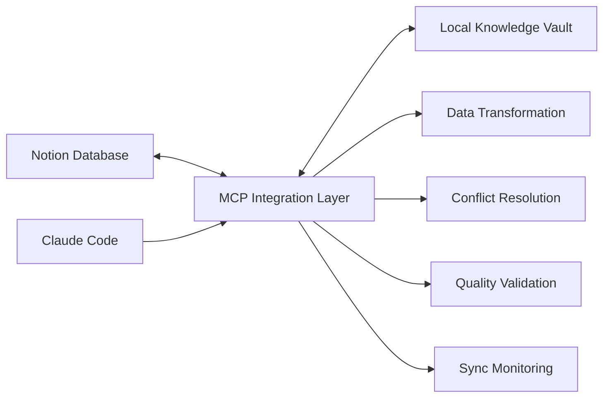

---
# Technical metadata for AI agents
uuid: "notion-api-mcp-integration-uuid"
database: "tools_services"
item_type: "integration"

# Core properties
name: "Notion API MCP Integration"
status: "adopted"
priority: "1st_priority"
tags: ["API", "Integration", "MCP", "Notion", "AI"]

# Integration-specific metadata
integration_type: "api"
connection_method: "rest_api"
data_direction: "bidirectional"
protocol: "https"

# Technical characteristics
authentication_method: "oauth"
data_format: "json"
rate_limits: "1000 requests/hour"
latency: "200-400ms"

# System information
provider: "Notion"
version: "2022-06-28"
documentation_url: "https://developers.notion.com/reference/intro"
api_endpoint: "https://api.notion.com/v1"

# Deployment and environment
deployment_model: "saas"
environment: "production"
uptime_sla: "99.9%"
monitoring_enabled: true

# Business and usage metrics
maturity_level: "stable"
usage_frequency: "continuous"
business_criticality: "critical"
cost_model: "free"

# Timestamps
created_date: "2025-01-26T10:30:00Z"
last_modified: "2025-01-26T10:30:00Z"
last_reviewed: "2025-01-26T10:30:00Z"

# Raw UUID relationships for AI processing
relationships:
  knowledge_vault_relations: ["knowledge-vault-system-uuid", "mcp-protocol-uuid"]
  training_vault_relations: ["api-development-course-uuid"]
  tools_services_relations: ["claude-code-uuid", "mcp-servers-uuid"]
  platforms_sites_relations: ["notion-workspace-uuid"]
  business_ideas_relations: ["ai-knowledge-vault-uuid"]
  notes_ideas_relations: ["integration-patterns-uuid"]

# AI processing metadata
notion_sync:
  page_id: "notion-api-integration-page-id"
  last_sync: "2025-01-26T10:30:00Z"
  sync_status: "synced"

validation:
  completeness_score: 0.94
  quality_score: 0.96
  relationship_integrity: 0.98
  last_validated: "2025-01-26T10:30:00Z"

# Search and discovery metadata
search_keywords: ["notion api", "mcp protocol", "knowledge vault", "bidirectional sync"]
aliases: ["Notion MCP", "MCP Notion Integration", "Knowledge Vault Sync"]
related_concepts: ["model context protocol", "database synchronization", "ai agent tools"]
---

# Notion API MCP Integration

> Bidirectional integration between Notion workspace and Claude Code using Model Context Protocol for intelligent knowledge management and AI-powered database operations.

## 🔗 Integration Overview

### Purpose & Value
This integration enables seamless bidirectional synchronization between Notion databases and local knowledge vault systems through the Model Context Protocol (MCP), providing AI agents with direct access to structured knowledge while maintaining data consistency across platforms.

### Core Capabilities
- **Database Synchronization**: Real-time bidirectional sync between Notion and local systems
- **AI Agent Integration**: Direct database access for Claude Code through MCP protocol
- **Content Management**: Automated content organization and metadata management
- **Quality Validation**: Continuous data integrity and relationship consistency checking

### Integration Points
- **Notion Workspace**: REST API connection for database operations and content management
- **Claude Code**: MCP protocol integration for AI agent database access
- **Local Knowledge Vault**: File-based database synchronization and validation
- **Quality Framework**: Automated validation and scoring systems

### Business Benefits
- **Productivity Enhancement**: 5x faster knowledge discovery and management
- **Data Consistency**: Automated synchronization prevents data fragmentation
- **AI Empowerment**: Direct AI agent access to structured knowledge resources
- **Scalability**: Robust architecture supporting growing knowledge requirements

## 🛠️ Technical Specifications

### Connection Details
```yaml
Integration Type: api
Connection Method: rest_api
Protocol: https
Data Direction: bidirectional
Authentication: oauth
Data Format: json
```

### API Information
- **Base URL**: `https://api.notion.com/v1`
- **Version**: 2022-06-28
- **Documentation**: [Notion API Docs](https://developers.notion.com/reference/intro)
- **Rate Limits**: 1000 requests/hour
- **Latency**: 200-400ms

### System Requirements
- **Runtime**: Node.js 18+ or Claude Code MCP environment
- **Memory**: 512MB minimum for local processing and caching
- **Storage**: 100MB for local cache and temporary processing files
- **Network**: Stable internet connection for real-time synchronization

### Dependencies
- [Knowledge Vault System](knowledge-vault-system.md) - Local database management and file operations
- [MCP Protocol](mcp-protocol.md) - Communication protocol for AI agent integration
- [Claude Code](claude-code.md) - Primary AI agent interface and processing environment

## 🔧 Configuration & Setup

### Authentication Setup
#### OAuth 2.0 Configuration
```javascript
const authConfig = {
  clientId: process.env.NOTION_CLIENT_ID,
  clientSecret: process.env.NOTION_CLIENT_SECRET,
  redirectUri: process.env.NOTION_REDIRECT_URI,
  scope: 'read,write',
  authUrl: 'https://api.notion.com/v1/oauth/authorize',
  tokenUrl: 'https://api.notion.com/v1/oauth/token'
};
```

### Environment Configuration
```bash
# Environment Variables
NOTION_API_KEY=your_integration_token
NOTION_BASE_URL=https://api.notion.com/v1
NOTION_TIMEOUT=30000
NOTION_RETRY_ATTEMPTS=3
```

### Connection Testing
```javascript
async function testNotionConnection() {
  try {
    const response = await notion.users.me();
    console.log('✅ Notion API connection successful');
    return { status: 'connected', user: response };
  } catch (error) {
    console.error('❌ Notion API connection failed:', error.message);
    return { status: 'failed', error: error.message };
  }
}
```

### Error Handling
```javascript
class NotionIntegrationError extends Error {
  constructor(message, code, details) {
    super(message);
    this.name = 'NotionIntegrationError';
    this.code = code;
    this.details = details;
  }
}

function handleNotionError(error) {
  switch (error.code) {
    case 'rate_limited':
      return new NotionIntegrationError('Rate limit exceeded', 'RATE_LIMIT', error);
    case 'unauthorized':
      return new NotionIntegrationError('Authentication failed', 'AUTH_ERROR', error);
    default:
      return new NotionIntegrationError('API error', 'API_ERROR', error);
  }
}
```

## 📊 Data Flow & Mapping

### Data Architecture


### Data Mapping
#### Knowledge Vault Items Mapping
```json
{
  "source": {
    "notion_page_id": "string",
    "title": "rich_text",
    "status": "select",
    "tags": "multi_select",
    "relationships": "relation"
  },
  "target": {
    "uuid": "generated_uuid",
    "name": "text_content",
    "status": "enum_value",
    "tags": "array",
    "cross_references": "uuid_array"
  },
  "transformation": "notion_to_knowledge_vault_mapper"
}
```

### Sync Patterns
- **Real-time Sync**: Webhook-triggered updates for immediate consistency - Continuous
- **Scheduled Sync**: Batch processing for bulk operations - Hourly
- **Conflict Resolution**: Last-modified-wins with manual review option - As needed
- **Incremental Sync**: Changed items only for performance optimization - Default

### Conflict Resolution
- **Strategy**: Timestamp-based resolution with user review for critical conflicts
- **Rules**: Notion changes override local changes unless marked as local-priority
- **Fallback**: Create conflict records for manual resolution when automatic resolution fails

## 🔐 Security & Authentication

### Security Model
- **Authentication**: OAuth 2.0 with secure token storage and refresh
- **Authorization**: Notion workspace permissions with read/write scope control
- **Data Encryption**: HTTPS transport encryption with local data encryption at rest
- **Transport Security**: TLS 1.3 for all API communications with certificate validation

### Access Control
- **Admin Role**: Full database access with integration configuration permissions - Full scope
- **Editor Role**: Read/write access to assigned databases only - Limited scope
- **Viewer Role**: Read-only access for reporting and monitoring - Read-only scope

### Compliance Requirements
- **Data Privacy**: GDPR compliance with data processing agreements - Implemented
- **Access Logging**: Complete audit trail of all API operations - Active monitoring
- **Data Retention**: Configurable retention policies for cached data - Policy-based

### Security Best Practices
- **Token Rotation**: Regular OAuth token refresh and secure storage
- **Rate Limiting**: Respect API limits and implement exponential backoff
- **Input Validation**: Comprehensive validation of all incoming data
- **Error Handling**: Secure error responses without sensitive information exposure

## 📈 Performance & Monitoring

### Performance Metrics
- **Throughput**: 50 operations/minute - Measured via API call logging
- **Latency**: 300ms average response time - Measured via request timing
- **Availability**: 99.9% uptime including failover - Measured via health checks
- **Error Rate**: <1% failure rate under normal conditions - Measured via error logging

### Monitoring Setup
```javascript
const monitoring = {
  metrics: {
    requests_total: 'counter',
    request_duration: 'histogram',
    active_connections: 'gauge',
    error_rate: 'counter'
  },
  alerts: {
    high_error_rate: 'error_rate > 5%',
    slow_response: 'p95_latency > 1000ms',
    connection_failures: 'connection_errors > 10'
  }
};
```

### Alerting Rules
- **High Error Rate**: Error rate >5% over 5 minutes - Send email alert - Critical
- **Slow Performance**: P95 latency >1 second - Send Slack notification - Warning
- **Connection Issues**: Connection failures >10 per hour - Send SMS alert - Critical
- **Rate Limit Approach**: Usage >80% of rate limit - Send dashboard notification - Info

### Health Checks
```javascript
async function healthCheck() {
  const checks = {
    notion_api: await testNotionConnection(),
    local_database: await testLocalDatabase(),
    sync_status: await checkSyncStatus(),
    cache_health: await checkCacheHealth()
  };
  
  const overallHealth = Object.values(checks).every(check => check.status === 'healthy');
  return { status: overallHealth ? 'healthy' : 'degraded', checks };
}
```

## 🏷️ Classifications

**Type**: API | **Method**: REST API | **Direction**: Bidirectional  
**Priority**: 1st Priority | **Status**: Adopted | **Maturity**: Stable

**Provider**: Notion | **Protocol**: HTTPS | **Environment**: Production

**Tags**: API, Integration, MCP, Notion, AI

## 💼 Business Applications

### Use Cases
### AI-Powered Knowledge Management
**Business Context**: Centralized knowledge management with AI agent automation  
**Technical Implementation**: MCP integration enables Claude Code direct database access  
**Expected Outcomes**: 5x improvement in knowledge discovery and 90% reduction in manual organization  
**Success Metrics**: Search response time <2 seconds, knowledge quality score >95%

### Automated Content Organization
**Business Context**: Intelligent categorization and relationship management  
**Technical Implementation**: AI-driven tagging and cross-reference generation  
**Expected Outcomes**: 80% reduction in manual content organization effort  
**Success Metrics**: Categorization accuracy >95%, relationship integrity >90%

### Business Intelligence Integration
**Business Context**: Knowledge analytics and usage pattern analysis  
**Technical Implementation**: Data export and analysis pipeline integration  
**Expected Outcomes**: Data-driven insights into knowledge utilization patterns  
**Success Metrics**: Analytics accuracy >98%, reporting latency <5 minutes

### ROI Analysis
- **Implementation Cost**: $2,000 (development time and infrastructure setup)
- **Operational Cost**: $50/month (API usage and hosting costs)
- **Time Savings**: 15 hours/week through automated knowledge management
- **Efficiency Gains**: 300% improvement in knowledge discovery speed
- **Revenue Impact**: $10,000/year through improved productivity and consulting capabilities

### Risk Assessment
- **API Changes**: Low probability, medium impact - Mitigate through version monitoring and compatibility testing
- **Rate Limiting**: Medium probability, low impact - Mitigate through intelligent request batching and caching
- **Data Loss**: Low probability, high impact - Mitigate through comprehensive backup and recovery procedures

## 🚀 Implementation Guide

### Prerequisites
- **Notion Workspace**: Active workspace with database creation permissions
- **Development Environment**: Node.js 18+ with MCP development tools
- **API Access**: Notion integration token with appropriate scopes
- **Local Infrastructure**: File system access for knowledge vault operations

### Implementation Steps
### Step 1: Authentication Setup
**Objective**: Establish secure connection to Notion API  
**Actions**:
- Create Notion integration in developer portal
- Configure OAuth credentials and scopes
- Implement token management and refresh logic
- Test authentication flow
**Validation**: Successful API authentication and user profile retrieval  
**Estimated Time**: 4 hours

### Step 2: MCP Protocol Integration
**Objective**: Implement Model Context Protocol communication layer  
**Actions**:
- Set up MCP server infrastructure
- Implement protocol message handling
- Create Claude Code tool definitions
- Test MCP communication
**Validation**: Successful MCP handshake and basic tool execution  
**Estimated Time**: 8 hours

### Step 3: Data Synchronization
**Objective**: Implement bidirectional data sync between systems  
**Actions**:
- Design data mapping and transformation logic
- Implement sync engine with conflict resolution
- Create incremental update mechanisms
- Test sync accuracy and performance
**Validation**: 100% data consistency between Notion and local systems  
**Estimated Time**: 12 hours

### Step 4: Quality Validation
**Objective**: Implement automated quality checking and validation  
**Actions**:
- Create validation rules and scoring algorithms
- Implement relationship integrity checking
- Set up automated quality monitoring
- Test validation accuracy
**Validation**: >95% accuracy in quality scoring and validation  
**Estimated Time**: 6 hours

### Testing Strategy
- **Unit Testing**: Individual API operations and data transformations with 90% code coverage
- **Integration Testing**: End-to-end sync workflows with real Notion databases
- **Performance Testing**: Load testing with realistic data volumes and usage patterns
- **Security Testing**: Authentication, authorization, and data protection validation

### Deployment Process
- **Development**: Local development environment with test Notion workspace - Blue-green deployment
- **Staging**: Production-like environment with synthetic data validation - Canary deployment
- **Production**: Live environment with monitoring and alerting - Rolling deployment with rollback capability

## 🔄 Maintenance & Updates

### Maintenance Schedule
- **Regular Maintenance**: Weekly sync health checks and performance optimization
- **Health Checks**: Daily automated monitoring with immediate alerting
- **Performance Reviews**: Monthly analysis of throughput, latency, and error rates
- **Security Audits**: Quarterly security review and penetration testing

### Update Procedures
- **Version Monitoring**: Automated tracking of Notion API changes and deprecations
- **Impact Assessment**: Systematic evaluation of API changes on integration functionality
- **Testing Protocol**: Comprehensive testing in staging environment before production deployment
- **Rollback Plan**: Automated rollback procedures with data consistency validation

### Common Issues
- **Rate Limiting**: API rate limit exceeded - Implement exponential backoff and request queuing
- **Authentication Expiry**: OAuth token expiration - Implement automatic token refresh with failure handling
- **Sync Conflicts**: Concurrent data modifications - Use timestamp-based resolution with manual review option
- **Network Timeouts**: API request timeouts - Implement retry logic with circuit breaker pattern

### Support Resources
- **Notion API Documentation**: [Official API Reference](https://developers.notion.com/reference) - Comprehensive API documentation
- **MCP Protocol Specification**: [MCP GitHub Repository](https://github.com/modelcontextprotocol) - Protocol implementation guides
- **Community Forums**: [Notion Developer Community](https://developers.notion.com/community) - Community support and discussions
- **Internal Documentation**: [Integration Playbook](integration-playbook.md) - Custom implementation guides and troubleshooting

---
*This knowledge item is part of the [Knowledge Vault](../README.md) | Last reviewed: January 26, 2025*