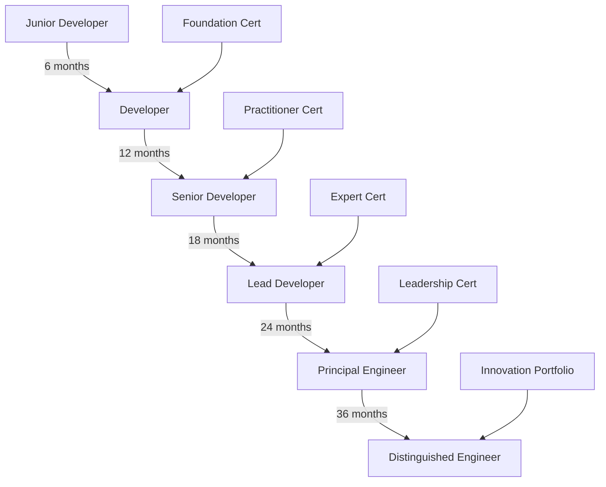
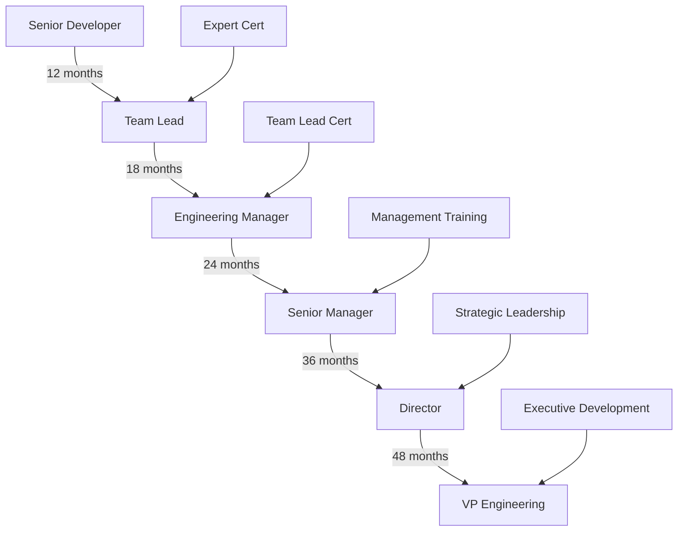
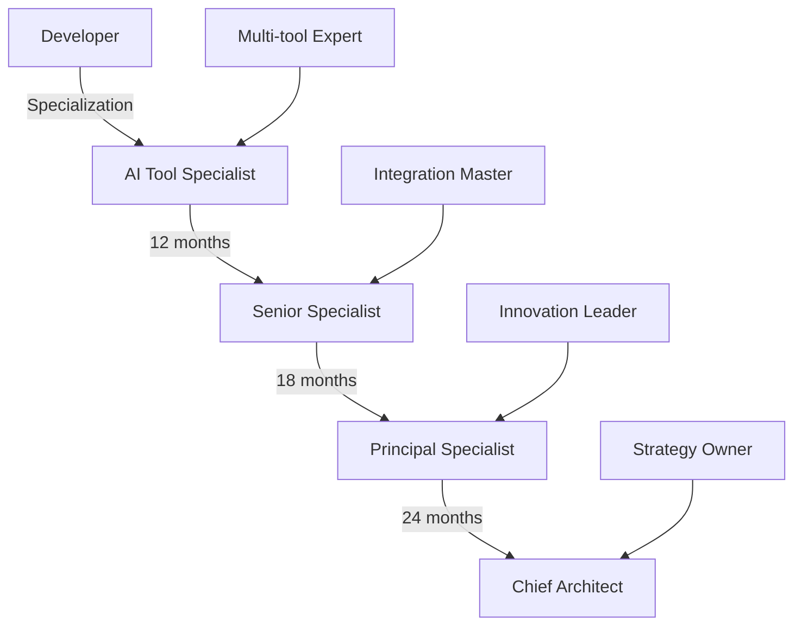

# AI-SDLC Assessment Framework

## Assessment Overview

This comprehensive framework evaluates team competencies in AI-enhanced software development, ensuring systematic skill progression and certification across all AI tools and methodologies.

### Framework Objectives
- Measure individual and team AI tool proficiency
- Track productivity improvements and ROI
- Identify skill gaps and training needs
- Provide clear career progression paths
- Ensure consistent quality standards

### Assessment Principles
1. **Practical Application Focus**: 80% hands-on, 20% theoretical
2. **Continuous Evaluation**: Weekly micro-assessments, monthly reviews
3. **Role-Specific Criteria**: Tailored to individual responsibilities
4. **Measurable Outcomes**: Quantifiable productivity metrics
5. **Progressive Complexity**: Gradual skill building approach

### Assessment Types and Methods

#### 1. Initial Baseline Assessment (Week 0)
- Current productivity metrics capture
- Technical skill inventory
- AI tool familiarity survey
- Problem-solving approach analysis

#### 2. Formative Assessments (Ongoing)
- Weekly code review evaluations
- Daily standup participation quality
- AI prompt effectiveness tracking
- Peer collaboration feedback

#### 3. Summative Assessments (Milestone-based)
- Monthly project deliverable reviews
- Quarterly certification exams
- Semi-annual 360° evaluations
- Annual performance reviews

### Competency Levels and Progression

| Level | Timeline | Proficiency | Productivity Gain |
|-------|----------|-------------|-------------------|
| Foundation | 0-3 months | Basic AI tool usage | 10-25% |
| Practitioner | 3-6 months | Independent operation | 25-50% |
| Expert | 6-12 months | Advanced techniques | 50-75% |
| Team Lead | 12+ months | Mentoring & optimization | 75-100% |

---

## Skill Assessment Matrix

### Technical Competencies by Tool

#### Claude Code Max Assessment

| Skill Area | Foundation | Practitioner | Expert | Team Lead |
|------------|------------|--------------|---------|-----------|
| **Prompt Engineering** | Basic queries | Context-aware prompts | Multi-turn optimization | Prompt pattern library |
| **Code Generation** | Simple functions | Complex modules | Full feature implementation | Architecture design |
| **Code Review** | Basic feedback | Security & performance | Automated workflows | Team standards |
| **Documentation** | README files | API docs | Architecture docs | Knowledge base |
| **Debugging** | Error identification | Root cause analysis | Performance optimization | Team troubleshooting |

**Assessment Method**:
```
Task: Generate a REST API endpoint with authentication
Time Limit: 30 minutes
Evaluation Criteria:
- Code quality (40%)
- Security implementation (30%)
- Documentation (20%)
- Testing coverage (10%)
```

#### Cursor IDE Assessment

| Skill Area | Foundation | Practitioner | Expert | Team Lead |
|------------|------------|--------------|---------|-----------|
| **Auto-completion** | Basic usage | Context optimization | Custom models | Team configuration |
| **Multi-file Editing** | Simple edits | Refactoring | Architecture changes | Code migration |
| **AI Commands** | Standard commands | Custom workflows | Automation scripts | Team templates |
| **Integration** | Basic Git | CI/CD integration | Custom tooling | Team workflows |

**Assessment Method**:
```
Task: Refactor a legacy component across multiple files
Time Limit: 45 minutes
Evaluation Criteria:
- Refactoring completeness (35%)
- Code consistency (25%)
- Test maintenance (25%)
- Documentation updates (15%)
```

#### GitHub Copilot Assessment

| Skill Area | Foundation | Practitioner | Expert | Team Lead |
|------------|------------|--------------|---------|-----------|
| **Code Suggestions** | Accept/reject | Context tuning | Pattern recognition | Team patterns |
| **Test Generation** | Unit tests | Integration tests | E2E tests | Test strategies |
| **Documentation** | Inline comments | Function docs | Module docs | Best practices |
| **Languages** | Primary language | Multiple languages | Polyglot development | Language standards |

### Domain Knowledge Requirements

#### Software Development Fundamentals
- **Foundation**: Basic programming concepts, version control
- **Practitioner**: Design patterns, architectural principles
- **Expert**: System design, performance optimization
- **Team Lead**: Technology selection, strategic planning

#### AI Tool Integration
- **Foundation**: Tool setup and basic usage
- **Practitioner**: Workflow optimization
- **Expert**: Custom integrations and automation
- **Team Lead**: Tool selection and team adoption

### Soft Skills Evaluation

| Skill | Assessment Method | Frequency |
|-------|-------------------|-----------|
| **Communication** | Peer feedback, documentation quality | Monthly |
| **Collaboration** | Team project contributions | Bi-weekly |
| **Problem-solving** | Case study exercises | Quarterly |
| **Adaptability** | New tool adoption speed | As needed |
| **Leadership** | Mentoring effectiveness | Quarterly |

### Team Collaboration Assessment

#### Pair Programming Effectiveness
```
Evaluation Rubric:
1. Role switching frequency (Driver/Navigator)
2. Communication clarity
3. Problem-solving collaboration
4. Knowledge sharing
5. Code quality improvement

Score: 1-5 scale per criterion
```

#### Code Review Participation
```
Metrics Tracked:
- Review turnaround time
- Feedback quality score
- Constructive criticism ratio
- Implementation of suggestions
- Knowledge transfer evidence
```

---

## Certification Levels

### Foundation Level (0-3 months)

#### Requirements
1. **Training Completion**
   - All role-specific modules (40 hours)
   - Tool-specific tutorials (20 hours)
   - Practice exercises (40 hours)

2. **Practical Assessments**
   - 5 coding challenges using AI tools
   - 10 code reviews with AI assistance
   - 3 documentation tasks
   - 1 team collaboration project

3. **Knowledge Checks**
   - AI tool fundamentals quiz (80% pass)
   - Best practices exam (75% pass)
   - Security awareness test (90% pass)

4. **Performance Metrics**
   - 10% productivity improvement
   - 90% on-time delivery
   - Quality score ≥ 3.5/5

#### Foundation Certificate Exam
```
Format: 3-hour practical exam
Components:
1. Live coding challenge (40%)
2. Code review exercise (30%)
3. Documentation task (20%)
4. Knowledge questions (10%)

Pass Score: 75%
Retake: After 2 weeks
```

### Practitioner Level (3-6 months)

#### Requirements
1. **Advanced Training**
   - Complex prompt engineering (20 hours)
   - Multi-tool workflows (30 hours)
   - Architecture patterns (20 hours)

2. **Project Deliverables**
   - Lead 2 feature implementations
   - Mentor 1 junior developer
   - Create 3 team resources
   - Optimize 5 workflows

3. **Performance Metrics**
   - 25-50% productivity improvement
   - Code quality score ≥ 4/5
   - Zero critical bugs
   - 95% on-time delivery

#### Practitioner Certificate Exam
```
Format: 4-hour project-based exam
Components:
1. Full feature implementation (50%)
2. Architecture decision (20%)
3. Team collaboration scenario (20%)
4. Advanced techniques demo (10%)

Pass Score: 80%
Retake: After 4 weeks
```

### Expert Level (6-12 months)

#### Requirements
1. **Specialized Skills**
   - Custom AI integration development
   - Performance optimization mastery
   - Security implementation expertise
   - Cross-functional leadership

2. **Leadership Contributions**
   - Train 5+ team members
   - Create team standards
   - Lead process improvements
   - Drive tool adoption

3. **Innovation Metrics**
   - 50-75% productivity improvement
   - 2+ process innovations
   - 90% team satisfaction
   - Measurable ROI contribution

#### Expert Certificate Project
```
Format: 2-week capstone project
Requirements:
1. Design and implement complex system
2. Document architectural decisions
3. Create team training materials
4. Present to leadership

Evaluation: Panel review
Pass Score: 85%
```

### Team Lead Level (12+ months)

#### Requirements
1. **Strategic Leadership**
   - Tool selection and evaluation
   - Team capability planning
   - Budget optimization
   - Vendor management

2. **Team Development**
   - Mentor all skill levels
   - Design training programs
   - Conduct assessments
   - Career development planning

3. **Business Impact**
   - 75-100% team productivity gain
   - Positive ROI demonstration
   - Innovation pipeline
   - External recognition

#### Team Lead Certification
```
Format: Portfolio review + presentation
Components:
1. Team transformation case study
2. Productivity metrics analysis
3. Innovation showcase
4. Strategic roadmap presentation

Evaluation: Executive panel
Recognition: Annual review
```

---

## Assessment Methods

### Practical Exercises and Projects

#### Weekly Coding Challenges
```yaml
Challenge Structure:
  Duration: 2 hours
  Complexity: Progressive
  Tools Required: Varies by week
  
Example Week 4 Challenge:
  Task: "Build a user authentication system"
  Requirements:
    - JWT implementation
    - Password hashing
    - Role-based access
    - Full test coverage
  AI Tools Allowed:
    - Claude Code Max for architecture
    - Copilot for implementation
    - Cursor for refactoring
  
Evaluation:
  - Functionality: 40%
  - Code Quality: 30%
  - Security: 20%
  - Documentation: 10%
```

#### Monthly Team Projects
```yaml
Project Framework:
  Team Size: 3-5 members
  Duration: 1 week sprint
  Complexity: Real-world scenarios
  
Example Project:
  Title: "E-commerce Cart Feature"
  Deliverables:
    - Shopping cart API
    - Frontend implementation
    - Payment integration
    - Full documentation
  
Assessment Focus:
  - Collaboration effectiveness
  - AI tool utilization
  - Code quality standards
  - Delivery timeline
```

### Code Reviews and Pair Programming

#### AI-Assisted Code Review Rubric
```markdown
**Review Categories** (1-5 scale):

1. **Code Quality**
   - Readability and clarity
   - Consistent style
   - Appropriate abstractions
   - DRY principle adherence

2. **AI Tool Usage**
   - Prompt effectiveness
   - Tool selection appropriateness
   - Integration quality
   - Productivity impact

3. **Security & Performance**
   - Vulnerability identification
   - Performance considerations
   - Resource optimization
   - Security best practices

4. **Documentation**
   - Code comments quality
   - API documentation
   - README completeness
   - Change documentation

**Scoring**:
- 5: Exceptional (teaching example)
- 4: Exceeds expectations
- 3: Meets standards
- 2: Needs improvement
- 1: Significant gaps
```

#### Pair Programming Assessment
```yaml
Session Evaluation:
  Duration: 2-hour sessions
  Frequency: Weekly
  
Metrics Tracked:
  - Role rotation (every 30 min)
  - Communication clarity
  - Problem-solving approach
  - Knowledge transfer
  - Code quality outcome
  
Peer Feedback Form:
  - Communication: /5
  - Collaboration: /5
  - Technical skill: /5
  - AI tool proficiency: /5
  - Learning attitude: /5
```

### Knowledge Checks and Quizzes

#### Weekly Micro-Assessments
```markdown
**Format**: 15-minute online quiz
**Questions**: 10 multiple choice + 2 short answer
**Topics**: Week's learning objectives

**Sample Questions**:

1. **Multiple Choice**
   Q: Which Claude Code Max prompt pattern is most effective for refactoring?
   a) "Refactor this code"
   b) "Improve this function considering performance and readability"
   c) "Make this better"
   d) "Fix all issues"
   
   Answer: b) - Specific context yields better results

2. **Short Answer**
   Q: Describe three benefits of using Cursor's multi-file editing for a large refactoring task.
   
   Expected Answer:
   - Maintains consistency across files
   - Reduces context switching
   - Enables atomic commits
```

#### Monthly Comprehensive Tests
```yaml
Test Structure:
  Duration: 90 minutes
  Format: Online proctored
  
Components:
  - Technical Knowledge: 40%
  - Tool Proficiency: 30%
  - Best Practices: 20%
  - Case Studies: 10%
  
Pass Score: 75%
Retake Policy: After 1 week review
Certificate: Upon passing
```

### Peer Feedback and Self-Assessment

#### 360° Feedback Framework
```markdown
**Quarterly Process**

**Participants**:
- Self-evaluation
- Manager review
- 3-5 peer reviews
- 2-3 subordinate reviews (if applicable)

**Categories Evaluated**:
1. Technical Competence
2. AI Tool Mastery
3. Collaboration Skills
4. Innovation & Initiative
5. Leadership Qualities

**Feedback Questions**:
- What AI techniques has [Name] mastered?
- How effectively do they share knowledge?
- What's their biggest improvement area?
- Rate their impact on team productivity
```

#### Self-Assessment Checklist
```markdown
**Monthly Self-Review**

**AI Tool Proficiency**:
- [ ] I can write effective prompts without multiple attempts
- [ ] I integrate multiple AI tools seamlessly
- [ ] I've automated at least 3 routine tasks
- [ ] I help others with AI tool challenges
- [ ] I stay updated with new features

**Productivity Metrics**:
- [ ] My output has increased by ____%
- [ ] My code quality score is ____/5
- [ ] I've reduced debugging time by ____%
- [ ] I complete tasks ____% faster
- [ ] My documentation is ____% more comprehensive

**Learning Progress**:
- [ ] I've completed all assigned training
- [ ] I practice new techniques weekly
- [ ] I share learnings with the team
- [ ] I seek feedback regularly
- [ ] I have a clear growth plan
```

---

## Ongoing Development

### Performance Metrics Tracking

#### Individual Metrics Dashboard
```yaml
Weekly Metrics:
  - Lines of Code (AI-assisted vs manual)
  - Commit frequency and quality
  - PR turnaround time
  - Bug detection rate
  - Documentation coverage

Monthly Metrics:
  - Feature delivery velocity
  - Code quality trends
  - AI tool utilization rate
  - Learning module completion
  - Peer feedback scores

Quarterly Metrics:
  - Productivity improvement %
  - Project success rate
  - Innovation contributions
  - Team impact score
  - Career progression status
```

#### Team Performance Analytics
```markdown
**Team Dashboard Metrics**

**Productivity Indicators**:
- Average velocity increase: ____%
- Collective code quality: ____/5
- Cross-functional collaboration: ____/5
- Knowledge sharing index: ____/10

**AI Adoption Metrics**:
- Tool utilization rate: ____%
- Prompt efficiency score: ____/5
- Automation coverage: ____%
- Innovation index: ____/10

**Business Impact**:
- Time-to-market improvement: ____%
- Defect reduction: ____%
- Customer satisfaction: ____/5
- ROI achievement: $____
```

### Skill Gap Identification

#### Automated Gap Analysis
```python
# Skill Gap Analysis Algorithm
def analyze_skill_gaps(employee_data):
    """
    Identifies skill gaps based on:
    - Role requirements
    - Current assessments
    - Performance metrics
    - Peer comparisons
    """
    
    gaps = {
        'technical': [],
        'ai_tools': [],
        'soft_skills': [],
        'domain': []
    }
    
    # Compare against role matrix
    # Identify underperforming areas
    # Prioritize by impact
    # Generate recommendations
    
    return {
        'critical_gaps': gaps,
        'training_plan': recommendations,
        'timeline': development_schedule
    }
```

#### Gap Remediation Process
```markdown
**Step 1: Identification**
- Automated assessment analysis
- Manager observation
- Self-reported challenges
- Peer feedback patterns

**Step 2: Prioritization**
- Business impact assessment
- Role criticality analysis
- Learning curve estimation
- Resource availability

**Step 3: Action Planning**
- Targeted training modules
- Mentorship assignments
- Practice projects
- Progress milestones

**Step 4: Progress Tracking**
- Weekly check-ins
- Skill re-assessment
- Metric improvement
- Feedback integration
```

### Development Planning

#### Individual Development Plan (IDP) Template
```markdown
**Employee**: [Name]
**Role**: [Current Position]
**Target Role**: [Aspiration]
**Timeline**: [6/12/18 months]

**Current State Analysis**:
- Strengths: [List top 3]
- Improvement Areas: [List top 3]
- Skill Gaps: [From assessment]

**Development Goals**:
1. **Technical Goal**: [Specific skill + metric]
   - Action: [Training/practice plan]
   - Timeline: [Milestone dates]
   - Success Metric: [Measurable outcome]

2. **AI Tool Mastery**: [Target proficiency]
   - Current Level: [Assessment score]
   - Target Level: [Certification goal]
   - Learning Path: [Modules/projects]

3. **Leadership/Soft Skill**: [Competency]
   - Development Activity: [Mentoring/leading]
   - Feedback Method: [360/peer review]
   - Progress Indicator: [Observable behavior]

**Support Resources**:
- Manager 1:1s: [Frequency]
- Mentor Sessions: [Schedule]
- Training Budget: [Allocation]
- Practice Time: [Hours/week]

**Review Schedule**:
- Weekly: Self-assessment
- Monthly: Manager check-in
- Quarterly: Formal review
- Annual: Career discussion
```

#### Team Development Strategy
```yaml
Team Development Framework:
  
  Skill Matrix Analysis:
    - Current team capabilities
    - Future project requirements
    - Industry trend alignment
    - Competitive benchmarking
  
  Collective Learning Initiatives:
    - Weekly tech talks
    - Pair programming rotations
    - Hackathon participation
    - Conference attendance
  
  Knowledge Management:
    - Internal wiki maintenance
    - Best practices documentation
    - Lesson learned sessions
    - Tool tip sharing
  
  Innovation Pipeline:
    - 20% time for exploration
    - Proof of concept projects
    - Tool evaluation sprints
    - Process improvement ideas
```

### Career Progression Paths

#### Technical Track


#### Management Track


#### Specialist Track


#### Career Development Resources
```markdown
**Internal Resources**:
- Mentorship program matching
- Career coaching sessions
- Skill development budget
- Conference speaking opportunities
- Patent/publication support

**External Resources**:
- Industry certifications
- Advanced degree support
- Professional associations
- Community involvement
- Open source contributions

**Recognition Programs**:
- Quarterly achievement awards
- Innovation bonuses
- Peer recognition system
- Public speaking opportunities
- Thought leadership platform
```

---

## Assessment Tools and Templates

### Rubric Templates

#### Code Quality Assessment Rubric
```markdown
**Project**: ________________
**Developer**: ______________
**Date**: __________________
**Assessor**: ______________

| Criterion | Weight | Score (1-5) | Comments |
|-----------|--------|-------------|----------|
| **Functionality** | 25% | ___ | |
| - Meets requirements | | | |
| - Edge case handling | | | |
| - Error management | | | |
| **Code Quality** | 25% | ___ | |
| - Readability | | | |
| - Maintainability | | | |
| - DRY/SOLID principles | | | |
| **AI Tool Usage** | 20% | ___ | |
| - Prompt effectiveness | | | |
| - Tool selection | | | |
| - Productivity gain | | | |
| **Testing** | 15% | ___ | |
| - Coverage | | | |
| - Quality | | | |
| - Edge cases | | | |
| **Documentation** | 15% | ___ | |
| - Code comments | | | |
| - API docs | | | |
| - README | | | |

**Total Score**: ___/5
**Recommendation**: Pass / Needs Improvement / Fail
```

### Evaluation Forms

#### Weekly 1:1 Assessment Form
```markdown
**Employee**: ________________
**Manager**: ________________
**Week of**: ________________

**This Week's Achievements**:
- [ ] Met sprint commitments
- [ ] Utilized AI tools effectively
- [ ] Collaborated well with team
- [ ] Maintained code quality
- [ ] Continued learning

**AI Tool Usage Review**:
| Tool | Usage Frequency | Effectiveness | Areas to Improve |
|------|----------------|---------------|------------------|
| Claude Code Max | ___ | ___/5 | |
| Cursor IDE | ___ | ___/5 | |
| GitHub Copilot | ___ | ___/5 | |

**Skill Development Progress**:
- Current certification level: ________
- Progress toward next level: ____%
- Completed training modules: ________
- Practice exercises done: ________

**Goals for Next Week**:
1. ________________________________
2. ________________________________
3. ________________________________

**Support Needed**:
_____________________________________

**Manager Notes**:
_____________________________________
```

### Progress Tracking Tools

#### Individual Progress Tracker
```yaml
Employee Progress Dashboard:
  
  Basic Information:
    Name: 
    Role: 
    Start Date: 
    Current Level: 
  
  Certification Progress:
    Foundation:
      Status: [Not Started/In Progress/Complete]
      Score: 
      Date: 
    Practitioner:
      Status: 
      Score: 
      Date: 
    Expert:
      Status: 
      Score: 
      Date: 
    Team Lead:
      Status: 
      Score: 
      Date: 
  
  Monthly Metrics:
    Month 1:
      Productivity Gain: %
      Code Quality: /5
      AI Tool Usage: %
      Training Completed: hrs
    Month 2:
      # Continue pattern
  
  Skill Development:
    Technical Skills:
      - Skill: Current Level -> Target Level
    AI Tools:
      - Tool: Proficiency -> Target
    Soft Skills:
      - Skill: Rating -> Goal
  
  Recognition:
    - Date: Achievement
    - Date: Achievement
```

#### Team Progress Dashboard
```markdown
**Team**: ________________
**Manager**: ______________
**Period**: ______________

**Team Composition**:
| Member | Role | Level | Certification | Next Goal |
|--------|------|-------|---------------|-----------|
| | | | | |
| | | | | |

**Collective Metrics**:
- Average productivity gain: ____%
- Team velocity increase: ____%
- Quality score average: ____/5
- AI tool adoption rate: ____%

**Skill Distribution**:
- Foundation level: ____%
- Practitioner level: ____%
- Expert level: ____%
- Team Lead level: ____%

**Development Initiatives**:
| Initiative | Status | Participants | Impact |
|------------|--------|--------------|--------|
| | | | |
| | | | |

**Upcoming Milestones**:
- [ ] _____________ (Date: ____)
- [ ] _____________ (Date: ____)
- [ ] _____________ (Date: ____)
```

---

## Implementation Guidelines

### Rollout Timeline
```
Month 1: Foundation establishment
- Set up assessment infrastructure
- Baseline measurements
- Initial training deployment

Month 2-3: Early adoption
- Weekly assessments begin
- First certification cohort
- Feedback integration

Month 4-6: Full implementation
- All team members engaged
- Regular certification cycles
- Continuous improvement

Month 7-12: Optimization
- Advanced certifications
- Team-wide metrics
- ROI demonstration
```

### Success Metrics
- 90% team participation rate
- 75% first-attempt certification pass rate
- 50% average productivity improvement
- 4.0/5.0 average satisfaction score
- Positive ROI within 6 months

### Continuous Improvement
- Monthly framework reviews
- Quarterly content updates
- Semi-annual methodology assessment
- Annual strategic alignment
- Ongoing industry benchmarking

This assessment framework provides the structure and tools necessary to evaluate, develop, and advance team capabilities in AI-enhanced software development, ensuring sustainable productivity improvements and career growth.