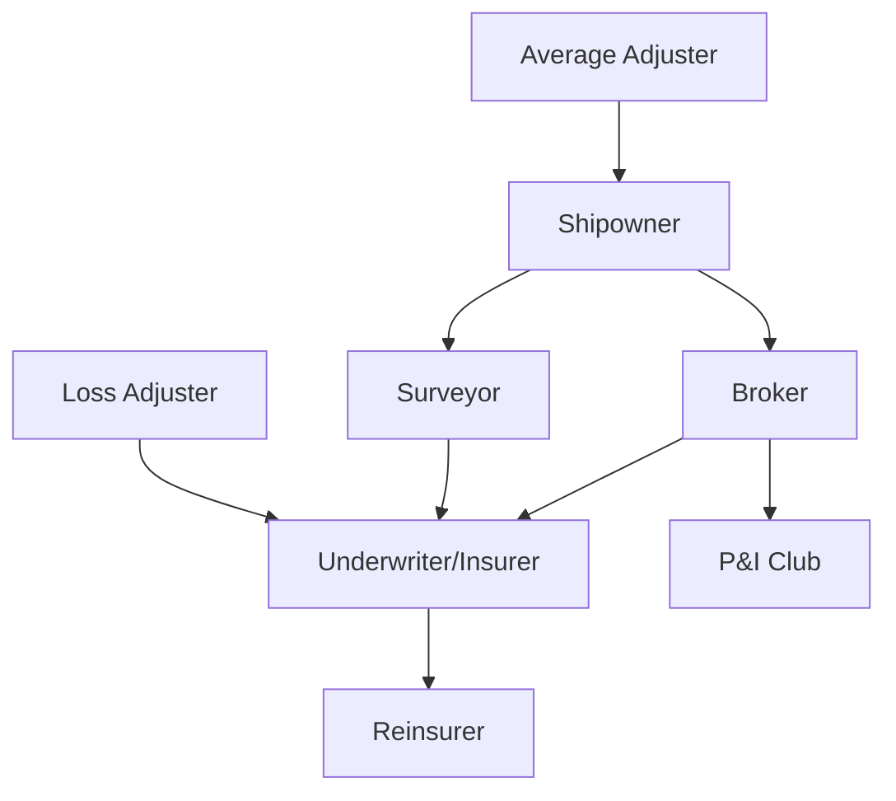
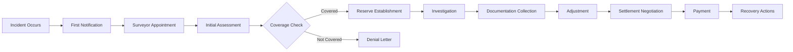
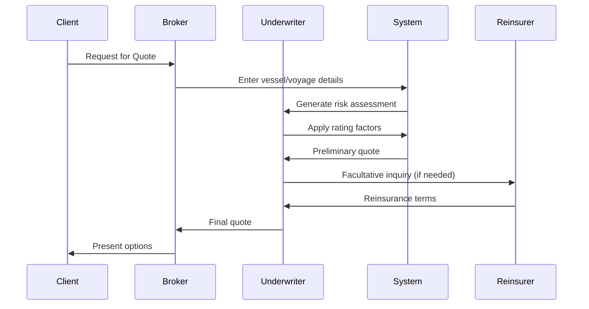

# Maritime Insurance Domain Training Guide

## Overview

This comprehensive training guide provides technical teams with essential domain knowledge for developing maritime insurance software solutions. It covers fundamental concepts, business processes, regulatory requirements, and technical integration points specific to the marine insurance industry.

## Learning Objectives

By completing this training, participants will:
- Understand the structure and terminology of maritime insurance
- Comprehend key business processes and workflows
- Recognize regulatory and compliance requirements
- Identify technical integration points and data requirements
- Apply domain knowledge to make informed development decisions

---

## Module 1: Maritime Insurance Fundamentals

### 1.1 Types of Marine Insurance

#### Hull Insurance
- **Coverage**: Physical damage to vessel structure, machinery, and equipment
- **Key Elements**:
  - Total loss (actual and constructive)
  - Particular average (partial damage)
  - Sue and labour expenses
  - Collision liability (3/4ths RDC)
- **Example**: Container ship suffers engine room fire causing $2M damage

#### Cargo Insurance
- **Coverage**: Goods in transit by sea, air, or land
- **Policy Types**:
  - Institute Cargo Clauses (A, B, C)
  - Warehouse to warehouse coverage
  - Temperature-controlled cargo provisions
- **Example**: Electronics shipment water damage during Pacific crossing

#### Protection & Indemnity (P&I)
- **Coverage**: Third-party liabilities not covered by hull insurance
- **Key Areas**:
  - Crew injury/death
  - Cargo damage/shortage
  - Pollution liability
  - Wreck removal
- **Example**: Oil tanker spill cleanup costs $50M

#### War Risk Insurance
- **Coverage**: Losses from war, terrorism, piracy
- **Exclusions**: Nuclear risks, cyber warfare (evolving)
- **Example**: Vessel detained in conflict zone for 6 months

### 1.2 Key Terminology

```
Glossary of Essential Terms:

- Assured/Insured: Party purchasing insurance
- Underwriter: Entity accepting risk
- Premium: Cost of insurance coverage
- Deductible/Excess: Amount insured pays before coverage
- General Average: Shared loss principle in maritime law
- Salvage: Reward for saving maritime property
- Subrogation: Insurer's right to recover from third parties
- Institute Clauses: Standard policy wordings (London market)
- Inchmaree Clause: Coverage for machinery breakdown
- York-Antwerp Rules: International general average rules
```

### 1.3 Regulatory Framework

#### International Maritime Organization (IMO)
- **Purpose**: UN agency for maritime safety and pollution prevention
- **Key Conventions**:
  - SOLAS (Safety of Life at Sea)
  - MARPOL (Marine Pollution)
  - STCW (Standards of Training, Certification)
- **Impact on Insurance**: Compliance affects premiums and coverage

#### Regional Regulations
- **EU**: Insurance Directive, MLC compliance
- **US**: Jones Act, OPA 90 (Oil Pollution Act)
- **Asia-Pacific**: Local cabotage laws, port state controls

### 1.4 Industry Structure



### Assessment 1.1: Fundamentals Knowledge Check

1. What is the difference between hull insurance and P&I coverage?
2. Explain general average and provide an example
3. List three IMO conventions and their insurance implications
4. Define subrogation in maritime context

---

## Module 2: Technical Domain Knowledge

### 2.1 Vessel Classification

#### Classification Societies
- **Major Societies** (IACS Members):
  - Lloyd's Register (LR)
  - American Bureau of Shipping (ABS)
  - Det Norske Veritas (DNV)
  - ClassNK
- **Functions**:
  - Technical standards development
  - Survey and certification
  - Condition assessment

#### Vessel Types and Risk Profiles

| Vessel Type | Key Risks | Insurance Considerations |
|------------|-----------|-------------------------|
| Container Ships | Stack collapse, fire | High cargo values, time sensitivity |
| Tankers | Pollution, explosion | Environmental liability focus |
| Bulk Carriers | Structural failure, cargo liquefaction | Age-related risks |
| Cruise Ships | Passenger liability, outbreak | High P&I exposure |
| Offshore Vessels | Weather exposure, technical complexity | Specialized coverage needs |

### 2.2 Risk Assessment Methodologies

#### Underwriting Factors

```python
# Risk Score Calculation Example
def calculate_risk_score(vessel_data):
    base_score = 100
    
    # Age factor
    age_factor = min(vessel_data['age'] * 2, 40)
    
    # Classification factor
    class_factor = {
        'IACS': 0,
        'Non-IACS': 20,
        'Unknown': 40
    }[vessel_data['classification']]
    
    # Flag state factor
    flag_factor = get_flag_state_score(vessel_data['flag'])
    
    # Trading area factor
    area_factor = get_trading_area_score(vessel_data['routes'])
    
    # Management factor
    mgmt_factor = get_management_score(vessel_data['manager'])
    
    risk_score = base_score + age_factor + class_factor + flag_factor + area_factor + mgmt_factor
    
    return risk_score
```

#### Data Points for Risk Assessment
1. **Vessel Particulars**:
   - Age, type, size (GT/DWT)
   - Classification society and status
   - Flag state and port state control record

2. **Operational History**:
   - Claims history (5-year minimum)
   - Detention/deficiency records
   - Crew nationality and experience

3. **Technical Condition**:
   - Survey reports
   - Maintenance records
   - Dry-docking history

### 2.3 Premium Calculation

#### Basic Premium Formula
```
Premium = (Sum Insured × Base Rate) × Risk Multipliers - Discounts + Loadings
```

#### Practical Example: Bulk Carrier Hull Insurance

```javascript
// Premium Calculation Engine
const calculatePremium = (vesselData, coverageData) => {
    // Base parameters
    const sumInsured = vesselData.marketValue; // $15,000,000
    const baseRate = 0.0045; // 0.45% base rate
    
    // Risk multipliers
    const ageMultiplier = vesselData.age > 15 ? 1.25 : 1.0;
    const flagMultiplier = getFlagMultiplier(vesselData.flag); // 0.9-1.3
    const classMultiplier = vesselData.isIACS ? 1.0 : 1.15;
    const tradeMultiplier = getTradeAreaMultiplier(vesselData.routes);
    
    // Discounts
    const deductibleDiscount = getDeductibleDiscount(coverageData.deductible);
    const fleetDiscount = vesselData.fleetSize > 10 ? 0.95 : 1.0;
    
    // Calculate
    let premium = sumInsured * baseRate;
    premium *= ageMultiplier * flagMultiplier * classMultiplier * tradeMultiplier;
    premium *= deductibleDiscount * fleetDiscount;
    
    // Minimum premium
    return Math.max(premium, 25000);
};
```

### 2.4 Claims Processing Workflows

#### Claims Lifecycle



#### Case Study: Cargo Damage Claim

**Scenario**: Electronics cargo worth $500,000 damaged by seawater ingress

**Processing Steps**:
1. **Notification** (Day 1):
   - Master's protest filed
   - Broker notifies underwriter
   - Surveyor instructed

2. **Survey** (Day 2-3):
   - Joint survey with cargo interests
   - Photographic evidence
   - Samples taken for testing

3. **Documentation** (Day 4-14):
   - Bill of lading
   - Commercial invoice
   - Packing list
   - Survey report
   - Sea protest

4. **Settlement** (Day 15-30):
   - Quantum assessment
   - Policy coverage verification
   - Deductible application
   - Payment authorization

### Assessment 2.1: Technical Knowledge Application

1. Calculate premium for a 10-year-old container vessel valued at $20M
2. List five key data points needed for underwriting assessment
3. Design a claims notification workflow diagram
4. Explain the role of classification societies in risk assessment

---

## Module 3: Business Process Understanding

### 3.1 Quote Generation Workflows

#### Standard Marine Quote Process



#### Quote Components

```json
{
  "quoteReference": "MQ-2024-001234",
  "vesselDetails": {
    "name": "MV EXAMPLE CARRIER",
    "imo": "9234567",
    "type": "Container",
    "built": 2015,
    "gt": 45000,
    "flag": "Singapore"
  },
  "coverage": {
    "type": "Hull & Machinery",
    "sumInsured": 25000000,
    "currency": "USD",
    "period": "12 months",
    "territorialLimits": "Worldwide excluding sanctioned areas",
    "deductible": {
      "machinery": 150000,
      "other": 100000
    }
  },
  "premium": {
    "annual": 187500,
    "rate": 0.75,
    "paymentTerms": "Quarterly",
    "minimumPremium": 150000
  },
  "conditions": [
    "Subject to satisfactory survey",
    "ISM compliance mandatory",
    "Classification society: IACS member only"
  ]
}
```

### 3.2 Policy Lifecycle Management

#### Policy Stages

1. **Inception**:
   - Quote acceptance
   - Documentation preparation
   - Premium collection
   - Coverage confirmation

2. **Mid-term Adjustments**:
   - Endorsements (voyage extensions, sum insured changes)
   - Additional premiums
   - Return premiums
   - Coverage modifications

3. **Renewal**:
   - Loss ratio analysis
   - Market review
   - Negotiation
   - Terms adjustment

4. **Expiry/Cancellation**:
   - Run-off provisions
   - Claims handling continuity
   - Premium adjustments
   - Documentation retention

#### System Requirements

```yaml
PolicyManagementSystem:
  Core Features:
    - Policy issuance and storage
    - Endorsement processing
    - Premium accounting
    - Document generation
    - Renewal tracking
    
  Integration Points:
    - Accounting systems
    - Claims platform
    - Reinsurance module
    - Regulatory reporting
    
  Data Requirements:
    - Policy versions history
    - Transaction audit trail
    - Premium payment tracking
    - Claims linkage
```

### 3.3 Broker Competition Process

#### London Market Slip Process

**Traditional Slip Components**:
- Leading underwriter (sets terms)
- Following markets (accept lead terms)
- Broker's order (placement sequence)

**Electronic Placement Evolution**:
```javascript
// Modern e-placement workflow
const placementProcess = {
    initiation: {
        platform: "PPL/Whitespace",
        documentType: "MRC (Market Reform Contract)",
        submissions: "Simultaneous to multiple markets"
    },
    
    quoting: {
        leadQuotes: "2-3 competitive leads sought",
        comparison: "Terms matrix generated",
        negotiation: "Best terms selected"
    },
    
    binding: {
        leadShare: "Typically 20-40%",
        following: "Remaining capacity filled",
        confirmation: "Electronic signing/stamping"
    }
};
```

### 3.4 Underwriting Procedures

#### Underwriting Authority Matrix

| Risk Type | Junior UW | Senior UW | CUO | Board |
|-----------|-----------|-----------|-----|-------|
| Clean Hull <$10M | ✓ | ✓ | ✓ | ✓ |
| Clean Hull $10-50M | Refer | ✓ | ✓ | ✓ |
| Older Tonnage (>20yr) | - | Refer | ✓ | ✓ |
| War Risk | - | - | ✓ | ✓ |
| Sanctions Exposed | - | - | - | ✓ |

#### Referral Triggers

```python
def check_referral_required(risk_data):
    referral_triggers = []
    
    # Age trigger
    if risk_data['vessel_age'] > 20:
        referral_triggers.append("Vessel over 20 years")
    
    # Value trigger
    if risk_data['sum_insured'] > 50000000:
        referral_triggers.append("SI exceeds $50M")
    
    # Claims trigger
    if risk_data['loss_ratio_3yr'] > 70:
        referral_triggers.append("Loss ratio >70%")
    
    # Sanctions trigger
    if any(port in SANCTIONED_PORTS for port in risk_data['trading_areas']):
        referral_triggers.append("Sanctions exposure")
    
    return {
        'referral_required': len(referral_triggers) > 0,
        'triggers': referral_triggers,
        'authority_level': determine_authority_level(referral_triggers)
    }
```

### Assessment 3.1: Business Process Scenarios

1. Design a quote workflow for a fleet of 5 tankers
2. List key data fields for policy endorsement processing
3. Explain the London market following process
4. Create an underwriting referral decision tree

---

## Module 4: Regulatory and Compliance

### 4.1 International Maritime Law

#### Key Conventions Impact on Insurance

**Hague-Visby Rules**:
- Carrier liability limits
- Cargo claim time bars
- Seaworthiness obligations
- Impact: Defines insurable exposures

**Hamburg Rules** (Limited adoption):
- Extended carrier liability
- Longer time limits
- Fire exception removed
- Impact: Higher P&I exposures where applicable

**Rotterdam Rules** (Not yet in force):
- Multimodal coverage
- Electronic documentation
- Volume contracts
- Impact: Future system requirements

### 4.2 Environmental Regulations

#### MARPOL Requirements

```markdown
MARPOL Annexes Insurance Implications:

Annex I (Oil Pollution):
- Bunker spill liability
- Tank cleaning claims
- Certificate requirements: IOPC, CLC

Annex II (Noxious Liquids):
- Chemical carrier requirements
- HNS Convention preparation

Annex VI (Air Pollution):
- Scrubber malfunction coverage
- Fuel switching incidents
- Carbon intensity regulations
```

#### Regional Environmental Rules

**EU Environmental Liability Directive**:
- Strict liability for environmental damage
- Mandatory financial security
- Restoration costs coverage

**US Environmental Regulations**:
- OPA 90: Unlimited liability for gross negligence
- CERCLA: Hazardous substance liability
- State-specific requirements (California particularly strict)

### 4.3 Safety Standards

#### ISM Code Compliance

**Insurance Requirements**:
```javascript
const ismComplianceCheck = {
    mandatory_documents: [
        "Document of Compliance (DOC)",
        "Safety Management Certificate (SMC)",
        "Crew certificates as per STCW"
    ],
    
    audit_requirements: {
        internal: "Annual",
        external: "Within 3 months of anniversary",
        renewal: "Every 5 years"
    },
    
    insurance_impact: {
        non_compliance: "Policy voidable",
        deficiencies: "Premium loading 10-25%",
        good_record: "Premium discount up to 10%"
    }
};
```

### 4.4 Data Protection Requirements

#### GDPR Compliance for Marine Insurance

**Key Requirements**:
1. **Lawful Basis**: Legitimate interest for underwriting
2. **Data Minimization**: Only collect necessary data
3. **Retention Periods**: 7 years post-policy expiry
4. **Cross-border Transfers**: Model clauses for Lloyd's market

**System Implementation**:
```yaml
DataProtectionFeatures:
  ConsentManagement:
    - Explicit consent tracking
    - Withdrawal mechanisms
    - Audit trail maintenance
    
  SubjectRights:
    - Access request handling
    - Rectification workflow
    - Erasure procedures (with legal hold)
    
  SecurityMeasures:
    - Encryption at rest and transit
    - Access control (role-based)
    - Breach notification system
```

### Assessment 4.1: Regulatory Compliance Check

1. Explain how MARPOL Annex VI affects hull insurance
2. List GDPR requirements for claims data handling
3. Describe ISM Code impact on policy validity
4. Design a compliance monitoring dashboard

---

## Module 5: System Integration Points

### 5.1 External Data Sources

#### Vessel Tracking and Intelligence

**AIS (Automatic Identification System)**:
```python
# AIS Integration Example
class AISDataIntegration:
    def __init__(self, provider_api):
        self.api = provider_api
        
    def get_vessel_position(self, imo_number):
        """Real-time position for risk monitoring"""
        return self.api.get_current_position(imo_number)
    
    def check_port_calls(self, imo_number, days=90):
        """Historical port calls for sanctions screening"""
        history = self.api.get_port_history(imo_number, days)
        return self.screen_sanctioned_ports(history)
    
    def monitor_trading_pattern(self, imo_number):
        """Detect unusual behavior (potential fraud)"""
        pattern = self.api.get_movement_pattern(imo_number)
        return self.analyze_anomalies(pattern)
```

**Data Providers Integration Matrix**:

| Provider Type | Use Case | Integration Method | Update Frequency |
|--------------|----------|-------------------|------------------|
| Lloyd's List Intelligence | Vessel details, ownership | REST API | Daily |
| IHS Markit | Technical specifications | SOAP/REST | Real-time |
| Windward | Behavioral analytics | Webhook | Event-driven |
| RightShip | Vetting scores | API pull | On-demand |
| Port State Control | Inspection records | FTP/API | Monthly |

### 5.2 API Integration Requirements

#### Standard Insurance APIs

```openapi
openapi: 3.0.0
info:
  title: Marine Insurance API
  version: 1.0.0

paths:
  /quotes:
    post:
      summary: Generate new quote
      requestBody:
        content:
          application/json:
            schema:
              type: object
              required:
                - vessel
                - coverage
                - period
              properties:
                vessel:
                  $ref: '#/components/schemas/Vessel'
                coverage:
                  $ref: '#/components/schemas/Coverage'
                period:
                  $ref: '#/components/schemas/Period'
      responses:
        200:
          description: Quote generated
          content:
            application/json:
              schema:
                $ref: '#/components/schemas/Quote'

  /policies/{policyNumber}/claims:
    post:
      summary: Register new claim
      parameters:
        - name: policyNumber
          in: path
          required: true
          schema:
            type: string
      requestBody:
        content:
          application/json:
            schema:
              $ref: '#/components/schemas/ClaimNotification'
```

### 5.3 Third-party Service Connections

#### Essential Service Integrations

**1. Sanctions Screening**:
```javascript
// Sanctions screening integration
const sanctionsScreening = async (entityData) => {
    const providers = [
        { name: 'WorldCheck', api: worldCheckAPI },
        { name: 'Dow Jones', api: dowJonesAPI },
        { name: 'OFAC', api: ofacAPI }
    ];
    
    const results = await Promise.all(
        providers.map(provider => 
            provider.api.screen({
                name: entityData.name,
                imo: entityData.imo,
                type: 'vessel'
            })
        )
    );
    
    return consolidateResults(results);
};
```

**2. Survey Management**:
- Survey appointment systems
- Report distribution
- Invoice processing
- Photo/document storage

**3. Premium Collection**:
- Payment gateways
- Bank integration
- Credit control systems
- Installment management

### 5.4 Compliance Reporting

#### Regulatory Reporting Requirements

```python
class RegulatoryReporting:
    def __init__(self):
        self.report_configs = {
            'Solvency II': {
                'frequency': 'Quarterly',
                'format': 'XBRL',
                'templates': ['QRT_S.16.01', 'QRT_S.17.01']
            },
            'Lloyd's Returns': {
                'frequency': 'Monthly',
                'format': 'CSV/XML',
                'categories': ['QMA', 'QMB', 'QMD']
            },
            'FCA Returns': {
                'frequency': 'Annual',
                'format': 'Gabriel',
                'requirements': ['RMAR', 'FSA029']
            }
        }
    
    def generate_solvency_report(self, reporting_date):
        """Generate Solvency II technical provisions report"""
        data = self.extract_policy_data(reporting_date)
        provisions = self.calculate_technical_provisions(data)
        return self.format_xbrl_output(provisions)
```

### Assessment 5.1: Integration Planning

1. Design data flow for vessel tracking integration
2. List API endpoints needed for claims system
3. Create sanctions screening workflow
4. Map regulatory reporting data requirements

---

## Case Studies and Practical Exercises

### Case Study 1: New Tanker Fleet Insurance Program

**Background**:
- Client: Global oil major
- Fleet: 15 VLCCs, average age 8 years
- Routes: Middle East to Asia/Europe
- Current coverage: Expiring in 60 days

**Exercise Tasks**:
1. Design quote collection process
2. Identify key underwriting considerations
3. Determine data integration needs
4. Plan system configuration requirements

**Solution Framework**:
```javascript
const fleetProgram = {
    underwriting_factors: [
        "Aggregate exposure limits",
        "Fleet discount structure",
        "Common renewal date alignment",
        "Cross-class coverage (Hull + P&I)"
    ],
    
    system_requirements: [
        "Fleet aggregation reporting",
        "Multi-vessel endorsement processing",
        "Consolidated billing",
        "Claims correlation analysis"
    ],
    
    integration_points: [
        "Vessel tracking for all units",
        "Crew matrix management",
        "Maintenance scheduling system",
        "Incident reporting platform"
    ]
};
```

### Case Study 2: Cyber Attack on Container Line

**Scenario**:
- Ransomware attack on booking system
- 48-hour operational disruption
- Cargo delays and claims
- Question: Insurance coverage?

**Analysis Points**:
1. Traditional marine policy exclusions
2. Standalone cyber coverage
3. Business interruption elements
4. Third-party liabilities

### Case Study 3: Environmental Incident Response

**Incident Details**:
- Bunker spill in sensitive area
- 200 MT heavy fuel oil
- Cleanup cost estimate: $25M
- Multiple jurisdiction involvement

**Response Workflow**:
1. Immediate notification procedures
2. Expert appointment and coordination
3. Regulatory liaison
4. Claims documentation requirements
5. Recovery prospects

---

## Knowledge Assessment

### Final Examination

**Section A: Multiple Choice (40%)**
1. Which convention governs carrier liability limits?
   - a) SOLAS
   - b) MARPOL
   - c) Hague-Visby Rules
   - d) ISM Code

2. P&I Clubs typically operate on:
   - a) Fixed premium basis
   - b) Mutual basis with calls
   - c) Profit-making basis
   - d) Government subsidy

**Section B: Scenario Analysis (30%)**
- Analyze a complex marine casualty
- Identify coverage implications
- Design claims handling workflow

**Section C: System Design (30%)**
- Create API specification for quote system
- Design data model for policy management
- Plan integration architecture

### Practical Project

**Build a Marine Insurance Calculator**:

Requirements:
- Vessel data input interface
- Risk scoring algorithm
- Premium calculation engine
- Quote document generation
- Basic API endpoints

Evaluation Criteria:
- Domain knowledge application
- Technical implementation
- User interface design
- Documentation quality

---

## Additional Resources

### Industry Publications
- Lloyd's List (daily shipping news)
- Marine Insurance International
- IUMI (International Union of Marine Insurance) statistics

### Technical Standards
- ACORD Marine standards
- ISO 28000 (Supply chain security)
- SWIFT MT700 (Documentary credits)

### Professional Development
- CII (Chartered Insurance Institute) - Marine modules
- IUMI education programs
- Lloyd's Market Association training

### System References
- London Market systems (PPL, IMR)
- ACORD implementation guides
- API documentation standards

---

## Conclusion

This training provides foundational knowledge for developing marine insurance systems. Success requires continuous learning as regulations, technology, and market practices evolve. Focus on understanding business needs while leveraging technical capabilities to create efficient, compliant solutions.

### Next Steps
1. Complete knowledge assessment
2. Build practical project
3. Shadow underwriting team
4. Review real system architectures
5. Participate in market forums

### Certification
Upon successful completion of assessment and practical project, participants receive "Marine Insurance Domain Specialist" certification valid for 2 years.