# AWS Architecture Visual Diagrams

## Overview

This document provides visual diagrams for all proposed AWS architecture options to help understand the infrastructure layouts, data flows, and component relationships for each deployment strategy.

---

## Option 1: Simple AWS Setup Architecture

### High-Level Architecture Diagram

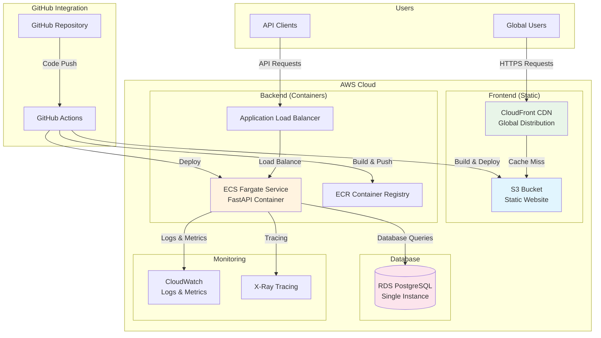

### Cost Breakdown Visualization

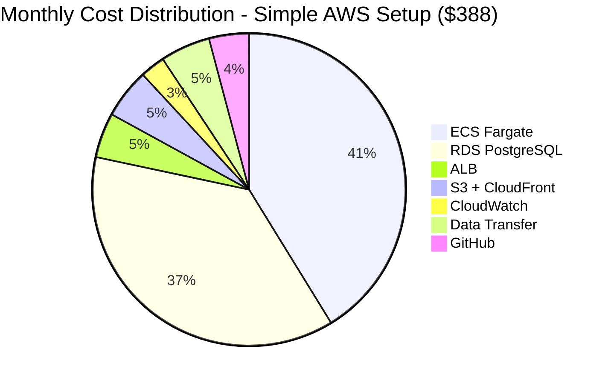

### Deployment Flow Diagram

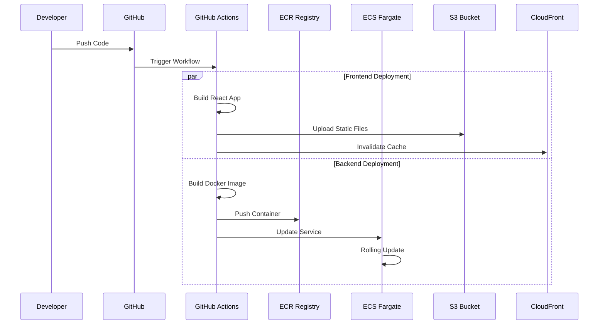

---

## Option 2: Multi-Environment Setup Architecture

### Multi-Environment Overview

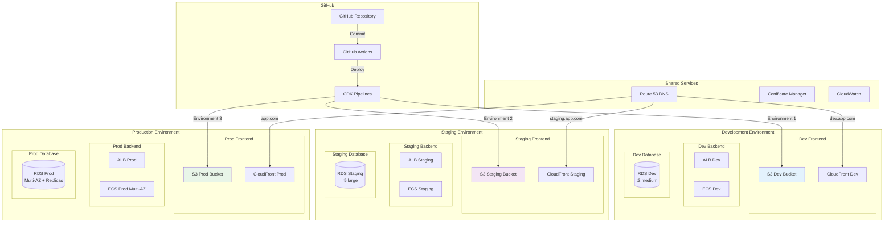

### Environment Promotion Pipeline

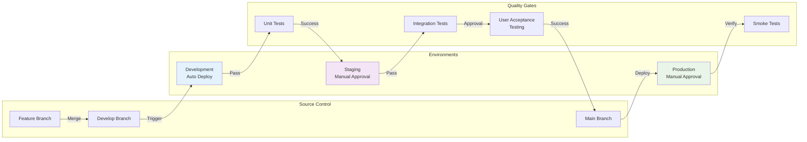

---

## Option 3: Full Ephemeral Environments Architecture

### Dynamic Environment Creation

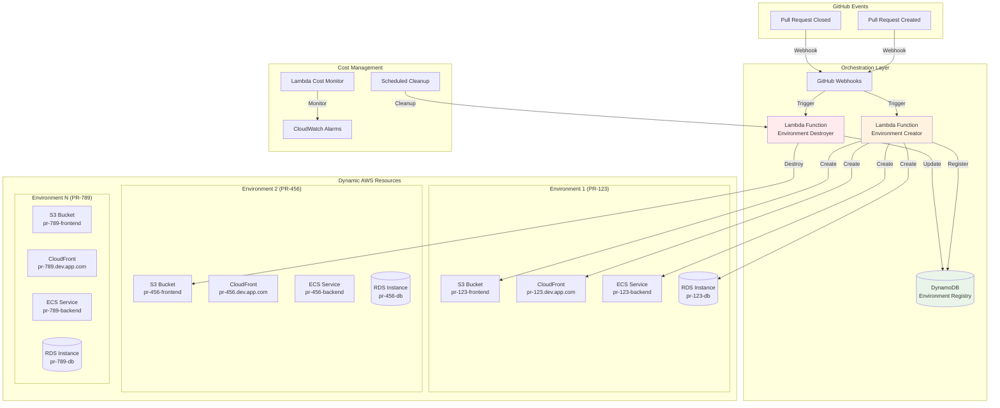

### Ephemeral Environment Lifecycle

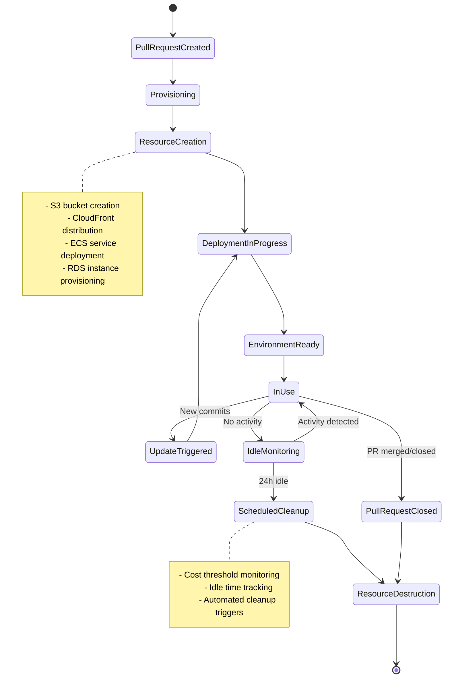

---

## Option 4: Hybrid Architecture

### Multi-Platform Integration

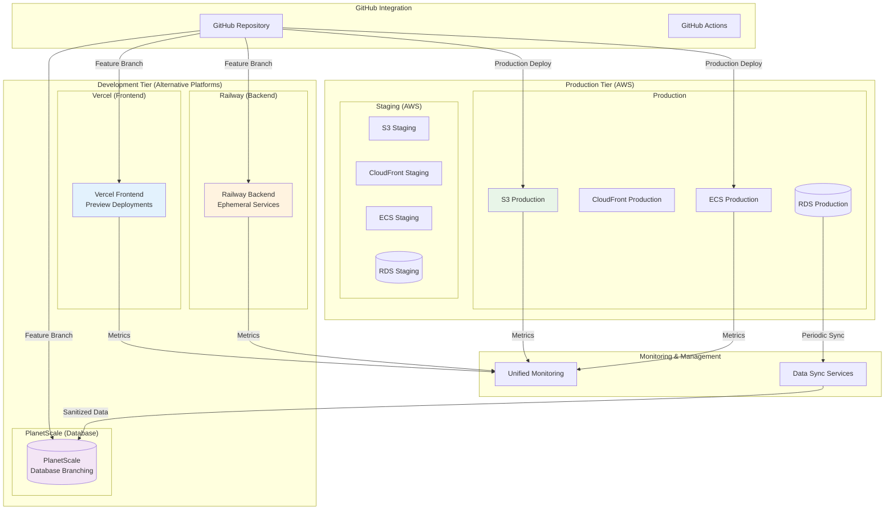

### Cost Optimization Comparison

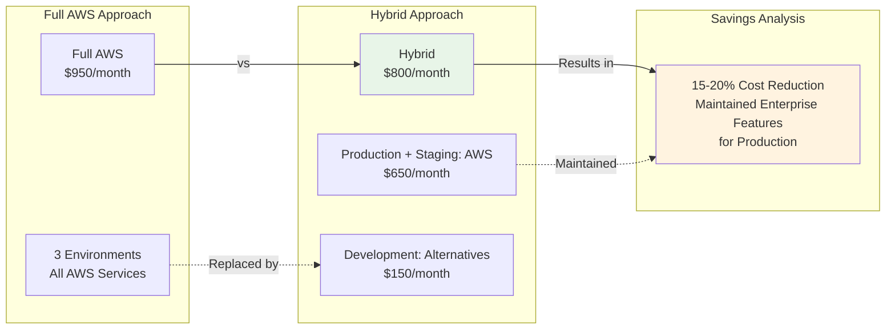

---

## Data Flow Diagrams

### Frontend Request Flow (S3 + CloudFront)

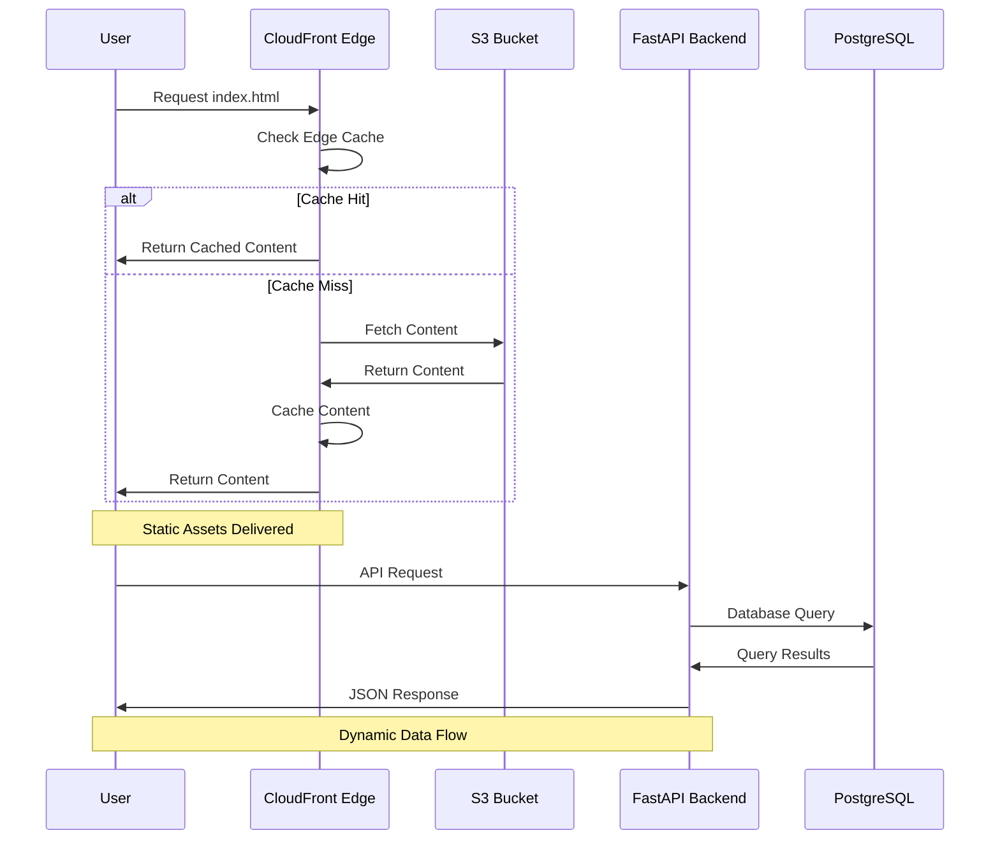

### Backend Auto-Scaling Flow

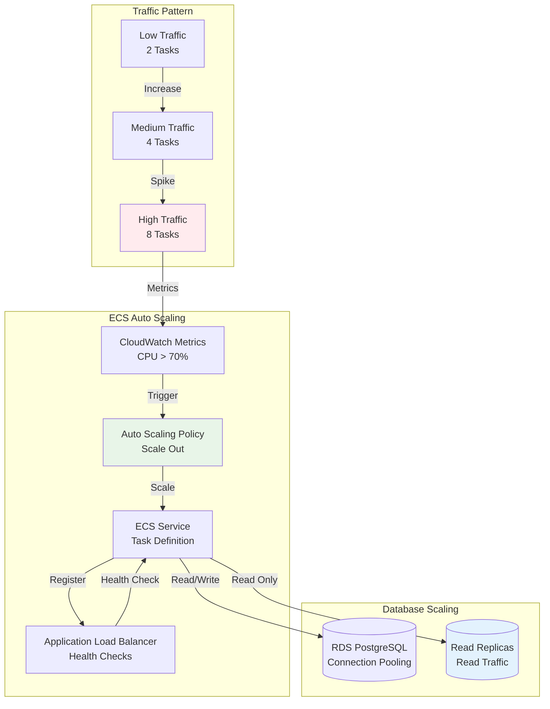

---

## Security Architecture

### Network Security Diagram

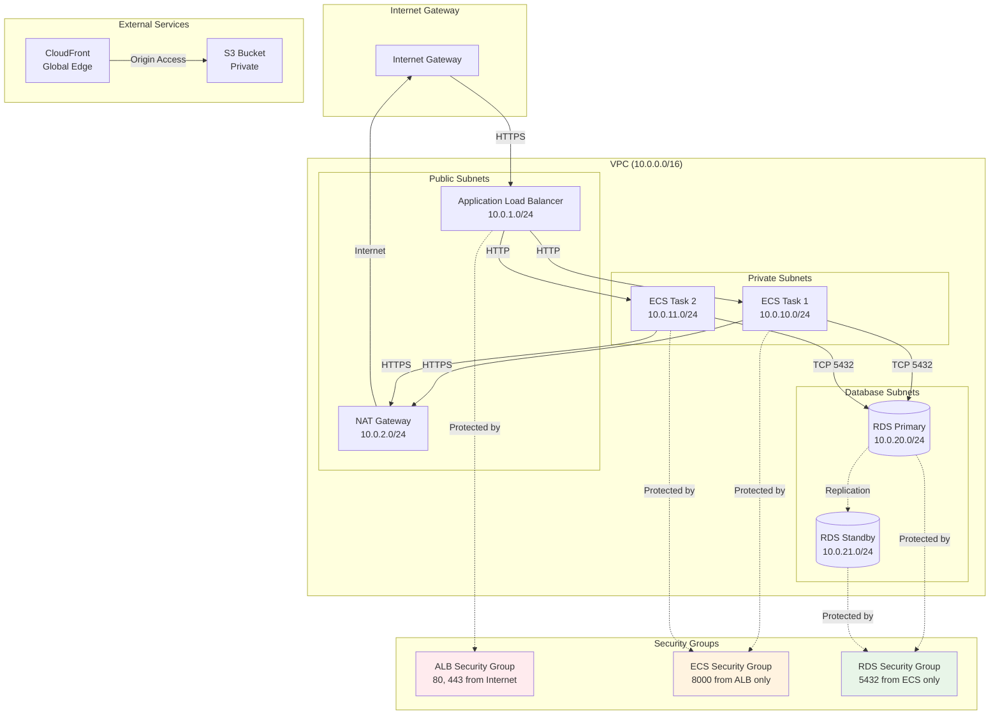

---

## Monitoring and Observability

### Comprehensive Monitoring Stack

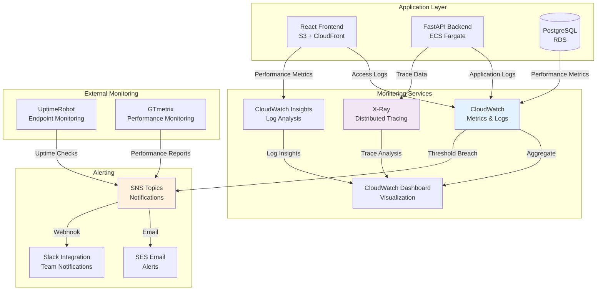

### Key Metrics Dashboard Layout

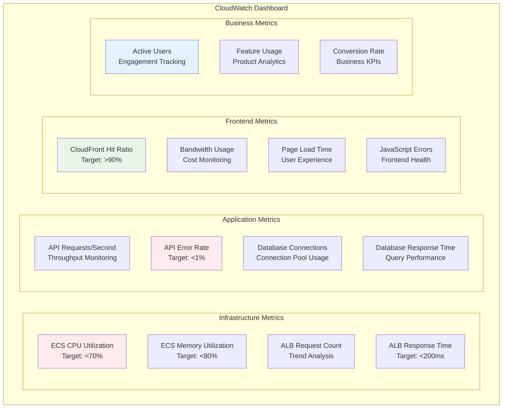

---

## Disaster Recovery Architecture

### Multi-Region Disaster Recovery

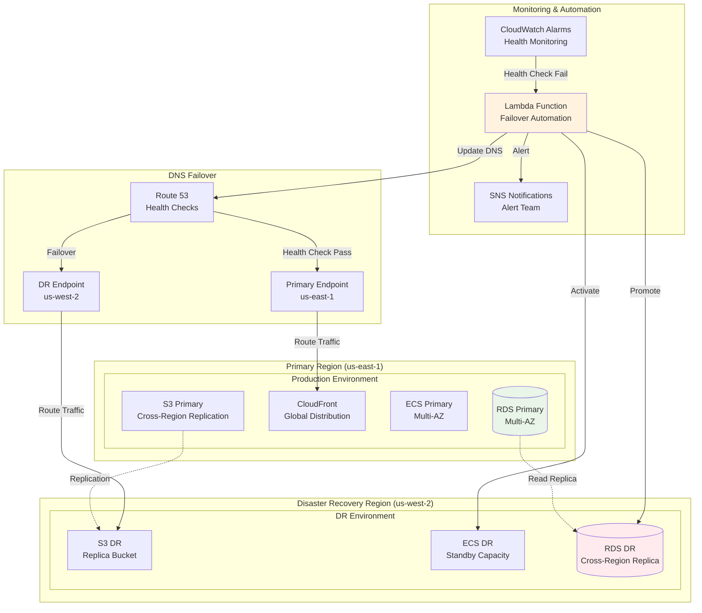

---

## Summary

These visual diagrams provide comprehensive views of each AWS architecture option, highlighting:

1. **Option 1**: Simple, cost-effective setup ideal for starting
2. **Option 2**: Professional multi-environment approach for scaling teams
3. **Option 3**: Advanced ephemeral environments for maximum development velocity
4. **Option 4**: Hybrid approach balancing cost and functionality

Each diagram shows the key components, data flows, cost structures, and operational considerations to help make informed architectural decisions based on your specific requirements and constraints.