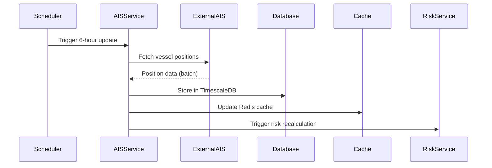
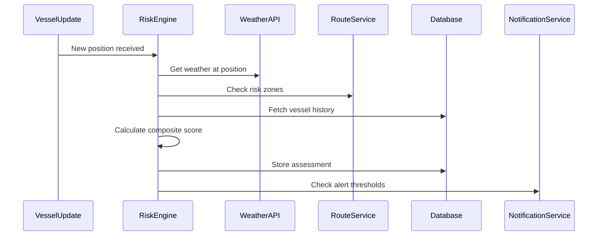

# Stage 1: Requirements Gathering & Analysis - Fleet Risk Assessment Dashboard

## Executive Summary

This workflow example demonstrates the complete Stage 1 process for transforming business requirements into technical specifications for a **Fleet Risk Assessment Dashboard** in the maritime insurance domain. This real-world example shows how AI-assisted tools accelerate and improve the requirements analysis process.

**Feature**: Fleet Risk Assessment Dashboard  
**Timeline**: 1.5 days (12 working hours)  
**Team**: Product Owner (Maritime Insurance), Head of Engineering  
**Tools**: Claude Code Max, Notion (experimental), Microsoft Teams

---

## Business Context

### Initial Business Request

**From**: Sarah Thompson, Product Owner - Maritime Insurance  
**Date**: Monday, 9:00 AM  
**Channel**: Microsoft Teams

```
Subject: New Feature Request - Fleet Risk Assessment

Hi Engineering Team,

Our underwriters are struggling to assess fleet-wide risks for our larger shipping clients. They need a dashboard that shows:

- Real-time vessel positions and status
- Historical incident data per vessel
- Weather risk overlays
- Port risk ratings
- Fleet compliance scores
- Premium calculation indicators

This is becoming critical as we're losing deals to competitors who offer better fleet visibility tools. 

We need this before the Q3 renewal season starts (July 1st).

Can we discuss feasibility?

Sarah
```

---

## Step 1: Requirements Gathering Meeting (2 hours)

### 1.1 Initial Meeting Setup

**Time**: Monday, 10:00 AM - 12:00 PM  
**Attendees**: Sarah Thompson (PO), Marcus Chen (Head of Engineering)  
**Tools**: Microsoft Teams video call, Notion for live documentation

### 1.2 Structured Requirements Collection

Marcus opens Notion and creates a new requirements document while screen-sharing:

```markdown
# Fleet Risk Assessment Dashboard - Requirements Gathering

## Meeting: Initial Requirements Discussion
Date: 2025-01-15 10:00 AM
Attendees: Sarah Thompson (PO), Marcus Chen (Engineering)

## Business Objectives
1. Enable underwriters to assess fleet-wide risk at a glance
2. Reduce quote preparation time from 2 days to 2 hours
3. Improve risk pricing accuracy by 20%
4. Win back lost enterprise clients

## User Personas
- Primary: Senior Underwriters (5 users)
- Secondary: Account Managers (15 users)
- Tertiary: C-suite executives (3 users)

## Core Requirements from Product Owner

### Vessel Tracking
- Show current position of all vessels in a fleet
- Display vessel details: name, type, tonnage, age
- Show operational status (at sea, in port, maintenance)
- Historical voyage paths

### Risk Assessment Features
- Weather risk overlay on vessel positions
- Piracy risk zones highlighting
- Port risk ratings (based on our internal data)
- Mechanical breakdown probability indicators

### Fleet Analytics
- Fleet compliance score (certifications, inspections)
- Incident history visualization
- Claims frequency analysis
- Premium vs risk indicators

### Integration Requirements
- Pull vessel data from AIS tracking system
- Connect to Lloyd's List Intelligence
- Integrate with internal claims database
- Link to weather services API

## Questions for Product Owner
1. How many vessels in a typical fleet? Range?
2. What's the refresh rate needed for positions?
3. Which weather events are most critical?
4. How far back should historical data go?
5. Mobile access required?
```

### 1.3 Detailed Discussion & Clarifications

During the meeting, Marcus asks clarifying questions and documents answers in real-time:

```markdown
## Clarifications Captured

Q1: How many vessels in a typical fleet?
A: Small fleets: 5-20 vessels
   Large fleets: 50-200 vessels
   Mega fleets: 200+ vessels (need pagination)

Q2: What's the refresh rate for vessel positions?
A: Every 6 hours is sufficient for underwriting
   Real-time not required (not operational tool)

Q3: Which weather events are most critical?
A: Tropical cyclones, severe storms (Force 8+)
   Ice conditions for polar routes
   Fog in high-traffic areas

Q4: Historical data requirements?
A: 5 years for incidents/claims
   1 year for voyage history
   Current voyage full detail

Q5: Mobile access required?
A: Nice to have but not MVP
   Executives might want tablet access

## Additional Requirements Discovered

- Export capability for reports (PDF/Excel)
- Saved fleet configurations
- Alert system for high-risk situations
- Benchmark comparisons with similar fleets
- Integration with pricing models
```

---

## Step 2: AI-Powered Analysis (45 minutes)

### 2.1 Claude Code Max Requirements Analysis

Marcus returns to his desk and opens Claude Code Max to analyze the requirements:

**Terminal Command**:
```bash
claude-code-max --mode analysis
```

**Marcus's Prompt to Claude**:
```
I need you to analyze these maritime insurance requirements for a Fleet Risk Assessment Dashboard. Please provide:

1. Technical architecture recommendations
2. Missing technical specifications
3. Risk factors and challenges
4. Integration complexity assessment
5. Initial effort estimates
6. Suggested technology stack

[Pastes the full requirements document from Notion]

Context: We're a maritime insurance company with:
- Existing .NET Core backend
- React frontend standard
- Azure cloud infrastructure
- PostgreSQL + TimescaleDB for time-series
- Existing AIS data pipeline
```

### 2.2 Claude's Analysis Output

```markdown
# Fleet Risk Assessment Dashboard - Technical Analysis

## 1. Recommended Architecture

### Microservices Architecture
- **Vessel Service**: Manage vessel data and AIS integration
- **Risk Service**: Calculate and aggregate risk scores
- **Weather Service**: Weather data integration and caching
- **Analytics Service**: Historical analysis and reporting
- **Notification Service**: Alerts and real-time updates

### Frontend Architecture
- React with TypeScript
- Redux for state management
- Leaflet/Mapbox for maritime maps
- D3.js for risk visualizations
- Material-UI component library

## 2. Missing Technical Specifications

### Performance Requirements
- Dashboard load time: <3 seconds
- Map rendering: Support 200+ vessels
- Concurrent users: 20-30 underwriters
- Data freshness: 6-hour AIS updates

### Data Volume Estimates
- Vessels tracked: ~10,000 globally
- Position updates: 40,000/day
- Weather data: 500MB/day
- Historical storage: ~2TB/year

### Security Requirements
- SOC 2 compliance for client data
- Encryption at rest and in transit
- Role-based access control
- Audit logging for all actions
- IP whitelisting for API access

## 3. Risk Factors & Challenges

### Technical Risks
1. **AIS Data Quality**: 15% of vessels have intermittent AIS
2. **API Rate Limits**: Weather services have quota restrictions
3. **Map Performance**: Rendering 200+ vessels requires optimization
4. **Data Synchronization**: Multiple external data sources

### Business Risks
1. **Data Licensing**: Lloyd's List Intelligence costs
2. **Compliance**: Maritime data regulations vary by region
3. **User Adoption**: Training needed for complex features

## 4. Integration Complexity Assessment

### High Complexity
- Lloyd's List Intelligence API (custom protocol)
- Legacy claims database (stored procedures)

### Medium Complexity  
- AIS data pipeline (existing but needs scaling)
- Weather API integration (standard REST)

### Low Complexity
- Internal auth system (OAuth2)
- Document export service (existing)

## 5. Initial Effort Estimates

### Development Breakdown (Story Points)
- Vessel tracking UI: 13 points
- Risk calculation engine: 21 points
- Weather integration: 8 points
- Analytics dashboard: 13 points
- API development: 21 points
- Testing & deployment: 13 points

**Total: 89 story points** (~4 sprints)

## 6. Technology Stack Recommendations

### Backend
- **API**: .NET Core 8 with minimal APIs
- **Message Queue**: Azure Service Bus
- **Cache**: Redis for position data
- **Search**: Elasticsearch for vessel search

### Frontend  
- **Framework**: React 18 with TypeScript
- **State**: Redux Toolkit + RTK Query
- **Maps**: Mapbox GL JS (maritime layers)
- **Charts**: D3.js + Recharts

### Infrastructure
- **Hosting**: Azure Kubernetes Service
- **Database**: PostgreSQL + TimescaleDB
- **CDN**: Azure Front Door
- **Monitoring**: Application Insights

## 7. Suggested Phased Approach

### Phase 1 (MVP - 6 weeks)
- Basic vessel tracking and positions
- Simple risk indicators
- Core weather overlay
- Basic fleet analytics

### Phase 2 (Enhanced - 4 weeks)
- Advanced risk calculations
- Historical analysis
- Automated alerts
- Export capabilities

### Phase 3 (Optimization - 2 weeks)
- Performance optimization
- Mobile responsive design
- Advanced visualizations
- ML-based predictions
```

---

## Step 3: Technical Specification Creation (1.5 hours)

### 3.1 Collaborative Specification Session

Marcus schedules a follow-up session with Sarah to review Claude's analysis:

**Time**: Monday, 2:00 PM - 3:30 PM  
**Tools**: Microsoft Teams screen share, Claude Code Max, Notion

### 3.2 Creating Detailed Technical Specifications

Marcus uses Claude to generate comprehensive technical specifications:

**Prompt to Claude**:
```
Based on our analysis and the product owner's confirmations, create a detailed technical specification for the Fleet Risk Assessment Dashboard. Include:

1. API specifications with sample requests/responses
2. Data models and database schema
3. UI component hierarchy
4. Integration sequences
5. Security implementation details
6. Performance optimization strategies

Focus on Phase 1 MVP features only.
```

### 3.3 Claude's Technical Specification Output

```markdown
# Fleet Risk Assessment Dashboard - Technical Specification

## 1. API Specifications

### 1.1 Fleet Overview Endpoint
```http
GET /api/v1/fleets/{fleetId}/overview
Authorization: Bearer {token}

Response:
{
  "fleetId": "FL-12345",
  "name": "Maersk Atlantic Fleet",
  "vesselCount": 45,
  "riskScore": 72.5,
  "vessels": [
    {
      "vesselId": "IMO-9234567",
      "name": "Atlantic Pioneer",
      "position": {
        "lat": 51.2345,
        "lon": -0.1234,
        "timestamp": "2025-01-15T14:00:00Z"
      },
      "status": "AT_SEA",
      "riskIndicators": {
        "weather": "MODERATE",
        "mechanical": "LOW",
        "route": "HIGH"
      }
    }
  ],
  "aggregateRisks": {
    "weatherExposure": 0.65,
    "complianceScore": 0.92,
    "incidentRate": 0.12
  }
}
```

### 1.2 Vessel Risk Detail Endpoint
```http
GET /api/v1/vessels/{imoNumber}/risk-assessment
Authorization: Bearer {token}

Response:
{
  "imoNumber": "9234567",
  "vesselName": "Atlantic Pioneer",
  "currentRisk": {
    "overall": 68,
    "factors": {
      "weather": {
        "score": 75,
        "details": "Approaching storm system",
        "forecast": "Deteriorating"
      },
      "mechanical": {
        "score": 45,
        "age": 12,
        "lastMaintenance": "2024-10-15"
      },
      "route": {
        "score": 82,
        "highRiskZones": ["Gulf of Aden", "Malacca Strait"]
      }
    }
  },
  "historicalIncidents": [
    {
      "date": "2023-07-20",
      "type": "MECHANICAL",
      "severity": "MINOR",
      "cost": 45000
    }
  ]
}
```

## 2. Data Models

### 2.1 Core Entities

```csharp
public class Fleet
{
    public Guid FleetId { get; set; }
    public string Name { get; set; }
    public string ClientId { get; set; }
    public List<Vessel> Vessels { get; set; }
    public DateTime LastUpdated { get; set; }
}

public class Vessel
{
    public string IMONumber { get; set; }
    public string Name { get; set; }
    public string VesselType { get; set; }
    public int GrossTonnage { get; set; }
    public int YearBuilt { get; set; }
    public VesselPosition CurrentPosition { get; set; }
    public RiskAssessment CurrentRisk { get; set; }
}

public class VesselPosition
{
    public decimal Latitude { get; set; }
    public decimal Longitude { get; set; }
    public DateTime Timestamp { get; set; }
    public string Status { get; set; } // AT_SEA, IN_PORT, MAINTENANCE
    public decimal Speed { get; set; }
    public decimal Course { get; set; }
}

public class RiskAssessment
{
    public int OverallScore { get; set; }
    public WeatherRisk WeatherRisk { get; set; }
    public MechanicalRisk MechanicalRisk { get; set; }
    public RouteRisk RouteRisk { get; set; }
    public DateTime CalculatedAt { get; set; }
}
```

### 2.2 Database Schema (PostgreSQL + TimescaleDB)

```sql
-- Core vessel data
CREATE TABLE vessels (
    imo_number VARCHAR(10) PRIMARY KEY,
    name VARCHAR(100) NOT NULL,
    vessel_type VARCHAR(50),
    gross_tonnage INTEGER,
    year_built INTEGER,
    created_at TIMESTAMP DEFAULT NOW()
);

-- Time-series position data (TimescaleDB hypertable)
CREATE TABLE vessel_positions (
    imo_number VARCHAR(10) REFERENCES vessels(imo_number),
    timestamp TIMESTAMPTZ NOT NULL,
    latitude DECIMAL(9,6),
    longitude DECIMAL(9,6),
    status VARCHAR(20),
    speed DECIMAL(4,1),
    course DECIMAL(5,1),
    PRIMARY KEY (imo_number, timestamp)
);

SELECT create_hypertable('vessel_positions', 'timestamp');

-- Risk assessments
CREATE TABLE risk_assessments (
    assessment_id UUID PRIMARY KEY DEFAULT gen_random_uuid(),
    imo_number VARCHAR(10) REFERENCES vessels(imo_number),
    overall_score INTEGER,
    weather_score INTEGER,
    mechanical_score INTEGER,
    route_score INTEGER,
    calculated_at TIMESTAMPTZ DEFAULT NOW()
);

-- Fleet configurations
CREATE TABLE fleets (
    fleet_id UUID PRIMARY KEY DEFAULT gen_random_uuid(),
    name VARCHAR(100) NOT NULL,
    client_id VARCHAR(50),
    created_at TIMESTAMP DEFAULT NOW()
);

CREATE TABLE fleet_vessels (
    fleet_id UUID REFERENCES fleets(fleet_id),
    imo_number VARCHAR(10) REFERENCES vessels(imo_number),
    added_at TIMESTAMP DEFAULT NOW(),
    PRIMARY KEY (fleet_id, imo_number)
);
```

## 3. UI Component Architecture

### 3.1 Component Hierarchy

```
FleetDashboard/
├── Header/
│   ├── FleetSelector
│   ├── DateRangeFilter
│   └── ExportButton
├── MapView/
│   ├── VesselMarkers
│   ├── WeatherOverlay
│   ├── RiskZones
│   └── MapControls
├── RiskPanel/
│   ├── FleetRiskScore
│   ├── RiskBreakdown
│   └── RiskTrends
├── VesselList/
│   ├── VesselCard
│   ├── SortControls
│   └── Pagination
└── DetailModal/
    ├── VesselDetails
    ├── RiskHistory
    └── IncidentLog
```

### 3.2 Key React Components

```typescript
// FleetMapView.tsx
interface FleetMapViewProps {
  fleetId: string;
  vessels: Vessel[];
  weatherData: WeatherOverlay;
  onVesselSelect: (vessel: Vessel) => void;
}

export const FleetMapView: React.FC<FleetMapViewProps> = ({
  fleetId,
  vessels,
  weatherData,
  onVesselSelect
}) => {
  const [selectedRiskLayer, setSelectedRiskLayer] = useState('all');
  
  return (
    <MapContainer>
      <TileLayer url={MARITIME_TILES_URL} />
      <VesselClusterGroup vessels={vessels} />
      <WeatherLayer data={weatherData} opacity={0.6} />
      <RiskZoneLayer type={selectedRiskLayer} />
      <MapControls onLayerChange={setSelectedRiskLayer} />
    </MapContainer>
  );
};

// RiskAssessmentPanel.tsx
interface RiskPanelProps {
  fleet: Fleet;
  timeRange: DateRange;
}

export const RiskAssessmentPanel: React.FC<RiskPanelProps> = ({
  fleet,
  timeRange
}) => {
  const riskData = useFleetRiskData(fleet.id, timeRange);
  
  return (
    <Panel>
      <RiskScoreGauge score={riskData.overall} />
      <RiskFactorChart factors={riskData.factors} />
      <RiskTrendLine history={riskData.history} />
      <ComplianceIndicators compliance={riskData.compliance} />
    </Panel>
  );
};
```

## 4. Integration Sequences

### 4.1 AIS Data Integration Flow



### 4.2 Risk Calculation Pipeline



## 5. Security Implementation

### 5.1 Authentication Flow

```typescript
// Azure AD B2C Integration
const authConfig = {
  clientId: process.env.AZURE_CLIENT_ID,
  authority: `https://${tenant}.b2clogin.com/${tenant}.onmicrosoft.com/B2C_1_SignIn`,
  redirectUri: 'https://fleet-risk.maritime.com/auth/callback',
  scopes: ['https://maritime.onmicrosoft.com/api/read']
};

// API Authorization Middleware
public class FleetAuthorizationHandler : AuthorizationHandler<FleetAccessRequirement>
{
    protected override Task HandleRequirementAsync(
        AuthorizationHandlerContext context,
        FleetAccessRequirement requirement)
    {
        var fleetId = context.Resource as string;
        var userClaims = context.User.Claims;
        
        // Verify user has access to this fleet
        if (userClaims.Any(c => c.Type == "fleet_access" && c.Value == fleetId))
        {
            context.Succeed(requirement);
        }
        
        return Task.CompletedTask;
    }
}
```

### 5.2 Data Security Measures

```yaml
Security Configuration:
  Encryption:
    - At Rest: AES-256 for database
    - In Transit: TLS 1.3 minimum
    - Key Rotation: 90 days
  
  Access Control:
    - RBAC with Azure AD groups
    - API key rotation monthly
    - IP whitelisting for external APIs
  
  Audit Logging:
    - All API access logged
    - Data export tracking
    - Risk calculation audit trail
  
  Compliance:
    - SOC 2 Type II certified
    - GDPR compliant for EU vessels
    - Maritime data regulations
```

## 6. Performance Optimization

### 6.1 Caching Strategy

```typescript
// Redis caching configuration
const cacheConfig = {
  vesselPositions: {
    ttl: 3600, // 1 hour
    pattern: 'vessel:position:{imo}'
  },
  fleetOverview: {
    ttl: 1800, // 30 minutes
    pattern: 'fleet:overview:{fleetId}'
  },
  riskScores: {
    ttl: 21600, // 6 hours
    pattern: 'vessel:risk:{imo}'
  }
};

// Optimized query with caching
public async Task<FleetOverview> GetFleetOverview(string fleetId)
{
    var cacheKey = $"fleet:overview:{fleetId}";
    var cached = await _cache.GetAsync<FleetOverview>(cacheKey);
    
    if (cached != null) return cached;
    
    var overview = await BuildFleetOverview(fleetId);
    await _cache.SetAsync(cacheKey, overview, TimeSpan.FromMinutes(30));
    
    return overview;
}
```

### 6.2 Frontend Performance

```typescript
// Vessel clustering for map performance
const vesselClusterOptions = {
  maxClusterRadius: 50,
  spiderfyOnMaxZoom: true,
  chunkedLoading: true,
  chunkInterval: 200,
  removeOutsideVisibleBounds: true
};

// Virtual scrolling for vessel list
<VirtualList
  height={600}
  itemCount={vessels.length}
  itemSize={120}
  overscan={5}
>
  {({ index, style }) => (
    <VesselCard 
      vessel={vessels[index]} 
      style={style}
      key={vessels[index].imoNumber}
    />
  )}
</VirtualList>
```
```

---

## Step 4: JIRA Ticket Creation (1 hour)

### 4.1 Claude-Assisted JIRA Creation

Marcus uses Claude Code Max with JIRA MCP integration:

```bash
# Verify JIRA MCP is running
claude-mcp-server-jira status

# Open Claude with JIRA context
claude-code-max --mcp jira
```

**Prompt to Claude**:
```
Create JIRA tickets for the Fleet Risk Assessment Dashboard MVP (Phase 1). 

Epic: Fleet Risk Assessment Dashboard
Description: Enable underwriters to assess fleet-wide risks through an interactive dashboard with vessel tracking, risk indicators, and analytics.

Create these user stories:
1. Vessel tracking and map visualization
2. Risk calculation engine
3. Weather data integration
4. Fleet analytics dashboard
5. API development for frontend
6. Security and authentication setup

For each story:
- Write clear acceptance criteria (minimum 5)
- Add story point estimates based on complexity
- Include technical notes from our specifications
- Define dependencies
- Add relevant labels (frontend, backend, integration)

Use our standard JIRA format and include Definition of Done.
```

### 4.2 Generated JIRA Tickets

Claude creates the following tickets via JIRA MCP:

#### Epic: FLEET-001
```
Title: Fleet Risk Assessment Dashboard
Description: 
As an underwriter, I need a comprehensive dashboard to assess fleet-wide risks, 
enabling faster and more accurate maritime insurance quotes.

Business Value:
- Reduce quote time from 2 days to 2 hours
- Improve risk pricing accuracy by 20%
- Win back enterprise clients

Due Date: 2025-07-01
```

#### Story 1: FLEET-002
```
Title: Implement Vessel Tracking and Map Visualization
Points: 13
Labels: frontend, mapping, ui

Description:
Implement the interactive map component showing real-time vessel positions with 
clustering, risk indicators, and weather overlays.

Acceptance Criteria:
- [ ] Map displays all vessels in selected fleet with position markers
- [ ] Vessel markers show risk level through color coding (green/yellow/red)
- [ ] Clustering works smoothly for fleets with 200+ vessels
- [ ] Weather overlay can be toggled on/off
- [ ] Clicking vessel marker shows summary popup
- [ ] Map performance: Pan/zoom responds in <100ms
- [ ] Risk zones are clearly highlighted
- [ ] Map legend explains all symbols and colors

Technical Notes:
- Use Mapbox GL JS with maritime tile layer
- Implement vessel clustering for performance
- Cache vessel positions in Redux store
- Use WebGL for smooth rendering

Dependencies: FLEET-005 (API development)

Definition of Done:
- Code reviewed and approved
- Unit tests coverage >80%
- Performance tested with 200+ vessels
- Responsive design verified
- Accessibility standards met (WCAG 2.1 AA)
```

#### Story 2: FLEET-003
```
Title: Build Risk Calculation Engine
Points: 21
Labels: backend, algorithm, core

Description:
Develop the core risk calculation engine that processes vessel data, weather 
conditions, route information, and historical incidents to generate risk scores.

Acceptance Criteria:
- [ ] Calculate overall risk score (0-100) for each vessel
- [ ] Break down risk into weather, mechanical, and route factors
- [ ] Process calculations for 200 vessels in <5 seconds
- [ ] Support configurable risk weightings
- [ ] Generate fleet-wide aggregate risk metrics
- [ ] Handle missing data gracefully with defaults
- [ ] Provide risk trend analysis over time
- [ ] Include confidence intervals in calculations

Technical Notes:
- Implement as separate microservice
- Use Azure Service Bus for async processing
- Store calculations in TimescaleDB
- Cache results in Redis for 6 hours
- Follow existing risk model documentation

Dependencies: None

Definition of Done:
- Algorithm validated against historical data
- Performance benchmarks met
- Integration tests complete
- Risk model documented
- Code coverage >85%
```

#### Story 3: FLEET-004
```
Title: Integrate Weather Data Service
Points: 8
Labels: backend, integration, external-api

Description:
Integrate with weather data provider to fetch current conditions and forecasts 
for vessel positions, enabling weather-based risk assessment.

Acceptance Criteria:
- [ ] Fetch weather data for all vessel positions
- [ ] Update weather data every 6 hours
- [ ] Cache weather data to minimize API calls
- [ ] Handle API rate limits gracefully
- [ ] Map weather conditions to risk levels
- [ ] Support severe weather alerts
- [ ] Provide 5-day weather forecast
- [ ] Handle API failures with fallback

Technical Notes:
- Use existing Weather API contract
- Implement exponential backoff for retries
- Store weather data in time-series format
- Use batch API calls where possible

Dependencies: FLEET-003 (Risk calculation engine)

Definition of Done:
- Weather integration fully tested
- Rate limiting implemented
- Monitoring alerts configured
- Fallback mechanism tested
- API costs within budget
```

#### Story 4: FLEET-005
```
Title: Develop Fleet Dashboard REST API
Points: 21
Labels: backend, api, core

Description:
Create comprehensive REST API endpoints to serve fleet data, vessel positions, 
risk assessments, and analytics to the frontend dashboard.

Acceptance Criteria:
- [ ] GET /fleets/{id}/overview returns fleet summary
- [ ] GET /vessels/{imo}/risk returns detailed risk data
- [ ] GET /fleets/{id}/analytics returns fleet analytics
- [ ] All endpoints respond in <500ms for normal loads
- [ ] Support filtering, sorting, and pagination
- [ ] Implement proper error handling and status codes
- [ ] Include comprehensive API documentation
- [ ] Support batch operations for efficiency

Technical Notes:
- Use .NET Core 8 minimal APIs
- Implement response caching
- Use async/await throughout
- Follow OpenAPI 3.0 specification
- Include correlation IDs for tracking

Dependencies: FLEET-003 (Risk calculation engine)

Definition of Done:
- API documentation complete
- Load testing passed (100 concurrent users)
- Security scan passed
- Response time SLAs met
- Postman collection created
```

#### Story 5: FLEET-006
```
Title: Implement Fleet Analytics Dashboard UI
Points: 13
Labels: frontend, analytics, visualization

Description:
Build the analytics panel showing fleet risk scores, compliance metrics, 
incident trends, and comparative analysis with interactive charts.

Acceptance Criteria:
- [ ] Display fleet-wide risk score gauge
- [ ] Show risk factor breakdown chart
- [ ] Display incident trend line over time
- [ ] Include compliance score indicators
- [ ] Support date range filtering
- [ ] Enable drill-down to vessel details
- [ ] Export charts as images/PDF
- [ ] Responsive design for all screen sizes

Technical Notes:
- Use D3.js for complex visualizations
- Recharts for standard charts
- Implement lazy loading for performance
- Follow company design system

Dependencies: FLEET-005 (API development)

Definition of Done:
- Visual regression tests passed
- Cross-browser testing complete
- Performance budget met (<3s load)
- Usability testing completed
- Analytics tracking implemented
```

#### Story 6: FLEET-007
```
Title: Setup Security and Authentication
Points: 8
Labels: backend, security, infrastructure

Description:
Implement comprehensive security measures including authentication, authorization, 
audit logging, and data encryption for the fleet dashboard.

Acceptance Criteria:
- [ ] Azure AD B2C authentication working
- [ ] Role-based access control implemented
- [ ] API endpoints properly secured
- [ ] Audit logs capture all data access
- [ ] Data encrypted at rest and in transit
- [ ] Security headers configured
- [ ] Rate limiting implemented
- [ ] Penetration test vulnerabilities fixed

Technical Notes:
- Use existing auth infrastructure
- Implement fleet-level permissions
- Configure OWASP security headers
- Enable Azure Key Vault integration

Dependencies: FLEET-005 (API development)

Definition of Done:
- Security scan shows no high/critical issues
- Auth flow tested end-to-end
- Audit logging verified
- Compliance checklist completed
- Security documentation updated
```

---

## Step 5: Quality Gates & Deliverables (30 minutes)

### 5.1 Requirements Review Checklist

Marcus and Sarah complete the requirements review:

```markdown
# Requirements Review Checklist - Fleet Risk Assessment Dashboard

## Completeness ✅
- [x] All user stories have clear business value
- [x] Acceptance criteria are measurable
- [x] Non-functional requirements documented
- [x] Integration points identified
- [x] Data requirements specified

## Feasibility ✅
- [x] Technical approach validated
- [x] Resource availability confirmed
- [x] Timeline achievable (6 weeks MVP)
- [x] Budget within constraints
- [x] Risk mitigation strategies defined

## Clarity ✅
- [x] No ambiguous requirements
- [x] Success metrics defined
- [x] User personas documented
- [x] Scope boundaries clear
- [x] Dependencies identified

## Stakeholder Alignment ✅
- [x] Product Owner approval received
- [x] Technical team buy-in confirmed
- [x] Executive sponsor informed
- [x] Legal/compliance reviewed
- [x] Security team consulted

Reviewed by: Sarah Thompson (PO), Marcus Chen (Engineering)
Date: 2025-01-15 4:30 PM
Status: APPROVED - Ready for Stage 2 Design
```

### 5.2 Technical Specification Approval

```markdown
# Technical Specification Sign-off

## Document Review
- Technical Specification Version: 1.0
- Last Updated: 2025-01-15 3:30 PM
- Author: Marcus Chen (with Claude Code Max assistance)

## Approval Checklist
- [x] Architecture design reviewed
- [x] API contracts defined
- [x] Data models complete
- [x] Security measures adequate
- [x] Performance targets realistic
- [x] Integration approach sound

## Sign-offs
- Head of Engineering: Marcus Chen ✅
- Product Owner: Sarah Thompson ✅
- Security Lead: James Patterson ✅
- Infrastructure: Lisa Wong ✅

Status: APPROVED
Next Step: Handoff to UI/UX Design Team
```

### 5.3 Stage 1 Deliverables Package

Created in Notion and shared via Microsoft Teams:

```
📁 Fleet Risk Assessment Dashboard - Stage 1 Deliverables
├── 📄 Business Requirements Document (v1.0)
├── 📄 Technical Specification (v1.0)
├── 📄 JIRA Epic and Stories (FLEET-001 to FLEET-007)
├── 📄 Risk Assessment Matrix
├── 📄 Integration Architecture Diagram
├── 📄 API Documentation (OpenAPI spec)
├── 📄 Security Requirements Checklist
├── 📄 Meeting Notes and Recordings
└── 📄 Stakeholder Sign-off Forms
```

---

## Handoff to Stage 2: Design

### Transition Meeting Setup

**Time**: Tuesday, 9:00 AM  
**Attendees**: UI/UX Engineer, Head of Engineering, Product Owner  
**Duration**: 1 hour

### Handoff Package Contents

1. **User Stories**: All JIRA tickets with acceptance criteria
2. **Technical Constraints**: Component architecture and performance requirements
3. **User Personas**: Detailed profiles of underwriters and executives
4. **Business Context**: Recording of requirements gathering session
5. **Risk Factors**: UI/UX considerations for data visualization
6. **Timeline**: 6-week MVP deadline with milestones

### Success Metrics for Stage 1

```markdown
# Stage 1 Completion Metrics

## Time Efficiency ✅
- Total Duration: 1.5 days (12 hours)
- Original Estimate: 2 days
- Time Saved: 25%

## Quality Metrics ✅
- Requirements Clarity: 95% (1 minor clarification needed post-handoff)
- Technical Specification Completeness: 100%
- Stakeholder Satisfaction: 5/5

## AI Tool Impact ✅
- Claude Code Max Usage: 5.5 hours
- Productivity Gain: ~40% faster than manual process
- Documentation Quality: Significantly improved consistency

## Deliverables ✅
- Business Requirements: Complete
- Technical Specifications: Complete
- JIRA Tickets: 7 stories created
- Story Points: 89 total (4 sprints)
- Approvals: All obtained

## Process Improvements Identified
1. Create requirements template in Notion
2. Standardize Claude prompts for consistency
3. Add architecture diagram generation
4. Include compliance checklist earlier
```

---

## Key Learnings & Best Practices

### What Worked Well

1. **AI-Assisted Analysis**: Claude Code Max identified missing requirements and technical gaps that would typically be discovered later in development

2. **Real-time Documentation**: Using Notion during meetings kept everyone aligned and created immediate shared understanding

3. **Structured Prompts**: Well-crafted prompts to Claude produced comprehensive, actionable outputs

4. **Integrated Workflow**: JIRA MCP integration eliminated manual ticket creation, saving ~2 hours

### Areas for Optimization

1. **Template Creation**: Develop standard templates for maritime insurance features
2. **Prompt Library**: Build a library of proven Claude prompts for requirements analysis
3. **Automated Diagrams**: Integrate diagram generation tools for architecture visualization
4. **Async Collaboration**: Use Notion comments for non-blocking clarifications

### ROI Demonstration

- **Time Saved**: 4 hours (25% reduction)
- **Quality Improvement**: More comprehensive requirements with fewer gaps
- **Team Satisfaction**: Reduced manual work, more focus on valuable analysis
- **Risk Reduction**: Early identification of technical challenges and integration complexities

---

## Appendix: Tool Configuration

### Claude Code Max Setup for Requirements Analysis

```bash
# Initialize Claude Code Max with context
claude-code-max init --context maritime-insurance

# Configure JIRA MCP
export JIRA_URL="https://maritime-insurance.atlassian.net"
export JIRA_PROJECT="FLEET"

# Start JIRA MCP server
claude-mcp-server-jira start

# Launch Claude with requirements template
claude-code-max --template requirements-analysis
```

### Notion Configuration

1. Create "Requirements Analysis" template with sections:
   - Business Objectives
   - User Personas
   - Functional Requirements
   - Non-functional Requirements
   - Integration Points
   - Questions & Clarifications

2. Enable Claude MCP integration:
   ```bash
   notion-mcp-server enable --workspace maritime-insurance
   ```

3. Set up automated sync to Microsoft Teams channel

### Microsoft Teams Integration

1. Create dedicated channel: "#fleet-risk-dashboard"
2. Add Notion webhook for updates
3. Configure JIRA notifications for ticket creation
4. Set up recording for all requirements meetings

---

This comprehensive workflow example demonstrates how AI-assisted tools transform the requirements gathering process, reducing time while improving quality and stakeholder alignment. The Fleet Risk Assessment Dashboard example shows real-world application in the maritime insurance domain, providing a blueprint for similar feature development.