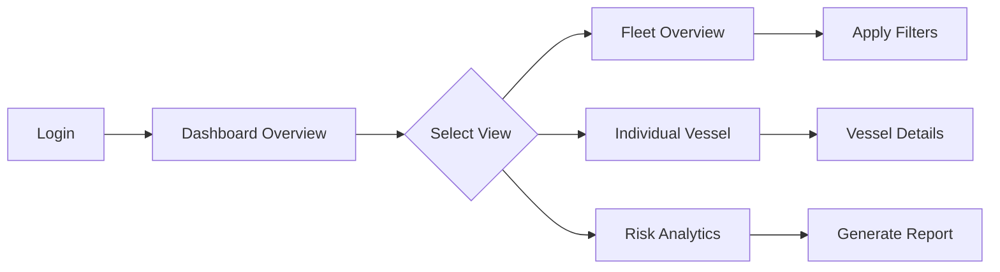
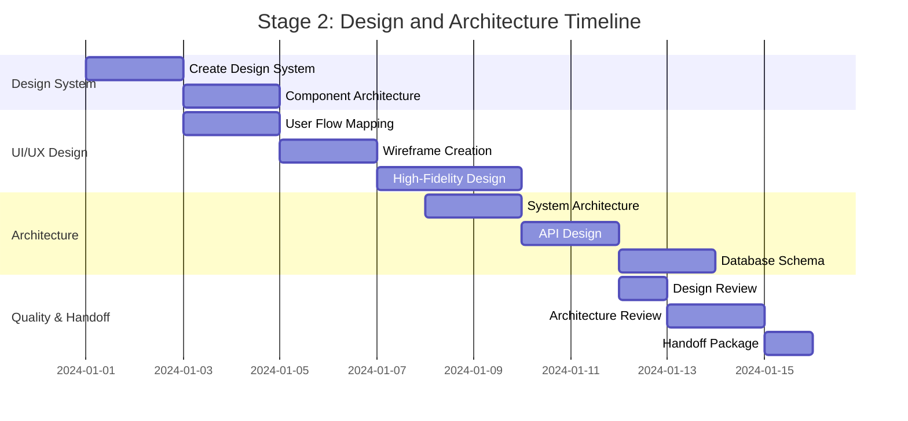

# Stage 2: Design and Architecture Workflow Example

## Maritime Insurance Feature: Fleet Risk Assessment Dashboard

### Overview

This workflow demonstrates the end-to-end design and architecture process for developing a Fleet Risk Assessment Dashboard - a critical feature for maritime insurance companies to evaluate and visualize risk factors across entire shipping fleets.

### Stage 2 Inputs (from Stage 1)

```yaml
technical_specifications:
  feature_name: "Fleet Risk Assessment Dashboard"
  version: "1.0.0"
  priority: "High"
  
  functional_requirements:
    - Real-time risk scoring for individual vessels
    - Fleet-wide risk aggregation and visualization
    - Historical risk trend analysis
    - Predictive risk modeling based on routes and weather
    - Compliance monitoring and alerts
    - Premium calculation integration
    
  non_functional_requirements:
    - Response time: < 2 seconds for dashboard load
    - Concurrent users: Support 500 simultaneous users
    - Data refresh: Real-time vessel tracking (30-second intervals)
    - Availability: 99.9% uptime
    - Security: SOC 2 Type II compliance
    
  user_stories:
    - As an underwriter, I need to view fleet-wide risk scores
    - As a risk analyst, I need to drill down into individual vessel risks
    - As a claims manager, I need to see historical incident patterns
```

## 1. Design System Creation Process

### Step 1.1: Initialize Design System in Figma

**Timeline**: Day 1-2

**Process**:
```
1. Create Figma project structure:
   /Fleet-Risk-Dashboard
   ├── Design System
   │   ├── Color Palette
   │   ├── Typography
   │   ├── Components
   │   └── Icons
   ├── Wireframes
   ├── High-Fidelity Designs
   └── Prototypes
```

**Maritime-Specific Design Tokens**:
```json
{
  "colors": {
    "risk": {
      "critical": "#D32F2F",
      "high": "#F57C00",
      "medium": "#FBC02D",
      "low": "#388E3C",
      "minimal": "#1976D2"
    },
    "vessel": {
      "cargo": "#5C6BC0",
      "tanker": "#7B1FA2",
      "container": "#00897B",
      "bulk": "#6D4C41"
    }
  },
  "spacing": {
    "dashboard-grid": "24px",
    "widget-padding": "16px",
    "data-table-row": "48px"
  }
}
```

### Step 1.2: Component Architecture Design

**AI-Assisted Component Generation with Claude Code Max**:

```typescript
// Prompt to Claude Code Max:
"Design a React component architecture for a maritime risk assessment dashboard 
that displays vessel risk scores, uses real-time data, and supports filtering"

// Claude Code Max Response:
interface FleetRiskDashboardProps {
  fleetId: string;
  timeRange: TimeRange;
  onVesselSelect: (vesselId: string) => void;
}

// Component hierarchy
const FleetRiskDashboard: React.FC<FleetRiskDashboardProps> = () => {
  return (
    <DashboardLayout>
      <RiskOverviewWidget />
      <FleetMapVisualization />
      <VesselRiskTable />
      <RiskTrendChart />
      <ComplianceAlerts />
    </DashboardLayout>
  );
};
```

## 2. UI/UX Design Process

### Step 2.1: User Flow Mapping

**Timeline**: Day 3-4



### Step 2.2: Wireframe Creation

**Low-Fidelity Wireframes** (Created in Figma):

```
┌─────────────────────────────────────────────────────┐
│ Fleet Risk Assessment Dashboard                      │
├─────────────────────────────────────────────────────┤
│ ┌─────────────┐ ┌─────────────┐ ┌─────────────┐   │
│ │ Total Fleet │ │ High Risk   │ │ Compliance  │   │
│ │ Risk: 7.2   │ │ Vessels: 12 │ │ Issues: 3   │   │
│ └─────────────┘ └─────────────┘ └─────────────┘   │
│                                                      │
│ ┌─────────────────────────┐ ┌───────────────────┐ │
│ │                         │ │                   │ │
│ │    Fleet Map View      │ │  Risk Trends      │ │
│ │                         │ │                   │ │
│ └─────────────────────────┘ └───────────────────┘ │
│                                                      │
│ ┌─────────────────────────────────────────────────┐│
│ │         Vessel Risk Table                       ││
│ └─────────────────────────────────────────────────┘│
└─────────────────────────────────────────────────────┘
```

### Step 2.3: High-Fidelity Design

**Timeline**: Day 5-7

**Design Specifications**:
- Grid System: 12-column responsive grid
- Breakpoints: Mobile (375px), Tablet (768px), Desktop (1440px)
- Color Usage: Risk-based color coding for immediate visual recognition
- Typography: Inter for UI, Roboto Mono for data

**Interactive Prototype Features**:
1. Hover states for all interactive elements
2. Click-through flow for vessel selection
3. Filter animation transitions
4. Real-time data update simulations

## 3. System Architecture Design

### Step 3.1: High-Level Architecture

**Timeline**: Day 8-9

```yaml
architecture:
  frontend:
    framework: Next.js 14
    state_management: Zustand
    ui_library: Tailwind CSS + Radix UI
    data_fetching: TanStack Query
    real_time: Socket.io client
    
  backend:
    api: Node.js + Express
    real_time: Socket.io server
    queue: Bull (Redis-based)
    cache: Redis
    
  data_layer:
    primary_db: PostgreSQL (Neon)
    time_series: TimescaleDB
    search: Elasticsearch
    
  external_integrations:
    vessel_tracking: AIS data providers
    weather_data: NOAA API
    compliance: IMO database
    maps: Mapbox GL
```

### Step 3.2: API Design and Documentation

**RESTful API Endpoints**:

```typescript
// API Schema using OpenAPI 3.0
paths:
  /api/v1/fleets/{fleetId}/risk-assessment:
    get:
      summary: Get fleet risk assessment
      parameters:
        - name: fleetId
          in: path
          required: true
          schema:
            type: string
        - name: timeRange
          in: query
          schema:
            type: string
            enum: [1d, 7d, 30d, 90d]
      responses:
        200:
          content:
            application/json:
              schema:
                $ref: '#/components/schemas/FleetRiskAssessment'
                
  /api/v1/vessels/{vesselId}/risk-history:
    get:
      summary: Get vessel risk history
      parameters:
        - name: vesselId
          in: path
          required: true
        - name: startDate
          in: query
          required: true
          schema:
            type: string
            format: date
```

**WebSocket Events**:

```typescript
// Real-time event definitions
interface RiskUpdateEvent {
  event: 'risk:update';
  data: {
    vesselId: string;
    oldRiskScore: number;
    newRiskScore: number;
    factors: RiskFactor[];
    timestamp: ISO8601;
  };
}

interface ComplianceAlertEvent {
  event: 'compliance:alert';
  data: {
    vesselId: string;
    alertType: 'certification' | 'inspection' | 'violation';
    severity: 'critical' | 'warning' | 'info';
    details: string;
  };
}
```

## 4. Database Schema Design

### Step 4.1: Core Schema Design

**Timeline**: Day 10-11

```sql
-- Fleet Management Schema
CREATE TABLE fleets (
    id UUID PRIMARY KEY DEFAULT gen_random_uuid(),
    company_id UUID NOT NULL,
    name VARCHAR(255) NOT NULL,
    created_at TIMESTAMP DEFAULT CURRENT_TIMESTAMP,
    updated_at TIMESTAMP DEFAULT CURRENT_TIMESTAMP
);

-- Vessel Information
CREATE TABLE vessels (
    id UUID PRIMARY KEY DEFAULT gen_random_uuid(),
    fleet_id UUID REFERENCES fleets(id),
    imo_number VARCHAR(7) UNIQUE NOT NULL,
    vessel_name VARCHAR(255) NOT NULL,
    vessel_type VARCHAR(50) NOT NULL,
    gross_tonnage INTEGER,
    year_built INTEGER,
    flag_state VARCHAR(3),
    created_at TIMESTAMP DEFAULT CURRENT_TIMESTAMP
);

-- Risk Assessments (Time-series data)
CREATE TABLE risk_assessments (
    id UUID PRIMARY KEY DEFAULT gen_random_uuid(),
    vessel_id UUID REFERENCES vessels(id),
    risk_score DECIMAL(3,1) CHECK (risk_score >= 0 AND risk_score <= 10),
    risk_category VARCHAR(20),
    assessed_at TIMESTAMP NOT NULL,
    factors JSONB NOT NULL,
    created_at TIMESTAMP DEFAULT CURRENT_TIMESTAMP
);

-- Create hypertable for time-series optimization
SELECT create_hypertable('risk_assessments', 'assessed_at');

-- Indexes for performance
CREATE INDEX idx_risk_assessments_vessel_time 
ON risk_assessments(vessel_id, assessed_at DESC);

CREATE INDEX idx_risk_assessments_fleet_time 
ON risk_assessments(vessel_id, assessed_at DESC) 
INCLUDE (risk_score, risk_category);
```

### Step 4.2: Compliance and Incident Tracking

```sql
-- Compliance Records
CREATE TABLE compliance_records (
    id UUID PRIMARY KEY DEFAULT gen_random_uuid(),
    vessel_id UUID REFERENCES vessels(id),
    compliance_type VARCHAR(50) NOT NULL,
    status VARCHAR(20) NOT NULL,
    expiry_date DATE,
    last_inspection DATE,
    details JSONB,
    created_at TIMESTAMP DEFAULT CURRENT_TIMESTAMP
);

-- Incident History
CREATE TABLE incidents (
    id UUID PRIMARY KEY DEFAULT gen_random_uuid(),
    vessel_id UUID REFERENCES vessels(id),
    incident_type VARCHAR(50) NOT NULL,
    severity VARCHAR(20) NOT NULL,
    occurred_at TIMESTAMP NOT NULL,
    location GEOGRAPHY(POINT),
    description TEXT,
    claim_amount DECIMAL(12,2),
    created_at TIMESTAMP DEFAULT CURRENT_TIMESTAMP
);
```

## 5. AI-Assisted Workflow Integration

### Step 5.1: Architecture Decision Support

**Using Claude Code Max for Architecture Decisions**:

```markdown
Prompt: "Analyze the trade-offs between using PostgreSQL with TimescaleDB 
extension vs. a dedicated time-series database like InfluxDB for storing 
vessel risk assessment data with 30-second update intervals for a fleet 
of 1000 vessels"

Claude Code Max Analysis:
- PostgreSQL + TimescaleDB recommended for:
  - Unified data model with relational data
  - ACID compliance for financial calculations
  - Familiar SQL interface
  - Cost-effective at this scale
  
- Performance optimizations suggested:
  - Chunk interval: 1 day
  - Retention policy: 2 years detailed, 5 years aggregated
  - Continuous aggregates for dashboard queries
```

### Step 5.2: Automated Code Generation

**Component Generation from Design**:

```typescript
// Generated by Claude Code Max from Figma design specs
import { Card, CardHeader, CardContent } from '@/components/ui/card';
import { TrendingUp, TrendingDown, AlertTriangle } from 'lucide-react';

interface RiskOverviewWidgetProps {
  fleetRiskScore: number;
  previousScore: number;
  highRiskVessels: number;
  complianceIssues: number;
}

export const RiskOverviewWidget: React.FC<RiskOverviewWidgetProps> = ({
  fleetRiskScore,
  previousScore,
  highRiskVessels,
  complianceIssues
}) => {
  const trend = fleetRiskScore - previousScore;
  const TrendIcon = trend > 0 ? TrendingUp : TrendingDown;
  const trendColor = trend > 0 ? 'text-red-500' : 'text-green-500';
  
  return (
    <div className="grid grid-cols-1 md:grid-cols-3 gap-6">
      <Card>
        <CardHeader>
          <h3 className="text-sm font-medium text-gray-500">Fleet Risk Score</h3>
        </CardHeader>
        <CardContent>
          <div className="flex items-baseline gap-2">
            <span className="text-3xl font-bold">{fleetRiskScore.toFixed(1)}</span>
            <TrendIcon className={`w-5 h-5 ${trendColor}`} />
          </div>
        </CardContent>
      </Card>
      
      {/* Additional cards for high risk vessels and compliance */}
    </div>
  );
};
```

### Step 5.3: Design Pattern Recommendations

**AI-Suggested Patterns**:

1. **Repository Pattern for Data Access**:
```typescript
// Suggested by Claude Code Max for clean architecture
interface VesselRiskRepository {
  getFleetRiskAssessment(fleetId: string, timeRange: TimeRange): Promise<FleetRiskData>;
  getVesselRiskHistory(vesselId: string, dateRange: DateRange): Promise<RiskHistory[]>;
  subscribeToRiskUpdates(vesselIds: string[], callback: RiskUpdateCallback): Unsubscribe;
}
```

2. **Observer Pattern for Real-time Updates**:
```typescript
// WebSocket event handling with automatic reconnection
class RiskUpdateService {
  private socket: Socket;
  private subscribers: Map<string, Set<RiskUpdateCallback>>;
  
  constructor() {
    this.setupSocketConnection();
    this.setupAutoReconnect();
  }
  
  subscribe(vesselId: string, callback: RiskUpdateCallback) {
    // Implementation
  }
}
```

### Step 5.4: Performance Optimization Suggestions

**Claude Code Max Performance Analysis**:

```typescript
// Optimization 1: Virtual scrolling for large vessel lists
import { useVirtualizer } from '@tanstack/react-virtual';

// Optimization 2: Memoized risk calculations
const calculateFleetRisk = useMemo(() => {
  return vessels.reduce((acc, vessel) => {
    return acc + (vessel.riskScore * vessel.grossTonnage);
  }, 0) / totalTonnage;
}, [vessels]);

// Optimization 3: Debounced search with query caching
const debouncedSearch = useDebouncedCallback((searchTerm: string) => {
  queryClient.prefetchQuery({
    queryKey: ['vessels', 'search', searchTerm],
    queryFn: () => searchVessels(searchTerm),
    staleTime: 5 * 60 * 1000, // 5 minutes
  });
}, 300);
```

## 6. Quality Gates and Deliverables

### Step 6.1: Design Review Checklist

**Timeline**: Day 12

**Design Review Criteria**:
- [ ] Accessibility: WCAG 2.1 AA compliance verified
- [ ] Responsive design: Tested on all target devices
- [ ] Brand consistency: Follows maritime insurance brand guidelines
- [ ] User testing: Minimum 5 user sessions completed
- [ ] Performance: Lighthouse score > 90
- [ ] Internationalization: Support for 5 target languages

**Review Process**:
```yaml
participants:
  - Lead Designer
  - Frontend Architect
  - Product Manager
  - Underwriting Team Representative
  - UX Researcher
  
review_stages:
  1. Internal design team review
  2. Technical feasibility review
  3. Stakeholder presentation
  4. User testing feedback incorporation
  5. Final approval
```

### Step 6.2: Architecture Approval Process

**Timeline**: Day 13-14

**Architecture Decision Records (ADR)**:

```markdown
# ADR-001: Real-time Data Architecture

## Status
Accepted

## Context
Need to display real-time vessel positions and risk updates with 
30-second refresh intervals for 1000+ vessels.

## Decision
Use WebSocket connections with Socket.io for real-time updates, 
backed by Redis pub/sub for scalability.

## Consequences
- Positive: Low latency updates, efficient bandwidth usage
- Negative: Additional infrastructure complexity
- Mitigation: Use managed Redis service (Upstash)
```

### Step 6.3: Prototype Validation

**Validation Metrics**:
- Load time: < 2 seconds (measured)
- Time to interactive: < 3 seconds
- Risk calculation accuracy: 99.9%
- Real-time update latency: < 500ms

**Testing Protocol**:
```javascript
// Performance testing script
describe('Fleet Risk Dashboard Performance', () => {
  test('Dashboard loads within 2 seconds', async () => {
    const startTime = performance.now();
    await page.goto('/dashboard/fleet-risk');
    await page.waitForSelector('[data-testid="risk-overview"]');
    const loadTime = performance.now() - startTime;
    expect(loadTime).toBeLessThan(2000);
  });
  
  test('Handles 500 concurrent WebSocket connections', async () => {
    const connections = await createConcurrentConnections(500);
    const updateLatencies = await measureUpdateLatencies(connections);
    expect(Math.max(...updateLatencies)).toBeLessThan(500);
  });
});
```

### Step 6.4: Handoff to Development Team

**Timeline**: Day 15

**Deliverables Package**:

1. **Design Assets**:
   - Figma file with all components and variants
   - Exported assets (SVG icons, images)
   - Design tokens (JSON format)
   - Interactive prototype link

2. **Technical Documentation**:
   - System architecture diagram
   - API specification (OpenAPI 3.0)
   - Database schema with migration scripts
   - Component hierarchy documentation
   - Performance requirements document

3. **Implementation Guide**:
   ```markdown
   ## Development Setup Guide
   
   ### Prerequisites
   - Node.js 20.x
   - PostgreSQL 15 with TimescaleDB
   - Redis 7.x
   - Mapbox API key
   
   ### Initial Setup
   1. Clone design system: `git clone ...`
   2. Install dependencies: `pnpm install`
   3. Setup database: `pnpm db:migrate`
   4. Configure environment: Copy `.env.example` to `.env`
   5. Start development: `pnpm dev`
   ```

4. **Acceptance Criteria**:
   - All user stories implemented
   - Performance benchmarks met
   - Accessibility standards verified
   - Security review passed
   - Integration tests coverage > 80%

## Success Criteria and Metrics

### Design Phase Success Metrics

```yaml
success_metrics:
  design_quality:
    - User satisfaction score: > 4.5/5
    - Design iteration count: < 3
    - Stakeholder approval: First review
    
  technical_feasibility:
    - Architecture risk score: Low
    - Estimated development time: Within 15% of target
    - Technical debt assessment: Minimal
    
  handoff_efficiency:
    - Development questions: < 5 per sprint
    - Design clarification requests: < 10 total
    - Rework due to design issues: < 5%
```

### Timeline Summary



### Post-Design Monitoring

**Ongoing Metrics**:
- Design-to-development translation accuracy
- Number of design changes during development
- Time saved through AI-assisted design
- Component reusability rate

## Conclusion

This Stage 2 workflow demonstrates how modern design and architecture practices, combined with AI assistance from Claude Code Max, can accelerate the creation of complex maritime insurance applications while maintaining high quality standards. The Fleet Risk Assessment Dashboard example shows the practical application of these processes in a real-world scenario.

### Key Takeaways

1. **AI Integration**: Claude Code Max significantly accelerates architecture decisions and code generation
2. **Tool Synergy**: Figma + Claude Code Max + Cursor IDE creates a seamless design-to-code pipeline
3. **Quality Gates**: Multiple review points ensure design and architecture quality
4. **Maritime Context**: Industry-specific requirements drive unique design patterns
5. **Measurable Success**: Clear metrics enable continuous improvement

### Next Steps

- Proceed to Stage 3: Development workflow
- Implement continuous design system updates
- Establish design-development feedback loops
- Monitor and optimize based on success metrics