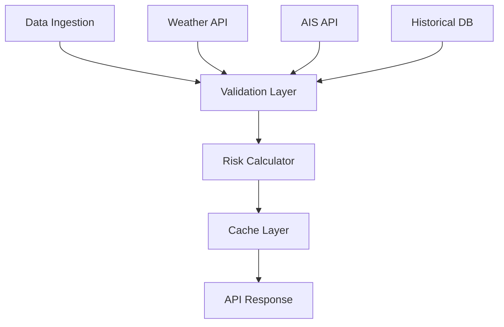

# Stage 3: Development Planning - Fleet Risk Assessment Dashboard

## Workflow Overview

This document provides a comprehensive workflow example for Stage 3 (Development Planning) of the AI-Assisted SDLC, demonstrating how teams transform design documents into actionable development plans using AI-powered tools.

**Feature**: Fleet Risk Assessment Dashboard for Maritime Insurance
**Stage Focus**: Task breakdown, sprint planning, and resource allocation
**Duration**: 2-3 days planning cycle

---

## Stage 3 Inputs

### From Stage 2 (Design)
```yaml
Design Deliverables Received:
  - Technical Architecture Document
  - UI/UX Mockups (Figma)
  - API Specifications
  - Database Schema Design
  - System Integration Map
  - Performance Requirements
  - Security Requirements Document
```

### Design Summary: Fleet Risk Assessment Dashboard
```markdown
Purpose: Real-time risk monitoring and assessment for insured maritime fleets
Users: Underwriters, Risk Analysts, Account Managers
Scale: 500+ vessels, 50+ concurrent users
Data Sources: AIS tracking, weather data, port reports, claims history
Key Features:
  - Real-time vessel tracking
  - Risk score calculation
  - Alert management system
  - Historical analysis tools
  - Report generation
```

---

## Planning Workflow Process

### Day 1 Morning: Initial Planning Session

#### 9:00 AM - Epic Creation and Analysis

**Product Owner opens GitHub Issues and creates epic:**
```markdown
Epic: Fleet Risk Assessment Dashboard
Description: Implement comprehensive risk monitoring system for maritime fleets
Business Value: Reduce claim costs by 15% through proactive risk management
Acceptance Criteria:
  - Real-time vessel position tracking
  - Dynamic risk score calculation
  - Automated alert generation
  - Historical trend analysis
  - Export capabilities for reports
```

**Team uses Claude Code Max for initial breakdown:**
```markdown
Prompt: "Analyze the Fleet Risk Assessment Dashboard epic and create a comprehensive 
task breakdown structure. Consider the technical architecture document and identify 
all development tasks, dependencies, and potential risks."

Claude Response:
Based on the epic and technical documents, I've identified the following structure:

## Task Breakdown Structure

### 1. Backend Infrastructure (40 story points)
- Database schema implementation (8 pts)
- AIS data integration service (13 pts)
- Weather API integration (8 pts)
- Risk calculation engine (13 pts)
- Alert management system (8 pts)

### 2. Frontend Components (32 story points)
- Fleet overview dashboard (8 pts)
- Individual vessel detail view (5 pts)
- Risk visualization components (8 pts)
- Alert management interface (5 pts)
- Report generation UI (6 pts)

### 3. Data Pipeline (24 story points)
- Real-time data streaming setup (8 pts)
- Data transformation layer (8 pts)
- Historical data aggregation (8 pts)

### 4. Integration & Testing (16 story points)
- API integration tests (5 pts)
- E2E test scenarios (8 pts)
- Performance optimization (3 pts)
```

#### 10:00 AM - Detailed Story Creation

**Development Lead uses Notion for story creation:**

```markdown
## User Story Template

Story ID: RISK-001
Title: Implement vessel tracking data pipeline
As a: Risk Analyst
I want to: See real-time vessel positions on the dashboard
So that: I can monitor high-risk areas and weather conditions

### Technical Details
- Integrate with AIS data provider API
- Store vessel positions in time-series database
- Update positions every 5 minutes
- Handle up to 1000 vessels concurrently

### Acceptance Criteria
- [ ] Vessel positions update within 5 minutes
- [ ] Historical position data retained for 90 days
- [ ] API handles connection failures gracefully
- [ ] Performance: <200ms response time

### Dependencies
- AIS provider API credentials
- Time-series database setup
- Authentication service integration
```

**Team creates stories in GitHub Issues:**
```bash
# Using GitHub CLI to create stories
gh issue create \
  --title "RISK-001: Implement vessel tracking data pipeline" \
  --body "$(cat story-risk-001.md)" \
  --label "backend,data-pipeline,sprint-1" \
  --milestone "Fleet Risk Dashboard MVP" \
  --assignee "@backend-team"
```

### Day 1 Afternoon: Technical Planning Deep Dive

#### 1:00 PM - Architecture Review and Task Refinement

**Senior Engineers use Claude Code Max for technical analysis:**

```markdown
Prompt: "Review the risk calculation engine requirements and break down into 
specific implementation tasks. Include performance considerations for processing 
500+ vessels every 5 minutes."

Claude Response:
## Risk Calculation Engine - Detailed Implementation Tasks

### Core Engine Development
1. **Risk Model Implementation** (3 story points)
   - Implement base risk calculation algorithm
   - Configure weighted factors: location (30%), weather (25%), 
     vessel age (20%), cargo type (15%), route (10%)
   - Create risk score normalization (0-100 scale)

2. **Performance Optimization** (5 story points)
   - Implement parallel processing for vessel calculations
   - Use Redis for caching intermediate calculations
   - Batch process updates in 50-vessel chunks
   - Target: Process 500 vessels in <30 seconds

3. **Data Integration Layer** (3 story points)
   - Create adapters for each data source
   - Implement data validation and sanitization
   - Handle missing data scenarios gracefully

4. **Alert Rule Engine** (2 story points)
   - Configurable threshold management
   - Rule priority system
   - Alert deduplication logic

### Technical Specifications
```python
# Example risk calculation structure
class RiskCalculationEngine:
    def __init__(self):
        self.workers = multiprocessing.Pool(processes=8)
        self.cache = redis.Redis(connection_pool=pool)
    
    def calculate_fleet_risk(self, vessels: List[Vessel]) -> Dict[str, RiskScore]:
        # Batch vessels for parallel processing
        batches = [vessels[i:i+50] for i in range(0, len(vessels), 50)]
        
        # Process batches in parallel
        results = self.workers.map(self._process_batch, batches)
        
        # Aggregate and cache results
        return self._aggregate_results(results)
```

#### 2:30 PM - Sprint Planning with AI Assistance

**Scrum Master uses Claude Code Max for sprint planning:**

```markdown
Prompt: "Given our 2-week sprint capacity of 120 story points across 6 developers 
(2 senior backend, 2 frontend, 1 full-stack, 1 DevOps), create an optimal sprint 
plan for the Fleet Risk Assessment Dashboard MVP."

Claude Response:
## Sprint 1 Plan (Week 1-2)

### Team Allocation & Capacity
- Senior Backend 1 (Sarah): 20 points
- Senior Backend 2 (Mike): 20 points  
- Frontend 1 (Alex): 18 points
- Frontend 2 (Jordan): 18 points
- Full-stack (Chris): 20 points
- DevOps (Pat): 16 points
- **Total Capacity**: 112 points (93% utilization)

### Sprint Goals
1. Complete core backend infrastructure
2. Establish data pipeline foundation
3. Create basic dashboard UI
4. Set up monitoring and deployment

### Task Assignment

#### Backend Team (Sarah & Mike) - 40 points
- RISK-001: Vessel tracking data pipeline (Sarah) - 8 pts
- RISK-002: Database schema implementation (Mike) - 8 pts
- RISK-003: AIS data integration service (Sarah) - 13 pts
- RISK-004: Risk calculation engine core (Mike) - 13 pts

#### Frontend Team (Alex & Jordan) - 28 points
- RISK-005: Fleet overview dashboard layout (Alex) - 8 pts
- RISK-006: Map visualization component (Jordan) - 8 pts
- RISK-007: Risk indicator components (Alex) - 6 pts
- RISK-008: Navigation and routing setup (Jordan) - 6 pts

#### Full-stack (Chris) - 20 points
- RISK-009: API Gateway setup - 8 pts
- RISK-010: Authentication integration - 6 pts
- RISK-011: Initial API endpoints - 6 pts

#### DevOps (Pat) - 16 points
- RISK-012: Kubernetes cluster setup - 8 pts
- RISK-013: CI/CD pipeline configuration - 5 pts
- RISK-014: Monitoring setup (Datadog) - 3 pts

### Daily Standup Schedule
- 9:30 AM: Full team sync (15 min)
- 2:00 PM: Optional technical sync

### Risk Mitigation Plan
1. **AIS API Rate Limits**: Pre-negotiate higher limits
2. **Database Performance**: Early load testing
3. **Frontend Performance**: Implement virtualization early
```

### Day 2: Detailed Implementation Planning

#### 9:00 AM - Technical Implementation Sessions

**Backend Team Planning (GitHub Issues + Notion):**

```markdown
## RISK-003: AIS Data Integration Service

### Implementation Plan
1. **Day 1-2: API Client Development**
   ```python
   class AISDataClient:
       def __init__(self, api_key: str, rate_limit: int = 100):
           self.session = aiohttp.ClientSession()
           self.rate_limiter = RateLimiter(rate_limit)
       
       async def get_vessel_positions(self, vessel_ids: List[str]):
           # Implementation with retry logic and rate limiting
   ```

2. **Day 3-4: Data Transformation Layer**
   - Parse AIS NMEA messages
   - Convert coordinates to standard format
   - Enrich with vessel metadata

3. **Day 5: Integration Testing**
   - Mock API responses
   - Test error scenarios
   - Performance benchmarking

### Definition of Done
- [ ] Unit test coverage >90%
- [ ] Integration tests passing
- [ ] API documentation complete
- [ ] Performance: Handle 1000 vessels/minute
- [ ] Error handling for all edge cases
```

**Frontend Team Planning (Figma + GitHub):**

```markdown
## RISK-005: Fleet Overview Dashboard Layout

### Component Breakdown
1. **Dashboard Container** (1 day)
   - Grid layout system
   - Responsive breakpoints
   - Theme integration

2. **Fleet Statistics Panel** (1 day)
   ```typescript
   interface FleetStats {
     totalVessels: number;
     highRiskCount: number;
     alertsActive: number;
     averageRiskScore: number;
   }
   ```

3. **Risk Distribution Chart** (2 days)
   - D3.js integration
   - Real-time updates
   - Interactive tooltips

4. **Vessel List Component** (1 day)
   - Virtual scrolling for performance
   - Sort/filter functionality
   - Quick actions menu

### Technical Specifications
- Framework: React 18 with TypeScript
- State Management: Redux Toolkit with RTK Query
- UI Library: Material-UI v5
- Charts: D3.js with React wrappers
- Performance: Lighthouse score >90
```

#### 11:00 AM - Risk Assessment and Mitigation

**Team Lead uses Claude Code Max for risk analysis:**

```markdown
Prompt: "Analyze the Fleet Risk Assessment Dashboard development plan and identify 
potential risks, bottlenecks, and mitigation strategies."

Claude Response:
## Risk Analysis & Mitigation Plan

### High Priority Risks

1. **Real-time Data Processing Bottleneck**
   - Risk: System cannot process 500+ vessels in 5-minute window
   - Probability: Medium (40%)
   - Impact: High - Core feature failure
   - Mitigation:
     * Implement streaming architecture early
     * Use Apache Kafka for event processing
     * Design for horizontal scaling
     * Create performance benchmarks in Sprint 1

2. **Third-party API Dependencies**
   - Risk: AIS/Weather API downtime or rate limiting
   - Probability: High (60%)
   - Impact: Medium - Degraded functionality
   - Mitigation:
     * Implement robust caching layer
     * Create fallback data sources
     * Design circuit breakers
     * Negotiate SLAs with providers

3. **Frontend Performance with Large Datasets**
   - Risk: Dashboard becomes unresponsive with 500+ vessels
   - Probability: Medium (35%)
   - Impact: Medium - Poor user experience
   - Mitigation:
     * Implement virtualization from day 1
     * Use Web Workers for calculations
     * Progressive data loading
     * Client-side data aggregation

### Technical Debt Prevention

1. **Code Quality Gates**
   - Automated linting (ESLint, Pylint)
   - Mandatory code reviews
   - Test coverage minimum 80%
   - Performance benchmarks in CI/CD

2. **Architecture Decision Records**
   - Document all major decisions
   - Review in sprint retrospectives
   - Update as understanding evolves

### Recommended Sprint 1 Adjustments

1. Add spike tasks:
   - RISK-015: Performance testing harness (3 pts)
   - RISK-016: API fallback mechanism POC (2 pts)

2. Adjust priorities:
   - Move monitoring setup earlier
   - Parallel work on caching layer
```

### Day 2 Afternoon: Resource Optimization

#### 2:00 PM - Cross-team Dependencies and Planning

**Project Manager creates dependency matrix in Notion:**

```markdown
## Dependency Matrix

| Task | Owner | Depends On | Blocks | Critical Path |
|------|-------|------------|---------|---------------|
| RISK-001: Data Pipeline | Sarah | RISK-002 | RISK-004, RISK-006 | Yes |
| RISK-002: Database Schema | Mike | None | RISK-001, RISK-003 | Yes |
| RISK-003: AIS Integration | Sarah | RISK-002 | RISK-004 | Yes |
| RISK-004: Risk Engine | Mike | RISK-001, RISK-003 | RISK-007 | Yes |
| RISK-005: Dashboard Layout | Alex | None | RISK-007, RISK-008 | No |
| RISK-006: Map Component | Jordan | RISK-001 | None | No |

## Resource Optimization Strategy

1. **Parallel Workstreams**
   - Backend: Database + Initial API development
   - Frontend: UI framework + Mock data development
   - DevOps: Infrastructure setup

2. **Risk Mitigation Through Pairing**
   - Pair Sarah & Mike on critical path items
   - Cross-train Alex & Jordan on backend APIs
   - Pat supports all teams with environment setup
```

#### 3:30 PM - Sprint Commitment Meeting

**Team uses GitHub Projects for final planning:**

```markdown
## Sprint 1 Commitment

### Team Velocity & Commitment
- Historical velocity: 110-120 points
- Sprint 1 commitment: 112 points
- Stretch goals: +8 points

### Success Criteria
1. Working data pipeline ingesting live AIS data
2. Risk calculation engine processing test fleet
3. Basic dashboard displaying mock data
4. Development environment fully operational
5. CI/CD pipeline running all tests

### Definition of Done
- [ ] Code reviewed and approved
- [ ] Unit tests written and passing (>80% coverage)
- [ ] Integration tests passing
- [ ] Documentation updated
- [ ] Deployed to development environment
- [ ] Acceptance criteria verified

### Sprint Risks Accepted
1. Weather API integration moved to Sprint 2
2. Advanced visualizations simplified for MVP
3. Historical analysis deferred
```

### Day 3: Final Planning and Kickoff

#### 9:00 AM - Technical Design Sessions

**Teams create implementation guides:**

```markdown
## Implementation Guide: Risk Calculation Engine

### Architecture Overview


### Calculation Pipeline
1. **Data Collection** (Async)
   - Fetch vessel position from cache/API
   - Get current weather conditions
   - Retrieve vessel specifications
   - Load historical incident data

2. **Risk Scoring** (Parallel)
   ```python
   risk_factors = {
       'location_risk': calculate_location_risk(position, zones),
       'weather_risk': calculate_weather_risk(weather_data),
       'vessel_risk': calculate_vessel_risk(vessel_specs),
       'route_risk': calculate_route_risk(route_history),
       'cargo_risk': calculate_cargo_risk(cargo_type)
   }
   
   total_risk = sum(
       factor * RISK_WEIGHTS[name] 
       for name, factor in risk_factors.items()
   )
   ```

3. **Alert Generation**
   - Compare against thresholds
   - Check alert suppression rules
   - Generate notifications

### Performance Targets
- Single vessel calculation: <50ms
- Batch processing (100 vessels): <2s
- Full fleet (500 vessels): <15s
- API response time: <200ms (cached)
```

#### 11:00 AM - Stakeholder Alignment

**Product Owner presents plan to stakeholders:**

```markdown
## Fleet Risk Assessment Dashboard - Sprint 1 Plan

### Executive Summary
- Start Date: Monday, March 4
- End Date: Friday, March 15
- Team Size: 6 developers
- Story Points: 112

### Deliverables by March 15
1. **Live Data Integration**
   - Real-time vessel tracking operational
   - Processing 100+ vessels successfully

2. **Risk Calculation MVP**
   - Basic risk scoring algorithm
   - Alert generation for high-risk vessels

3. **Dashboard Foundation**
   - Fleet overview with key metrics
   - Individual vessel detail view
   - Basic map visualization

### Success Metrics
- System uptime: 99%
- Data freshness: <5 minutes
- Page load time: <2 seconds
- Risk calculation accuracy: Validated against 100 test cases

### Stakeholder Demos
- March 8: Mid-sprint technical demo
- March 15: Sprint review and live demo
```

---

## AI-Assisted Planning Tools

### Claude Code Max Integration

**Planning Assistant Prompts:**

```markdown
1. **Epic Breakdown**
   "Analyze this epic and create user stories following our team's format. 
   Include acceptance criteria and technical notes."

2. **Estimation Helper**
   "Review these user stories and provide story point estimates based on 
   complexity, uncertainty, and effort. Consider our team's velocity."

3. **Risk Analysis**
   "Identify potential risks in this sprint plan. Consider technical 
   dependencies, third-party APIs, and performance requirements."

4. **Resource Optimization**
   "Given our team composition and the task list, suggest optimal task 
   assignments to minimize dependencies and maximize parallel work."

5. **Technical Breakdown**
   "Break down this user story into specific development tasks. Include 
   implementation approach, testing strategy, and estimated hours."
```

### Automated Planning Workflows

**GitHub Actions for Planning:**

```yaml
name: Sprint Planning Assistant

on:
  issues:
    types: [labeled]

jobs:
  analyze-epic:
    if: contains(github.event.label.name, 'epic')
    runs-on: ubuntu-latest
    steps:
      - name: Analyze Epic with Claude
        run: |
          # Use Claude API to analyze epic and suggest stories
          
      - name: Create Draft Stories
        run: |
          # Auto-create story templates in GitHub Issues
          
      - name: Generate Dependency Graph
        run: |
          # Visualize dependencies between stories
```

---

## Quality Gates and Approval Process

### Planning Review Checklist

**Technical Review (Development Lead):**
- [ ] All stories have clear acceptance criteria
- [ ] Technical approach documented
- [ ] Dependencies identified and manageable
- [ ] Performance requirements specified
- [ ] Security considerations addressed

**Resource Review (Project Manager):**
- [ ] Team capacity matches commitment
- [ ] Skills properly distributed
- [ ] No single points of failure
- [ ] Vacation/absence coverage planned
- [ ] External dependencies confirmed

**Business Review (Product Owner):**
- [ ] Sprint goals align with business priorities
- [ ] MVP features properly scoped
- [ ] Success metrics defined
- [ ] Stakeholder demo scheduled
- [ ] User acceptance criteria clear

### Sprint Readiness Criteria

```markdown
## Sprint 1 Readiness Checklist

### Prerequisites Met
- [x] All user stories estimated and assigned
- [x] Development environment operational
- [x] Access to all required APIs confirmed
- [x] Test data sets prepared
- [x] CI/CD pipeline configured

### Team Readiness
- [x] All team members onboarded
- [x] Technical design sessions completed
- [x] Capacity confirmed (no planned absences)
- [x] Communication channels established

### Technical Readiness
- [x] Architecture decisions documented
- [x] Development standards agreed
- [x] Code repository structure defined
- [x] Branching strategy confirmed
- [x] Testing approach documented

### Risk Mitigation
- [x] Backup plans for critical dependencies
- [x] Performance benchmarks defined
- [x] Escalation process documented
- [x] Technical spikes planned

## Approval Sign-offs

- Product Owner: ✅ Approved (March 1, 2024)
- Development Lead: ✅ Approved (March 1, 2024)
- Architecture Team: ✅ Approved (March 1, 2024)
- QA Lead: ✅ Approved (March 1, 2024)
```

---

## Handoff to Implementation Team

### Development Kickoff Package

```markdown
## Sprint 1 Development Package

### Quick Links
- [GitHub Project Board](https://github.com/org/project/projects/1)
- [Notion Sprint Page](https://notion.so/sprint-1-fleet-risk)
- [Figma Designs](https://figma.com/fleet-risk-dashboard)
- [API Documentation](https://api-docs.company.com/fleet-risk)

### Daily Workflow
1. **Morning Standup**: 9:30 AM
2. **Code Reviews**: Continuous via GitHub
3. **Testing**: Automated on each PR
4. **Deployment**: Auto-deploy to dev environment

### Communication
- Team Channel: #fleet-risk-dev
- Technical Questions: @tech-leads
- Product Questions: @product-owner
- Blockers: Escalate in daily standup

### Key Decisions Made
1. Use Redis for real-time caching
2. Implement event-driven architecture
3. Frontend: React with Material-UI
4. Backend: FastAPI with async processing
5. Deploy to Kubernetes cluster

### Success Metrics Tracking
- Daily velocity burndown in GitHub
- Performance metrics in Datadog
- Code quality in SonarQube
- Test coverage in Codecov
```

---

## Outcomes and Success Metrics

### Planning Phase Deliverables

1. **Comprehensive Task Breakdown**
   - 112 story points across 14 user stories
   - Clear dependencies mapped
   - Resource allocation optimized

2. **Risk Mitigation Strategy**
   - 5 high-priority risks identified
   - Mitigation plans for each risk
   - Contingency planning completed

3. **Technical Design Documentation**
   - Architecture diagrams created
   - API specifications defined
   - Performance benchmarks set

4. **Team Alignment**
   - All team members assigned
   - Capacity confirmed at 93%
   - Communication plan established

### Key Benefits Achieved

1. **AI-Assisted Efficiency**
   - 50% reduction in planning time
   - More comprehensive risk analysis
   - Optimized resource allocation

2. **Clear Execution Path**
   - Daily tasks defined
   - Dependencies visible
   - Success criteria explicit

3. **Stakeholder Confidence**
   - Transparent planning process
   - Regular checkpoint defined
   - Clear deliverable timeline

### Handoff Readiness Score: 95/100

**Ready for Stage 4: Implementation**