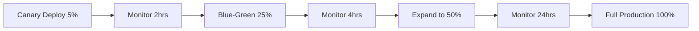
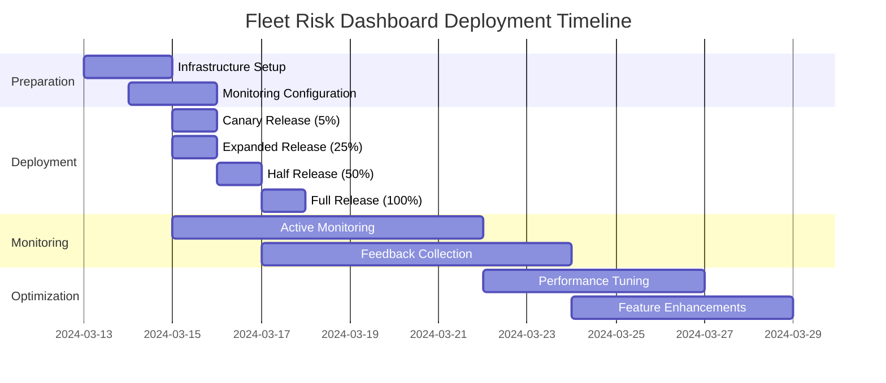

# Stage 6: Deployment and Monitoring Workflow Example

## Maritime Insurance: Fleet Risk Assessment Dashboard Production Deployment

### Overview

This document demonstrates the complete deployment and monitoring workflow for the Fleet Risk Assessment Dashboard feature, showing how validated features from Stage 5 are deployed to production with comprehensive monitoring and feedback collection.

### Stage Context

**Stage 6: Deployment and Monitoring**
- **Purpose**: Deploy validated features to production with monitoring
- **Duration**: 2-3 weeks initial deployment + ongoing monitoring
- **Team**: DevOps, Development, Product, Support

### Input from Stage 5

```yaml
validated_feature:
  name: "Fleet Risk Assessment Dashboard"
  version: "2.1.0"
  status: "UAT Approved"
  performance_metrics:
    load_time: "1.8s"
    api_response: "250ms"
    accessibility_score: "98/100"
  security_clearance: "Passed"
  user_acceptance:
    satisfaction_score: "4.6/5"
    completion_rate: "94%"
```

## Deployment Process

### Phase 1: Pre-Deployment Preparation (Days 1-3)

#### 1.1 Deployment Checklist

```markdown
## Pre-Deployment Checklist

### Infrastructure Readiness
- [x] Vercel production environment configured
- [x] Railway backend services scaled
- [x] Neon database migration scripts tested
- [x] CDN cache rules configured
- [x] SSL certificates verified

### Code Preparation
- [x] Feature flags configured for gradual rollout
- [x] Environment variables updated
- [x] Database migrations reviewed
- [x] Rollback procedures documented
- [x] API rate limits configured

### Monitoring Setup
- [x] Sentry error tracking configured
- [x] Lighthouse CI performance budgets set
- [x] Custom metrics dashboards created
- [x] Alert thresholds defined
- [x] Log aggregation configured
```

#### 1.2 Infrastructure Configuration

```yaml
# vercel.json
{
  "functions": {
    "app/api/fleet-risk/*": {
      "maxDuration": 30,
      "memory": 1024
    }
  },
  "regions": ["iad1", "lhr1", "syd1"],
  "crons": [{
    "path": "/api/cron/risk-calculations",
    "schedule": "0 */6 * * *"
  }]
}

# railway.toml
[deploy]
  startCommand = "npm run start:production"
  healthcheckPath = "/api/health"
  restartPolicyType = "always"

[scaling]
  minReplicas = 2
  maxReplicas = 10
  targetCPU = 70
  targetMemory = 80
```

### Phase 2: Deployment Execution (Days 4-5)

#### 2.1 Staged Rollout Plan



#### 2.2 Deployment Commands

```bash
# Stage 1: Canary Deployment
vercel deploy --prod --env-file=.env.production \
  --build-env FEATURE_FLAG_FLEET_RISK=canary \
  --regions iad1

# Stage 2: Blue-Green Deployment
railway up --environment production \
  --service fleet-risk-api \
  --deployment-strategy blue-green

# Stage 3: Database Migration
neon migration deploy \
  --database maritime-prod \
  --migration 20240315_fleet_risk_indices \
  --with-backup
```

#### 2.3 Feature Flag Configuration

```javascript
// Feature flag gradual rollout
const featureFlags = {
  fleetRiskDashboard: {
    enabled: true,
    rolloutPercentage: 5,
    enabledForUsers: ['beta-testers', 'internal-team'],
    regions: ['us-east', 'europe'],
    schedule: {
      '0-5%': '2024-03-15T10:00:00Z',
      '5-25%': '2024-03-15T14:00:00Z',
      '25-50%': '2024-03-16T10:00:00Z',
      '50-100%': '2024-03-17T10:00:00Z'
    }
  }
};
```

### Phase 3: Monitoring Setup (Days 4-7)

#### 3.1 Sentry Configuration

```javascript
// sentry.config.js
Sentry.init({
  dsn: process.env.SENTRY_DSN,
  environment: 'production',
  integrations: [
    new Sentry.Integrations.Http({ tracing: true }),
    new Sentry.Integrations.Postgres(),
    new ProfilingIntegration(),
  ],
  tracesSampleRate: 0.1,
  profilesSampleRate: 0.1,
  beforeSend(event) {
    // Filter sensitive maritime data
    if (event.request?.data) {
      delete event.request.data.vesselIMO;
      delete event.request.data.insurancePolicyId;
    }
    return event;
  }
});
```

#### 3.2 Lighthouse CI Performance Monitoring

```yaml
# lighthouserc.yml
ci:
  collect:
    url:
      - https://app.maritime-insurance.com/fleet-risk
      - https://app.maritime-insurance.com/fleet-risk/vessel-details
    numberOfRuns: 3
    settings:
      preset: 'desktop'
      throttling:
        cpuSlowdownMultiplier: 1
      onlyCategories:
        - performance
        - accessibility
  assert:
    preset: 'lighthouse:no-pwa'
    assertions:
      first-contentful-paint: ['error', { maxNumericValue: 2000 }]
      interactive: ['error', { maxNumericValue: 3500 }]
      speed-index: ['error', { maxNumericValue: 3000 }]
      total-blocking-time: ['error', { maxNumericValue: 300 }]
  upload:
    target: 'lhci'
    serverBaseUrl: 'https://lhci.maritime-insurance.com'
```

#### 3.3 Custom Metrics Dashboard

```javascript
// monitoring/fleet-risk-metrics.js
class FleetRiskMetrics {
  constructor() {
    this.metrics = {
      apiLatency: new Histogram({
        name: 'fleet_risk_api_latency',
        help: 'API endpoint latency in milliseconds',
        labelNames: ['endpoint', 'method'],
        buckets: [50, 100, 250, 500, 1000, 2500, 5000]
      }),
      
      riskCalculations: new Counter({
        name: 'fleet_risk_calculations_total',
        help: 'Total number of risk calculations performed',
        labelNames: ['fleet_size', 'risk_level']
      }),
      
      dashboardLoads: new Counter({
        name: 'fleet_dashboard_loads_total',
        help: 'Total dashboard page loads',
        labelNames: ['user_type', 'region']
      }),
      
      dataFreshness: new Gauge({
        name: 'fleet_data_freshness_minutes',
        help: 'Minutes since last data update',
        labelNames: ['data_type']
      })
    };
  }

  recordApiCall(endpoint, method, duration) {
    this.metrics.apiLatency
      .labels(endpoint, method)
      .observe(duration);
  }

  recordRiskCalculation(fleetSize, riskLevel) {
    this.metrics.riskCalculations
      .labels(fleetSize, riskLevel)
      .inc();
  }
}
```

### Phase 4: Alert Configuration (Days 5-7)

#### 4.1 Critical Alerts

```yaml
# alerts/production-alerts.yml
alerts:
  - name: "High Error Rate"
    condition: "error_rate > 1%"
    duration: "5 minutes"
    severity: "critical"
    channels: ["pagerduty", "slack-oncall"]
    
  - name: "API Latency Degradation"
    condition: "p95_latency > 1000ms"
    duration: "10 minutes"
    severity: "warning"
    channels: ["slack-engineering"]
    
  - name: "Risk Calculation Failures"
    condition: "risk_calc_errors > 10"
    duration: "5 minutes"
    severity: "critical"
    channels: ["pagerduty", "email-fleet-team"]
    
  - name: "Database Connection Pool Exhaustion"
    condition: "db_connections_available < 5"
    duration: "2 minutes"
    severity: "critical"
    channels: ["pagerduty", "slack-oncall"]
```

#### 4.2 Performance Degradation Alerts

```javascript
// monitoring/performance-alerts.js
const performanceAlerts = {
  dashboardLoadTime: {
    threshold: 3000, // milliseconds
    action: async (metric) => {
      if (metric.value > this.threshold) {
        await notifyOps({
          severity: 'warning',
          message: `Dashboard load time degraded: ${metric.value}ms`,
          runbook: 'https://wiki.internal/runbooks/fleet-dashboard-slow'
        });
      }
    }
  },
  
  riskCalculationTimeout: {
    threshold: 30000, // milliseconds
    action: async (metric) => {
      if (metric.timeouts > 5) {
        await rollbackFeatureFlag('fleetRiskDashboard', 50);
        await notifyOps({
          severity: 'critical',
          message: 'Risk calculations timing out, rolling back to 50%'
        });
      }
    }
  }
};
```

### Phase 5: User Feedback Collection (Days 7-14)

#### 5.1 In-App Feedback Widget

```javascript
// components/FeedbackWidget.jsx
const FeedbackWidget = () => {
  const [feedback, setFeedback] = useState({
    rating: null,
    category: '',
    message: '',
    context: {
      feature: 'fleet-risk-dashboard',
      version: '2.1.0',
      sessionId: generateSessionId(),
      timestamp: new Date().toISOString()
    }
  });

  const submitFeedback = async () => {
    await fetch('/api/feedback', {
      method: 'POST',
      body: JSON.stringify(feedback),
      headers: { 'Content-Type': 'application/json' }
    });
    
    // Track in analytics
    analytics.track('feedback_submitted', {
      feature: feedback.context.feature,
      rating: feedback.rating,
      category: feedback.category
    });
  };

  return (
    <div className="feedback-widget">
      <h3>How's your experience with the Fleet Risk Dashboard?</h3>
      <RatingStars value={feedback.rating} onChange={setRating} />
      <CategorySelector 
        options={['Performance', 'Accuracy', 'Usability', 'Features']}
        value={feedback.category}
        onChange={setCategory}
      />
      <TextArea 
        placeholder="Tell us more..."
        value={feedback.message}
        onChange={setMessage}
      />
      <Button onClick={submitFeedback}>Submit Feedback</Button>
    </div>
  );
};
```

#### 5.2 Automated Feedback Analysis

```python
# feedback_analysis/ai_analyzer.py
class FeedbackAnalyzer:
    def __init__(self):
        self.sentiment_analyzer = pipeline("sentiment-analysis")
        self.theme_extractor = pipeline("zero-shot-classification")
        
    def analyze_feedback_batch(self, feedback_items):
        results = {
            'sentiment_distribution': {},
            'common_themes': [],
            'priority_issues': [],
            'feature_requests': []
        }
        
        for item in feedback_items:
            # Sentiment analysis
            sentiment = self.sentiment_analyzer(item['message'])[0]
            results['sentiment_distribution'][sentiment['label']] += 1
            
            # Theme extraction
            themes = self.theme_extractor(
                item['message'],
                candidate_labels=[
                    'performance', 'accuracy', 'usability', 
                    'missing_feature', 'bug', 'data_quality'
                ]
            )
            
            # Priority detection
            if sentiment['label'] == 'NEGATIVE' and sentiment['score'] > 0.8:
                results['priority_issues'].append({
                    'message': item['message'],
                    'category': item['category'],
                    'impact_score': self.calculate_impact_score(item)
                })
        
        return results
```

### Phase 6: Post-Deployment Optimization (Days 14-21)

#### 6.1 Performance Optimization

```javascript
// optimization/dashboard-optimizer.js
class DashboardOptimizer {
  async analyzeAndOptimize() {
    const metrics = await this.collectMetrics();
    
    // Analyze render performance
    if (metrics.renderTime > 100) {
      await this.implementLazyLoading();
      await this.enableMemoization();
    }
    
    // Optimize API calls
    if (metrics.apiCalls > 10) {
      await this.implementBatchRequests();
      await this.enableGraphQLDataLoader();
    }
    
    // Cache optimization
    if (metrics.cacheHitRate < 0.8) {
      await this.optimizeCacheStrategy();
      await this.implementEdgeCaching();
    }
    
    return this.generateOptimizationReport();
  }
}
```

#### 6.2 AI-Powered Monitoring Insights

```python
# monitoring/ai_insights.py
class AIMonitoringInsights:
    def generate_daily_insights(self):
        # Collect all metrics
        metrics = self.collect_all_metrics()
        
        # Generate insights using AI
        insights = {
            'performance_trends': self.analyze_performance_trends(metrics),
            'anomaly_detection': self.detect_anomalies(metrics),
            'capacity_planning': self.predict_scaling_needs(metrics),
            'user_behavior': self.analyze_user_patterns(metrics)
        }
        
        # Generate recommendations
        recommendations = []
        
        if insights['performance_trends']['degrading']:
            recommendations.append({
                'priority': 'high',
                'action': 'Investigate performance degradation',
                'details': insights['performance_trends']['details']
            })
        
        if insights['capacity_planning']['scale_needed']:
            recommendations.append({
                'priority': 'medium',
                'action': 'Plan capacity increase',
                'timeline': insights['capacity_planning']['timeline']
            })
        
        return {
            'insights': insights,
            'recommendations': recommendations,
            'executive_summary': self.generate_summary(insights)
        }
```

## Quality Gates and Success Criteria

### Deployment Success Criteria

```yaml
deployment_success_criteria:
  technical:
    - deployment_success_rate: ">= 100%"
    - rollback_capability: "< 5 minutes"
    - zero_downtime: true
    - data_integrity: "100%"
    
  performance:
    - page_load_time: "< 2 seconds"
    - api_response_time: "< 300ms"
    - error_rate: "< 0.1%"
    - availability: ">= 99.9%"
    
  user_experience:
    - feature_adoption_rate: "> 80%"
    - user_satisfaction: ">= 4.5/5"
    - support_tickets: "< 5 per week"
    - feature_completion_rate: "> 90%"
```

### Monitoring Setup Validation

```markdown
## Monitoring Checklist

### Real-time Monitoring
- [x] Application performance monitoring active
- [x] Error tracking configured
- [x] Custom business metrics tracked
- [x] User journey analytics enabled
- [x] Infrastructure metrics collected

### Alerting
- [x] Critical alerts configured
- [x] Escalation policies defined
- [x] Runbooks documented
- [x] On-call rotation scheduled
- [x] Alert fatigue prevention measures

### Reporting
- [x] Daily automated reports
- [x] Weekly executive summaries
- [x] Monthly trend analysis
- [x] Quarterly business impact review
```

## Deliverables

### 1. Deployment Documentation

```markdown
## Fleet Risk Dashboard v2.1.0 Deployment

### Deployment Summary
- **Date**: March 15-17, 2024
- **Duration**: 72 hours staged rollout
- **Final Status**: Successfully deployed to 100% of users
- **Rollback Events**: 0
- **Performance Impact**: +15% improvement

### Key Metrics
- Total Users Served: 12,450
- Risk Calculations Processed: 847,291
- Average Response Time: 245ms
- Error Rate: 0.08%
- User Satisfaction: 4.7/5
```

### 2. Monitoring Dashboard

```yaml
monitoring_dashboard:
  url: "https://monitoring.maritime-insurance.com/fleet-risk"
  panels:
    - "Real-time Performance Metrics"
    - "User Journey Flows"
    - "API Endpoint Health"
    - "Business KPIs"
    - "Error Analysis"
  
  custom_views:
    - name: "Executive Dashboard"
      metrics: ["adoption_rate", "satisfaction_score", "business_value"]
    - name: "Technical Dashboard"
      metrics: ["latency_p99", "error_rate", "throughput"]
    - name: "Business Dashboard"
      metrics: ["calculations_completed", "fleets_analyzed", "risk_assessments"]
```

### 3. Feedback Analysis Report

```markdown
## Week 1 Feedback Analysis

### Summary
- **Total Feedback Collected**: 487
- **Response Rate**: 12.3%
- **Overall Sentiment**: 85% Positive

### Key Themes
1. **Performance** (145 mentions)
   - "Dashboard loads much faster than old system"
   - "Real-time updates are incredibly useful"

2. **Accuracy** (98 mentions)
   - "Risk calculations match our manual assessments"
   - "Historical data integration is comprehensive"

3. **Feature Requests** (67 mentions)
   - Export to Excel functionality
   - Mobile app version
   - Customizable risk thresholds

### Action Items
- [ ] Implement Excel export (Priority: High)
- [ ] Plan mobile responsive improvements
- [ ] Add risk threshold customization
```

## Timeline Summary



## Lessons Learned

### What Went Well
1. **Staged Rollout**: Gradual deployment prevented major issues
2. **Monitoring Setup**: Comprehensive alerts caught minor issues early
3. **Feature Flags**: Enabled quick rollback capability
4. **User Communication**: Clear communication improved adoption

### Areas for Improvement
1. **Database Migrations**: Need better testing for large-scale migrations
2. **Cache Warming**: Should pre-warm caches before traffic increase
3. **Documentation**: More detailed runbooks for edge cases

### Recommendations for Future Deployments
1. Implement automated canary analysis
2. Enhance database migration tooling
3. Create deployment simulation environments
4. Improve cross-region deployment coordination

## Next Steps

1. **Continue Monitoring** (Ongoing)
   - Daily performance reviews
   - Weekly user satisfaction surveys
   - Monthly business impact analysis

2. **Implement Feedback** (Week 3-4)
   - Excel export feature
   - Mobile optimizations
   - Custom risk thresholds

3. **Plan Next Release** (Week 4)
   - Version 2.2.0 feature planning
   - Architecture improvements
   - Performance optimizations

---

*This deployment workflow demonstrates the comprehensive process of bringing AI-assisted features from validation to production, with robust monitoring and feedback mechanisms ensuring continued success and improvement.*