# WorkOS Technical Architecture for Maritime Insurance Platform

## Architecture Overview

This document details the technical architecture of WorkOS integration in the maritime insurance platform, showing the exact boundaries between WorkOS-managed services and custom implementation requirements.

## System Architecture Diagram

```mermaid
graph TB
    subgraph "User Layer"
        U[👤 Maritime Users]
        U1[Ship Owners]
        U2[Cargo Owners] 
        U3[Brokers]
        U4[Charterers]
    end

    subgraph "Frontend Layer - React Application"
        subgraph "WorkOS Managed Components"
            WA[🔐 WorkOS AuthKit Provider]
            WS[🍪 Session Management]
            WT[🔄 Token Refresh]
        end
        
        subgraph "Custom Maritime Components"
            MC[🚢 Maritime Context Provider]
            TR[🛡️ Tenant Route Guards]
            VD[📊 Vessel Dashboards]
        end
        
        WA --> MC
        WS --> TR
        WT --> VD
    end

    subgraph "API Layer - FastAPI Backend"
        subgraph "Authentication Middleware"
            TV[🔍 Token Verification]
            UC[👤 User Context Extraction]
            TC[🏢 Tenant Context Creation]
        end
        
        subgraph "Business Logic Layer"
            VE[🚢 Vessel Endpoints]
            PE[📋 Policy Endpoints]
            CE[💰 Claims Endpoints]
            AE[📊 Analytics Endpoints]
        end
        
        TV --> UC --> TC
        TC --> VE
        TC --> PE
        TC --> CE
        TC --> AE
    end

    subgraph "WorkOS Cloud Services"
        WO[☁️ WorkOS API]
        WJ[🔑 JWT Token Service]
        WH[🪝 Webhook Service]
        WD[📊 WorkOS Dashboard]
    end

    subgraph "Data Layer"
        subgraph "Authentication Data"
            AD[🔐 Auth Events]
            SD[📅 Session Data]
            AL[📋 Audit Logs]
        end
        
        subgraph "Business Data"
            VT[🚢 Vessels Table]
            PT[📋 Policies Table]
            CT[💰 Claims Table]
            OT[🏢 Organizations Table]
        end
    end

    subgraph "External Maritime Services"
        IM[🌊 IMO Database]
        MS[⚓ Maritime Authorities]
        IR[📊 Insurance Registries]
    end

    %% User interactions
    U --> WA
    U1 --> VD
    U2 --> VD
    U3 --> VD
    U4 --> VD

    %% Frontend to Backend
    MC --> TV
    TR --> TV
    VD --> VE

    %% Backend to WorkOS
    TV --> WO
    UC --> WJ
    TC --> WH

    %% Backend to Data
    VE --> VT
    PE --> PT
    CE --> CT
    AE --> OT
    
    %% Authentication data flow
    WH --> AD
    TV --> SD
    UC --> AL

    %% External integrations
    VE --> IM
    PE --> MS
    CE --> IR

    %% Styling
    classDef workosManaged fill:#e1f5fe,stroke:#01579b,stroke-width:2px
    classDef customCode fill:#f3e5f5,stroke:#4a148c,stroke-width:2px
    classDef dataStore fill:#e8f5e8,stroke:#1b5e20,stroke-width:2px
    classDef external fill:#fff3e0,stroke:#e65100,stroke-width:2px

    class WA,WS,WT,WO,WJ,WH,WD workosManaged
    class MC,TR,VD,TV,UC,TC,VE,PE,CE,AE customCode
    class AD,SD,AL,VT,PT,CT,OT dataStore
    class IM,MS,IR external
```



## Component Responsibility Matrix

### WorkOS-Managed Components ✅

| Component | Responsibility | Implementation Status |
|-----------|----------------|----------------------|
| **OAuth Flow** | Complete OAuth 2.0 + PKCE implementation | ✅ Fully managed by WorkOS |
| **JWT Generation** | Token creation, signing, expiration management | ✅ Fully managed by WorkOS |
| **Token Storage** | Secure HTTP-only cookies with CSRF protection | ✅ Fully managed by WorkOS |
| **Session Management** | Session lifecycle, automatic refresh | ✅ Fully managed by WorkOS |
| **Token Validation** | Signature verification, expiration checks | ✅ SDK provides validation functions |
| **User Profile Management** | Basic user data (name, email, organization) | ✅ Fully managed by WorkOS |
| **Security Headers** | CORS, CSP, secure cookie flags | ✅ Fully managed by WorkOS |
| **Admin Portal** | Organization management UI | ✅ Fully managed by WorkOS |

### Custom Implementation Required 🔧

| Component | Responsibility | Implementation Required |
|-----------|----------------|------------------------|
| **Maritime Context Extraction** | Extract vessel, IMO, geographic data from requests | 🔧 Custom middleware needed |
| **Tenant Access Control** | Vessel-specific permissions and data filtering | 🔧 Custom authorization logic |
| **Multi-Tenant Database Queries** | Organization-scoped data access | 🔧 Custom query filters |
| **Maritime Audit Logging** | Compliance-specific event logging | 🔧 Custom audit system |
| **Business Logic** | Vessel management, policies, claims processing | 🔧 Complete custom implementation |
| **Maritime UI Components** | Vessel dashboards, maritime forms | 🔧 Custom React components |
| **Compliance Reporting** | Maritime regulation compliance reports | 🔧 Custom reporting system |
| **Geographic Restrictions** | Territorial waters access control | 🔧 Custom geo-filtering |

## Detailed Technical Implementation

### 1. Frontend Architecture

#### WorkOS AuthKit Integration
```typescript
// App.tsx - Root level integration
import { AuthKitProvider } from '@workos-inc/authkit-react';

function App() {
  return (
    <AuthKitProvider
      clientId={process.env.REACT_APP_WORKOS_CLIENT_ID!}
      apiHostname="api.workos.com"
      redirectUri={process.env.REACT_APP_WORKOS_REDIRECT_URI}
      devMode={process.env.NODE_ENV === 'development'}
    >
      <MaritimeAuthProvider>
        <Router>
          <Routes>
            <Route path="/vessels" element={
              <ProtectedRoute requiredRole="vessel_access">
                <VesselDashboard />
              </ProtectedRoute>
            } />
          </Routes>
        </Router>
      </MaritimeAuthProvider>
    </AuthKitProvider>
  );
}
```

#### Custom Maritime Authentication Layer
```typescript
// contexts/MaritimeAuthContext.tsx
import { useAuth } from '@workos-inc/authkit-react';

export const MaritimeAuthProvider: React.FC<{ children: React.ReactNode }> = ({ children }) => {
  const { user, isLoading } = useAuth(); // WorkOS handles this
  
  // Custom maritime context extraction
  const maritimeContext = useMemo(() => {
    if (!user) return null;
    
    return {
      userId: user.id,
      email: user.email,
      organizationId: user.organizationId,
      tenantType: extractTenantType(user.organizationId),
      vesselAccess: extractVesselPermissions(user),
      geographicScope: extractGeographicPermissions(user),
      roles: user.roles || []
    };
  }, [user]);

  return (
    <MaritimeContext.Provider value={maritimeContext}>
      {children}
    </MaritimeContext.Provider>
  );
};
```

### 2. Backend Authentication Architecture

#### Token Verification Middleware
```python
# middleware/auth_middleware.py
import workos
from fastapi import HTTPException, Depends
from fastapi.security import HTTPBearer

security = HTTPBearer()

async def verify_workos_token(credentials: HTTPAuthorizationCredentials = Depends(security)) -> MaritimeUser:
    """
    WorkOS handles:
    - JWT signature verification
    - Token expiration validation
    - Issuer/audience verification
    - Token format validation
    """
    try:
        # WorkOS SDK does the heavy lifting
        user_info = workos.sso.get_profile_and_token(
            access_token=credentials.credentials
        )
        
        # Custom maritime user creation
        return MaritimeUser(
            id=user_info.profile['sub'],
            email=user_info.profile['email'], 
            organization_id=user_info.profile.get('org'),
            tenant_type=determine_tenant_type(user_info.profile.get('org')),
            roles=user_info.profile.get('roles', [])
        )
        
    except workos.exceptions.AuthenticationException:
        raise HTTPException(status_code=401, detail="Invalid token")
```

#### Maritime Context Middleware
```python
# middleware/maritime_context.py
class MaritimeContextMiddleware:
    """Custom middleware for extracting maritime-specific context"""
    
    async def __call__(self, request: Request, call_next):
        # Extract maritime context from request
        maritime_context = await self.extract_maritime_context(request)
        request.state.maritime_context = maritime_context
        
        response = await call_next(request)
        return response
    
    async def extract_maritime_context(self, request: Request) -> MaritimeContext:
        context = MaritimeContext()
        
        # Extract vessel information
        if "vessel_id" in request.path_params:
            context.vessel_id = request.path_params["vessel_id"]
            context.vessel_imo = await self.get_vessel_imo(context.vessel_id)
        
        # Extract geographic context
        if "lat" in request.query_params and "lng" in request.query_params:
            context.location = {
                "latitude": float(request.query_params["lat"]),
                "longitude": float(request.query_params["lng"])
            }
            context.territorial_waters = await self.determine_territorial_waters(context.location)
        
        # Extract financial context
        if request.method in ["POST", "PUT", "PATCH"]:
            body = await self.get_request_body(request)
            if "amount" in body:
                context.financial_amount = float(body["amount"])
        
        return context
```

### 3. Database Integration Pattern

#### Tenant-Scoped Database Access
```python
# repositories/base_repository.py
class TenantScopedRepository:
    """Base repository with automatic tenant filtering"""
    
    def __init__(self, db_session: AsyncSession):
        self.db = db_session
    
    async def find_by_tenant(self, model: Type[SQLModel], tenant_id: str, **filters):
        """Automatically apply tenant filtering to all queries"""
        query = select(model).where(model.organization_id == tenant_id)
        
        # Apply additional filters
        for field, value in filters.items():
            if hasattr(model, field):
                query = query.where(getattr(model, field) == value)
        
        return await self.db.execute(query)
    
    async def create_with_tenant(self, model: SQLModel, tenant_id: str):
        """Automatically set tenant context on creation"""
        model.organization_id = tenant_id
        model.created_at = datetime.utcnow()
        
        self.db.add(model)
        await self.db.commit()
        return model

# Usage in vessel service
class VesselService:
    def __init__(self, repository: TenantScopedRepository):
        self.repo = repository
    
    async def get_vessels_for_user(self, user: MaritimeUser) -> List[Vessel]:
        """Get vessels scoped to user's organization"""
        return await self.repo.find_by_tenant(
            Vessel, 
            user.organization_id,
            active=True
        )
```

### 4. API Endpoint Protection Pattern

#### Protected Route Implementation
```python
# routes/vessel_routes.py
@router.get("/vessels/{vessel_id}")
async def get_vessel(
    vessel_id: str,
    user: MaritimeUser = Depends(verify_workos_token),
    maritime_context: MaritimeContext = Depends(get_maritime_context)
) -> VesselResponse:
    """
    Multi-layer protection:
    1. WorkOS token verification (verify_workos_token)
    2. Maritime context extraction (get_maritime_context) 
    3. Vessel access validation (check_vessel_access)
    """
    
    # Verify user has access to this specific vessel
    await check_vessel_access(user, vessel_id)
    
    # Get vessel with tenant filtering
    vessel = await vessel_service.get_vessel_by_id(vessel_id, user.organization_id)
    
    if not vessel:
        raise HTTPException(status_code=404, detail="Vessel not found")
    
    # Log access for maritime compliance
    await audit_service.log_vessel_access(
        user_id=user.id,
        vessel_id=vessel_id,
        action="view",
        maritime_context=maritime_context
    )
    
    return VesselResponse.from_model(vessel)

async def check_vessel_access(user: MaritimeUser, vessel_id: str):
    """Custom vessel access control logic"""
    vessel = await vessel_service.get_vessel_basic_info(vessel_id)
    
    # Check if user's organization has access to this vessel
    if vessel.organization_id != user.organization_id:
        # Check if there's a shared access agreement
        has_shared_access = await check_shared_vessel_access(user.organization_id, vessel_id)
        if not has_shared_access:
            raise HTTPException(status_code=403, detail="Vessel access denied")
    
    # Additional role-based checks
    if "vessel_operator" not in user.roles and vessel.requires_operator_role:
        raise HTTPException(status_code=403, detail="Operator role required")
```

### 5. Error Handling Architecture

#### Comprehensive Error Handling
```python
# middleware/error_middleware.py
class MaritimeErrorHandler:
    """Custom error handling for maritime-specific scenarios"""
    
    async def __call__(self, request: Request, call_next):
        try:
            response = await call_next(request)
            return response
            
        except workos.exceptions.AuthenticationException as e:
            return await self.handle_auth_error(request, e)
        except MaritimeAccessDenied as e:
            return await self.handle_maritime_access_error(request, e)
        except Exception as e:
            return await self.handle_general_error(request, e)
    
    async def handle_auth_error(self, request: Request, error: Exception) -> JSONResponse:
        """Handle WorkOS authentication errors"""
        # Log security event
        await security_logger.log_auth_failure(request, str(error))
        
        return JSONResponse(
            status_code=401,
            content={
                "error": "authentication_failed",
                "message": "Invalid or expired authentication token",
                "maritime_context": "Please re-authenticate to access vessel data"
            },
            headers={"WWW-Authenticate": "Bearer"}
        )
    
    async def handle_maritime_access_error(self, request: Request, error: MaritimeAccessDenied) -> JSONResponse:
        """Handle maritime-specific access control errors"""
        # Log compliance event
        await compliance_logger.log_access_denied(request, error.details)
        
        return JSONResponse(
            status_code=403,
            content={
                "error": "maritime_access_denied",
                "message": error.message,
                "required_permissions": error.required_permissions,
                "vessel_context": error.vessel_context
            }
        )
```

## Data Flow Architecture

### Authentication Data Flow


### Multi-Tenant Data Access Pattern


## Security Architecture

### Multi-Layer Security Model


## Performance Considerations

### Caching Strategy
```python
# Caching for frequently accessed maritime data
from redis import Redis
import json

class MaritimeCache:
    def __init__(self, redis_client: Redis):
        self.redis = redis_client
    
    async def cache_vessel_permissions(self, user_id: str, vessel_permissions: Dict):
        """Cache vessel permissions to avoid repeated database queries"""
        cache_key = f"vessel_permissions:{user_id}"
        await self.redis.setex(
            cache_key, 
            3600,  # 1 hour TTL
            json.dumps(vessel_permissions)
        )
    
    async def get_cached_vessel_permissions(self, user_id: str) -> Optional[Dict]:
        """Retrieve cached vessel permissions"""
        cache_key = f"vessel_permissions:{user_id}"
        cached_data = await self.redis.get(cache_key)
        return json.loads(cached_data) if cached_data else None
```

### Database Optimization
```sql
-- Optimized indexes for tenant-scoped queries
CREATE INDEX CONCURRENTLY idx_vessels_org_active 
ON vessels (organization_id, active) 
WHERE active = true;

CREATE INDEX CONCURRENTLY idx_policies_org_status 
ON policies (organization_id, status, created_at DESC);

CREATE INDEX CONCURRENTLY idx_audit_logs_org_timestamp 
ON maritime_audit_logs (organization_id, timestamp DESC);
```

## Monitoring and Observability

### Key Metrics to Track
```python
# Custom metrics for maritime platform
from prometheus_client import Counter, Histogram, Gauge

# Authentication metrics
AUTH_REQUESTS_TOTAL = Counter('maritime_auth_requests_total', 'Total authentication requests', ['status', 'tenant_type'])
AUTH_DURATION = Histogram('maritime_auth_duration_seconds', 'Authentication request duration')

# Business metrics  
VESSEL_ACCESS_TOTAL = Counter('maritime_vessel_access_total', 'Total vessel access requests', ['organization_id', 'access_type'])
ACTIVE_SESSIONS = Gauge('maritime_active_sessions', 'Number of active user sessions', ['tenant_type'])

# Compliance metrics
AUDIT_EVENTS_TOTAL = Counter('maritime_audit_events_total', 'Total audit events logged', ['event_type', 'compliance_level'])
```

This technical architecture provides a clear separation between WorkOS-managed authentication services and custom maritime business logic, ensuring security, scalability, and compliance with maritime industry requirements.