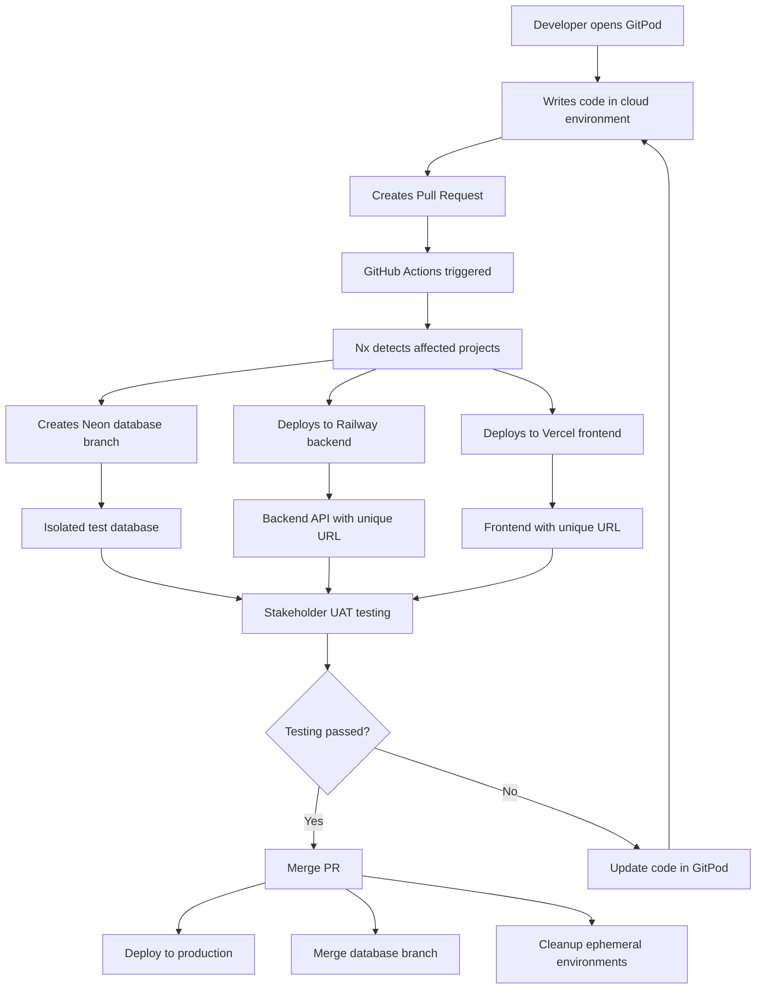

# Tool Overlap Analysis - Why Each Tool is Essential

## Purpose of This Document

This document addresses the critical questions about tool overlaps and redundancies in the recommended infrastructure stack, specifically answering:

1. **Why do we need Railway ephemeral environments if we have GitPod?**
2. **Why do we need Neon database branching if we have Railway?**
3. **Can we use just one tool instead of multiple?**
4. **What problems does each tool solve that others don't?**
5. **How do all tools work together without redundancy?**

---

## 🔍 UNDERSTANDING THE ECOSYSTEM

### The Three-Layer Architecture

```
┌─────────────────────────────────────────────────────────────────────────┐
│                          LAYER 1: DEVELOPMENT                            │
├─────────────────────────────────────────────────────────────────────────┤
│  GitPod: Where developers write code                                   │
│  ├─ Cloud-based VS Code environment                                    │
│  ├─ Pre-configured with all tools                                      │
│  ├─ Instant setup for new team members                                 │
│  └─ Consistent environment for all developers                          │
└─────────────────────────────────────────────────────────────────────────┘

┌─────────────────────────────────────────────────────────────────────────┐
│                          LAYER 2: DATA ISOLATION                         │
├─────────────────────────────────────────────────────────────────────────┤
│  Neon: Database branching for isolated testing                         │
│  ├─ Each PR gets its own database branch                               │
│  ├─ No data conflicts between features                                 │
│  ├─ Safe testing without affecting production                          │
│  └─ Merge database changes when PR is merged                           │
└─────────────────────────────────────────────────────────────────────────┘

┌─────────────────────────────────────────────────────────────────────────┐
│                          LAYER 3: DEPLOYMENT                             │
├─────────────────────────────────────────────────────────────────────────┤
│  Railway + Vercel: Where stakeholders test features                    │
│  ├─ Railway: Backend API deployment                                    │
│  ├─ Vercel: Frontend deployment                                        │
│  ├─ Unique URLs for each PR                                            │
│  └─ UAT environment for stakeholder review                             │
└─────────────────────────────────────────────────────────────────────────┘
```

---

## 🚀 DETAILED TOOL ANALYSIS

### **1. GitPod vs Railway/Vercel - "Why both?"**

#### **GitPod Purpose: Development Environment**
- **What it does**: Provides cloud-based development environment
- **Who uses it**: Developers writing code
- **When it's used**: During active development
- **Value**: Instant setup, consistent environment

#### **Railway/Vercel Purpose: Deployment Environment**
- **What it does**: Hosts applications for stakeholder testing
- **Who uses it**: Stakeholders, QA, UAT testers
- **When it's used**: After code is written, during review
- **Value**: Production-like environment for testing

#### **Why Both Are Needed:**

```
GitPod = Your office where you build the car
Railway/Vercel = The test track where customers test drive the car

You can't build a car on a test track
You can't test drive a car in a workshop
```

**Real Example:**
- **Developer in GitPod**: "I'm writing the quote calculator logic"
- **Stakeholder on Railway**: "I'm testing the quote calculator to see if it works for my use case"

### **2. Neon vs Railway Database - "Why both?"**

#### **Neon Purpose: Database Isolation**
- **What it does**: Creates separate database for each feature
- **Value**: Complete data isolation between features
- **Key Feature**: Git-like branching for databases

#### **Railway Database Purpose: Application Integration**
- **What it does**: Connects application to database
- **Value**: Simple connection and management
- **Key Feature**: Easy PostgreSQL hosting

#### **Why Both Are Needed:**

```
Neon = The database storage system
Railway = The application that uses the database

Think of it like:
Neon = The bank vault (stores money safely)
Railway = The ATM (accesses money for users)
```

**Real Example:**
- **PR #123**: Gets Neon database branch `pr-123-branch.neon.tech`
- **Railway API**: Connects to that specific branch
- **Result**: Complete isolation - no data conflicts

### **3. Local Development vs GitPod - "Why choose GitPod?"**

#### **Option 1: Local Development (Traditional)**
```bash
# Each developer needs to:
1. Install Node.js, Python, PostgreSQL
2. Configure development environment
3. Install dependencies
4. Set up database connection
5. Configure environment variables
6. Troubleshoot "works on my machine" issues
```
**Time to productivity**: 4-8 hours per developer
**Ongoing maintenance**: 2-3 hours per week per developer

#### **Option 2: GitPod (Recommended)**
```bash
# Each developer simply:
1. Click GitPod link
2. Wait 30 seconds for environment to load
3. Start coding immediately
```
**Time to productivity**: 30 seconds per developer
**Ongoing maintenance**: 0 hours per week

#### **Cost Analysis:**
- **Local Setup**: $0 upfront, but 32 hours/month team maintenance
- **GitPod**: $200/month, but 0 hours/month team maintenance
- **Break-even**: GitPod pays for itself with 12 saved hours

### **4. Why This Specific Database Choice?**

#### **Database Options Comparison:**

| Feature | Neon | Railway PostgreSQL | Supabase | Traditional |
|---------|------|-------------------|----------|-------------|
| **Branching** | ✅ Git-like | ❌ No | ❌ No | ❌ No |
| **Serverless** | ✅ Auto-scale | ❌ Always on | ❌ Always on | ❌ Manual |
| **Cost** | ✅ Pay per use | ❌ Fixed | ❌ Fixed | ❌ Fixed |
| **Isolation** | ✅ Perfect | ⚠️ Manual | ⚠️ Manual | ⚠️ Complex |
| **CI/CD** | ✅ Automatic | ❌ Manual setup | ❌ Manual setup | ❌ Complex |

#### **Why Neon is Essential:**
```
Without Neon:
PR #123 → Same database ← PR #124
Result: Data conflicts, test interference

With Neon:
PR #123 → Branch pr-123 (isolated)
PR #124 → Branch pr-124 (isolated)
Result: No conflicts, safe testing
```

### **5. CI/CD: Why This Approach?**

#### **Alternative 1: Manual Deployment**
```bash
# Developer process:
1. Write code
2. Manually deploy to test server
3. Manually create database
4. Manually configure environment
5. Manually notify stakeholders
6. Manually clean up after testing
```
**Time per feature**: 2-3 hours of manual work
**Error rate**: High (manual steps)

#### **Alternative 2: GitHub Actions (Recommended)**
```yaml
# Automated process:
1. PR created → Automatic deployment
2. Database branch created automatically
3. Environment configured automatically
4. Stakeholders notified automatically
5. Cleanup happens automatically
```
**Time per feature**: 0 hours of manual work
**Error rate**: Low (automated)

---

## 🎯 ADDRESSING SPECIFIC CONCERNS

### **Question 1: "Can we use just GitPod for everything?"**

**Answer: No, here's why:**

GitPod is for development, not stakeholder testing:
- **GitPod URLs**: Only accessible to developers with accounts
- **GitPod Purpose**: Writing code, not testing features
- **GitPod Limitations**: Not suitable for UAT environments

**What stakeholders need:**
- Public URLs they can access
- Stable environments for testing
- Mobile-responsive interfaces
- Professional appearance

### **Question 2: "Why not just use Railway for both backend and frontend?"**

**Answer: Specialization is key:**

**Railway Strengths:**
- Excellent for Python/FastAPI
- Great PostgreSQL integration
- Simple backend deployment
- Good for APIs

**Railway Weaknesses:**
- Not optimized for React/frontend
- No CDN for global performance
- Limited frontend deployment features
- No preview deployments

**Vercel Strengths:**
- Optimized for React/Next.js
- Global CDN for fast loading
- Automatic preview deployments
- Perfect for frontend

**Result**: Use each tool for what it does best

### **Question 3: "Do we really need database branching?"**

**Answer: Yes, it's essential for safe development:**

**Without Database Branching:**
```
Developer A: Testing shipping quotes
Developer B: Testing cargo quotes
Same database → A's test data affects B's tests
Result: Unreliable testing, data conflicts
```

**With Database Branching:**
```
Developer A: Testing on branch pr-123
Developer B: Testing on branch pr-124
Separate databases → No interference
Result: Reliable testing, clean data
```

### **Question 4: "What about the UAT environment requirement?"**

**Answer: Every PR automatically creates UAT environment:**

**Traditional UAT:**
- Manual setup of test environment
- Shared environment for all testing
- Scheduling conflicts
- Slow feedback loops

**Our UAT Approach:**
- Automatic UAT environment per PR
- Unique URL for each feature
- Parallel testing possible
- Immediate feedback

**Example:**
- **PR #123 UAT**: https://pr-123-marine-app.vercel.app
- **PR #124 UAT**: https://pr-124-marine-app.vercel.app
- **Production**: https://marine-app.vercel.app

---

## 🔧 HOW EVERYTHING CONNECTS

### **Complete Integration Flow**



### **Daily Workflow Integration**

**Morning (9:00 AM):**
- Developer opens GitPod → Instant development environment
- Neon provides development database branch
- All tools ready in 30 seconds

**Development (9:30 AM - 5:00 PM):**
- Code written in GitPod
- Local testing against Neon branch
- Continuous integration with existing tools

**PR Creation (5:00 PM):**
- GitHub Actions triggers
- Railway deploys backend
- Vercel deploys frontend
- Neon creates PR database branch

**UAT Testing (Next Day):**
- Stakeholders test on deployed environment
- Feedback provided via PR comments
- Issues fixed in GitPod

**Production (After Approval):**
- PR merged automatically
- Production deployment
- Database branch merged
- Ephemeral environments cleaned up

---

## 💰 COST JUSTIFICATION

### **Cost Per Tool Per Month**

| Tool | Cost | Purpose | Alternative Cost |
|------|------|---------|------------------|
| GitPod | $200 | Development environment | Local setup: $0 + 32 hours/month |
| Neon | $30 | Database branching | Manual DB setup: $0 + 8 hours/month |
| Railway | $20 | Backend deployment | Manual deployment: $0 + 4 hours/month |
| Vercel | $20 | Frontend deployment | Manual deployment: $0 + 4 hours/month |

**Total**: $270/month vs 48 hours/month of manual work

**Break-even**: If team time is worth $6/hour, GitPod pays for itself
**Reality**: Team time is worth $50-100/hour, so ROI is 500-1000%

---

## 🎯 FINAL RECOMMENDATIONS

### **Recommended Stack (Complete)**

1. **GitPod Professional** ($200/month)
   - Purpose: Development environment
   - Benefit: Zero setup, consistent environment
   - Alternative: Local development (32 hours/month maintenance)

2. **Neon PostgreSQL** ($30/month)
   - Purpose: Database with branching
   - Benefit: Complete data isolation
   - Alternative: Manual database management (8 hours/month)

3. **Railway** ($20/month)
   - Purpose: Backend deployment
   - Benefit: Automatic API deployment
   - Alternative: Manual backend deployment (4 hours/month)

4. **Vercel** ($20/month)
   - Purpose: Frontend deployment
   - Benefit: Optimized React hosting
   - Alternative: Manual frontend deployment (4 hours/month)

5. **GitHub Actions** ($0/month)
   - Purpose: Automation
   - Benefit: Zero manual deployment
   - Alternative: Manual CI/CD (8 hours/month)

### **Why This Stack is Optimal**

1. **No Redundancy**: Each tool serves a specific purpose
2. **Perfect Integration**: All tools work together seamlessly
3. **Zero DevOps**: No manual deployment or environment management
4. **Stakeholder-Friendly**: Automatic UAT environments
5. **Cost-Effective**: Saves 48 hours/month of manual work

### **Implementation Priority**

1. **Start with GitPod** - Immediate productivity improvement
2. **Add Neon database** - Enable safe feature development
3. **Set up Railway + Vercel** - Automate deployments
4. **Implement GitHub Actions** - Complete automation
5. **Train stakeholders** - Optimize UAT process

This stack provides the perfect balance of productivity, safety, and stakeholder involvement with minimal complexity and maximum automation.

---

**Conclusion**: Each tool serves a specific, essential purpose. There is no redundancy, and removing any tool would create significant gaps in the development workflow. The stack is designed for maximum efficiency with minimal DevOps overhead.