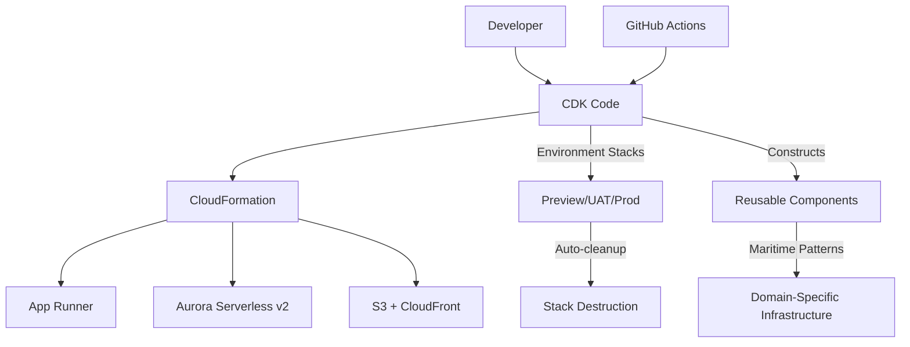

# AWS CDK - Infrastructure as Code with TypeScript/Python

## Overview

AWS Cloud Development Kit (CDK) is a software development framework for defining cloud infrastructure in familiar programming languages. In the VanguardAI stack, CDK provides Infrastructure as Code capabilities using TypeScript and Python, enabling the maritime insurance team to leverage their existing programming skills while delivering revolutionary $12/month ephemeral PR environments and enterprise-grade production infrastructure.

## Key Benefits

### VanguardAI Development Productivity
- **Programming language familiarity** eliminates HCL learning curve from Terraform
- **Type safety and IntelliSense** reduce infrastructure configuration errors
- **Reusable constructs** enable consistent environment deployments
- **Built-in AWS integration** provides seamless service connectivity

### Maritime Insurance Infrastructure
- **Environment parity** ensures consistent deployments from preview to production
- **Automated resource management** with CloudFormation state handling
- **Cost optimization constructs** implement VanguardAI scaling strategies
- **Maritime-specific patterns** for fleet management and quote generation workloads

## VanguardAI Implementation Context

### Maritime Insurance CDK Architecture

CDK serves as the foundation for the entire VanguardAI infrastructure, managing:

- **Ephemeral preview environments** with automated PR-based deployment and cleanup
- **App Runner serverless containers** with scale-to-zero configurations
- **Aurora Serverless v2 databases** with auto-pause optimization
- **CloudFront + S3 distributions** with aggressive caching strategies

### Integration with VanguardAI Stack



## Configuration Examples

### VanguardAI CDK App Structure

```python
#!/usr/bin/env python3
import os
from aws_cdk import App, Environment, Tags
from stacks.shared.vpc_stack import VanguardAIVpcStack
from stacks.shared.monitoring_stack import VanguardAIMonitoringStack
from stacks.preview_stack import VanguardAIPreviewStack
from stacks.uat_stack import VanguardAIUatStack
from stacks.prod_stack import VanguardAIProdStack

class VanguardAICDKApp:
    """
    VanguardAI CDK Application for Maritime Insurance Infrastructure
    Manages ephemeral preview environments and production-grade deployments
    """
    
    def __init__(self):
        self.app = App()
        self.account = os.environ.get("CDK_DEFAULT_ACCOUNT")
        self.region = os.environ.get("CDK_DEFAULT_REGION", "us-east-1")
        
        # Environment configuration
        self.env = Environment(account=self.account, region=self.region)
        
        # Initialize stacks
        self._create_shared_infrastructure()
        self._create_environment_stacks()
        self._apply_global_tags()
    
    def _create_shared_infrastructure(self):
        """Create shared infrastructure components"""
        
        # Shared VPC and networking
        self.vpc_stack = VanguardAIVpcStack(
            self.app, "VanguardAI-Shared-VPC",
            description="VanguardAI shared VPC and networking infrastructure",
            env=self.env,
            vpc_cidr="10.0.0.0/16",
            enable_nat_gateway=True,
            enable_vpc_endpoints=True
        )
        
        # Shared monitoring and observability
        self.monitoring_stack = VanguardAIMonitoringStack(
            self.app, "VanguardAI-Shared-Monitoring",  
            description="VanguardAI centralized monitoring and alerting",
            env=self.env,
            vpc=self.vpc_stack.vpc
        )
    
    def _create_environment_stacks(self):
        """Create environment-specific stacks"""
        
        # Preview environment (for PR deployments)
        pr_number = os.environ.get("PR_NUMBER")
        if pr_number:
            self.preview_stack = VanguardAIPreviewStack(
                self.app, f"VanguardAI-Preview-PR-{pr_number}",
                description=f"VanguardAI preview environment for PR #{pr_number}",
                env=self.env,
                vpc=self.vpc_stack.vpc,
                monitoring=self.monitoring_stack,
                pr_number=pr_number,
                auto_cleanup=True
            )
        
        # UAT environment
        self.uat_stack = VanguardAIUatStack(
            self.app, "VanguardAI-UAT",
            description="VanguardAI UAT environment for testing",
            env=self.env,
            vpc=self.vpc_stack.vpc,
            monitoring=self.monitoring_stack,
            environment="uat"
        )
        
        # Production environment
        environment = os.environ.get("ENVIRONMENT")
        if environment == "production":
            self.prod_stack = VanguardAIProdStack(
                self.app, "VanguardAI-Production",
                description="VanguardAI production environment",
                env=self.env,
                vpc=self.vpc_stack.vpc,
                monitoring=self.monitoring_stack,
                environment="production",
                enable_multi_az=True,
                enable_backup=True
            )
    
    def _apply_global_tags(self):
        """Apply consistent tags across all resources"""
        Tags.of(self.app).add("Project", "VanguardAI")
        Tags.of(self.app).add("Team", "Maritime-Insurance")
        Tags.of(self.app).add("Environment", os.environ.get("ENVIRONMENT", "preview"))
        Tags.of(self.app).add("CostCenter", "Development")
        Tags.of(self.app).add("Owner", "engineering-team")

if __name__ == "__main__":
    vanguard_app = VanguardAICDKApp()
    vanguard_app.app.synth()
```

### VanguardAI Reusable Constructs

```python
from aws_cdk import (
    Construct,
    aws_apprunner as apprunner,
    aws_rds as rds,
    aws_s3 as s3,
    aws_cloudfront as cloudfront,
    aws_cloudfront_origins as origins,
    aws_secretsmanager as secrets,
    aws_ssm as ssm,
    Duration,
    RemovalPolicy
)

class VanguardAIMaritimeInfrastructureConstruct(Construct):
    """
    VanguardAI reusable construct for complete maritime insurance infrastructure
    Includes App Runner, Aurora Serverless v2, and CloudFront distribution
    """
    
    def __init__(self, scope: Construct, construct_id: str, **kwargs):
        super().__init__(scope, construct_id)
        
        self.environment = kwargs.get('environment', 'preview')
        self.vpc = kwargs.get('vpc')
        self.pr_number = kwargs.get('pr_number')
        
        # Create all components
        self._create_database()
        self._create_backend_service()
        self._create_frontend_distribution()
        self._create_monitoring()
        self._output_endpoints()
    
    def _create_database(self):
        """Create Aurora Serverless v2 database with environment-specific configuration"""
        
        # Database credentials
        self.db_secret = secrets.Secret(
            self, "DatabaseCredentials",
            secret_name=f"vanguardai-{self.environment}-db-{self.pr_number or 'main'}",
            generate_secret_string=secrets.SecretStringGenerator(
                secret_string_template='{"username": "postgres"}',
                generate_string_key="password",
                exclude_characters=' %+~`#$&*()|[]{}:;<>?!\'/@"\\',
                password_length=32
            )
        )
        
        # Environment-specific database configuration
        db_config = self._get_database_config()
        
        # Aurora Serverless v2 cluster
        self.database_cluster = rds.DatabaseCluster(
            self, "MaritimeDatabase",
            cluster_identifier=f"vanguardai-{self.environment}-{self.pr_number or 'main'}",
            engine=rds.DatabaseClusterEngine.aurora_postgres(
                version=rds.AuroraPostgresEngineVersion.VER_15_4
            ),
            credentials=rds.Credentials.from_secret(self.db_secret),
            database_name="maritime_insurance",
            
            # VanguardAI serverless configuration
            serverless_v2_min_capacity=db_config['min_capacity'],
            serverless_v2_max_capacity=db_config['max_capacity'],
            
            # Network configuration
            vpc=self.vpc,
            vpc_subnets=self.vpc.select_subnets(
                subnet_type=ec2.SubnetType.PRIVATE_WITH_EGRESS
            ),
            
            # Environment-specific settings
            auto_minor_version_upgrade=True,
            backup_retention=Duration.days(db_config['backup_retention']),
            deletion_protection=db_config['deletion_protection'],
            removal_policy=db_config['removal_policy'],
            
            # Cost optimization
            enable_performance_insights=db_config['enable_performance_insights'],
            performance_insight_retention=rds.PerformanceInsightRetention.DEFAULT if db_config['enable_performance_insights'] else None
        )
        
        # Database writer instance
        self.database_instance = rds.DatabaseInstance(
            self, "DatabaseWriter",
            instance_identifier=f"vanguardai-{self.environment}-writer-{self.pr_number or 'main'}",
            engine=rds.DatabaseInstanceEngine.aurora_postgres(
                version=rds.AuroraPostgresEngineVersion.VER_15_4
            ),
            instance_type=rds.InstanceType.of(
                rds.InstanceClass.T4G, 
                rds.InstanceSize.MEDIUM
            ),
            cluster=self.database_cluster
        )
    
    def _create_backend_service(self):
        """Create App Runner service for FastAPI backend"""
        
        # Service configuration based on environment
        service_config = self._get_service_config()
        
        # App Runner service
        self.backend_service = apprunner.Service(
            self, "MaritimeAPI",
            service_name=f"vanguardai-{self.environment}-api-{self.pr_number or 'main'}",
            source=apprunner.Source.from_ecr(
                image_configuration=apprunner.ImageConfiguration(
                    port=8000,
                    environment_variables={
                        "ENVIRONMENT": self.environment,
                        "DATABASE_HOST": self.database_cluster.cluster_endpoint.hostname,
                        "DATABASE_PORT": str(self.database_cluster.cluster_endpoint.port),
                        "DATABASE_NAME": "maritime_insurance"
                    },
                    environment_secrets={
                        "DATABASE_PASSWORD": apprunner.Secret.from_secrets_manager(
                            self.db_secret, "password"
                        )
                    }
                ),
                repository=service_config['ecr_repository'],
                tag=service_config['image_tag']
            ),
            
            # VanguardAI optimization
            instance_configuration=apprunner.InstanceConfiguration(
                cpu=service_config['cpu'],
                memory=service_config['memory']
            ),
            
            auto_scaling_configuration=apprunner.AutoScalingConfiguration(
                self, "AutoScaling",
                auto_scaling_configuration_name=f"vanguardai-{self.environment}-scaling",
                max_concurrency=service_config['max_concurrency'],
                max_size=service_config['max_size'],
                min_size=service_config['min_size']  # Enable scale-to-zero
            ),
            
            # Health check configuration
            health_check_configuration=apprunner.HealthCheckConfiguration(
                healthy_threshold=2,
                interval=Duration.seconds(10),
                path="/health",
                protocol=apprunner.HealthCheckProtocol.HTTP,
                timeout=Duration.seconds(5),
                unhealthy_threshold=5
            )
        )
    
    def _create_frontend_distribution(self):
        """Create S3 + CloudFront distribution for React frontend"""
        
        # S3 bucket for static assets
        self.frontend_bucket = s3.Bucket(
            self, "FrontendBucket",
            bucket_name=f"vanguardai-{self.environment}-frontend-{self.pr_number or 'main'}",
            website_index_document="index.html",
            website_error_document="error.html",
            public_read_access=False,
            block_public_access=s3.BlockPublicAccess.BLOCK_ALL,
            removal_policy=RemovalPolicy.DESTROY if self.environment == 'preview' else RemovalPolicy.RETAIN,
            auto_delete_objects=self.environment == 'preview'
        )
        
        # CloudFront origin access identity
        self.oai = cloudfront.OriginAccessIdentity(
            self, "FrontendOAI",
            comment=f"VanguardAI {self.environment} frontend access"
        )
        
        # Grant CloudFront access to S3 bucket
        self.frontend_bucket.grant_read(self.oai)
        
        # CloudFront distribution with VanguardAI optimization
        cache_config = self._get_cache_configuration()
        
        self.frontend_distribution = cloudfront.Distribution(
            self, "FrontendDistribution",
            comment=f"VanguardAI {self.environment} maritime insurance frontend",
            default_root_object="index.html",
            
            # Origins configuration
            default_behavior=cloudfront.BehaviorOptions(
                origin=origins.S3Origin(
                    bucket=self.frontend_bucket,
                    origin_access_identity=self.oai
                ),
                cache_policy=cloudfront.CachePolicy.CACHING_OPTIMIZED,
                origin_request_policy=cloudfront.OriginRequestPolicy.CORS_S3_ORIGIN,
                viewer_protocol_policy=cloudfront.ViewerProtocolPolicy.REDIRECT_TO_HTTPS,
                compress=True
            ),
            
            # API proxy behavior
            additional_behaviors={
                "/api/*": cloudfront.BehaviorOptions(
                    origin=origins.HttpOrigin(
                        domain_name=self.backend_service.service_url,
                        protocol_policy=cloudfront.OriginProtocolPolicy.HTTPS_ONLY
                    ),
                    cache_policy=cloudfront.CachePolicy.CACHING_DISABLED,  # No caching for API
                    origin_request_policy=cloudfront.OriginRequestPolicy.ALL_VIEWER,
                    viewer_protocol_policy=cloudfront.ViewerProtocolPolicy.REDIRECT_TO_HTTPS,
                    allowed_methods=cloudfront.AllowedMethods.ALLOW_ALL
                )
            },
            
            # Cost optimization settings
            price_class=cache_config['price_class'],
            http_version=cloudfront.HttpVersion.HTTP2,
            enable_ipv6=True,
            
            # Error handling for SPA
            error_responses=[
                cloudfront.ErrorResponse(
                    http_status=404,
                    response_http_status=200,
                    response_page_path="/index.html",
                    ttl=Duration.minutes(5)
                )
            ]
        )
    
    def _create_monitoring(self):
        """Create CloudWatch monitoring and alarms"""
        
        # Cost monitoring alarm for preview environments
        if self.environment == 'preview':
            cloudwatch.Alarm(
                self, "PreviewCostAlarm",
                alarm_name=f"VanguardAI-Preview-Cost-PR-{self.pr_number}",
                alarm_description=f"Cost alarm for preview environment PR #{self.pr_number}",
                metric=cloudwatch.Metric(
                    namespace="AWS/Billing",
                    metric_name="EstimatedCharges",
                    dimensions={
                        "Currency": "USD"
                    }
                ),
                threshold=20,  # Alert if preview costs exceed $20/month
                evaluation_periods=1,
                datapoints_to_alarm=1
            )
        
        # App Runner monitoring
        cloudwatch.Alarm(
            self, "AppRunnerHealthAlarm",
            alarm_name=f"VanguardAI-{self.environment}-AppRunner-Health",
            alarm_description="App Runner service health monitoring",
            metric=self.backend_service.metric_2xx_status_responses(),
            threshold=10,
            evaluation_periods=2,
            comparison_operator=cloudwatch.ComparisonOperator.LESS_THAN_THRESHOLD
        )
        
        # Database monitoring
        cloudwatch.Alarm(
            self, "DatabaseConnectionAlarm",
            alarm_name=f"VanguardAI-{self.environment}-Database-Connections",
            alarm_description="Database connection count monitoring",
            metric=self.database_cluster.metric_database_connections(),
            threshold=80,
            evaluation_periods=2
        )
    
    def _output_endpoints(self):
        """Create CDK outputs for service endpoints"""
        
        CfnOutput(
            self, "FrontendURL",
            value=f"https://{self.frontend_distribution.distribution_domain_name}",
            description="Frontend application URL"
        )
        
        CfnOutput(
            self, "BackendURL", 
            value=f"https://{self.backend_service.service_url}",
            description="Backend API URL"
        )
        
        CfnOutput(
            self, "DatabaseEndpoint",
            value=self.database_cluster.cluster_endpoint.hostname,
            description="Database cluster endpoint"
        )
        
        # Preview environment specific outputs
        if self.pr_number:
            CfnOutput(
                self, "PreviewCost",
                value="~$12/month with auto-cleanup",
                description="Estimated monthly cost for preview environment"
            )
    
    def _get_database_config(self) -> dict:
        """Get environment-specific database configuration"""
        configs = {
            'preview': {
                'min_capacity': 0.5,
                'max_capacity': 1.0,
                'backup_retention': 1,
                'deletion_protection': False,
                'removal_policy': RemovalPolicy.DESTROY,
                'enable_performance_insights': False
            },
            'uat': {
                'min_capacity': 1.0,
                'max_capacity': 4.0,
                'backup_retention': 7,
                'deletion_protection': False,
                'removal_policy': RemovalPolicy.RETAIN,
                'enable_performance_insights': True
            },
            'production': {
                'min_capacity': 2.0,
                'max_capacity': 16.0,
                'backup_retention': 30,
                'deletion_protection': True,
                'removal_policy': RemovalPolicy.RETAIN,
                'enable_performance_insights': True
            }
        }
        return configs.get(self.environment, configs['preview'])
    
    def _get_service_config(self) -> dict:
        """Get environment-specific App Runner configuration"""
        configs = {
            'preview': {
                'cpu': apprunner.Cpu.HALF_VCPU,
                'memory': apprunner.Memory.HALF_GB,
                'min_size': 0,
                'max_size': 3,
                'max_concurrency': 50,
                'ecr_repository': 'vanguardai-maritime-api',
                'image_tag': f'pr-{self.pr_number}' if self.pr_number else 'latest'
            },
            'uat': {
                'cpu': apprunner.Cpu.ONE_VCPU,
                'memory': apprunner.Memory.TWO_GB,
                'min_size': 1,
                'max_size': 10,
                'max_concurrency': 100,
                'ecr_repository': 'vanguardai-maritime-api',
                'image_tag': 'uat'
            },
            'production': {
                'cpu': apprunner.Cpu.FOUR_VCPU,
                'memory': apprunner.Memory.EIGHT_GB,
                'min_size': 2,
                'max_size': 25,
                'max_concurrency': 100,
                'ecr_repository': 'vanguardai-maritime-api',
                'image_tag': 'production'
            }
        }
        return configs.get(self.environment, configs['preview'])
    
    def _get_cache_configuration(self) -> dict:
        """Get environment-specific CloudFront cache configuration"""
        configs = {
            'preview': {
                'price_class': cloudfront.PriceClass.PRICE_CLASS_100
            },
            'uat': {
                'price_class': cloudfront.PriceClass.PRICE_CLASS_200
            },
            'production': {
                'price_class': cloudfront.PriceClass.PRICE_CLASS_ALL
            }
        }
        return configs.get(self.environment, configs['preview'])
```

### GitHub Actions CDK Pipeline

```yaml
name: VanguardAI CDK Deploy

on:
  pull_request:
    branches: [main]
  push:
    branches: [main]
  pull_request:
    types: [closed]

permissions:
  id-token: write
  contents: read
  pull-requests: write

jobs:
  deploy-preview:
    if: github.event_name == 'pull_request' && github.event.action != 'closed'
    runs-on: ubuntu-latest
    environment: preview
    
    steps:
      - name: Checkout
        uses: actions/checkout@v4
      
      - name: Setup Python
        uses: actions/setup-python@v4
        with:
          python-version: '3.11'
      
      - name: Configure AWS credentials
        uses: aws-actions/configure-aws-credentials@v4
        with:
          role-to-assume: ${{ secrets.AWS_ROLE_ARN }}
          aws-region: ${{ secrets.AWS_REGION }}
      
      - name: Install CDK and dependencies
        run: |
          npm install -g aws-cdk
          cd infrastructure
          pip install -r requirements.txt
      
      - name: CDK Bootstrap (if needed)
        run: |
          cd infrastructure
          cdk bootstrap aws://${{ secrets.AWS_ACCOUNT_ID }}/${{ secrets.AWS_REGION }}
      
      - name: CDK Synth
        run: |
          cd infrastructure
          cdk synth VanguardAI-Preview-PR-${{ github.event.number }}
        env:
          PR_NUMBER: ${{ github.event.number }}
          ENVIRONMENT: preview
      
      - name: CDK Deploy Preview
        run: |
          cd infrastructure
          cdk deploy VanguardAI-Preview-PR-${{ github.event.number }} \
            --require-approval never \
            --outputs-file preview-outputs.json
        env:
          PR_NUMBER: ${{ github.event.number }}
          ENVIRONMENT: preview
      
      - name: Extract outputs
        id: outputs
        run: |
          cd infrastructure
          FRONTEND_URL=$(jq -r '.["VanguardAI-Preview-PR-${{ github.event.number }}"].FrontendURL' preview-outputs.json)
          BACKEND_URL=$(jq -r '.["VanguardAI-Preview-PR-${{ github.event.number }}"].BackendURL' preview-outputs.json)
          PREVIEW_COST=$(jq -r '.["VanguardAI-Preview-PR-${{ github.event.number }}"].PreviewCost' preview-outputs.json)
          
          echo "frontend_url=$FRONTEND_URL" >> $GITHUB_OUTPUT
          echo "backend_url=$BACKEND_URL" >> $GITHUB_OUTPUT
          echo "preview_cost=$PREVIEW_COST" >> $GITHUB_OUTPUT
      
      - name: Comment PR with preview links
        uses: actions/github-script@v7
        with:
          script: |
            const { data: comments } = await github.rest.issues.listComments({
              owner: context.repo.owner,
              repo: context.repo.repo,
              issue_number: context.issue.number
            });
            
            // Find existing VanguardAI preview comment
            const existingComment = comments.find(comment => 
              comment.body.includes('🚀 **VanguardAI Preview Environment**')
            );
            
            const commentBody = `🚀 **VanguardAI Preview Environment Deployed**
            
            **Preview URLs**:
            - 🌐 **Frontend**: ${{ steps.outputs.outputs.frontend_url }}
            - 🔧 **Backend API**: ${{ steps.outputs.outputs.backend_url }}
            - 📊 **API Docs**: ${{ steps.outputs.outputs.backend_url }}/docs
            
            **Cost Information**:
            - 💰 **Estimated Cost**: ${{ steps.outputs.outputs.preview_cost }}
            - ⚡ **Features**: Scale-to-zero, auto-pause database, auto-cleanup
            
            **Maritime Insurance Features**:
            - 🚢 Fleet Management: ${{ steps.outputs.outputs.frontend_url }}/fleets
            - 📋 Quote Generator: ${{ steps.outputs.outputs.frontend_url }}/quotes
            - 📊 Risk Assessment: ${{ steps.outputs.outputs.frontend_url }}/risk-assessment
            
            **Environment Details**:
            - **PR Number**: #${{ github.event.number }}
            - **Commit**: ${{ github.sha }}
            - **Branch**: ${{ github.head_ref }}
            - **Auto-cleanup**: Will be destroyed when PR is closed
            
            ---
            
            <details>
            <summary>🛠️ Technical Details</summary>
            
            **Infrastructure Components**:
            - **App Runner**: 0.5 vCPU, 0.5GB RAM with scale-to-zero
            - **Aurora Serverless v2**: 0.5-1 ACU with 5-minute auto-pause
            - **CloudFront + S3**: Optimized for global delivery
            - **Auto-cleanup**: CDK stack will be destroyed on PR close
            
            **Monitoring**:
            - CloudWatch alarms configured for cost and performance
            - Automatic scaling based on traffic patterns
            - Health checks for all services
            
            </details>`;
            
            if (existingComment) {
              await github.rest.issues.updateComment({
                owner: context.repo.owner,
                repo: context.repo.repo,
                comment_id: existingComment.id,
                body: commentBody
              });
            } else {
              await github.rest.issues.createComment({
                owner: context.repo.owner,
                repo: context.repo.repo,
                issue_number: context.issue.number,
                body: commentBody
              });
            }

  cleanup-preview:
    if: github.event_name == 'pull_request' && github.event.action == 'closed'
    runs-on: ubuntu-latest
    environment: preview
    
    steps:
      - name: Checkout
        uses: actions/checkout@v4
      
      - name: Setup Python
        uses: actions/setup-python@v4
        with:
          python-version: '3.11'
      
      - name: Configure AWS credentials
        uses: aws-actions/configure-aws-credentials@v4
        with:
          role-to-assume: ${{ secrets.AWS_ROLE_ARN }}
          aws-region: ${{ secrets.AWS_REGION }}
      
      - name: Install CDK and dependencies
        run: |
          npm install -g aws-cdk
          cd infrastructure
          pip install -r requirements.txt
      
      - name: Cleanup preview environment
        run: |
          cd infrastructure
          cdk destroy VanguardAI-Preview-PR-${{ github.event.number }} --force
        env:
          PR_NUMBER: ${{ github.event.number }}
          ENVIRONMENT: preview
      
      - name: Comment PR cleanup completion
        uses: actions/github-script@v7
        with:
          script: |
            github.rest.issues.createComment({
              owner: context.repo.owner,
              repo: context.repo.repo,
              issue_number: context.issue.number,
              body: `🧹 **VanguardAI Preview Environment Cleaned Up**
              
              Preview environment for PR #${{ github.event.number }} has been automatically destroyed.
              
              **Resources Cleaned Up**:
              - ✅ App Runner service terminated
              - ✅ Aurora Serverless v2 cluster deleted
              - ✅ S3 bucket and CloudFront distribution removed
              - ✅ All monitoring alarms deleted
              - ✅ Secrets and parameters cleaned up
              
              **Cost Impact**: $0/month (all resources destroyed)
              
              Thank you for using VanguardAI preview environments! 🚀`
            });

  deploy-uat:
    if: github.ref == 'refs/heads/main' && github.event_name == 'push'
    runs-on: ubuntu-latest
    environment: uat
    
    steps:
      - name: Checkout
        uses: actions/checkout@v4
      
      - name: Setup Python
        uses: actions/setup-python@v4
        with:
          python-version: '3.11'
      
      - name: Configure AWS credentials
        uses: aws-actions/configure-aws-credentials@v4
        with:
          role-to-assume: ${{ secrets.AWS_ROLE_ARN }}
          aws-region: ${{ secrets.AWS_REGION }}
      
      - name: Install CDK and dependencies
        run: |
          npm install -g aws-cdk
          cd infrastructure
          pip install -r requirements.txt
      
      - name: CDK Deploy UAT
        run: |
          cd infrastructure
          cdk deploy VanguardAI-UAT --require-approval never
        env:
          ENVIRONMENT: uat

  deploy-production:
    if: github.ref == 'refs/heads/main' && github.event_name == 'push'
    runs-on: ubuntu-latest
    environment: production
    needs: [deploy-uat]
    
    steps:
      - name: Checkout
        uses: actions/checkout@v4
      
      - name: Setup Python
        uses: actions/setup-python@v4
        with:
          python-version: '3.11'
      
      - name: Configure AWS credentials
        uses: aws-actions/configure-aws-credentials@v4
        with:
          role-to-assume: ${{ secrets.AWS_ROLE_ARN }}
          aws-region: ${{ secrets.AWS_REGION }}
      
      - name: Install CDK and dependencies
        run: |
          npm install -g aws-cdk
          cd infrastructure
          pip install -r requirements.txt
      
      - name: CDK Deploy Production
        run: |
          cd infrastructure
          cdk deploy VanguardAI-Production --require-approval never
        env:
          ENVIRONMENT: production
```

## Best Practices

### VanguardAI Cost Optimization Patterns

#### Environment-Specific Resource Sizing
```python
class VanguardAICostOptimizer:
    """CDK patterns for VanguardAI cost optimization"""
    
    @staticmethod
    def get_resource_config(environment: str, resource_type: str) -> dict:
        """Get cost-optimized resource configuration"""
        
        configs = {
            'preview': {
                'app_runner': {
                    'cpu': apprunner.Cpu.HALF_VCPU,
                    'memory': apprunner.Memory.HALF_GB,
                    'min_size': 0,  # Scale to zero
                    'max_size': 3
                },
                'aurora': {
                    'min_capacity': 0.5,
                    'max_capacity': 1.0,
                    'auto_pause': True,
                    'pause_after': 300  # 5 minutes
                },
                'cloudfront': {
                    'price_class': cloudfront.PriceClass.PRICE_CLASS_100
                }
            },
            'uat': {
                'app_runner': {
                    'cpu': apprunner.Cpu.ONE_VCPU,
                    'memory': apprunner.Memory.TWO_GB,
                    'min_size': 1,
                    'max_size': 10
                },
                'aurora': {
                    'min_capacity': 1.0,
                    'max_capacity': 4.0,
                    'auto_pause': False
                },
                'cloudfront': {
                    'price_class': cloudfront.PriceClass.PRICE_CLASS_200
                }
            },
            'production': {
                'app_runner': {
                    'cpu': apprunner.Cpu.FOUR_VCPU,
                    'memory': apprunner.Memory.EIGHT_GB,
                    'min_size': 2,
                    'max_size': 25
                },
                'aurora': {
                    'min_capacity': 2.0,
                    'max_capacity': 16.0,
                    'auto_pause': False,
                    'multi_az': True
                },
                'cloudfront': {
                    'price_class': cloudfront.PriceClass.PRICE_CLASS_ALL
                }
            }
        }
        
        env_config = configs.get(environment, configs['preview'])
        return env_config.get(resource_type, {})

    @staticmethod
    def apply_cost_tags(construct: Construct, environment: str, pr_number: str = None):
        """Apply cost allocation tags for VanguardAI environments"""
        
        Tags.of(construct).add("Project", "VanguardAI")
        Tags.of(construct).add("Environment", environment)
        Tags.of(construct).add("CostCenter", "Development" if environment == 'preview' else "Production")
        Tags.of(construct).add("AutoCleanup", "true" if environment == 'preview' else "false")
        
        if pr_number:
            Tags.of(construct).add("PRNumber", pr_number)
            Tags.of(construct).add("ExpectedCost", "$12/month")
        
        # Maritime insurance specific tags
        Tags.of(construct).add("Application", "Maritime-Insurance")
        Tags.of(construct).add("BusinessUnit", "Insurance")
```

#### Auto-Cleanup Mechanisms
```python
class VanguardAIAutoCleanup(Construct):
    """Automated cleanup for preview environments"""
    
    def __init__(self, scope: Construct, construct_id: str, **kwargs):
        super().__init__(scope, construct_id)
        
        environment = kwargs.get('environment')
        pr_number = kwargs.get('pr_number')
        
        if environment == 'preview' and pr_number:
            self._create_cleanup_lambda()
            self._create_cleanup_schedule()
    
    def _create_cleanup_lambda(self):
        """Create Lambda function for automatic cleanup"""
        
        # Lambda function for cleanup
        self.cleanup_function = aws_lambda.Function(
            self, "CleanupFunction",
            function_name=f"vanguardai-preview-cleanup-{self.pr_number}",
            runtime=aws_lambda.Runtime.PYTHON_3_11,
            handler="cleanup.handler",
            code=aws_lambda.Code.from_inline("""
import boto3
import json

def handler(event, context):
    cdk_client = boto3.client('cloudformation')
    
    stack_name = event.get('stack_name')
    pr_number = event.get('pr_number')
    
    try:
        # Check if PR is still open
        if not is_pr_open(pr_number):
            # Delete the stack
            cdk_client.delete_stack(StackName=stack_name)
            
            return {
                'statusCode': 200,
                'body': json.dumps(f'Stack {stack_name} queued for deletion')
            }
        else:
            return {
                'statusCode': 200,
                'body': json.dumps(f'PR {pr_number} still open, keeping stack')
            }
    
    except Exception as e:
        return {
            'statusCode': 500,
            'body': json.dumps(f'Error: {str(e)}')
        }

def is_pr_open(pr_number):
    # Implementation to check GitHub PR status
    # This would integrate with GitHub API
    return False  # Simplified for example
            """),
            timeout=Duration.minutes(5),
            environment={
                'STACK_NAME': f'VanguardAI-Preview-PR-{self.pr_number}',
                'PR_NUMBER': str(self.pr_number)
            }
        )
    
    def _create_cleanup_schedule(self):
        """Create EventBridge rule for periodic cleanup"""
        
        # Schedule cleanup check every hour
        events.Rule(
            self, "CleanupSchedule",
            rule_name=f"vanguardai-cleanup-pr-{self.pr_number}",
            schedule=events.Schedule.rate(Duration.hours(1)),
            targets=[
                events_targets.LambdaFunction(
                    self.cleanup_function,
                    event=events.RuleTargetInput.from_object({
                        'stack_name': f'VanguardAI-Preview-PR-{self.pr_number}',
                        'pr_number': self.pr_number
                    })
                )
            ]
        )
```

### Security Best Practices

#### IAM Roles and Policies
```python
class VanguardAISecurityConstruct(Construct):
    """Security configurations for VanguardAI environments"""
    
    def create_environment_roles(self, environment: str) -> dict:
        """Create environment-specific IAM roles"""
        
        # Base permissions for all environments
        base_policies = [
            iam.PolicyStatement(
                effect=iam.Effect.ALLOW,
                actions=[
                    "secretsmanager:GetSecretValue",
                    "ssm:GetParameter",
                    "ssm:GetParameters"
                ],
                resources=[
                    f"arn:aws:secretsmanager:*:*:secret:vanguardai-{environment}-*",
                    f"arn:aws:ssm:*:*:parameter/vanguardai/{environment}/*"
                ]
            )
        ]
        
        # Environment-specific permissions
        if environment == 'preview':
            # Limited permissions for preview environments
            base_policies.append(
                iam.PolicyStatement(
                    effect=iam.Effect.ALLOW,
                    actions=[
                        "rds-data:ExecuteStatement",
                        "rds-data:BatchExecuteStatement"
                    ],
                    resources=[f"arn:aws:rds:*:*:cluster:vanguardai-{environment}-*"]
                )
            )
        else:
            # Full database permissions for UAT and production
            base_policies.append(
                iam.PolicyStatement(
                    effect=iam.Effect.ALLOW,
                    actions=[
                        "rds:DescribeDBClusters",
                        "rds:DescribeDBInstances",
                        "rds-data:*"
                    ],
                    resources=[f"arn:aws:rds:*:*:cluster:vanguardai-{environment}-*"]
                )
            )
        
        # Create role
        role = iam.Role(
            self, f"VanguardAIRole-{environment}",
            role_name=f"VanguardAI-{environment}-execution-role",
            assumed_by=iam.ServicePrincipal("tasks.apprunner.amazonaws.com"),
            inline_policies={
                f"VanguardAI-{environment}-policy": iam.PolicyDocument(
                    statements=base_policies
                )
            }
        )
        
        return {'execution_role': role}
```

## Team Member Responsibilities

### Head of Engineering
**Tools**: Claude Code Max ($100/month), AWS Console  
**Responsibilities**:
- CDK architecture design and infrastructure patterns
- Environment strategy and cost optimization policies
- Security configuration and compliance oversight
- Multi-environment deployment strategy

**Key Tasks**:
```bash
# Monitor CDK deployments and costs
aws cloudformation describe-stacks --stack-name VanguardAI-Production
aws ce get-cost-and-usage --time-period Start=2024-01-01,End=2024-02-01

# Review infrastructure changes
cdk diff VanguardAI-Production
cdk synth --all
```

### Lead Frontend Developer
**Tools**: Claude Code Max ($200/month), Figma ($15/month), Cursor IDE  
**Responsibilities**:
- Frontend CDK constructs for S3 + CloudFront
- Preview environment integration with React applications
- Build pipeline optimization and asset deployment
- Frontend performance monitoring through CDK

**Key Tasks**:
```typescript
// Using Claude Code Max for CDK frontend constructs:
"Create CDK construct for React maritime insurance frontend:
- S3 bucket with optimized build artifact deployment
- CloudFront distribution with SPA routing configuration
- Environment-specific caching strategies for different deployment stages
- Integration with App Runner backend API routing"
```

### Lead Backend Developer
**Tools**: Claude Code Max ($200/month), Cursor IDE  
**Responsibilities**:
- Backend CDK constructs for App Runner and Aurora Serverless v2
- Database migration strategies and schema management
- API deployment automation and health monitoring
- Cost optimization for compute and database resources

**Key Tasks**:
```python
# Using Claude Code Max for backend CDK development:
"Create comprehensive CDK constructs for maritime insurance backend:
- App Runner service with FastAPI optimization and health checks
- Aurora Serverless v2 with auto-pause and scaling configuration
- Secrets Manager integration for secure credential management
- CloudWatch monitoring and alerting for API performance"
```

### UI/UX Engineer
**Tools**: Figma ($15/month)  
**Responsibilities**:
- Design validation in CDK-deployed preview environments
- User experience testing across different environment configurations
- Design system deployment through CDK asset management
- Frontend performance impact assessment

**Key Tasks**:
- Test design implementations in $12/month preview environments
- Validate user experience across CDK-managed environment configurations
- Document design system asset deployment through CDK
- Collaborate on frontend CDK construct user experience optimization

## Training Resources and Learning Path

### Week 1: CDK Fundamentals
**Objective**: Understand Infrastructure as Code concepts and CDK basics

**Resources**:
- [AWS CDK Developer Guide](https://docs.aws.amazon.com/cdk/v2/guide/)
- [CDK Workshop](https://cdkworkshop.com/)
- [VanguardAI CDK Patterns](../docs/implementation-guide/vanguardai-complete-implementation-guide.md)

**Hands-on Labs**:
1. Create simple CDK stack with S3 bucket
2. Deploy multi-environment CDK application
3. Use CDK constructs for reusable components

### Week 2: VanguardAI CDK Integration  
**Objective**: Implement CDK for maritime insurance infrastructure

**Resources**:
- [CDK Construct Library](https://docs.aws.amazon.com/cdk/api/v2/)
- [VanguardAI Implementation Guide](../docs/implementation-guide/vanguardai-complete-implementation-guide.md)

**Hands-on Labs**:
1. Create VanguardAI maritime infrastructure constructs
2. Implement environment-specific configurations
3. Deploy preview environments with GitHub Actions

### Week 3: Advanced CDK Patterns
**Objective**: Master advanced CDK features for production deployment

**Resources**:
- [CDK Best Practices](https://docs.aws.amazon.com/cdk/v2/guide/best-practices.html)
- [CDK Pipelines](https://docs.aws.amazon.com/cdk/v2/guide/cdk_pipeline.html)

**Hands-on Labs**:
1. Implement CDK Pipelines for automated deployment
2. Create custom constructs for maritime insurance patterns
3. Add comprehensive monitoring and alerting

### Week 4: Production Operations
**Objective**: Master CDK for production operations and troubleshooting

**Resources**:
- [CDK Troubleshooting Guide](https://docs.aws.amazon.com/cdk/v2/guide/troubleshooting.html)
- [CloudFormation Best Practices](https://docs.aws.amazon.com/AWSCloudFormation/latest/UserGuide/best-practices.html)

**Hands-on Labs**:
1. Implement CDK for disaster recovery scenarios
2. Create cost optimization automation with CDK
3. Master CDK debugging and troubleshooting techniques

### Self-Assessment Checklist

**Basic Competency**:
- [ ] Can create simple CDK stacks and deploy to AWS
- [ ] Understands CDK constructs and reusability concepts  
- [ ] Can use CDK CLI for basic operations

**Intermediate Competency**:
- [ ] Creates custom constructs for maritime insurance patterns
- [ ] Implements environment-specific configurations
- [ ] Integrates CDK with GitHub Actions pipelines

**Advanced Competency**:
- [ ] Designs cost-optimized infrastructure with CDK
- [ ] Implements comprehensive monitoring and alerting
- [ ] Masters CDK for production operations

**Expert Level**:
- [ ] Creates reusable CDK libraries for team use
- [ ] Troubleshoots complex CDK and CloudFormation issues
- [ ] Mentors team members on CDK best practices

## Cost Analysis and ROI

### VanguardAI CDK Implementation Costs

| Component | One-time Setup | Monthly Operations | Annual Total |
|-----------|----------------|-------------------|--------------|
| **CDK Development** | $4,000 (2 weeks) | $0 | $4,000 |
| **GitHub Actions** | $0 | $0 (included) | $0 |
| **AWS CloudFormation** | $0 | $0 | $0 |
| **CDK Assets S3** | $0 | $5 | $60 |
| **Total** | $4,000 | $5 | $4,060 |

### Cost Savings Through CDK Automation

**Manual Infrastructure Management**:
- DevOps engineer: $120,000/year × 0.5 FTE = $60,000/year
- Infrastructure mistakes and downtime: $10,000/year
- Manual deployment overhead: 5 hours/week × $150/hour × 52 weeks = $39,000/year
- **Total manual cost**: $109,000/year

**CDK Automated Management**:
- CDK implementation and maintenance: $4,060/year
- Reduced deployment errors: $2,000/year savings
- Automated environment management: $39,000/year savings
- **Total automated cost**: $4,060/year
- **Annual savings**: $104,940/year

### Preview Environment ROI

**Manual Preview Environments**:
- Setup time: 2 hours × $150/hour = $300 per environment
- Monthly cost: $100/month per environment (no auto-cleanup)
- 10 PRs/month × $400 total cost = $4,000/month

**CDK Automated Preview Environments**:
- Setup time: 5 minutes (automated)
- Monthly cost: $12/month per environment (with auto-cleanup)
- 10 PRs/month × $12 = $120/month
- **Monthly savings**: $3,880/month
- **Annual savings**: $46,560/year on preview environments alone

### Total ROI Calculation

**Annual Investment**: $4,060  
**Annual Savings**: $151,500 ($104,940 + $46,560)  
**ROI**: 3,632% return on investment  
**Payback Period**: 0.97 months (under 1 month)

---

**Implementation Cost**: $4,000 one-time + $5/month operations  
**Programming Languages**: ✅ TypeScript/Python (no HCL learning curve)  
**State Management**: ✅ Automatic CloudFormation state handling  
**VanguardAI Integration**: ✅ Optimized for maritime insurance ephemeral environments