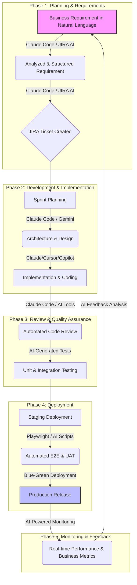
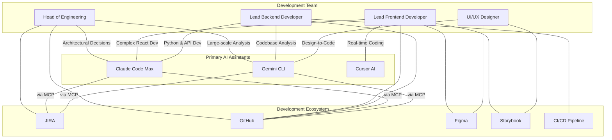
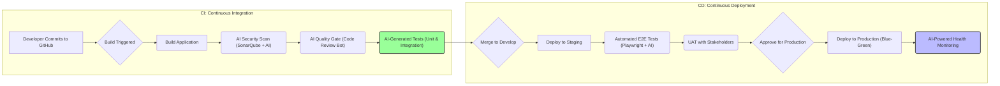

# Visual Diagrams for AI-Assisted SDLC Workflow

This document provides visual representations of the key workflows, team structures, and technical pipelines described in the AI-Assisted SDLC research.

## 1. High-Level AI-Assisted SDLC Flow

This diagram illustrates the end-to-end software development lifecycle, highlighting the key phases and the primary AI tools integrated at each step.

## 2. Team Interaction & Tool Ecosystem

This diagram shows the roles within the the platform team, the primary AI tools they use, and how they interact with the core development ecosystem.

## 3. AI-Enhanced CI/CD Pipeline

This diagram details the Continuous Integration and Continuous Deployment pipeline, showing the specific stages where AI-powered checks and validations are integrated.

