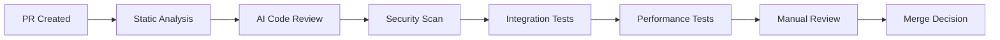

# Perspective 3: Workflow and Orchestration Patterns

## PR Lifecycle Integration

### Pre-Merge Validation Pipeline

### Validation Checkpoints
1. **Static Analysis**: Code quality, style compliance, security vulnerabilities
2. **AI Review**: Logic validation, best practices, architectural consistency
3. **Integration Testing**: Cross-service compatibility, API contracts
4. **Performance Assessment**: Resource usage, regression detection

## Execution Strategies

### Parallel vs Sequential Execution
**Parallel Benefits:**
- Reduced validation time through concurrent execution
- Efficient resource utilization
- Early failure detection and fast feedback

**Sequential Use Cases:**
- Dependency management for ordered execution
- Resource constraints requiring sequential processing
- Complex validation requiring previous step results

### Error Handling and Recovery
**Fault Tolerance:**
- **Circuit Breaker Pattern**: Automatic failure isolation
- **Exponential Backoff**: Intelligent retry for transient failures
- **Fallback Procedures**: Alternative validation approaches

**Recovery Mechanisms:**
- **State Persistence**: Progress preservation for recovery
- **Partial Results**: Incremental validation reporting
- **Manual Override**: Human intervention for complex failures

## Status Reporting and Feedback

### GitHub PR Interface Integration
- **Check Runs**: Detailed validation status with expandable results
- **PR Comments**: AI-generated feedback with actionable recommendations
- **Review Summaries**: Comprehensive reports with approval rationale

### External Notification Systems
- **Slack Integration**: Real-time status updates for teams
- **Email Notifications**: Detailed validation reports for stakeholders
- **Dashboard Integration**: Centralized monitoring and reporting

## Workflow Orchestration Patterns

### Event-Driven Triggers
- **PR Events**: Created, updated, reopened triggers
- **Comment Triggers**: @claude mentions for manual validation
- **Scheduled Validation**: Periodic review for long-running PRs

### Multi-Agent Coordination
- **Specialized Agents**: Different agents for security, performance, style
- **Result Synthesis**: Comprehensive report generation from multiple agents
- **Conflict Resolution**: Handling contradictory recommendations

### Integration with Existing CI/CD
- **GitHub Actions**: Native integration with existing workflows
- **Jenkins**: Plugin-based integration for enterprise environments
- **GitLab CI**: Webhook-based integration patterns
- **Custom Pipelines**: API-based integration for proprietary systems