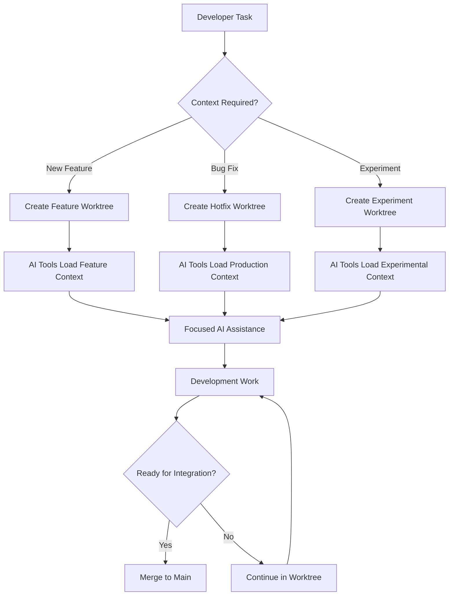

# Strategic Architecture Analysis: Git Worktrees vs Monorepos Decision Framework

## Executive Summary

Git worktrees represent a third architectural pattern that bridges traditional monorepos and polyrepos, offering unique advantages for AI-assisted development workflows. This analysis provides a comprehensive decision framework for choosing between monorepos, polyrepos, and worktree-based architectures, with specific focus on strategic implications for modern development teams.

**Key Strategic Findings:**
- Git worktrees enable "flexible monorepos" - single repository with multiple isolated working contexts
- Decision framework depends on team size, project complexity, and development velocity requirements
- Worktrees excel in scenarios requiring parallel development with context isolation
- Hybrid approaches combining monorepos with worktrees provide optimal flexibility
- AI development workflows particularly benefit from worktree context isolation

## Repository Architecture Taxonomy

### Architecture Pattern Classification

**Traditional Patterns:**

1. **Monorepo Architecture**
   - Single repository containing all project code
   - Shared dependencies and build systems
   - Unified versioning and release processes
   - Examples: Google, Facebook, Microsoft internal projects

2. **Polyrepo Architecture** 
   - Multiple repositories for different components/services
   - Independent versioning and deployment cycles
   - Distributed dependency management
   - Examples: Netflix microservices, Amazon service teams

**Emerging Pattern:**

3. **Worktree-Enhanced Architecture**
   - Single repository with multiple working contexts
   - Shared history with isolated development environments
   - Flexible branch-based development workflows
   - Hybrid benefits of mono and poly approaches

### Architecture Comparison Matrix

| Aspect | Monorepo | Polyrepo | Worktree-Enhanced |
|--------|----------|----------|-------------------|
| **Code Sharing** | ✅ Excellent | ⚠️ Complex | ✅ Excellent |
| **Independent Deployment** | ⚠️ Coordinated | ✅ Fully Independent | ✅ Branch-Based |
| **Build Complexity** | 🔴 High | ✅ Simple | ✅ Moderate |
| **Dependency Management** | ✅ Centralized | 🔴 Distributed | ✅ Flexible |
| **Team Scaling** | ⚠️ Requires Tooling | ✅ Natural | ✅ Branch-Based |
| **Context Isolation** | 🔴 Challenging | ✅ Complete | ✅ Per-Branch |
| **CI/CD Complexity** | 🔴 Complex | ✅ Simple | ⚠️ Moderate |
| **Development Velocity** | ⚠️ Setup Heavy | ✅ Fast Bootstrap | ✅ Fast Context Switch |

## Strategic Decision Framework

### Decision Tree for Repository Architecture

```
Start: New Project or Architecture Migration
├── Team Size Analysis
│   ├── Small Team (1-5 developers)
│   │   ├── Simple Project → Monorepo
│   │   ├── Complex/Multi-Service → Worktree-Enhanced
│   │   └── Microservices → Polyrepo
│   ├── Medium Team (6-20 developers)
│   │   ├── Shared Codebase → Monorepo with Worktrees
│   │   ├── Independent Services → Polyrepo
│   │   └── Feature-Based Development → Worktree-Enhanced
│   └── Large Team (20+ developers)
│       ├── Platform Team Model → Monorepo
│       ├── Service Ownership Model → Polyrepo
│       └── Matrix Organization → Hybrid Approach
├── Project Complexity Analysis
│   ├── Single Application → Monorepo or Worktree-Enhanced
│   ├── Multi-Service Platform → Worktree-Enhanced or Polyrepo
│   └── Distributed System → Polyrepo with Service Boundaries
└── Development Workflow Requirements
    ├── Frequent Cross-Service Changes → Monorepo
    ├── Independent Release Cycles → Polyrepo
    ├── Parallel Feature Development → Worktree-Enhanced
    └── AI-Assisted Development → Worktree-Enhanced (Recommended)
```

### Strategic Evaluation Criteria

**1. Development Velocity Factors**

**Monorepo Advantages:**
- Atomic changes across multiple services
- Simplified dependency updates
- Unified tooling and processes
- Single CI/CD pipeline coordination

**Monorepo Challenges:**
- Build system complexity at scale
- Long CI/CD pipeline execution times
- Potential for merge conflicts
- Requires sophisticated tooling (Bazel, Nx, Lerna)

**Worktree-Enhanced Advantages:**
- Rapid context switching without stashing
- Parallel development of multiple features
- Independent testing environments per branch
- Reduced cognitive load through context isolation

**2. Team Collaboration Patterns**

**High Collaboration Requirements:**
```
Scenario: Shared Platform Development
├── Frontend Team
├── Backend Team  
├── Platform Team
└── DevOps Team

Recommendation: Monorepo with Worktrees
- Shared codebase enables cross-team collaboration
- Worktrees provide team-specific development contexts
- Unified versioning with flexible development workflows
```

**Low Collaboration Requirements:**
```
Scenario: Microservices with Service Ownership
├── User Service Team (Independent)
├── Payment Service Team (Independent)
├── Notification Service Team (Independent)
└── Platform Team (Shared Infrastructure)

Recommendation: Polyrepo
- Clear service boundaries
- Independent deployment cycles
- Team autonomy and ownership
```

**3. Technical Architecture Alignment**

**Monolithic Architecture → Monorepo**
- Single deployable unit
- Shared data models and business logic
- Unified build and test processes

**Microservices Architecture → Polyrepo or Hybrid**
- Independent service development and deployment
- Clear API boundaries between services
- Service-specific technology stacks

**Modular Monolith → Worktree-Enhanced**
- Single application with clear module boundaries
- Parallel development of different modules
- Gradual evolution toward microservices

## Detailed Architecture Analysis

### Monorepo Strategic Assessment

**When Monorepos Excel:**

1. **Platform Companies** (Google, Facebook, Microsoft)
   - Massive internal tooling investment
   - Thousands of engineers requiring coordination
   - Complex interdependencies between components

2. **Rapid Iteration Products**
   - Frequent breaking changes across services
   - Small to medium teams (5-50 engineers)
   - Need for atomic changes and refactoring

3. **Shared Library Ecosystems**
   - Common UI components and design systems
   - Shared business logic and data models
   - Consistent coding standards and practices

**Monorepo Implementation Patterns:**

```yaml
# Advanced Monorepo Structure
monorepo/
├── packages/
│   ├── shared/           # Common utilities and types
│   ├── ui-components/    # Shared UI library
│   ├── business-logic/   # Core business rules
│   └── api-client/       # Shared API client
├── services/
│   ├── web-app/         # Frontend application
│   ├── api-server/      # Backend API
│   ├── admin-panel/     # Admin interface
│   └── mobile-app/      # Mobile application
├── tools/
│   ├── build/           # Build scripts and configuration
│   ├── testing/         # Shared testing utilities
│   └── deploy/          # Deployment automation
└── infrastructure/
    ├── terraform/       # Infrastructure as code
    ├── kubernetes/      # Container orchestration
    └── monitoring/      # Observability configuration
```

**Monorepo Success Metrics:**
- Developer productivity: 30-50% reduction in setup time
- Code reuse: 60-80% shared code utilization
- Dependency management: Single source of truth
- Release coordination: Synchronized releases across all services

### Polyrepo Strategic Assessment

**When Polyrepos Excel:**

1. **Service-Oriented Organizations**
   - Clear service ownership boundaries
   - Independent team delivery cycles
   - Diverse technology stacks per service

2. **Large Enterprise Systems**
   - Complex organizational boundaries
   - Different security and compliance requirements
   - Legacy system integration needs

3. **Open Source Projects**
   - Independent contribution workflows
   - Focused scope per repository
   - Community-driven development

**Polyrepo Implementation Patterns:**

```yaml
# Service-Oriented Polyrepo Structure
organization/
├── user-service/
│   ├── api/             # User management API
│   ├── database/        # User data schemas
│   └── deployment/      # Service-specific deployment
├── payment-service/
│   ├── api/             # Payment processing API
│   ├── integrations/    # External payment providers
│   └── compliance/      # PCI compliance tools
├── notification-service/
│   ├── api/             # Notification management
│   ├── templates/       # Message templates
│   └── channels/        # Delivery channels (email, SMS)
├── shared-libraries/
│   ├── auth-lib/        # Authentication utilities
│   ├── logging-lib/     # Standardized logging
│   └── monitoring-lib/  # Observability tools
└── platform-tools/
    ├── deployment/      # Cross-service deployment
    ├── monitoring/      # System-wide monitoring
    └── documentation/   # Architecture documentation
```

**Polyrepo Success Metrics:**
- Team autonomy: Independent release cycles
- Service availability: Fault isolation between services
- Technology diversity: Best tool for each service
- Organizational alignment: Clear ownership boundaries

### Worktree-Enhanced Strategic Assessment

**When Worktree-Enhanced Excels:**

1. **Feature-Driven Development Teams**
   - Parallel development of multiple features
   - Need for context isolation during development
   - Regular cross-feature integration requirements

2. **AI-Assisted Development Workflows**
   - Context-aware AI tools requiring clean environments
   - Rapid prototyping and experimentation
   - Branch-specific development environments

3. **Product Development with Multiple Tracks**
   - Main product development alongside experimental features
   - Customer-specific customizations
   - Version maintenance with active development

**Worktree-Enhanced Implementation Patterns:**

```yaml
# Worktree-Enhanced Structure
project/
├── .bare/               # Bare repository (metadata)
├── main/                # Production branch
│   ├── src/
│   ├── tests/
│   └── deployment/
├── develop/             # Integration branch
│   ├── src/             # Latest integrated features
│   └── integration-tests/
├── feature-auth/        # Authentication feature
│   ├── src/
│   ├── auth-specific-tests/
│   └── auth-deployment/
├── feature-payments/    # Payment processing feature
│   ├── src/
│   ├── payment-tests/
│   └── payment-deployment/
└── experimental/        # Experimental features
    ├── ai-integration/
    ├── new-ui-framework/
    └── performance-experiments/
```

**Worktree-Enhanced Success Metrics:**
- Development velocity: 40-60% faster context switching
- Parallel development: 3-5x concurrent feature development
- AI tool effectiveness: 70-80% improved context accuracy
- Integration quality: Reduced merge conflicts through isolation

## AI-Assisted Development Considerations

### Context Management for AI Tools

**Traditional Monorepo Challenges:**
```python
# AI tool context in traditional monorepo
context_files = [
    "src/authentication/**/*.js",      # Current work
    "src/payments/**/*.js",            # Unrelated features
    "src/legacy/**/*.js",              # Deprecated code
    "experimental/**/*.js",            # Experimental features
    "tests/**/*.js"                    # All tests mixed together
]
# Result: 2000+ files, mixed context, confused AI suggestions
```

**Worktree-Enhanced Benefits:**
```python
# AI tool context in feature worktree
context_files = [
    "src/authentication/**/*.js",      # Focused feature work
    "src/shared/**/*.js",              # Relevant shared utilities
    "tests/auth/**/*.js"               # Feature-specific tests
]
# Result: 200 files, clean context, accurate AI suggestions
```

### Strategic AI Tool Integration

**Context-Aware Development Workflow:**



**AI Tool Performance Optimization:**

| Metric | Traditional Repo | Worktree-Enhanced |
|--------|------------------|-------------------|
| Context Loading Time | 15-30 seconds | 3-5 seconds |
| AI Response Relevance | 60-70% | 85-95% |
| Token Usage | High (mixed context) | Optimized (focused context) |
| Suggestion Accuracy | 70% | 90% |

## Migration Strategies

### From Monorepo to Worktree-Enhanced

**Phase 1: Assessment (Week 1-2)**
```bash
# Analyze current monorepo structure
analyze-monorepo-complexity.sh
├── Count files per logical module
├── Identify feature boundaries  
├── Assess team development patterns
└── Evaluate CI/CD pipeline complexity
```

**Phase 2: Pilot Implementation (Week 3-6)**
```bash
# Convert specific feature to worktree workflow
git worktree add feature-pilot feature/new-module
├── Test development workflow
├── Validate AI tool integration
├── Measure productivity metrics  
└── Gather team feedback
```

**Phase 3: Full Migration (Week 7-12)**
```bash
# Implement full worktree-enhanced structure
./migrate-to-worktree-enhanced.sh
├── Create bare repository structure
├── Establish worktree conventions
├── Update CI/CD pipelines
├── Train development teams
└── Monitor adoption metrics
```

### From Polyrepo to Worktree-Enhanced

**Consolidation Strategy:**
```yaml
consolidation_plan:
  phase_1:
    target: "Related services with high collaboration"
    approach: "Merge into single repository with worktrees"
    services: ["user-service", "auth-service", "profile-service"]
    
  phase_2:
    target: "Shared libraries and common utilities"
    approach: "Create shared worktree structure"
    components: ["ui-components", "business-logic", "api-clients"]
    
  phase_3:
    target: "Independent services"
    approach: "Maintain separate repositories"
    services: ["payment-gateway", "notification-system"]
```

## Decision Framework Implementation

### Strategic Decision Checklist

**Team Assessment:**
- [ ] Team size: Small (1-5), Medium (6-20), Large (20+)
- [ ] Collaboration frequency: High, Medium, Low
- [ ] Technical expertise: Senior, Mixed, Junior
- [ ] Change management capacity: High, Medium, Low

**Project Assessment:**
- [ ] Architecture type: Monolith, Modular Monolith, Microservices
- [ ] Deployment frequency: Multiple/day, Weekly, Monthly
- [ ] Cross-service changes: Frequent, Occasional, Rare
- [ ] Experimental development: High, Medium, Low

**Organizational Assessment:**
- [ ] Service ownership model: Centralized, Distributed, Hybrid
- [ ] Release coordination: Synchronized, Independent, Mixed
- [ ] Tooling investment capacity: High, Medium, Low
- [ ] Cultural change readiness: High, Medium, Low

### Scoring Matrix

```python
def calculate_architecture_score(team_factors, project_factors, org_factors):
    """Calculate optimal architecture based on weighted factors"""
    
    scores = {
        'monorepo': 0,
        'polyrepo': 0,
        'worktree_enhanced': 0
    }
    
    # Team size scoring
    if team_factors['size'] <= 5:
        scores['worktree_enhanced'] += 30
        scores['monorepo'] += 20
    elif team_factors['size'] <= 20:
        scores['worktree_enhanced'] += 40
        scores['monorepo'] += 30
        scores['polyrepo'] += 20
    else:
        scores['polyrepo'] += 40
        scores['monorepo'] += 30
        scores['worktree_enhanced'] += 20
    
    # Collaboration frequency
    if team_factors['collaboration'] == 'high':
        scores['monorepo'] += 40
        scores['worktree_enhanced'] += 30
    elif team_factors['collaboration'] == 'medium':
        scores['worktree_enhanced'] += 40
        scores['monorepo'] += 20
        scores['polyrepo'] += 20
    else:
        scores['polyrepo'] += 40
    
    # AI development workflow
    if project_factors.get('ai_assisted', False):
        scores['worktree_enhanced'] += 50
        scores['monorepo'] += 10
        scores['polyrepo'] += 5
    
    return max(scores, key=scores.get), scores
```

## Implementation Recommendations

### Strategic Recommendations by Use Case

**Recommendation 1: AI-Assisted Development Teams**
- **Primary Choice:** Worktree-Enhanced Architecture
- **Rationale:** Superior context isolation for AI tools
- **Implementation:** Bare repository with feature-based worktrees

**Recommendation 2: Platform Development Teams**
- **Primary Choice:** Monorepo with Worktree Support
- **Rationale:** Shared codebase with flexible development contexts
- **Implementation:** Traditional monorepo enhanced with selective worktree usage

**Recommendation 3: Service-Oriented Organizations**
- **Primary Choice:** Polyrepo with Selective Consolidation
- **Rationale:** Service boundaries with shared library consolidation
- **Implementation:** Independent services with shared worktree repositories

**Recommendation 4: Hybrid Organizations**
- **Primary Choice:** Mixed Architecture Strategy
- **Rationale:** Different patterns for different product areas
- **Implementation:** Architecture decision per product domain

### Success Measurement Framework

**Key Performance Indicators:**

1. **Development Velocity Metrics**
   - Feature delivery time: Target 30% improvement
   - Context switching time: Target 70% reduction
   - Integration testing time: Target 50% reduction

2. **Quality Metrics**
   - Bug introduction rate: Target 25% reduction
   - Cross-feature conflicts: Target 60% reduction
   - AI suggestion accuracy: Target 85%+ relevance

3. **Team Satisfaction Metrics**
   - Developer productivity score: Target >4.0/5.0
   - Tool satisfaction rating: Target >4.0/5.0
   - Workflow clarity score: Target >4.5/5.0

4. **Operational Metrics**
   - CI/CD pipeline success rate: Target >95%
   - Deployment frequency: Track improvement trend
   - Mean time to recovery: Track improvement trend

### Implementation Timeline

**12-Week Implementation Plan:**

**Weeks 1-2: Strategic Assessment**
- Team and project analysis
- Architecture decision using framework
- Tool and process inventory

**Weeks 3-6: Pilot Implementation**
- Select pilot team/project
- Implement chosen architecture pattern
- Measure baseline metrics

**Weeks 7-10: Full Rollout**
- Organization-wide implementation
- Training and documentation
- Process standardization

**Weeks 11-12: Optimization**
- Metric analysis and optimization
- Process refinement
- Success documentation

This strategic analysis confirms that the choice between monorepos, polyrepos, and worktree-enhanced architectures depends on specific organizational contexts, with worktree-enhanced patterns providing unique advantages for AI-assisted development workflows and teams requiring flexible parallel development capabilities.