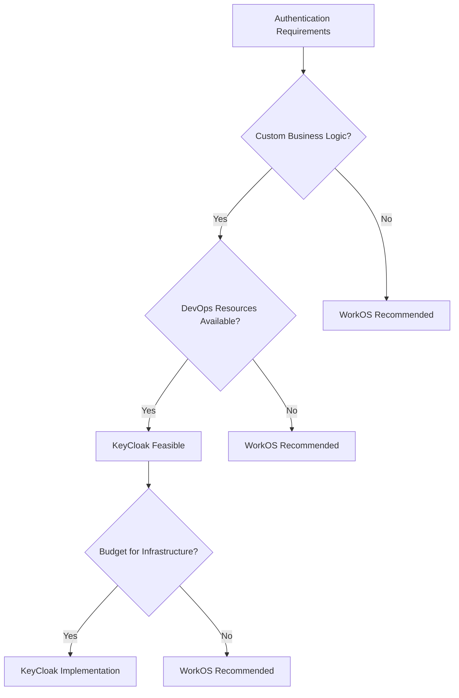

# KeyCloak vs WorkOS: Integration Architecture Analysis

## Executive Summary

This analysis evaluates the technical integration complexity and architectural considerations for implementing KeyCloak versus WorkOS in a B2C authentication system with controlled registration patterns.

## Integration Complexity Assessment

### KeyCloak Integration Architecture

**API Integration Patterns:**
- **REST API Coverage**: Comprehensive Admin REST API with 200+ endpoints
- **Authentication Flows**: Full OAuth 2.0/OIDC implementation with custom flow support
- **Client Libraries**: Official adapters for Java, JavaScript, Node.js, Python, .NET
- **Custom Integration**: Service Provider Interface (SPI) for deep customization

**Integration Complexity Factors:**
```javascript
// Example KeyCloak Node.js integration
const Keycloak = require('keycloak-connect');
const session = require('express-session');

// Configuration complexity
const kcConfig = {
  realm: 'your-realm',
  'auth-server-url': 'https://your-keycloak-server/auth/',
  'ssl-required': 'external',
  'public-client': false,
  'confidential-port': 0,
  'verify-token-audience': true
};

// Session management setup required
const memoryStore = new session.MemoryStore();
const keycloak = new Keycloak({store: memoryStore}, kcConfig);
```

**Development Timeline Estimate**: 4-8 weeks
- Initial setup and configuration: 1-2 weeks
- Custom theme development: 1-2 weeks  
- B2C flow customization: 1-2 weeks
- API integration and testing: 1-2 weeks

### WorkOS Integration Architecture

**API Integration Patterns:**
- **REST API Design**: Clean, RESTful endpoints with intuitive design
- **SDK Coverage**: Comprehensive SDKs for 10+ languages with consistent patterns
- **Event-Driven**: Webhook system for real-time event handling
- **Developer Experience**: Excellent documentation with interactive examples

**Integration Simplicity:**
```javascript
// Example WorkOS Node.js integration
const { WorkOS } = require('@workos-inc/node');

const workos = new WorkOS('your-api-key');

// Simple authentication
const authorizationUrl = workos.userManagement.getAuthorizationUrl({
  provider: 'authkit',
  redirectUri: 'https://your-app.com/callback',
  state: 'optional-state'
});

// Profile retrieval
const profile = await workos.userManagement.getUser(userId);
```

**Development Timeline Estimate**: 1-3 weeks
- SDK integration: 3-5 days
- Custom styling (AuthKit): 2-3 days
- Webhook setup: 2-3 days
- Testing and deployment: 3-5 days

## API Design and Developer Experience

### KeyCloak API Analysis

**Strengths:**
- **Comprehensive Coverage**: Admin API covers all authentication scenarios
- **Standards Compliance**: Full OIDC/OAuth 2.0 specification support
- **Flexibility**: Custom authenticators via SPI framework
- **Protocol Support**: SAML, OIDC, OAuth 2.0, and custom protocols

**Challenges:**
- **Complexity**: Steep learning curve for comprehensive features
- **Documentation**: Technical documentation requires deep identity knowledge
- **Configuration**: Complex realm and client configuration options
- **API Versioning**: Limited backward compatibility guarantees

**API Example - User Registration:**
```javascript
// Complex admin API call for user creation
const adminClient = new KcAdminClient({
  baseUrl: 'https://keycloak-server/auth/',
  realmName: 'master'
});

await adminClient.auth({
  username: 'admin',
  password: 'admin-password',
  grantType: 'password',
  clientId: 'admin-cli'
});

const user = await adminClient.users.create({
  realm: 'your-realm',
  username: 'new-user',
  email: 'user@example.com',
  enabled: true,
  emailVerified: false,
  attributes: {
    'custom-field': ['value']
  }
});
```

### WorkOS API Analysis

**Strengths:**
- **Intuitive Design**: REST API follows modern conventions
- **Consistent Patterns**: Uniform error handling and response formats
- **Rich SDKs**: Language-specific SDKs with idiomatic patterns
- **Interactive Documentation**: Live API explorer with code examples

**API Example - User Registration:**
```javascript
// Simple user creation with WorkOS
const user = await workos.userManagement.createUser({
  email: 'user@example.com',
  password: 'secure-password',
  firstName: 'John',
  lastName: 'Doe',
  emailVerified: false
});

// Send verification email
await workos.userManagement.sendVerificationEmail({
  userId: user.id
});
```

**Performance Characteristics:**
- **Response Times**: Consistently under 200ms for standard operations
- **Rate Limits**: Generous limits with clear documentation
- **Error Handling**: Structured error responses with actionable messages
- **Pagination**: Cursor-based pagination for efficient data retrieval

## Technical Architecture Considerations

### KeyCloak Architecture Requirements

**Infrastructure Components:**
- **Database**: PostgreSQL/MySQL cluster for high availability
- **Reverse Proxy**: Nginx/HAProxy for load balancing and SSL termination
- **Clustering**: Multiple KeyCloak instances with shared sessions
- **Monitoring**: Custom metrics and health check implementation

**Scalability Architecture:**
```yaml
# Docker Compose example for HA setup
version: '3.8'
services:
  keycloak-1:
    image: quay.io/keycloak/keycloak:22.0
    environment:
      KC_DB_URL: jdbc:postgresql://postgres-cluster:5432/keycloak
      KC_CACHE_STACK: kubernetes
      KEYCLOAK_ADMIN: admin
    deploy:
      replicas: 3
  
  postgres-cluster:
    image: postgres:14
    environment:
      POSTGRES_DB: keycloak
      POSTGRES_USER: keycloak
    volumes:
      - postgres_data:/var/lib/postgresql/data
```

### WorkOS Architecture Requirements

**Infrastructure Components:**
- **API Integration**: Direct HTTPS API calls to WorkOS endpoints
- **Webhook Handling**: Simple webhook endpoint for event processing
- **Session Management**: Standard web session handling
- **Caching**: Optional Redis for session caching

**Minimal Architecture:**
```javascript
// Express.js application setup
const express = require('express');
const { WorkOS } = require('@workos-inc/node');

const app = express();
const workos = new WorkOS(process.env.WORKOS_API_KEY);

// Webhook handler
app.post('/webhooks/workos', express.raw({type: 'application/json'}), (req, res) => {
  const payload = req.body;
  const signature = req.headers['workos-signature'];
  
  // Verify and process webhook
  const event = workos.webhooks.constructEvent(payload, signature);
  // Handle event...
  
  res.status(200).send('OK');
});
```

## Performance and Reliability Analysis

### KeyCloak Performance Characteristics

**Throughput Metrics:**
- **Authentication Requests**: 1,000-5,000 RPS per instance
- **Token Validation**: 10,000+ RPS with proper caching
- **Admin Operations**: 100-500 RPS depending on complexity
- **Database Load**: High read/write operations for sessions and users

**Reliability Considerations:**
- **Single Point of Failure**: Database dependency requires clustering
- **Session Stickiness**: Load balancer configuration complexity
- **Backup/Recovery**: Full database backup and realm export procedures
- **Updates**: Requires planned downtime for major version upgrades

### WorkOS Performance Characteristics

**Throughput Metrics:**
- **API Responses**: Consistently sub-200ms globally
- **Authentication Flow**: Optimized for minimal redirects
- **Webhook Delivery**: 99.9% delivery rate with retries
- **Global CDN**: Multi-region deployment for low latency

**Reliability Features:**
- **SLA**: 99.9%+ uptime guarantee
- **Redundancy**: Built-in multi-region failover
- **Monitoring**: Real-time status page and alerting
- **Zero-Downtime Updates**: Managed service with rolling updates

## Implementation Risk Assessment

### KeyCloak Risk Factors

**Technical Risks:**
1. **Complexity Overhead**: Steep learning curve for team adoption
2. **Infrastructure Management**: Full responsibility for security and updates
3. **Configuration Drift**: Complex realm settings prone to misconfiguration
4. **Performance Tuning**: Requires deep understanding of JVM and clustering

**Mitigation Strategies:**
- Dedicated DevOps engineer for KeyCloak management
- Comprehensive documentation and runbooks
- Automated configuration management with Infrastructure as Code
- Performance testing and monitoring implementation

### WorkOS Risk Factors

**Technical Risks:**
1. **Vendor Lock-in**: Proprietary API and feature dependencies
2. **Customization Limits**: Bounded by platform capabilities
3. **Cost Scaling**: Per-user pricing at scale
4. **API Changes**: Potential breaking changes in managed service

**Mitigation Strategies:**
- Standard OIDC compliance for future migration options
- Abstraction layer for authentication logic
- Cost monitoring and usage optimization
- Version pinning and change management processes

## Recommendation Matrix

### For Teams with 2-5 Developers
**Recommended**: WorkOS
- **Rationale**: Faster time-to-market, lower operational overhead
- **Timeline**: 1-3 weeks vs 4-8 weeks for KeyCloak
- **Total Cost of Ownership**: Lower with managed infrastructure

### For Teams with 6+ Developers and DevOps Expertise
**Consider**: KeyCloak if customization requirements are extensive
- **Rationale**: Full control and customization capabilities
- **Prerequisites**: Dedicated infrastructure and security expertise
- **Long-term Value**: Lower per-user costs at scale

### For Rapid MVP/Prototype Development
**Strongly Recommended**: WorkOS
- **Rationale**: Minimal integration effort, production-ready security
- **Implementation Time**: Days vs weeks
- **Risk Level**: Significantly lower operational risk

## Technical Decision Framework



This analysis provides a technical foundation for decision-making based on integration complexity, development resources, and operational requirements.